# 30 个让你发笑的编程笑话

> 原文：<https://javascript.plainenglish.io/30-programming-jokes-that-will-make-you-laugh-98f9e20c34e9?source=collection_archive---------0----------------------->

## 与所有程序员相关的笑话和迷因列表

Photo by [Ahmed Zayan](https://unsplash.com/@zayyerrn?utm_source=medium&utm_medium=referral) on [Unsplash](https://unsplash.com?utm_source=medium&utm_medium=referral)

当程序员是一份有趣的工作。在程序员的职业生涯中，会发生许多有趣的事情。作为一名程序员，这里有一些与你相关的笑话。

我希望你喜欢下面的笑话汇编。让我们开始吧。

## 1.每个程序员都像

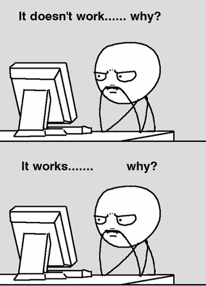

Image source: Mohammed Ibrahim on [quora.com](https://www.quora.com/What-are-the-best-programming-comic-strips)

## 2.当调试代码以找到根本原因时

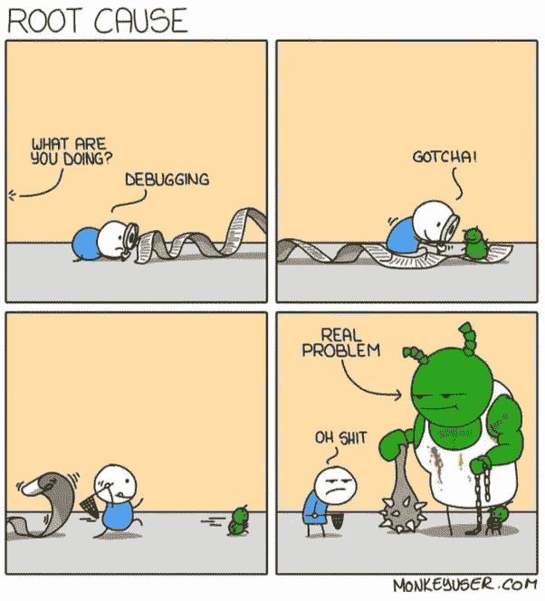

Image source: Jonathan Ouyang on [quora.com](https://www.quora.com/What-are-the-best-programming-comic-strips)

## 3.当有人忘记保存他们编写的所有代码时

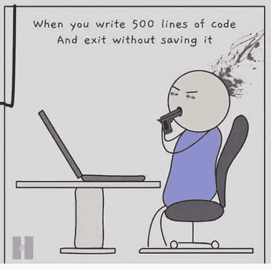

Image source: Chukwuebuka Sunday on [quora.com](https://www.quora.com/What-are-the-best-programming-comic-strips)

## 4.当一个程序一团糟，但是最后一切都解决了

Image source: [thecoderpedia.com](https://www.thecoderpedia.com/blog/programming-memes/#9_When_your_Program_finally_works_at_End%E2%80%8B%E2%80%8B%E2%80%8B%E2%80%8B%E2%80%8B)

## 5.代码注释应该像这样

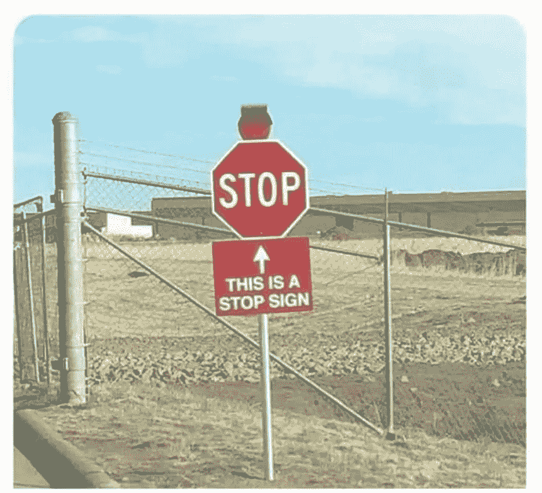

Image source: [thecoderpedia.com](https://www.thecoderpedia.com/blog/programming-memes/#10_Code_Comments_be_Like%E2%80%8B%E2%80%8B%E2%80%8B%E2%80%8B)

## 6.当你在漫长的一天工作后最终决定睡觉时

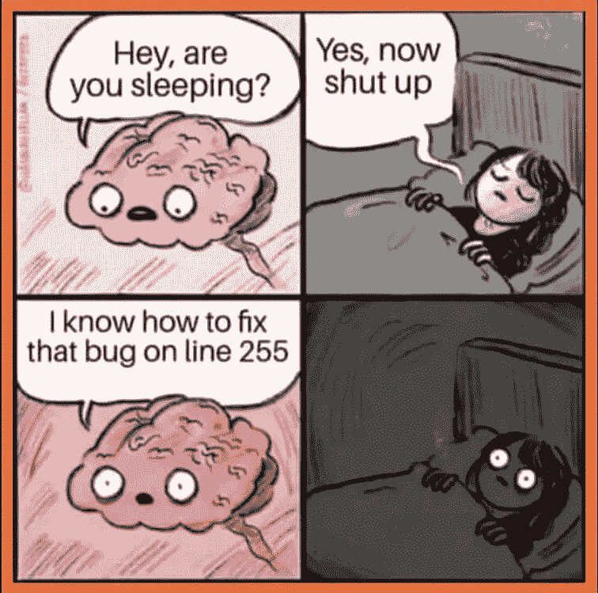

Image source: [thecoderpedia.com](https://www.thecoderpedia.com/blog/programming-memes/#1_Programmers_while_Sleeping%E2%80%8B)

## 7.用户如何看待程序员和程序员如何看待用户

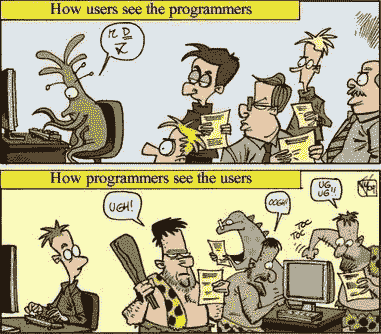

Image source: Tony Jesuthasan on [quora.com](https://www.quora.com/What-are-the-best-programming-comic-strips)

## 8.while 和 do…while 循环的区别

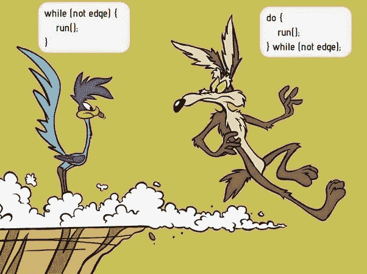

Image source: Mashal Rashid on [quora.com](https://www.quora.com/What-are-the-best-programming-comic-strips)

## 9.试图修复一个小错误的程序员

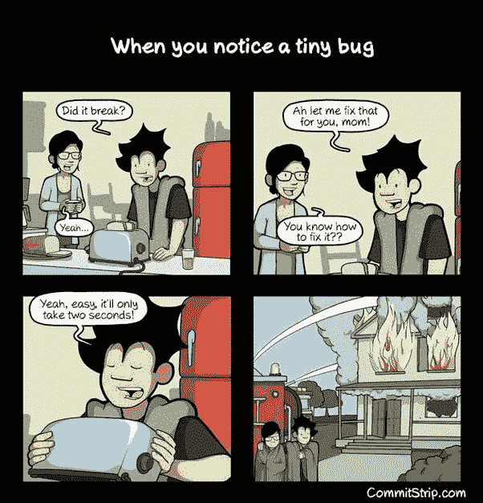

Image source: Suraj Sharma on [quora.com](https://www.quora.com/What-are-the-best-programming-comic-strips)

## 10.当一个程序员在周五留下少量工作，认为他们可以在周一完成

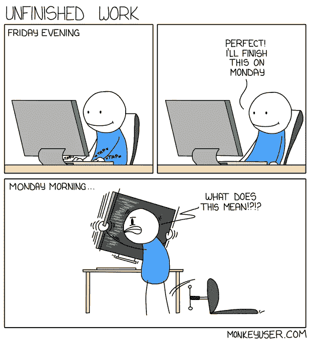

Image source: Chukwuebuka Sunday on [quora.com](https://www.quora.com/What-are-the-best-programming-comic-strips)

## 11.当一个程序员在试图修复一个 bug 时终于取得了一些进展

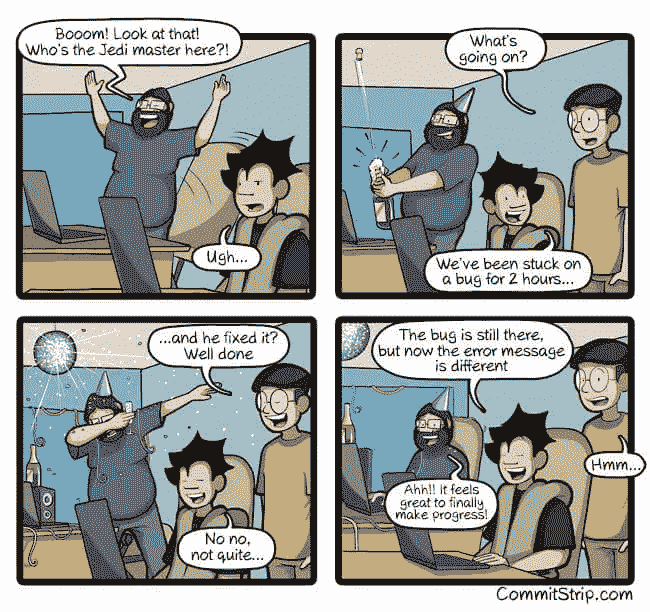

Image source: techparadise on [pinterest.com](https://www.pinterest.com/pin/661466264009569611/)

## 12.当 chrome 和其他应用程序一起在电脑上运行时

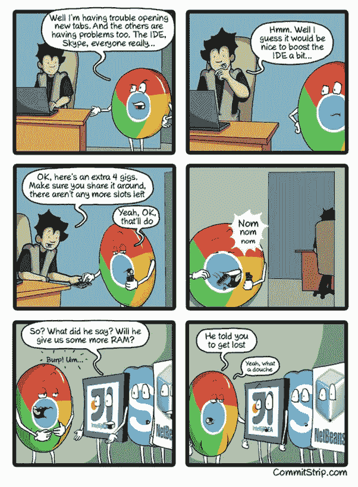

Image source: Jonathan Ouyang on [quora.com](https://www.quora.com/What-are-the-best-programming-comic-strips)

## 13.当 Internet Explorer 反击取笑它的速度时

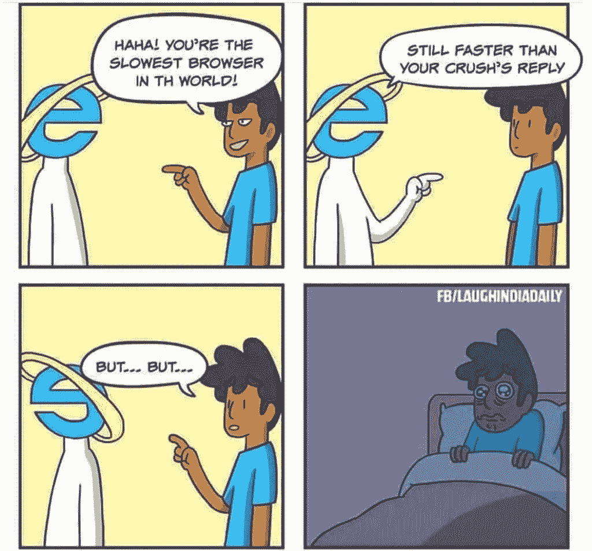

Image source: [thecoderpedia.com](https://www.thecoderpedia.com/blog/programming-memes/#16_Internet_Explorer%E2%80%8B%E2%80%8B%E2%80%8B%E2%80%8B%E2%80%8B)

## 14.用于 web 开发的语言之争

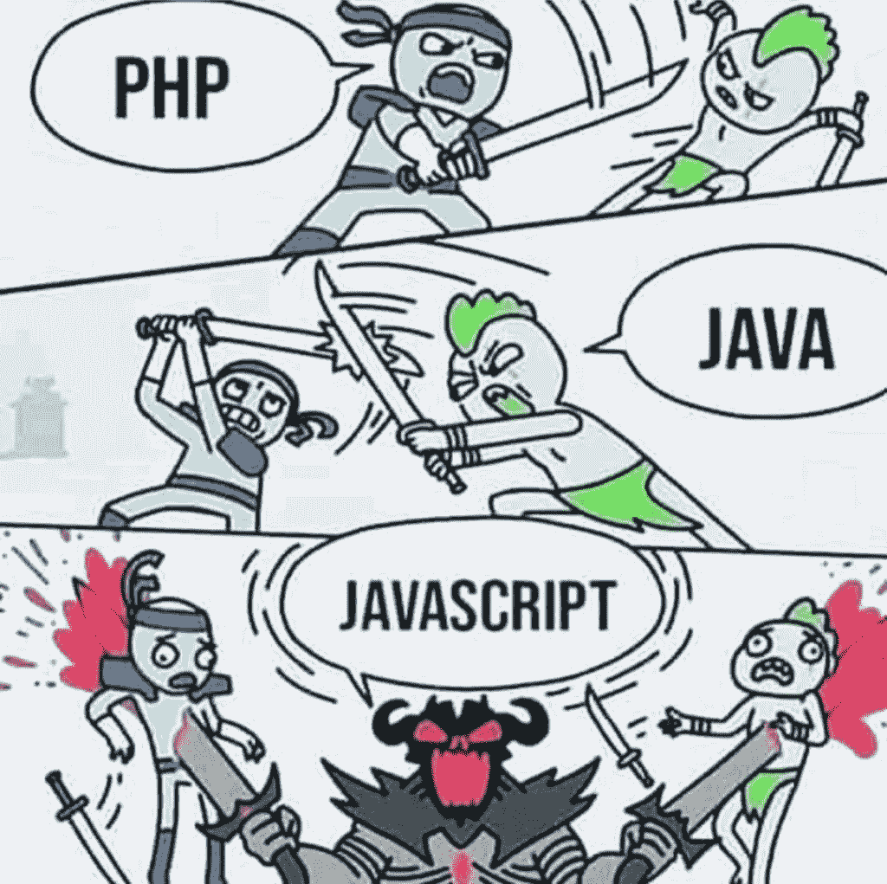

Image source: [thecoderpedia.com](https://www.thecoderpedia.com/blog/programming-memes/#25_PHP_vs_Java_vs_JavaScript%E2%80%8B%E2%80%8B%E2%80%8B%E2%80%8B)

## 15.有史以来最鼓舞人心的名言

Image source: [thecoderpedia.com](https://www.thecoderpedia.com/blog/programming-memes/#11_Most_Inspiring_Quote_Ever!%E2%80%8B%E2%80%8B%E2%80%8B%E2%80%8B%E2%80%8B)

## 16.当程序员试图从他们的代码中移除所有的错误时

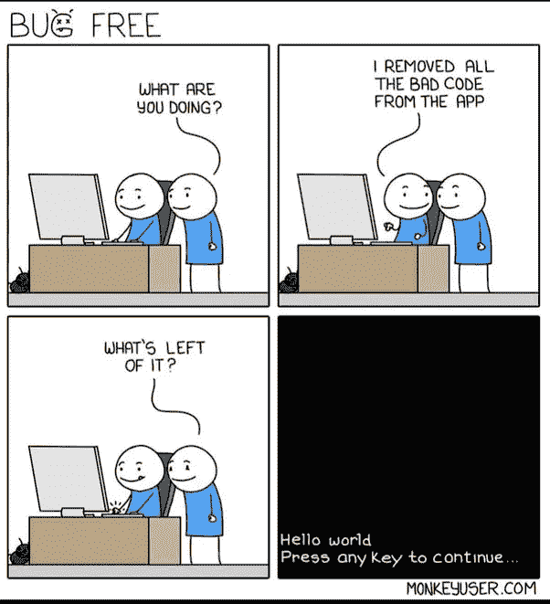

Image source: [thecoderpedia.com](https://www.thecoderpedia.com/blog/programming-memes/#35_Removing_the_Bad_Code%E2%80%8B%E2%80%8B%E2%80%8B%E2%80%8B%E2%80%8B)

## 17.当有人说他们是 HTML 程序员时的反应

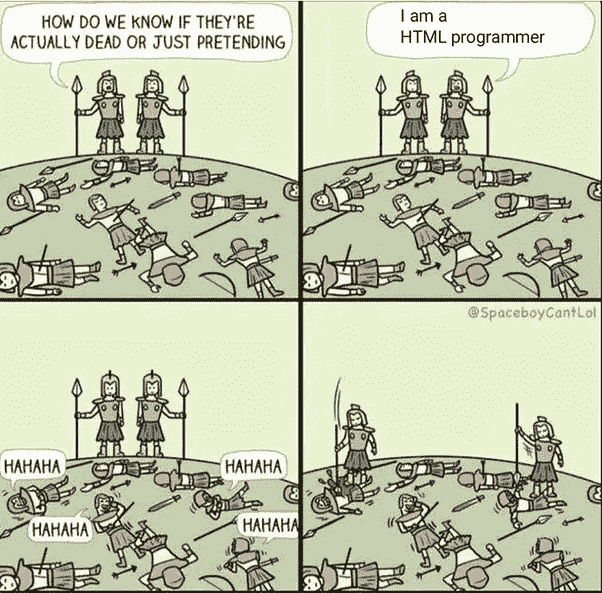

Image source: Suraj Sharma on [quora.com](https://www.quora.com/What-are-the-best-programming-comic-strips)

## 18.当您想到在最终代码修复后吃午餐时

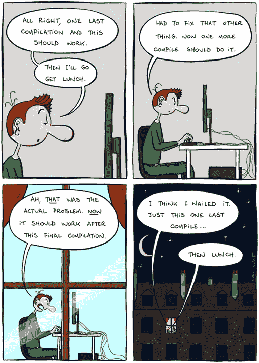

Image source: Giuseppa Tripoli on [quora.com](https://www.quora.com/What-are-the-best-programming-comic-strips)

## 19.当程序员发现某个应用程序没有托管在 Linux 服务器上时

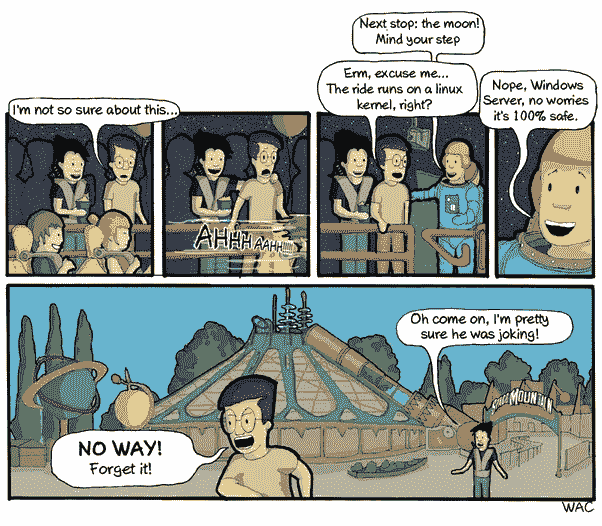

Image source: Alexander Hartdegen Lee on [quora.com](https://www.quora.com/Whats-your-favorite-programming-comic-strip)

## 20.当你试图在发布日修复产品中的某些东西时

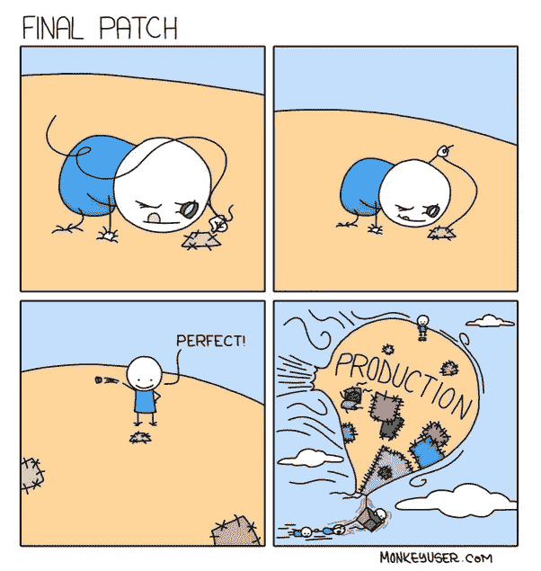

Image source: Adarsh Kumar GM on [quora.com](https://www.quora.com/What-are-the-best-programming-comic-strips)

## 21.当所有浏览器都有聚会时

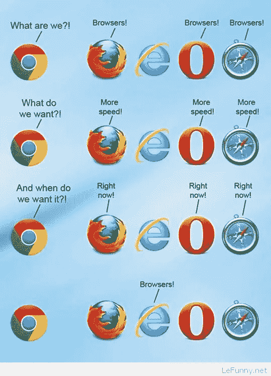

Image source: Funny Pictures on [lefunny.net](https://lefunny.net/funny-internet-explorer-comic/)

## 22.当程序员去客户那里为他们应用程序的停机时间道歉时

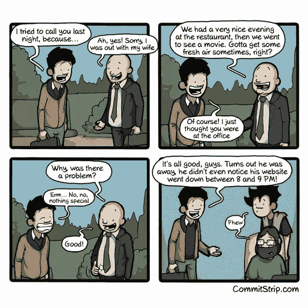

Image source: Harsh Raj Gupta on [quora.com](https://www.quora.com/What-are-the-best-programming-comic-strips)

## 23.年度程序员

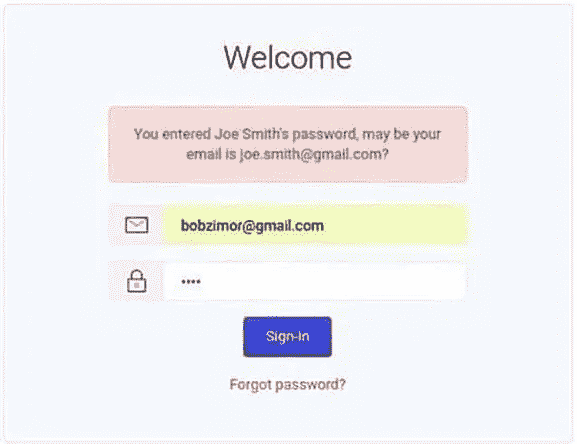

Image source: Shivam Agrawal on [quora.com](https://www.quora.com/What-are-the-best-programming-comic-strips)

## 24.向客户推销时，错误代码工作正常时的反应

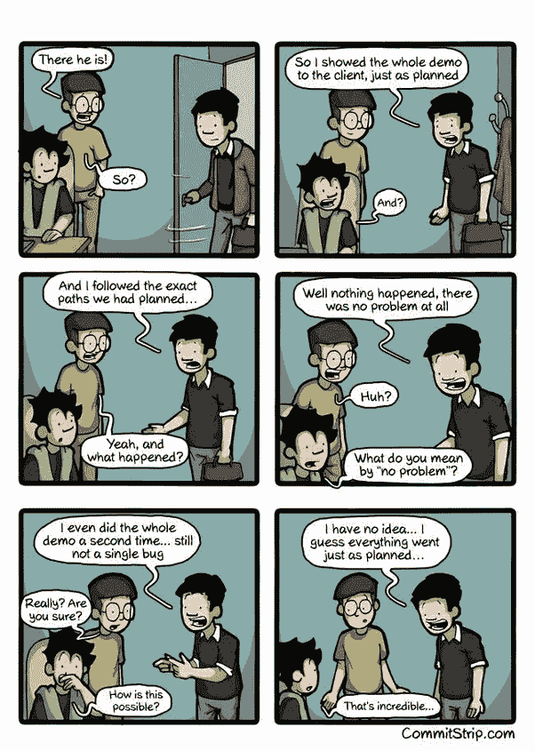

Image source: Harsh Raj Gupta on [quora.com](https://www.quora.com/What-are-the-best-programming-comic-strips)

## 25.涉及应用程序前端和后端的考试作弊

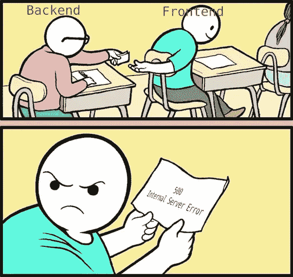

Image source: Shivam Agrawal on [quora.com](https://www.quora.com/What-are-the-best-programming-comic-strips)

## 26.在线课程有什么承诺，你最终会得到什么

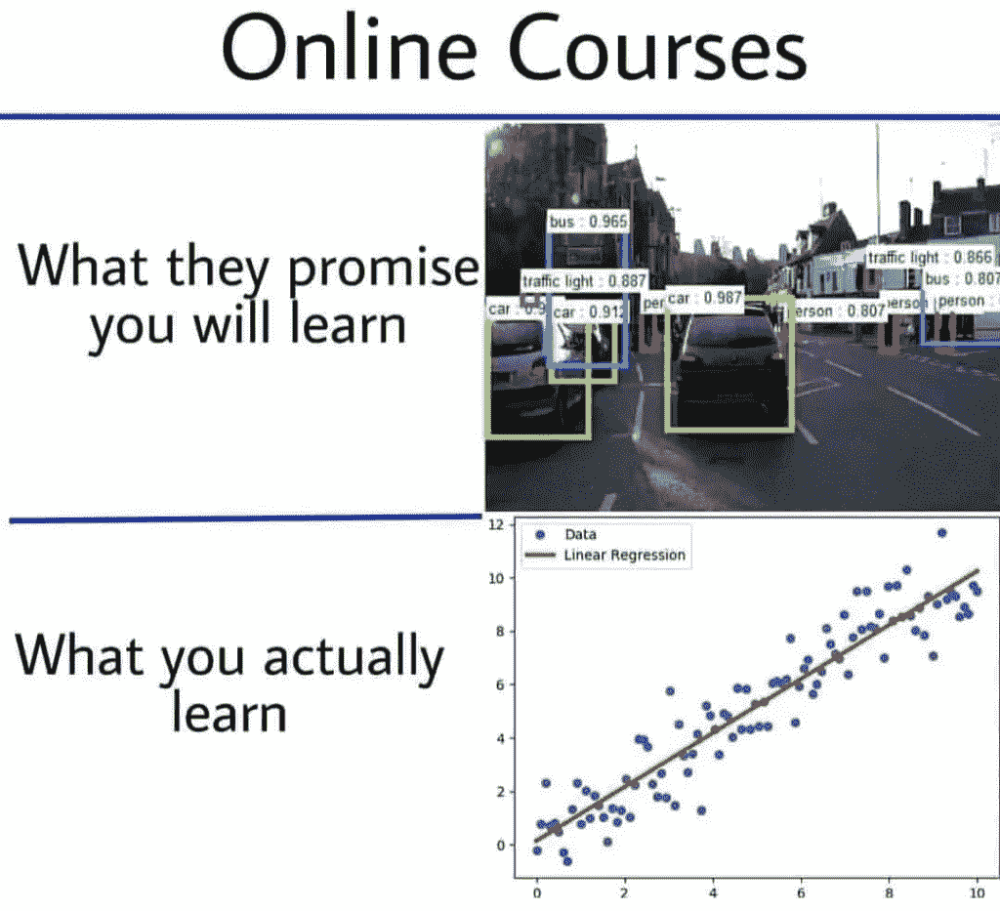

Image source: [thecoderpedia.com](https://www.thecoderpedia.com/blog/programming-memes/#17_Online_Courses%E2%80%8B%E2%80%8B%E2%80%8B%E2%80%8B%E2%80%8B)

## 27.作战室的情况

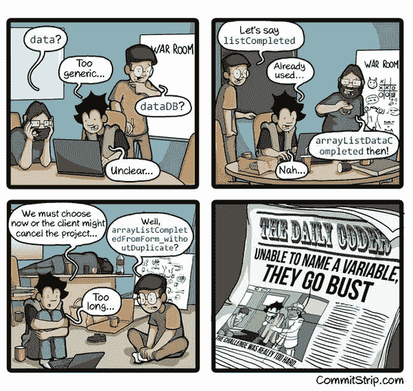

Image source: Harsh Raj Gupta on [quora.com](https://www.quora.com/What-are-the-best-programming-comic-strips)

## 28.软件公司中的不同角色

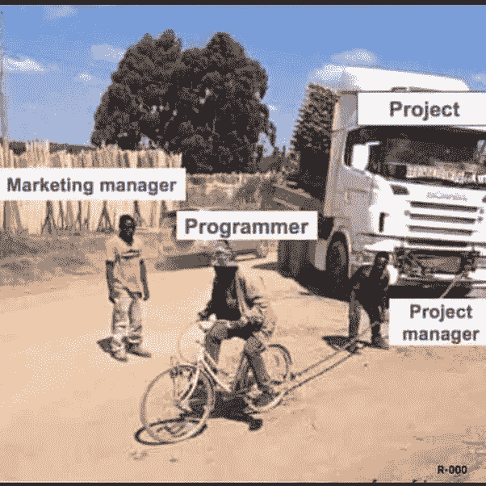

Image source: Shivam Agrawal on [quora.com](https://www.quora.com/What-are-the-best-programming-comic-strips)

## 29.前端与后端

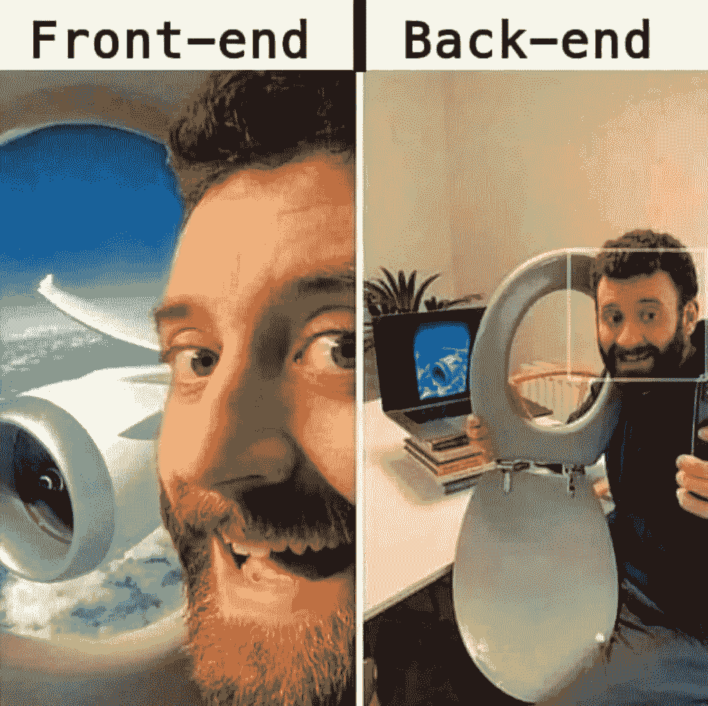

Image source: [thecoderpedia.com](https://www.thecoderpedia.com/blog/programming-memes/#21_FrontEnd_vs_BackEnd%E2%80%8B%E2%80%8B%E2%80%8B)

## 30.当我们花了 7 个小时调试自己的代码时

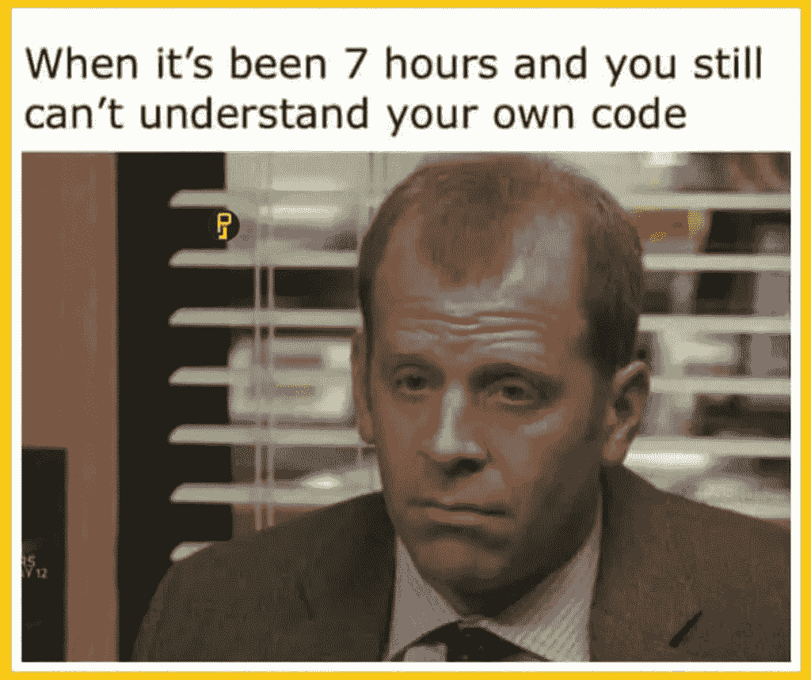

Image source: [thecoderpedia.com](https://www.thecoderpedia.com/blog/programming-memes/#33_Debugging_Your_Own_Code_be_Like%E2%80%8B%E2%80%8B%E2%80%8B%E2%80%8B%E2%80%8B)

喜欢这篇文章吗？如果有，通过 [**订阅解码获取更多编码内容，我们的 YouTube 频道**](https://www.youtube.com/channel/UCtipWUghju290NWcn8jhyAw) **！**

# 参考资料:

*   quora.com 最佳编程笑话
*   thecoderpedia.com[上的编程迷因](https://www.thecoderpedia.com/blog/programming-memes/)
*   lefunny.net[上搞笑的网络浏览器漫画](https://lefunny.net/funny-internet-explorer-comic/)
*   在[pinterest.com](https://www.pinterest.com/pin/661466264009569611/)的生产中修复一个 Bug 是什么感觉

感谢阅读！

如果你喜欢阅读这样的故事，并想支持我成为一名作家，可以考虑[成为一名媒体会员](https://nehalk.medium.com/membership)。一个月 5 美元，你可以无限制地阅读 Medium 上的所有故事。如果你[用我的链接](https://nehalk.medium.com/membership)注册，我会赚一小笔佣金。

 [## 通过我的推荐链接加入 Medium-Nehal Khan

### 作为一个媒体会员，你的会员费的一部分会给你阅读的作家，你可以完全接触到每一个故事…

nehalk.medium.com](https://nehalk.medium.com/membership) 

## 喜欢这篇文章吗？这里还有一些你可能会喜欢的文章

 [## JavaScript 实际上是如何工作的？

### JavaScript 引擎、事件循环、回调队列和 Web APIs 的概述。

javascript.plainenglish.io](/how-does-javascript-actually-work-under-the-hood-567f9f17b855)  [## 每个优秀的 Web 开发人员都应该知道的 12 个 JavaScript 概念

### 帮助你成为更好的 JS 开发人员的重要 JavaScript 概念

javascript.plainenglish.io](/12-javascript-concepts-that-every-good-web-developer-should-know-6fac820b507c)