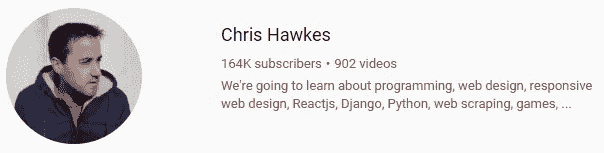

# 在 YouTube 上关注 35 个了不起的开发人员🔥

> 原文：<https://javascript.plainenglish.io/35-awesome-dev-people-to-follow-on-youtube-446d1f45563d?source=collection_archive---------7----------------------->

这里我整理了一份 YouTube 上个人最喜欢的开发者列表。我也在每个频道上加了几行，所以更容易理解这个频道是关于什么的，以及我为什么把它加进来。尽情享受吧！

## 1.[移动媒体](https://www.youtube.com/channel/UC29ju8bIPH5as8OGnQzwJyA)

许多关于各种技术的很棒的速成课程。通常在理论和实践方面分别遵循 20/80 法则。最近频道里有一些很棒的嘉宾主持。

## 2.[网络忍者](https://www.youtube.com/channel/UCW5YeuERMmlnqo4oq8vwUpg)

各种技术的高质量内容被剪辑成特定主题的短视频。超赞的播放列表。

## 3.[学院](https://www.youtube.com/channel/UCSJbGtTlrDami-tDGPUV9-w)

广泛的技术话题。内容总是经过精心研究的。经过深思熟虑的演示和示例。

## 4.本·阿瓦德

对各种主题有开放的想法(不一定总是与编码直接相关)。知道他的东西和一个很好的幽默在这里和那里。

## 5.[编码园](https://www.youtube.com/channel/UCLNgu_OupwoeESgtab33CCw)

有很多实时编码，在聊天中有实时观众互动。可能的话会回答你的问题。可能有时节奏很快。

## 6.[网站开发简化版](https://www.youtube.com/channel/UCFbNIlppjAuEX4znoulh0Cw)

优质内容。主题经过深入研究，内容经过深思熟虑，易于理解。

## 7.[电脑迷](https://www.youtube.com/user/Computerphile)

如果你对计算机感兴趣，这是必备的。深入了解事物如何工作，幕后发生了什么，等等。

## 8.[火船](https://www.youtube.com/channel/UCsBjURrPoezykLs9EqgamOA)

现代尖端技术。令人敬畏的视觉效果和简洁的信息。整体内容质量。

## 9.[弗罗林流行](https://www.youtube.com/channel/UCeU-1X402kT-JlLdAitxSMA)

喜欢挑战，比如在 X 时间内做 X 项目。大量的现场编码与特定主题的独立视频混合在一起。

## 10. [freeCodeCamp](https://www.youtube.com/channel/UC8butISFwT-Wl7EV0hUK0BQ)

最适合全长度教程(通常 8 小时以上)的地方。许多项目你可以在以后实际使用。

## 11.[解码](https://www.youtube.com/decodedx)

高质量的视频和主题往往比其他地方解释得更好。伟大的 JavaScript 内容，任何 JS 开发的必备。

## 12. [TechLead](https://www.youtube.com/channel/UC4xKdmAXFh4ACyhpiQ_3qBw)

前谷歌和前 facebook 工程师。当然知道他的东西，尽管，如果你是一个初学者，你可能很难决定他是真的还是时不时地在耍花招。

## 13.[霍马理工大学](https://www.youtube.com/channel/UCV0qA-eDDICsRR9rPcnG7tw)

高质量、精心编辑的内容。类似于 TechLead，但通常更具艺术性和电影风格。也喜欢到处放复活节彩蛋。

## 14. [CS 道场](https://www.youtube.com/channel/UCxX9wt5FWQUAAz4UrysqK9A)

牛逼频道如果你是学算法和数据结构的。我强烈推荐，尤其是如果你正处于找工作和准备面试的阶段。

## 15.阿尼亚·库博

最近的频道之一。在 JS 游戏开发中指定。很容易理解。如果你想学习普通的 JS，这是一个很好的资源。

## 16.[编码序列](https://www.youtube.com/user/shiffman)

对这些话题非常感兴趣。当然知道他的东西。通常情况下，现场编码会议期间会同时进行粉丝互动。

## 17.[柯尔特·斯蒂尔](https://www.youtube.com/channel/UCrqAGUPPMOdo0jfQ6grikZw)

Udemy 上最畅销的导师之一有一个很棒的 YouTube 频道。视觉上赏心悦目的高质量内容。

## 18.[开发编辑](https://www.youtube.com/channel/UClb90NQQcskPUGDIXsQEz5Q)

优质内容。非常容易理解。在开始的时候，我会在这里和那里向你展示一个魔术。

## 19. [Learncode.academy](https://www.youtube.com/user/learncodeacademy)

伟大的内容，知道他的东西。最近不太活跃，尽管那里有很多很棒的资源，尤其是每年的开发者路线图。

## 20.[冰毒方法](https://www.youtube.com/channel/UC8A0M0eDttdB11MHxX58vXQ)

优质内容。如果你正在寻找高级 JS 或学习画布，这很好。大量的最佳实践和优雅的代码。

## 21.[希特什·乔杜里](https://www.youtube.com/user/hiteshitube)

创建有用的 ama 和实时视频，经常与关注者互动。其他视频简短扼要。

## 22.韦斯博斯

偶尔做一些现场编码。知道他的东西，听起来很愉快(正如我们从 [Syntax.fm](https://syntax.fm/) 中所知道的)

## 23.[编码技术](https://www.youtube.com/channel/UCtxCXg-UvSnTKPOzLH4wJaQ)

这基本上是 TED 给编码人员的。那里贴了很多很棒的全长技术演讲。

## 24.[德里克·巴纳斯](https://www.youtube.com/user/derekbanas)

在第一批 YouTube 开发频道中。非常详细，尽管功能涵盖的速度非常快。非常适合更新特定的技术。

## 25. [LevelUpTuts](https://www.youtube.com/user/LevelUpTuts)

各种技术的绝佳渠道。根据观众的经验水平，在播放列表中分类的大量教程。

## 26.[达尼·克罗斯](https://www.youtube.com/user/TheCharmefis)

前称 MMTuts。最近改变了频道名称，增加了游戏和视频日志。不同技术的伟大的播放列表。

## 27.[谷歌开发者](https://www.youtube.com/user/GoogleDevelopers)

最新更新和未来计划，前沿技术新闻。也报道事件和有趣的谈话。

## 28.[约书亚·福禄克](https://www.youtube.com/user/Tychos1)

诚实的评论和许多现实生活中的情况，如采访等。没有隐晦的意思，开门见山。

## 29.[设计课程](https://www.youtube.com/user/DesignCourse)

所有前端开发人员的必备之物。大量的现代设计教程，有助于学习设计工具和技术。

## 30.克里斯·科伊尔

[css-tricks.com](https://css-tricks.com/)创始人。正如您可能猜到的，主要是渠道中面向前端的内容。网格，响应式设计，以及所有的好东西。

## 31.克里斯·霍克斯

主要是关于更广泛和开放的主题的想法，如工具比较、职业技巧、顶级技术列表、如何操作的建议、观点等。

## 32. [JSConf](https://www.youtube.com/user/jsconfeu)

许多关于 JS 相关主题的精彩演讲。这是一个跟随现代趋势和不断发展的环境的绝佳资源。

我想谈谈 Youtube 频道，如果不提及其他一些与编码没有直接关系的频道，这个列表就不完整。以下是一些额外的内容:

## 33.数字迷

围绕数学和数字的一切。牛逼又热情的主持人。有趣的话题，容易跟进。

## 34.[3 蓝色 1 棕色](https://www.youtube.com/channel/UCYO_jab_esuFRV4b17AJtAw)

最纯粹的质量超过数量。使用 [manim](https://github.com/3b1b/manim) 开源引擎制作动画。令人兴奋的东西。

## 35. [ColdFusion](https://www.youtube.com/user/coldfustion)

各种技术领域中经过充分研究的内容。高质量的音频和编辑。

我希望你喜欢这本书！

欢迎随时关注我的 [Twitter](https://twitter.com/madzadev) 、 [LinkedIn](https://www.linkedin.com/in/madzadev/) 、 [GitHub](https://github.com/madzadev) 、 [Hashnode](https://hashnode.com/@madza) 和 [DEV](https://dev.to/madza) ！

更多信息，请通过 [hi@madza.dev](mailto:hi@madza.dev) 联系我。