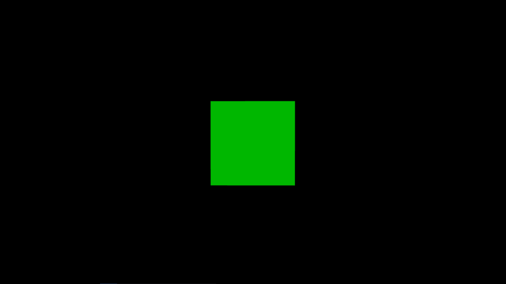

# 带苗条和 Three.js 的 3D

> 原文：<https://javascript.plainenglish.io/3d-with-svelte-and-three-js-f4366f342f9f?source=collection_archive---------1----------------------->



***更新:自本文发布以来，GitHub 中的示例已经更新为利用 SvelteKit。***

更新一些演示应用程序时，我希望构建一些快速而精简的东西——比 React 更少的样板文件以增加示例的清晰度，但具有实时重新加载、包管理和捆绑的功能。

我对尝试[苗条](https://svelte.dev/)很感兴趣，对环境和工具链的简单和清洁感到惊讶。


这里有一个结合了 [Three.js](https://threejs.org/) 来构建 3D WebGL 应用的例子。

跟随，或者[在 GitHub 查看库](https://github.com/jasonsturges/threejs-svelte-boilerplate)。

# 创建解决方案

首先，通过在终端中执行以下命令，使用`npx degit`设置 Svelte 的模板来搭建项目:

```
npx degit sveltejs/template svelte-app
```

继续添加`three`包:

```
npm add three
```

Npm 会添加 Three.js 并自动安装包。

## App.svelte

在`App.svelte`中创建一个`canvas`元素，用 Svelte 的[绑定](https://svelte.dev/tutorial/bind-this)链接 DOM 元素传入`createScene()`函数。

App.svelte

虽然 Three.js 可以自动创建和附加自己的 DOM 元素，但是看到 Svelte 如何传递声明性语法范围内的元素还是很酷的。

需要注意的是，这需要 Svelte 的`onMount()`的[生命周期](https://svelte.dev/tutorial/onmount)方法，该方法在组件首次呈现到 DOM 后运行。

## scene.js

创建一个名为`scene.js`的新文件——我们将从创建场景[的 Three.js 文档中放入示例代码](https://threejs.org/docs/#manual/en/introduction/Creating-a-scene),并对其进行一些小的修改，以解决调整浏览器窗口大小的问题:

scene.js

在上面的代码中，`renderer`使用了`scene`和`camera`来更新每一帧的画布元素。`animate()`函数通过从浏览器的下一次重画请求一个动画帧来执行 Three.js 渲染。

在这个场景中，添加了一个由`geometry`定义的`cube`网格，并使用一个`material`给网格一个外观。

为了调整浏览器窗口的大小，添加了一个`resize`事件监听器来更新摄像头并调整页面上 canvas 元素的大小。

## global.css

最后，为了视觉外观，更新`global.css`来填充屏幕:

# 发射它

从终端执行`npm run dev`启动 Svelte 的 live reload with Rollup，打开 [http://localhost:5000](http://localhost:5000) 查看结果。

在我的下一篇文章中，我将展示一个使用 Babylon.js 引擎的替代版本。