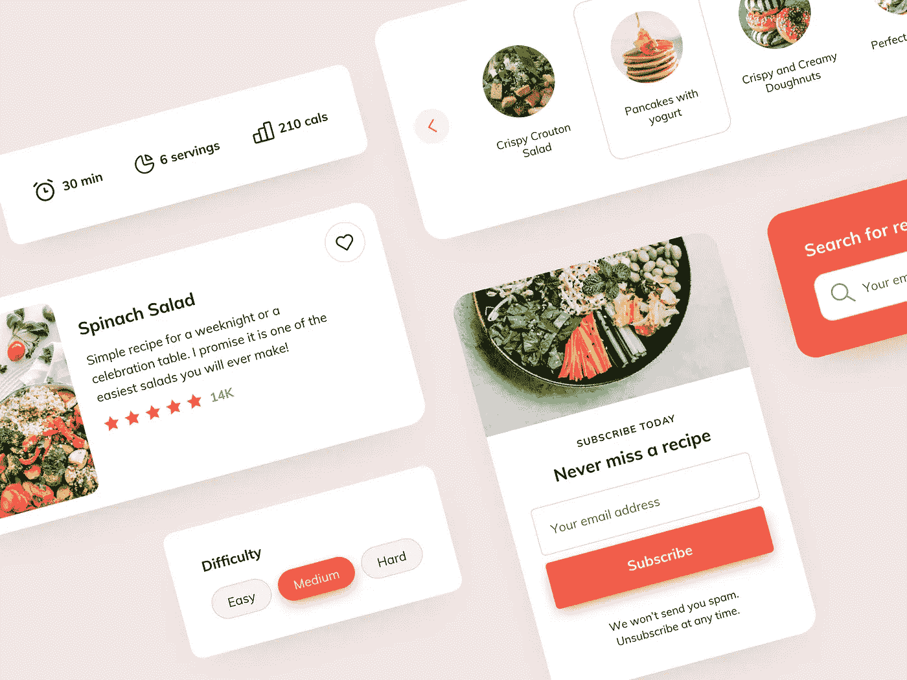
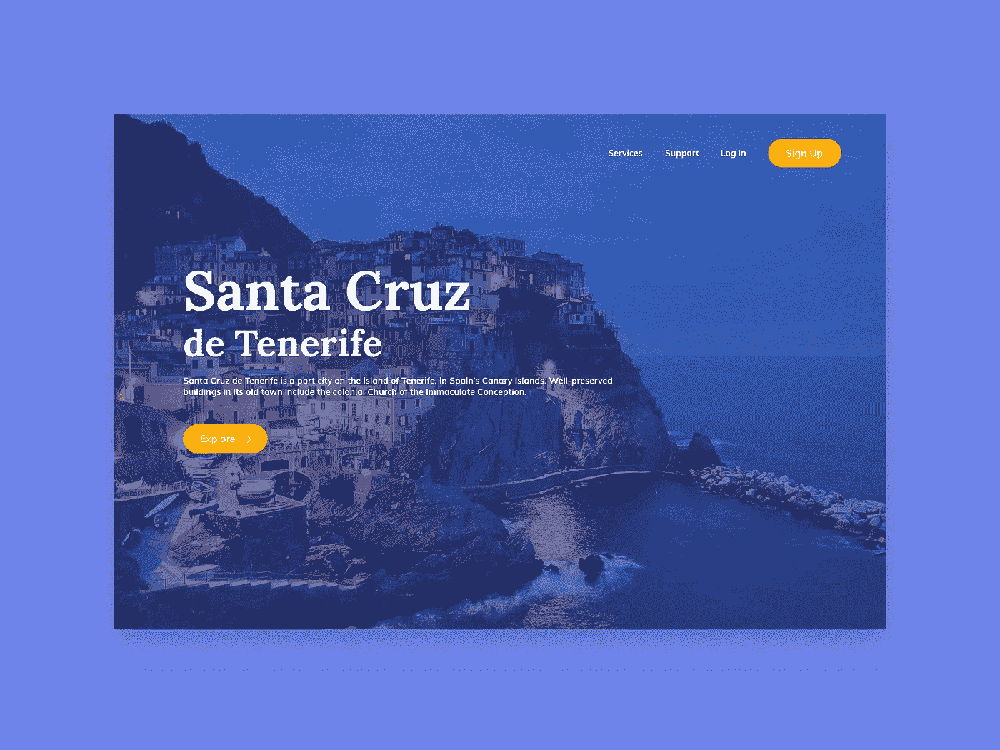
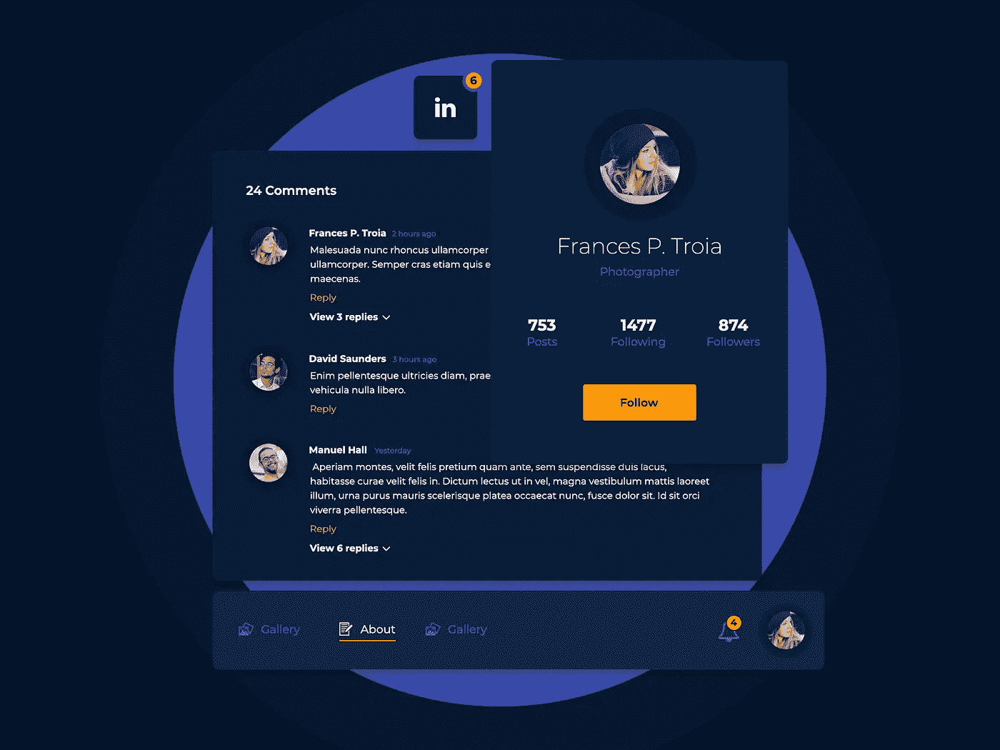
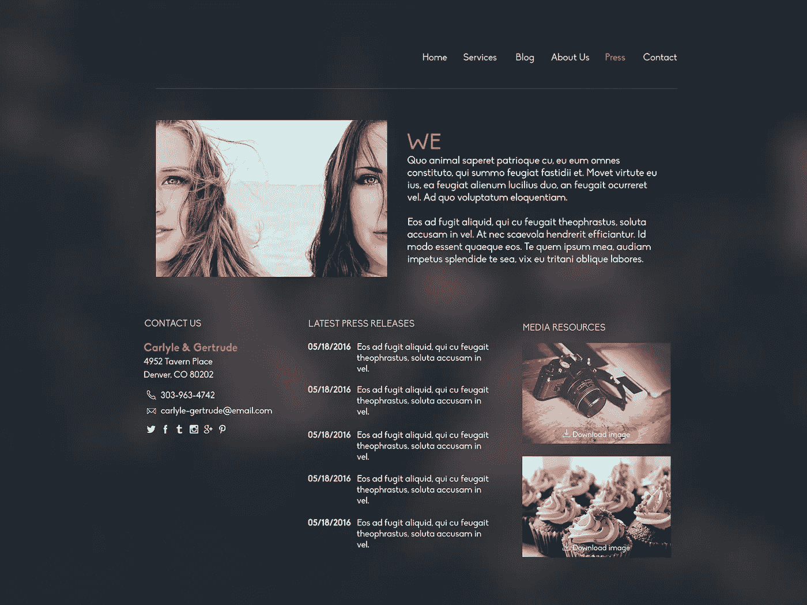

# 你的投资组合中必须有 4 种类型的项目

> 原文：<https://javascript.plainenglish.io/4-great-portfolio-projects-ideas-you-can-build-quickly-3a22c13c0f1f?source=collection_archive---------2----------------------->

## 你可以在一周内完成所有这些项目。



Source: [UI Design Daily](https://uidesigndaily.com/posts/sketch-recipe-components-subscribe-tags-card-rating-day-1145)([CC License](https://uidesigndaily.com/license)).

在你的投资组合中有简单而漂亮的项目可以大大增加你被雇用的机会。

当你有一个可行的、用心的项目时，你就有了你能力的视觉证明，面试官喜欢这样。

我将列出 4 个惊人的项目，它们将改变你的投资组合，帮助你找到你梦想的工作。

此外，到本文结束时，您不仅将知道如何在一周内构建这些项目，而且还能够免费部署它。

在我们继续之前，我想强调的是，我将首先介绍前端项目，然后是后端项目，因为您可以使用前端代码并向其添加后端，从而减少工作量。

让我们开始吧。

# 项目 1。登录页面



Source: [UI Design Daily](https://uidesigndaily.com/posts/sketch-landing-page-website-day-536)([CC License](https://uidesigndaily.com/license)).

建立一个吸引人的登陆页面或者重新制作著名的登陆页面是展示你的用户体验和可访问性的一个很好的项目。

但最重要的是，它还将使用一个 API 来收集用户提供的数据，但以后会更多。

这个项目实际上是非常简单的建设，这应该不会超过几个小时。

这个项目的主要工作是用 CSS 设计网页的 HTML，并使用恰当的配色方案来创建赏心悦目的网站。

我强烈建议建立一个包含大量自然或食物图片的登陆页面。从上面的图片，你可以看到自然图片作为背景有多好。

因此，我的理想选择是建立一个旅行社或餐馆网页。

既然我们已经决定了我们要构建的登陆页面，我们可以从免费资源中挑选一张高分辨率的图片，比如 [Unsplash](https://unsplash.com/) 和 [Pexels](https://www.pexels.com/) ，并使用 CSS 将其设置为[背景。](https://www.w3schools.com/cssref/pr_background-position.asp)

关于灵感，你可以在这里找到 100 多个登陆页面设计。

为了找到一个吸引人的调色板，你可以使用 [Colorsinspo](https://colorsinspo.com/) 来寻找充满活力的配色方案。

构建这样一个页面的另一个主要方面是允许用户提供他们的联系信息来注册服务。

幸运的是，这很容易。使用 [MailChimp](https://mailchimp.com/developer/) API，你可以收集[免费](https://mailchimp.com/pricing/)的用户数据，只需要基本的 JavaScript，不需要任何服务器代码。

# 项目 2。社交媒体主页



Source: [UI Design Daily](https://uidesigndaily.com/posts/photoshop-social-platform-mini-ui-kit-media-card-users-day-515)([CC License](https://uidesigndaily.com/license)).

建立一个漂亮的、互动的社交媒体主页可以让你真正脱颖而出，尤其是当你申请一个前端职位的时候。

你可以创建多个页面，这是任何社交媒体平台都需要的。

然而，由于这是一个前端项目，所有的数据将是静态的，因此你应该最多创建 2-3 个静态页面，总的来说，这个项目应该不会超过 2 天完成。

主页，即 index.html，应该是能够导航到个人资料和第三个页面(这可能是设置或画廊页面)的主页。

随意从上面的图片中汲取灵感。

由于该网站是静态的，所以完全没有必要使用任何前端框架，整个项目可以使用普通的旧 JavaScript 来完成。

使用 JavaScript 进行导航也非常简单，只需一行代码即可完成- `window.location.href="profile.html"`其中“profile.html”是您希望加载到同一目录中的页面。

根据你的技能，你可以在这个项目中加入流体动画和加载动画来创造一个真实的沉浸式体验。

如果你知道 SCSS、Bootstrap 或其他 CSS 预处理程序和框架，这个项目是展示它们的好方法。

另一方面，即使有大量的动画库，如 [Anime.js](https://animejs.com/) ，我还是建议你坚持使用 CSS 动画。

# 项目 3。社交媒体后端

如果你申请的是一个全栈开发人员的角色，或者是一份需要处理服务器端代码的工作，那么拥有一个强大的后端，并具备认证和数据库等各种功能是必须的。

**您可以使用项目#2 作为该项目的前端模板。**

然而，我建议混合颜色和整体布局，这样就不会重复上述项目。

要用 apt 安全写出好的后端，必须使用 Node.js、Django、Laravel 等框架。

> **无论你选择哪个框架，都要确保遵循最佳实践。**

项目#1 和#2 分别涵盖了你在 CSS 和 JavaScript 方面的专业知识，这个项目让你有能力展示你使用成熟框架的经验。

如果你使用的是 JavaScript 框架，一定要使用最新的特性，比如箭头函数和[其他类似的现代实践](https://medium.com/javascript-in-plain-english/5-modern-practices-of-javascript-that-every-developer-should-know-1a61dc9a6ee0)。

对于数据库，使用 MongoDB 似乎是一个流行的选择。但是如果你想拥有一个对初学者友好得多的数据库，并且学习曲线不那么陡峭，你可以试试 [Firebase](https://firebase.google.com/) 。

Firebase 提供了一个直观的 API 来让你快速入门，正如他们在[官方指南](https://firebase.google.com/docs/web/setup)中所讨论的。

**我之所以强调 Firebase，是因为它能让你访问认证、实时数据库、分析等等。**

一旦初始化并设置了 Firebase，就可以轻松地调用 API 来存储文档并执行其他操作。

下面是一段显示 API 调用的 JavaScript 代码，但是你可以在他们的官方文档中找到适合你的框架的代码。

```
db.collection("users").add({
    first: "Ada",
    last: "Lovelace",
    born: 1815
})
.then(function(docRef) {
    console.log("Document written with ID: ", docRef.id);
})
.catch(function(error) {
    console.error("Error adding document: ", error);
});
```

此外，我建议使用 REST APIs 来分离前端和后端。

这是因为它将展示您工作和构建 API 的经验，您甚至可以集成复杂的功能，如缓存数据、净化用户输入等等。

取决于你希望你的后端有多复杂和健壮，这个项目可能需要 2 到 4 天才能完成。

# 项目 4。个人作品集网站



Source: [UI Design Daily](https://uidesigndaily.com/posts/photoshop-press-kit-about-page-day-51)([CC License](https://uidesigndaily.com/license)).

如果你是任何技术社区或团体的成员，这肯定是一个对你来说显而易见的项目。

个人作品集是展示你的经历和作品的现代方式。建立自己的投资组合的最大好处在于，你可以随心所欲。

您可以创建流畅的动画和漂亮的时间线，还可以添加主要项目的图像和 gif。

根据你的品味和偏好，作品集可以是多页的或单页的网站。就我个人而言，我更喜欢一个多页的项目，主页上有一些关于我的信息，后面是我最近的项目。

其他页面包含“联系我”表单和我的所有其他项目。

列出项目制作过程中使用的编程语言和框架，以及项目细节，以便面试官更容易理解你的项目及其背后的代码。

除此之外，我建议在你的主页上列出不同的项目。

您可以将我在本文中讨论的项目列在列表的顶部，因为所有这些项目都使用不同的技能和工具。

# 免费部署您的项目

与其只是向您的项目展示代码，不如部署它们并演示您的项目。

如今，部署 web 应用程序比以往任何时候都更容易。

你可以从大量免费托管内容的服务中进行选择，但是，我将写我最喜欢和最常用的两个托管个人项目的服务。

对于纯粹依赖 HTML、CSS 和 JavaScript 的前端项目，我使用 Netlify。Netlify 有一个免费计划，我发现这个计划足以托管如此大规模的项目，此外，它还通过 Github 提供连续部署。

Netlify 的缺点之一是它不能承载 NodeJS 和其他后端框架应用。这就是 Heroku 进来的地方。

像 Netlify 一样，Heroku 提供了一个自由层，并且有一个稳定的 CLI 以便于部署。它[比包括所有流行框架的 Netlify 支持更多的工具和语言](https://devcenter.heroku.com/categories/language-support)。

您可以在这些平台上免费部署，自由层限制不应该困扰您的个人文件夹项目。

# 结论

软件开发的好处之一是，我们可以直接向雇主构建最能突出我们技能的应用程序。

因此，有必要利用这一事实，建立一个包含你最好作品的综合文件夹。

**除此之外，拥有一个突出的投资组合甚至对建立信誉也很重要，这在自由职业中至关重要。**

我在本文中提到的项目涵盖了不同的目的，每一个都是给人留下好印象的关键。