# 编写可读且高效的 JavaScript 代码的 4 个关键原则

> 原文：<https://javascript.plainenglish.io/4-key-principles-to-writing-readable-and-efficient-javascript-code-1d022b685b3f?source=collection_archive---------2----------------------->

## 清理你的代码，提高你的薪水


Photo by [Kevin Ku](https://unsplash.com/@ikukevk?utm_source=medium&utm_medium=referral) on [Unsplash](https://unsplash.com?utm_source=medium&utm_medium=referral)

JavaScript 是一种非常灵活的编程语言，您可以用许多不同的方式来实现您的需求。但是遵循一些原则和技巧可以让你的代码更具可读性和效率。

# 1.以强类型语言的风格编写代码

JavaScript 是一种弱类型编程语言，其中一个变量在语法上可以有不同类型的值。但是为了提高编译性能并使您的代码更容易被其他程序员阅读，建议您以强类型的风格编写代码。

## 定义变量时，应该指定数据类型

错误代码:

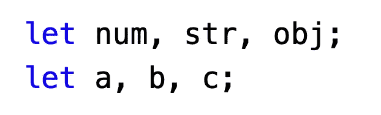

上面代码中的变量缺少类型信息，这使得其他程序员很难理解代码或者 JavaScript 解释器很难优化。

好代码:

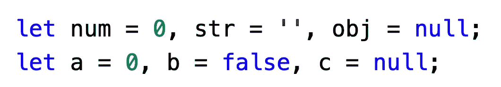

## 不要随意改变变量的类型

错误代码:

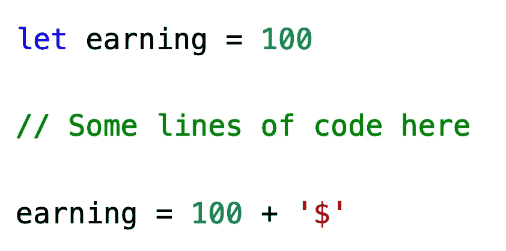

`earning`开头是整数，后来变成了字符串。如果其他人需要阅读或修改这些代码，他或她必然会对代码产生怀疑，甚至会编写出错误的代码。

同时，V8 这样的引擎中的 JavaScript 代码被转换成字节码后执行，字节码中的数据类型被确定。如果我们在 JavaScript 代码中改变变量的数据类型，编译器必须做一些额外的处理，这会降低程序的性能。

好代码:

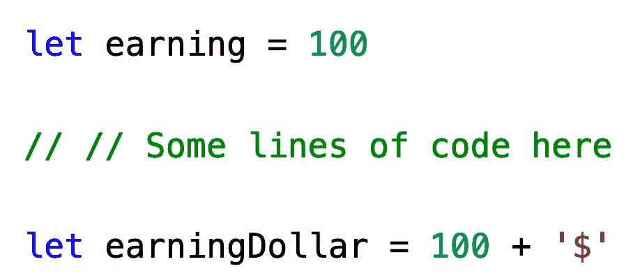

当您需要转换值的类型时，请使用新的变量。

## 函数的返回类型应该是固定的

错误代码:

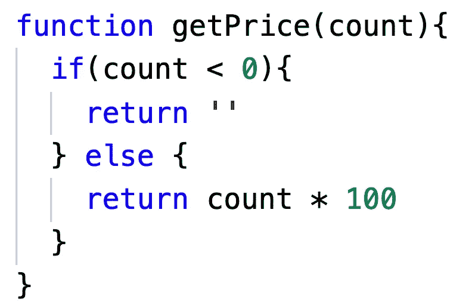

这个函数可以返回一个整数或者一个字符串。虽然这符合 JavaScript 语法，但这使得调用函数的人很难直接用`getPrice()`的结果做算术。

好代码:

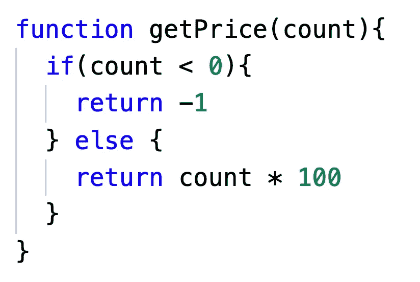

我们可以在函数注释中同意，返回`-1`意味着参数无效。这允许调用者以统一的方式处理函数的结果。

# 2.减少不必要的范围查找

JavaScript 支持嵌套作用域和作用域链，这允许我们编写高效的代码。但是使用这些语法会错误地弄乱代码。

## 如果没有必要，不要将代码暴露在全局范围内

错误代码:

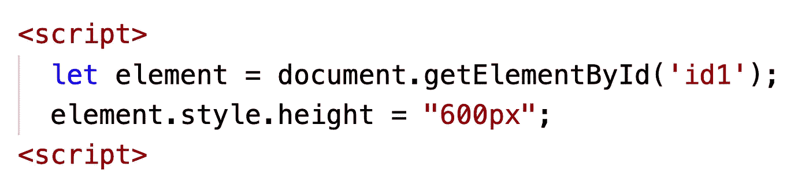

首先，script 标签中的所有变量都在全局范围内，不同 script 标签中的代码可能由不同的程序员开发，可能会造成命名冲突。

第二，上面第二行代码，在使用`element`变量时，在全局范围内寻找`element`变量，降低了程序的性能。

好代码:

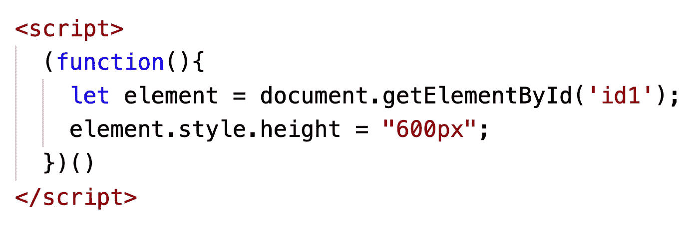

这样，我们使用闭包来隐藏`element`变量。这不会污染全局范围，而且在局部范围内查找变量更快。

当然，如果你确定你会在其他地方使用`element`变量，你还是应该在全局范围内公开它。

## 不要滥用闭包

JavaScript 通过作用域链寻找变量。如果在当前作用域中找不到变量，JavaScript 引擎会在当前作用域的父作用域中查找，然后逐层向上查找全局作用域。所以闭包嵌套得越深，变量查找花费的时间就越长。

错误代码:

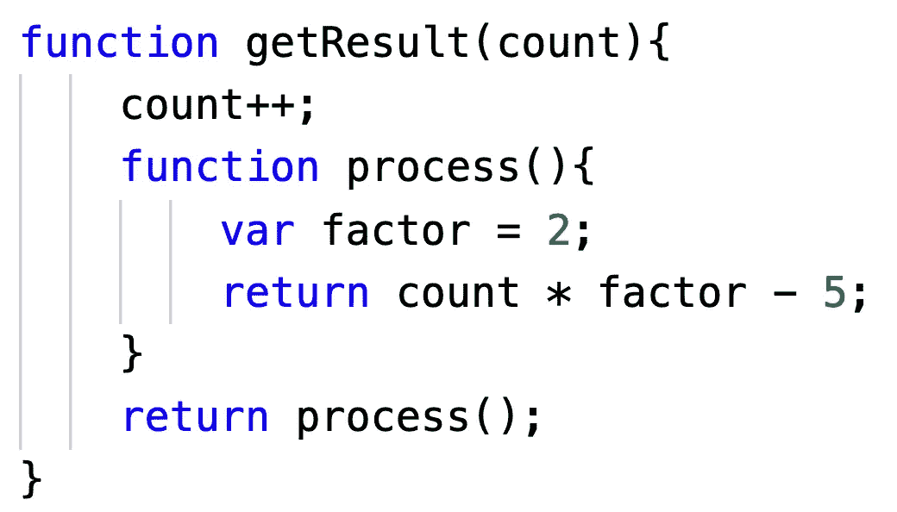

在`process`函数中使用了上层作用域变量`count`，这使得 JavaScript 引擎在调用`process`函数时查找`count`变量更加耗时。

同时，如果作用域是多级嵌套的，在`process`和`count`之间有几十行代码，那么在读取流程函数时很容易混淆 count 变量。

更好的方法是将`count`作为参数传递给`process`。

好代码:

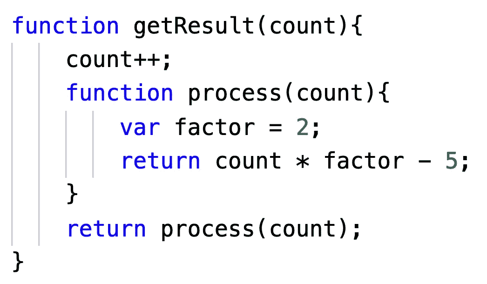

# 3.使用 ES6 特性来简化代码

ES6 已经存在很多年了，现在非常兼容。我们应该积极拥抱 ES6，让代码更加简洁优雅。

## 使用箭头函数代替普通函数作为回调函数

如果不需要考虑关于`this`绑定的问题，用箭头函数代替普通函数作为回调是个不错的主意。

错误代码:

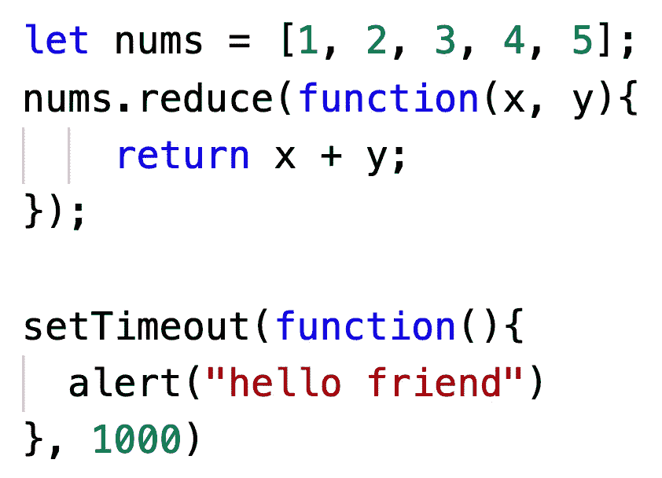

好代码:

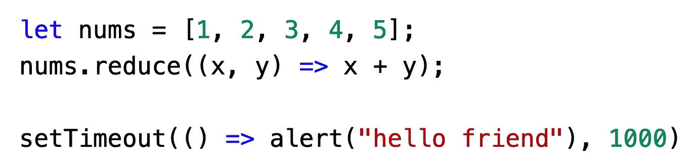

## 使用类别

使用传统的原型语法会将构造函数代码与原型方法代码分开，从而无法有效地组织代码。

错误代码:

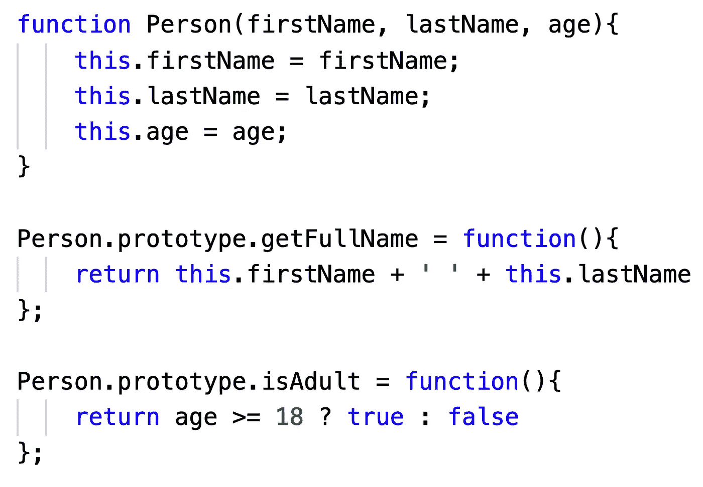

使用类使代码更简单、更容易理解，同时使用类也使实现继承的静态成员函数变得容易。

好代码:

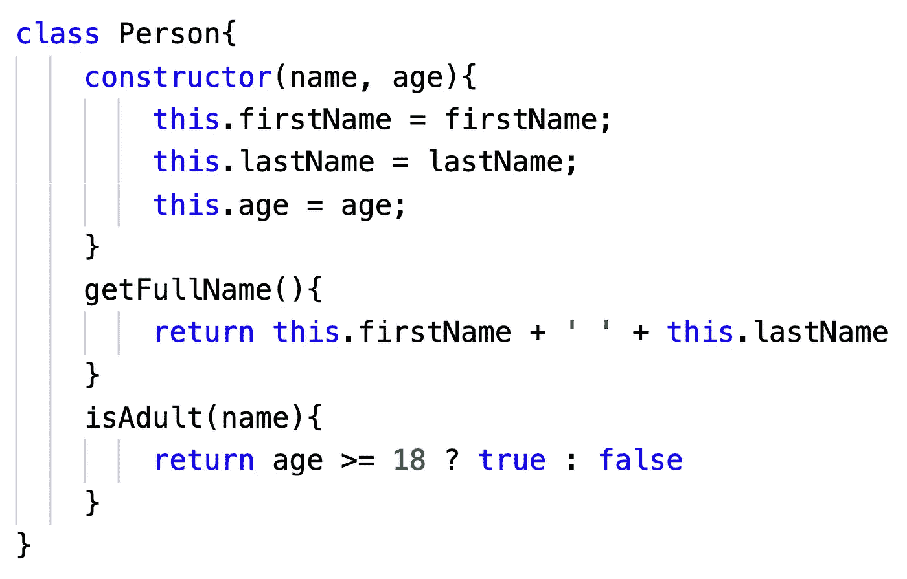

## 使用模板字符串

模板字符串用反斜杠(`` ``)字符而不是双引号或单引号括起来。

错误代码:

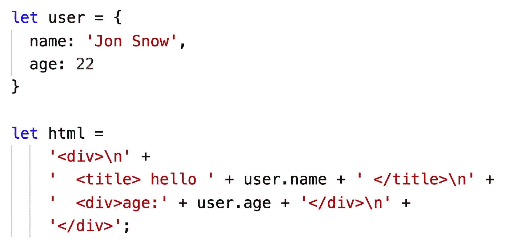

在模板字符串中，我们可以使用任何字符，而不是像`\n`这样的转义字符。

同时，我们可以直接使用表达式`${}`插入变量，而不是拆分字符串，使用`+`串联。

好代码:

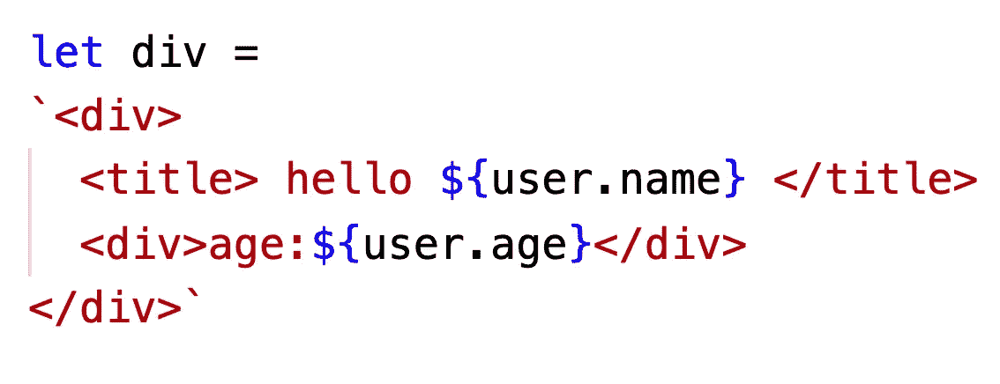

这显然更容易阅读。

## 使用默认参数

在 ES5 中，如果我们想给函数的参数一个默认值，我们可以这样写:


在 ES6 中，我们可以用一种更简单、更易读的方式编写:


## **使用块范围**变量

如果我们希望控制台以 100 毫秒的间隔依次输出 0，1，2，…10，有些人可能会编写这样的代码:

```
for(var index = 0; index <= 10; index++){
  setTimeout(() => console.log(index), 100)
}
```

不幸的是，上面的代码不能满足需求。因为`var`声明的变量在全局范围内，所以当 setTimeout 回调函数执行时，`index`的值已经更改为 11。

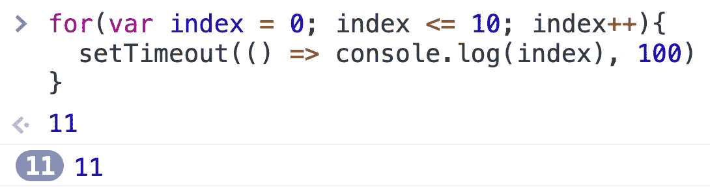

ES5 中的一个解决方案是使用闭包:

```
for(var index = 0; index <= 10; index++){
  (function(archivedIndex){
    setTimeout(() => console.log(archivedIndex), 100)
  })(index)
}
```

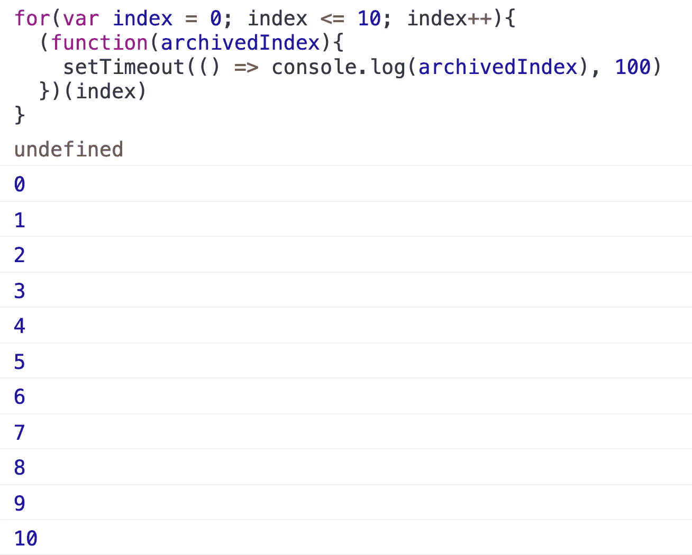

这里我们通过闭包保存`index`值，这样每次执行 setTimeout 时，都会找到正确的`index`值。

但是上面的写法很麻烦，很难理解。更好的方法是使用`let`来声明一个块范围的变量。

```
for(let index = 0; index <= 10; index++){
  setTimeout(() => console.log(index), 100)
}
```

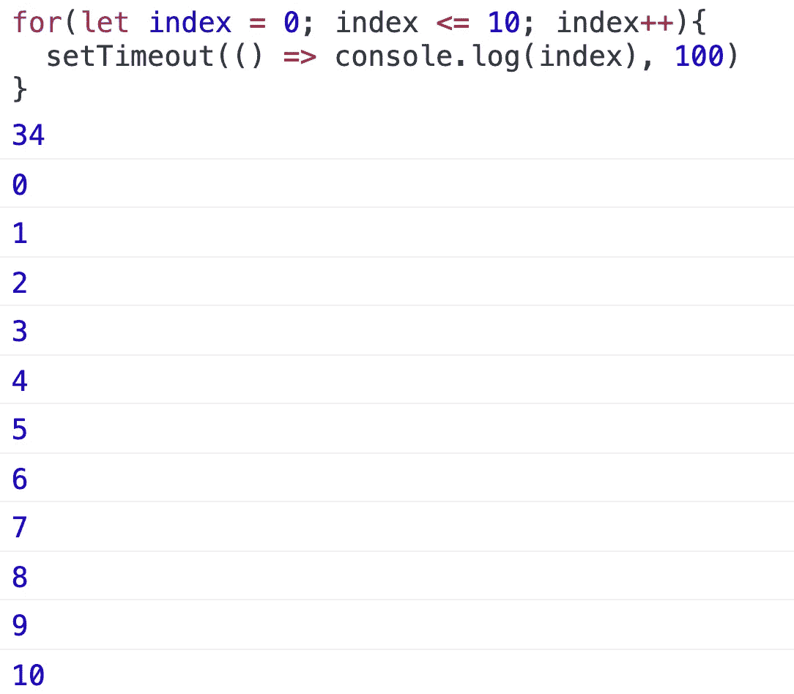

你只需要改变三个字符就可以完成要求，非常简单，方便，可读性强。

# 4.语法风格

## 用三元运算符替换简单的 if-else

通常，三元运算符的语法如下:

```
condition ? expression_1 : expression_2;
```

`condition`是一个计算结果为布尔值`true`或`false`的表达式。如果条件为`true`，三元运算符返回`expression_1`，否则返回`expression_2`。

错误代码:

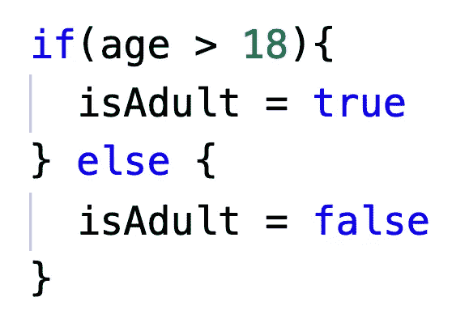

好代码:

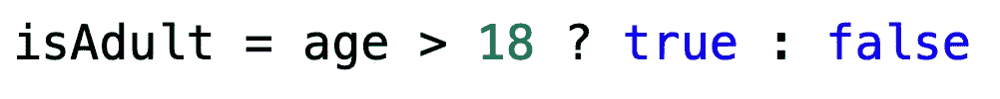

## 避免==

`==`有很多特殊的机制，过多使用`==`会让我们的代码更加难以理解。我们可以显式转换数据类型，使代码更容易理解。

错误代码:

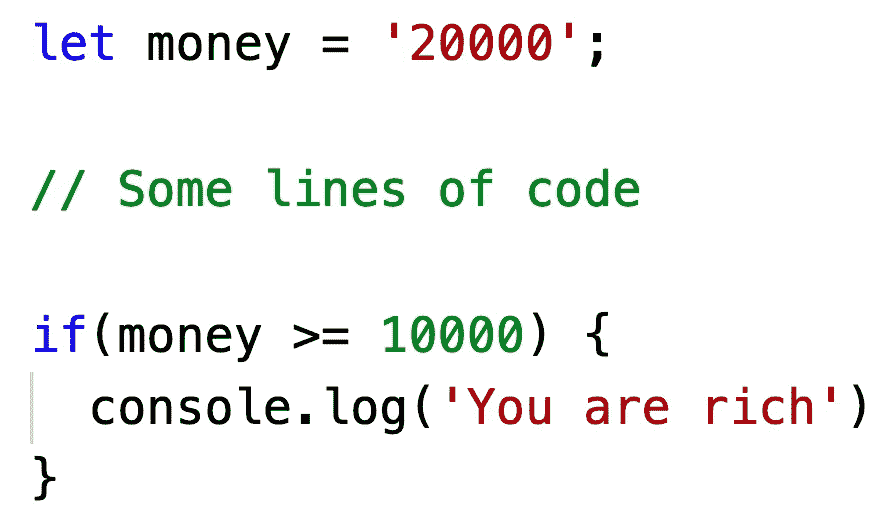

好代码:

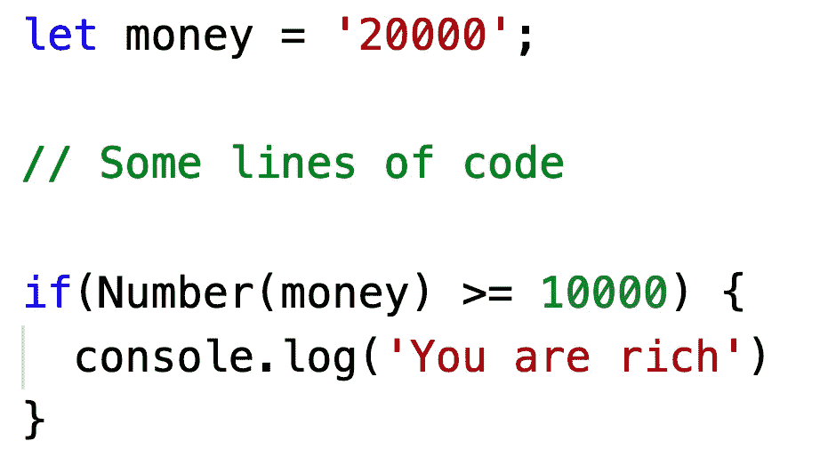