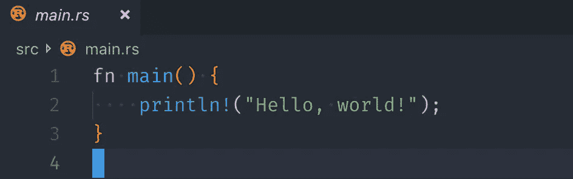
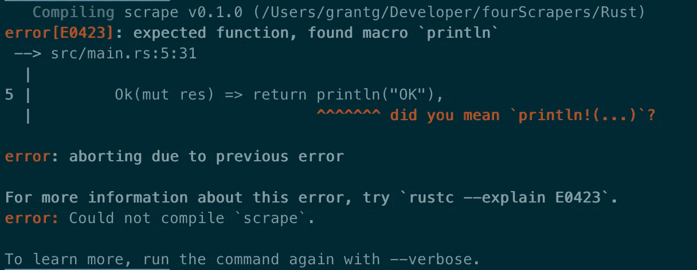

# 我用四种不同的语言编写了一个 web scraper。

> 原文：<https://javascript.plainenglish.io/4-languages-1-app-cf7d209d700d?source=collection_archive---------4----------------------->

## 对《hello world》的斥责，在 Node，Go，Python，和 Rust。

Photo by [Jonny Caspari](https://unsplash.com/@jonnysplsh?utm_source=medium&utm_medium=referral) on [Unsplash](https://unsplash.com?utm_source=medium&utm_medium=referral)

hello world in Rust

我们都曾经写过这样的话，老实说，这种居高临下的做法需要停止了。我明白了，你学习如何建立一个项目，无论什么工具是必要的，也许还有一些基本的语法。然而，这远不是一个“介绍”。

有了一个前端框架，人们可以做一个“待办事项”应用程序。这给出了状态、用户输入、crud 交互和布局的全面视图。但是如果我不关心前端交互呢？

在每个场景中，我都问过自己一些问题:如何导入我可能需要使用的方法？我如何与文件系统交互？如何远程获取资源(http 请求)？一旦我拥有了资源，我该如何与之互动呢？涵盖所有这些概念的项目将是一个简单的 web scraper。

> 警告——网络抓取是一个争论点，有人说这是不道德的，几乎是非法的。虽然我不同意这种观点，但我建议，如果你打算制作和使用一种工具从网络资源中收集数据，你应该谨慎行事。如果操作不当，这可能是破坏性的，要小心。

我有一些网络抓取的经验。我觉得在业余时间摆弄这些东西很有趣，我也曾专业地参与过一些涉及相当全面的设置的项目。对于这个实验，我想使用标准的打包方法。通过这种方式，我们获得了熟悉语言的好处，而不是学习特定包的 API。

> 要求—
> 
> 对页面发出 http 请求
> 
> 将页面存储在文件系统本地(确保我们不会覆盖之前的抓取)
> 
> 从磁盘上读取文件
> 
> 使用本地方法查找搜索词

实现这四个目标需要对每一种语言有更深刻的理解，而不是印刷一些泰格·伍兹的名言😝，[我知道它来自 C](https://en.wikipedia.org/wiki/%22Hello,_World!%22_program) 。我们将学习每种语言如何处理异步行为，如何读写文件，以及如何处理原语。更不用说我们还将在控制台上打印一些有意义的内容。

## - [NodeJS](https://nodejs.org) -

Photo by [Mario Gogh](https://unsplash.com/@mariogogh?utm_source=medium&utm_medium=referral) on [Unsplash](https://unsplash.com?utm_source=medium&utm_medium=referral)

我每天都在用 JavaScript 工作，这将为我想用其他语言复制的东西设置一个标杆。尽可能保持自然和简单。我想到了这个:

Node JS

我们已经导入了三个本地方法，`get`将获取我们的页面，然后是`readFileSync`和`writeFileSync`正在阻塞的函数(它们同步运行)。当我们调用`checkPageForText`时，它需要一个 URL 和一个术语。它首先对资源发出 http 请求(`url`)，当数据流以块的形式出现时，它用这些块构建一个`data`字符串。

一旦流结束，它就获取该字符串并将其同步写入磁盘。这就是时间戳很重要的地方，这样我们就不会不断地覆盖抓取的数据。如果页面包含搜索词，我们可以通过这种方式引用历史数据，从而进一步解析该文件。使用一个简单的 if 检查，我们读取刚刚编写的文件，然后使用本地 javascript `includes`字符串方法找到我们的`term`。

JavaScript 是异步的，在这种情况下，我们使用回调来处理从请求返回的响应，并在数据完全传输后访问数据。如果过度使用，回调可能会变得混乱，并可能创建一个“末日金字塔”。

另一个解决方案涉及承诺，甚至可能涉及`async`和`await`关键词。对于这个应用程序来说，使用回调很好，也很容易理解。有人将 JavaScript 描述为“富于表现力”，在这种情况下，有许多方法可以达到同样的效果。

总的来说，我们对页面有一个基本的了解，可以找到一个搜索字符串并报告给用户。这可能会更加健壮，但是在语言之间进行比较会变得更加困难，应用程序越复杂，这种比较就越没有意义。

## - [Go-lang](https://golang.org/) -

Photo by [Sorin Sîrbu](https://unsplash.com/@sirbusorin?utm_source=medium&utm_medium=referral) on [Unsplash](https://unsplash.com?utm_source=medium&utm_medium=referral)

这里我们遵循与节点实现中相同的步骤。`scrape`将`u`作为 URL，将`t`作为术语或搜索术语。Go 中对单字符变量的约定与我学习编写可读代码的方式正好相反。然而，这是他们的习俗，所以我必须遵守。

Go

错误检查是使用 Go 时的一个已知难点。您可以看到每个可能的故障点的连续错误检查。一方面，这是重复的，但是它确实使调试更容易。

从像 JavaScript 这样的动态语言迁移到 Go 的一个巨大区别是，我们必须定义我们的类型，并在适当的时候将我们的字节片转换成一个字符串(第 49 行)。这在类型安全方面有明显的优势，也有助于考虑您的函数到底需要什么来返回正确的类型。

在与更熟悉 Go 的人合作之后，我能够简化一些难看的字符串连接(使用`Sprintf`而不是`+`)，并且更好地理解 Go 中的命名约定。当向函数传递变量时，使用一两个字母，否则类似于`filename`或`body`就可以了。Go 作为一种可访问的强类型语言在这个列表中脱颖而出。

## - [Python](https://www.python.org/) -

Photo by [Hitesh Choudhary](https://unsplash.com/@hiteshchoudhary?utm_source=medium&utm_medium=referral) on [Unsplash](https://unsplash.com?utm_source=medium&utm_medium=referral)

直截了当是我描述编写 Python 的方式。难怪这是许多新程序员的首选语言。Python 的用户基础非常庞大，支持无处不在。

Python

这里我们用相同的`url`和`term`参数制作相同的`scrape`程序。代码非常简单，很容易理解，我几乎不认为它需要解释。

我在这里要指出的一个问题是，Python 并没有使用花括号来直观地显示一个块的清晰语法，而是依赖空白。我不喜欢这样，虽然我确实看到了优雅。

我知道 Python 的这种特性是它易于使用的原因，也是为什么这么多人使用它的原因。我喜欢这种简单地编写`if term in s.read()`而不必调用方法来搜索字符串的能力。Python 给我的印象是功利主义的，在这一点上，它是一种极其强大的通用语言。

## - [生锈](https://www.rust-lang.org) -

Photo by [Ross Sokolovski](https://unsplash.com/@ross_sokolovski?utm_source=medium&utm_medium=referral) on [Unsplash](https://unsplash.com?utm_source=medium&utm_medium=referral)

Rust 与本文前面的语言完全不同。Rust 的一个惊人之处在于，它的编译器错误实际上是人类可读的，而且非常有用。

我认为他们真的已经超越了这一点，在开发 Rust 的工具时，试图消除一些可能变得不太重要的东西的痛苦。与本文中的其他语言相比，编写代码花费的时间要多得多，这就是除锈器:

Rust

我很难找到一种简单的方法来用标准库发出 http 请求，最终使用了一个名为`reqwest`的外部机箱(包/库)。

用 Rust 写这个程序需要的一个概念是[‘借用’](https://doc.rust-lang.org/book/second-edition/ch04-02-references-and-borrowing.html)。在 Rust 中，被借用的变量是它们自己的类型，它们是对变量存储在内存中的位置的引用(对我来说听起来像一个指针，我对这个理解不足以区分)。内存管理是许多使用高级语言的程序员没有明确处理的事情。

我之前提到过 Go 的一个痛点是错误检查。Rust 没有这个问题，事实上，Rust 中的程序员可以根据信息是如何被访问或生成的，来选择如何以及何时处理错误。你可以从`get_timestamp`和`read_file`的区别中看出这一点。

当读取文件时，我们使用`.expect()`语法来处理异常，而时间戳生成使用[结果枚举](https://doc.rust-lang.org/book/2018-edition/ch09-02-recoverable-errors-with-result.html)来处理错误。我喜欢选择，令人惊讶的是，尽管我一直在纠结，但我真的喜欢铁锈。我不会很舒服地伸手去拿它来快速形成一个想法，但是我的兴趣已经增长了。

Photo by [Kobu Agency](https://unsplash.com/@kobuagency?utm_source=medium&utm_medium=referral) on [Unsplash](https://unsplash.com?utm_source=medium&utm_medium=referral)

每种语言都有不同的目的，它们解决不同的问题。其中一些语言(Python 和 JavaScript)似乎可以解决所有问题。但同样地，它们缺乏效率和安全性，而这正是 Rust 擅长的。

一些在这些语言方面有更多经验的人肯定会找到更好的/不同的方法来实现简单的 scraper，我很期待看到一些人如何实现它。或者在熟悉一门新语言的时候，你有喜欢写的不同的程序，请分享一下。

就《hello world》来说，一个简单的刮刀就牵扯的多了。我想证明对编程语言的介绍可以更深入，并展示它的特性、语法、优点和缺点。这绝不是一个解决实际问题的方法，只是我想探索的东西。希望你觉得这个有用，决定贡献自己的刮刀或者更好的东西。