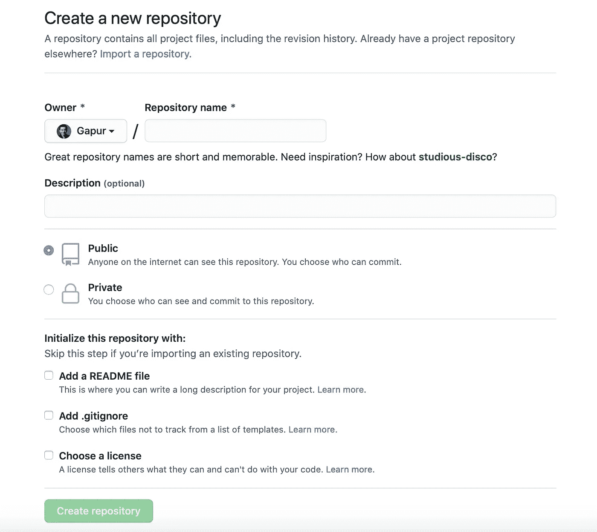
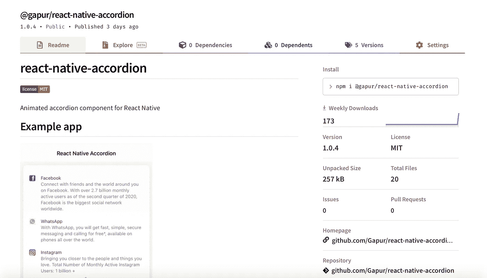

# 如何在短短 4 分钟内发布第一个开源包

> 原文：<https://javascript.plainenglish.io/4-min-typescript-npm-package-a982f96a54d1?source=collection_archive---------17----------------------->

## 4 分钟打字稿 NPM 包


Photo by [Beazy](https://unsplash.com/@beazy?utm_source=unsplash&utm_medium=referral&utm_content=creditCopyText) on [Unsplash](https://unsplash.com/s/photos/computer-library?utm_source=unsplash&utm_medium=referral&utm_content=creditCopyText)

作为开发人员，当我们工作或创建一个新的框架或包可重用组件、功能等时，我们会遇到这样的情况……有时每个人都有一个惊人项目的灵感或想法。为什么不与社区分享，让他们的生活更轻松。

幸运的是，作为 JavaScript 开发者，我们有一个 NPM！我将向您展示如何创建和发布您的第一个 npm 包。

事不宜迟，如果您还没有编写您的基于 TS 的包，没关系，让我们一起来做吧。

# 入门指南

首先，我们将在控制台中使用以下命令创建一个新项目。该命令将使用默认选项创建一个新文件夹。我要创造`[react-native-accordion](https://www.npmjs.com/package/@gapur/react-native-accordion)`。

```
mkdir react-native-accordion
cd react-native-accordion
npm init -y
```

如果您没有全局的`typescript`,您应该用这个命令安装最重要的依赖项。

```
npm install --save-dev typescript
```

一旦我们安装了`typescript`，我们可以通过下一个命令初始化一个 TypeScript 项目。

```
tsc --init
```

这将生成一个默认值`tsconfig.json`。

# 配置 tsconfig.json 选项

`tsconfig.json` file 负责配置我们的 TypeScript 项目。如果打开`tsconfig.json`文件，可以看到选项，大部分都被注释掉了。编辑后我们的文件看起来像这样:

```
{
  "compilerOptions": {
    "baseUrl": "./",
    "target": "ES6",
    "module": "CommonJS",
    "jsx": "react-native",
    "declaration": true,
    "outDir": "./lib",
    "strict": true,
    "noImplicitAny": true,
    "allowSyntheticDefaultImports": true,
    "esModuleInterop": true,
    "skipLibCheck": true,
    "paths": {
      "root/*": ["./*"]
    }
  },
  "include": [
    "./src/**/*",
  ],
  "exclude": ["node_modules", "example/node_modules", "lib"]
}
```

让我们来看看重要的选项:

*   baseUrl —解析非绝对模块名称的基本目录
*   目标——指定 ES 目标版本(现代浏览器支持所有 ES6 特性，因此`ES6`是一个不错的选择)
*   模块—模块系统类型脚本的编译器在输出代码时将使用的模块
*   outDir —这告诉 TypeScript 将我们的代码编译到一个目录中
*   skipLibCheck —强制编译器跳过所有声明文件的类型检查
*   声明——这告诉 TypeScript 发出一个`.d.ts`定义文件以及您编译的 JavaScript

# 编辑包. json

接下来我要更新`package.json`。

```
{
  "name": "[@gapur/react-native-accordion](http://twitter.com/gapur/react-native-accordion)",
  "version": "1.0.0",
  "main": "lib/index.js",
  "types": "lib/index.d.ts",
  "scripts": {
    "build": "tsc -p tsconfig.json",
    "prepublishOnly": "npm run build",
    "test": "echo \"Error: no test specified\" && exit 1"
  },
  "repository": {
    "type": "git",
    "url": "git+[https://github.com/Gapur/react-native-accordion.git](https://github.com/Gapur/react-native-accordion.git)"
  },
  "keywords": [
    "react",
    "react-native",
    "react-component",
    "accordion",
    "react-native-component",
  ],
  "author": "Gapur Kassym <[gapur.kassym@gmail.com](mailto:gapur.kassym@gmail.com)> ([https://github.com/Gapur](https://github.com/Gapur))",
  "license": "MIT",
  "devDependencies": {
    "[@types/react](http://twitter.com/types/react)": "^16.9.49",
    "[@types/react-native](http://twitter.com/types/react-native)": "^0.63.22",
    "typescript": "^4.0.3"
  },
}
```

让我们讨论一下重要的选项，或者您可以查看 [package.json 文档](https://docs.npmjs.com/files/package.json):

*   名称—我们在 NPM 的包裹的名称
*   版本—我们的包版本，这个字段必须是`x.x.x`的形式，检查`[semantic versioning guidelines](https://docs.npmjs.com/about-semantic-versioning)`
*   main —程序的主要入口点
*   类型—我们的主声明类型脚本文件
*   构建——这告诉编译我们的代码
*   作者—该字段必须采用格式`Your name <email@example.com> (http://example.com)`

# 编写一些代码

接下来，我们可以创建一个简单的包——一个对两个变量求和的函数。

```
export const add = (x: number, y:number):number => {
  return x + y;
}
```

不过我已经实现了`react-native-accordion`，如果有兴趣可以在这里查看我的代码 [react-native-accordion](https://github.com/Gapur/react-native-accordion) 。

# 创建自述文件

一个[自述文件](https://www.makeareadme.com)是一个介绍和解释项目的文本文件。它包含理解项目内容通常需要的信息。我强烈建议将自述文件包含在您的软件包目录中。


README example

这是我的自述示例，如果你感兴趣，这里有我的[自述文件](https://github.com/Gapur/react-native-accordion/blob/master/README.md)和[自述模板](https://gist.github.com/PurpleBooth/109311bb0361f32d87a2)的链接。

# 。gitignore 和。npmignore

`.gitignore`指定哪些文件和文件夹应该从对存储库的任何提交中省略。根据您的环境，您可以在您的`.gitignore`文件中使用[模板](https://github.com/github/gitignore)。

`.npmignore`的工作与`.gitignore`类似，它指定在将包发布到 NPM 时应该忽略哪些文件。

# GitHub 知识库

接下来，我将创建一个 Github 存储库。



Create a new repository

然后，将代码推送到您的存储库中。


react-native-accordion

# 发布国家预防机制包

在发布之前，我们需要编译和准备您的项目文件。我们可以通过在 package.json 文件中添加脚本来实现。

```
"scripts": {
  "prepublishOnly": "npm run build"
}
```

最后，我们可以用下面的命令发布我们的 npm 包。

```
npm publish
```

嘣！我们刚刚发布了我们的第一个 npm 包。



npm package

# 结论

感谢阅读，希望这篇文章对你有用。编码快乐！

# 资源

[](https://blog.logrocket.com/publishing-node-modules-typescript-es-modules/) [## 用 TypeScript 和 es 模块发布节点模块

### 了解如何用 TypeScript 编写包，但仍然向用户提供他们不会使用的现代 JavaScript 代码…

blog.logrocket.com](https://blog.logrocket.com/publishing-node-modules-typescript-es-modules/) [](https://medium.com/cameron-nokes/the-30-second-guide-to-publishing-a-typescript-package-to-npm-89d93ff7bccd) [## 向 NPM 发布打字稿包的 30 秒指南

### 最初发布于 https://Cameron nokes . com/blog/the-30-second-guide-to-publishing-a-typescript-package-to-NPM/

medium.com](https://medium.com/cameron-nokes/the-30-second-guide-to-publishing-a-typescript-package-to-npm-89d93ff7bccd) [](https://medium.com/better-programming/how-to-publish-your-first-npm-package-ebfbcde3c26f) [## 如何发布你的第一个 npm 包

### 了解如何向 JavaScript 生态系统发布开源包

medium.com](https://medium.com/better-programming/how-to-publish-your-first-npm-package-ebfbcde3c26f) [](https://dev.to/monisnap/5-min-typescript-npm-package-4ce4) [## 5 分钟打字稿 NPM 包

### 作为开发人员，我们可能想要创建一个新的框架或包，重用组件、函数等...希望是…

开发到](https://dev.to/monisnap/5-min-typescript-npm-package-4ce4) [](https://github.com/Gapur/react-native-accordion) [## gapur/react-native-手风琴

### React Native 的动画手风琴组件。为 Gapur/react-native-accordion 的发展做出贡献

github.com](https://github.com/Gapur/react-native-accordion)