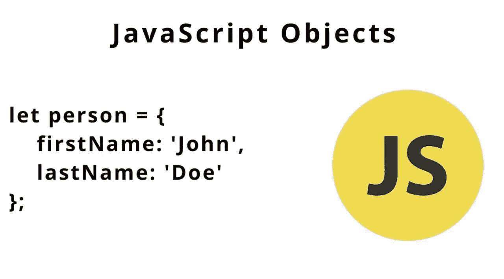

# 您可能不知道的 4 个对象方法

> 原文：<https://javascript.plainenglish.io/4-object-methods-you-may-do-not-know-4c74721ef358?source=collection_archive---------12----------------------->



# 目标

JavaScript 完全是关于对象的。类是 JavaScript 中最重要的数据类型。它通常用于存储各种键控集合和更复杂的实体。让我们找出 4 个有用但不为大多数人所知的对象方法

# 1.Object.is()

EC6 增加了一个叫做`Object.is()`的辅助函数。`Object.is()`方法确定两个值是否相同，与`===`运算符略有不同

## **`**===**`**和** `**Object.is()**`的区别**

**方法`Object.is()`在几乎所有的意图和目的上与`===`相同，只有两个关键的不同**

****1_ 负 0****

**不寻常的 JavaScript 数字负零`-0`通常被认为等于正零`+0`，但它们在技术上是不同的值。`Object.is()`可以区分它们，返回`false`进行`-0`和`+0`的比较**

```
console.log(Object.is(-0, +0)) // false
console.log(-0 === +0) // true
```

****2_ 楠****

**NaN 表示“非数字”值，等效表示为`NaN`或`Number.NaN`。`**NaN**` **是 JavaScript** 中唯一不等于自身的数字，但使用`Object.is()`时`NaN`被认为是与自身相同的值**

```
console.log(Object.is(NaN, NaN)) // trueconsole.log(NaN === NaN) // false
```

> **有人会问这有用吗？？？**

## **`Object.is()`的真实例子**

****React 代码**使用`Object.is`算法比较之前的状态和更新后的状态。所以…有用吧？**

**我认为 React 代码使用了`Object.is`,因为这可能会阻止 React 在给定一个`NaN`值的情况下无限地重新呈现组件，而这个值使用`===`永远不会等于它本身**

## **Object.is()的更多示例**

**`test`和`newTest`有相同的对象值，但引用不同；这就是为什么它是`false`。鉴于，`Object.is(test, cloneTest)`返回`true`，因为**值和参考值是相同的****

```
Object.is('objectis', 'objectis'); // true
Object.is(0, -0); // falseconst test = {a: 100};
const cloneTest = test;
const newTest = {a: 100};console.log(Object.is(test, cloneTest)) // true;console.log(Object.is(test, newTest)) // false;
```

# **2.Object.freeze()**

**`Object.freeze()`方法**冻结**一个对象。**一个被冻结的物体不能再被改变；****

****的好处**的好处`**Object.freeze()**`**

**冻结对象**

**1_ 防止新属性被添加**/**或删除******

**2_ 防止更改现有属性的**可枚举性、可配置性或可写性****

**3_ 防止现有属性的**值**被更改**

**4_ 防止其**原型**被更改**

****与**的比较`**Object.seal()**`**

**用`Object.seal()`密封的对象可以改变它们现有的属性。用`Object.freeze()`冻结的对象中的现有属性被设为**不可变****

**`**Object.freeze()**` **例题****

**尝试更改`prop1`属性将会失败，我们将会得到以下错误`Uncaught TypeError: Cannot assign to read only property prop1 of object #<Object>`**

```
const obj = { prop1: 'some string', prop2: 5,};const frozenObj = Object.freeze(obj);obj.prop1 = 'some other string' // uncaught TypeError
```

****检查物体是否冻结****

```
const frozenObj = Object.freeze(obj);console.log(Object.isFrozen(frozenObj)) // true
```

# **3.Object.fromEntries()**

**这是`Object.entries`的反转。使用`Object.fromEntries`，可以将**数组**转换为**对象****

**`**Object.fromEntries()**` **例题****

**`Object.fromEntries`将二维数组转换为对象；数组`entries[i][0]`的第一个元素变成`key`，数组`entries[i][1]`的第二个元素变成一个值**

```
const entries = [ ['foo', 'bar'], ['baz', 42]];const obj = Object.fromEntries(entries);console.log(obj); //Object { foo: "bar", baz: 42 }
```

****数组作为一个值****

```
const entries = [ ['foo', [1,2,3,4,5,6]], ['baz', 42]];const obj = Object.fromEntries(entries);console.log(obj);// Object { foo: [ 1, 2, 3, 4, 5, 6 ], baz: 42 }
```

****其他类型的类型错误****

**`Object.fromEntries()`的参数应该是可迭代的，如**数组**或**映射。**如果将其他数据类型传入`Object.fromEntries`，将返回**未捕获类型错误****

# **4.object . getownpropertydescriptors()**

**`Object.getOwnPropertyNames()`方法返回在给定对象中直接找到的所有属性(包括不可枚举的属性)的数组**

```
const obj = {0: 'a', 1: 'b', 2: 'c'};
const keys = Object.getOwnPropertyNames(obj);console.log(keys) // ['0', '1', '2']
```

****与**的比较`**Object.keys()**`**

**`Object.getOwnPropertyNames(obj)`**

**返回**对象的所有属性****

**鉴于`Object.keys()`**

**仅返回**所有可枚举属性****

**换句话说，如果任何属性被设置为`enumerable: false`，这两个方法将返回不同的输出**

****示例-当所有值都可以枚举时****

**在这种情况下，输出将是相同的**

```
const screen = { branch: 'Dell', size: '27inch' };console.log(Object.getOwnPropertyNames(screen)); 
// ['branch', 'size']
console.log(Object.keys(screen)); // ['branch', 'size']
```

****示例-当值不可枚举时****

**让我们再定义一个名为`resolution`的属性，并将其设置为`enumerable: false`**

```
Object.defineProperties(screen, { resolution: 
                         {enumerable: false,
                          value: '2560 x 1440',
                          },
});
```

**在这种情况下，由于`resolution`具有**enumerate:false，**键“resolution”不会出现在`Object.keys`方法中**

```
console.log(Object.getOwnPropertyNames(screen)); 
// ['branch', 'size', 'resolution']
console.log(Object.keys(screen)); // ['branch', 'size']
```

# **结论**

**如果您对 JavaScript 比较陌生，我建议您彻底学习对象数据类型。再说一遍，JavaScript 是关于对象的，它们是 JavaScript 中最重要的数据类型。希望你喜欢 JavaScript 编码，如果你有任何问题，请留下评论。**

****

**Photo by [Mike Meyers](https://unsplash.com/@mike_meyers?utm_source=medium&utm_medium=referral) on [Unsplash](https://unsplash.com?utm_source=medium&utm_medium=referral)**