# 4 种帮助您理解阵列的做法。减少()

> 原文：<https://javascript.plainenglish.io/4-practices-to-help-you-understand-array-reduce-f3138cfef095?source=collection_archive---------1----------------------->

## 在 JavaScript 中，您应该了解这个数组方法。


Photo by [Antonio Garcia](https://unsplash.com/@angarav?utm_source=medium&utm_medium=referral) on [Unsplash](https://unsplash.com?utm_source=medium&utm_medium=referral)

`Array.prototype.reduce()`是数组中最强大的方法之一，也是 JavaScript 函数式编程中一个吸引人的特性。但是不幸的是，我发现许多朋友不习惯使用它。让我详细介绍一下这个方法，希望能对你有所帮助。

这是`reduce`的一个基本用法:

```
var arr = [1, 2, 3];function reducer(parmar1, parmar2){
}arr.reduce(reducer)
```

`reduce`是一种对数组原型对象进行操作的方法，可以帮助我们操作数组。它将以另一个函数作为它的参数，这个函数可以叫做`reducer`。

`reducer`取两个参数。第一个参数 param1 是最后一次减速器运行的结果。如果这是第一次运行`reducer`，则 param1 的默认值是数组第一个元素的值。

reduce 方法循环遍历数组中的每个元素，就像 for 循环一样。回路中的电流值取为参数 2。

遍历数组后，reduce 将返回最后一次 reduce 计算的结果。

让我们看一个详细的例子。

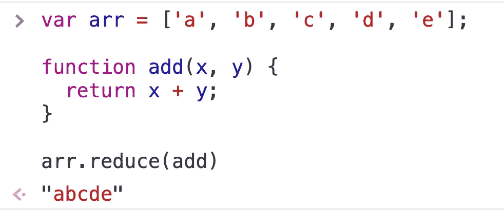

接下来，让我们探索如何执行上述代码。

本规范中`reducer`为`add`。

首先，因为我们是第一次执行`add`，数组中的第一个元素`'a'`将被视为`add`的第一个参数，然后循环从数组的第二个元素`'b'`开始。此时`'b'`是`add`的第二个参数。

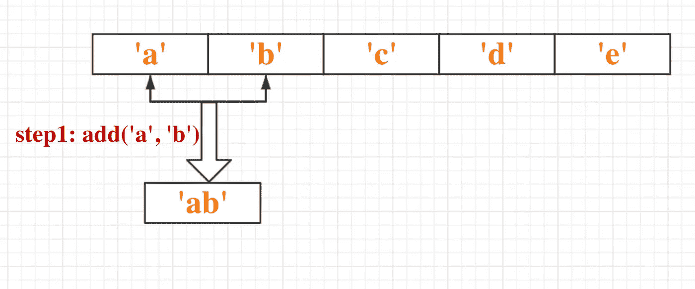

经过第一次计算，得到结果`'ab'`。该结果将被缓存，并在下一次`add`计算中作为参数 1 使用。同时，数组中的第三个参数`'c'`将作为`add`的参数 2。


同样，`reduce`将继续遍历数组中的元素，运行`'abc'`和`'d'`作为`add`的参数。

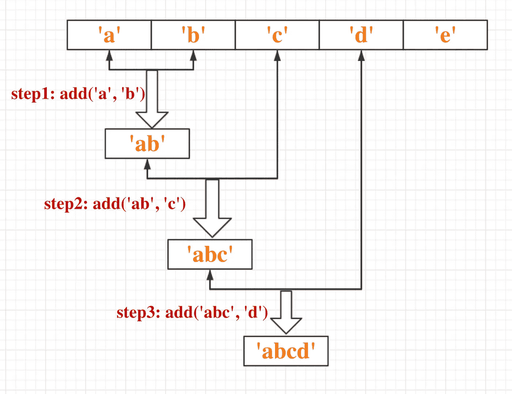

最后，遍历数组中的最后一个元素后，将返回计算结果。

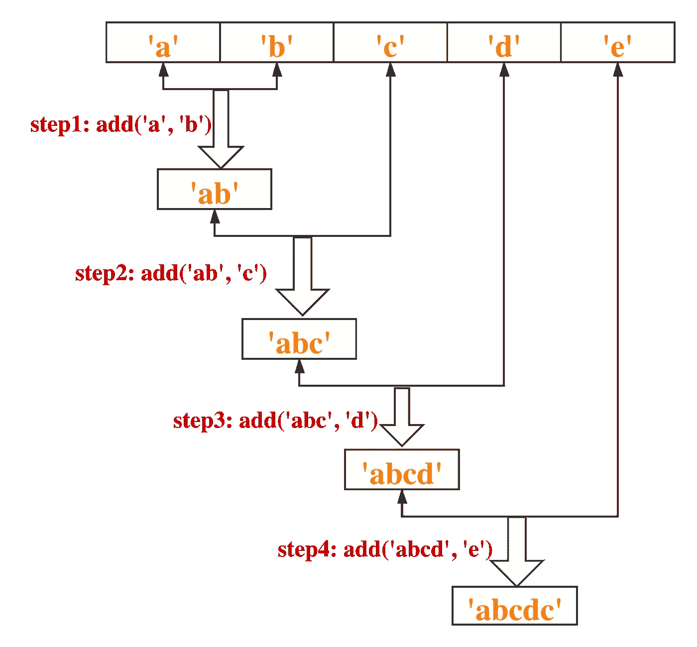

现在我们有了结果:`'abcde'`。

所以，我们可以看到`reduce`也是一种遍历数组的方式！它依次取数组中每个元素的值，执行`reducer`函数。

但是我们可以看到上面的循环并没有那种和谐的美感。因为我们取数组中的第一个元素，也就是`'a'`，作为初始 param1，然后从数组中的第二个元素开始循环得到 param2。

事实上，我们可以将`reduce`中的第二个参数指定为`reducer`函数的 param1 的初始值，所以 param2 将从数组中的第一个元素开始循环得到。

代码如下:

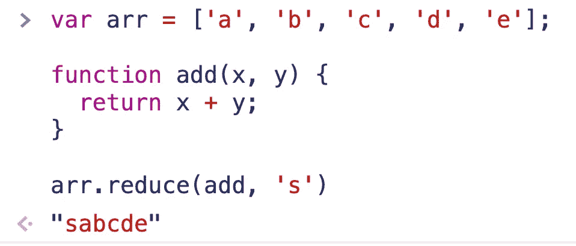

这次我们在第一次调用`reducer`的时候把`'s'`作为 param1，然后从第一个元素开始依次遍历数组。

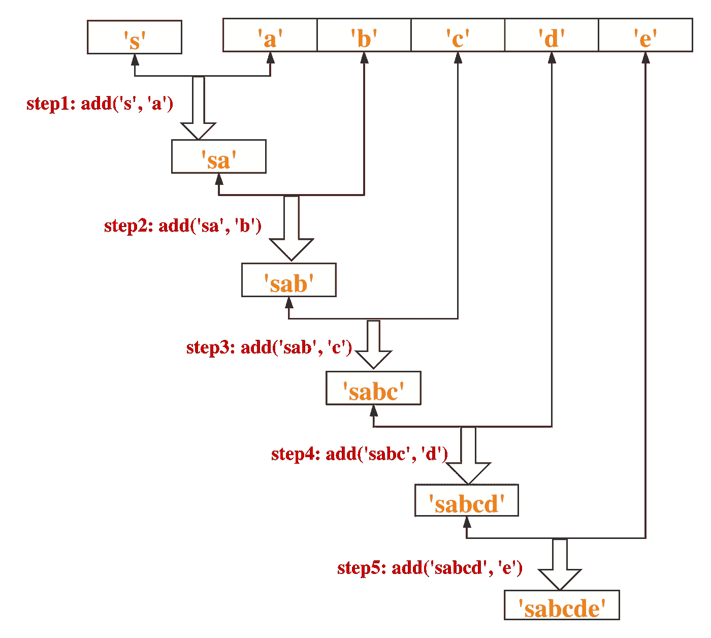

所以我们可以用这个语法来重写我们的第一段代码。

```
var arr = ['a', 'b', 'c', 'd', 'e'];function add(x, y) {
    return x + y;
}arr.reduce(add, '')
```

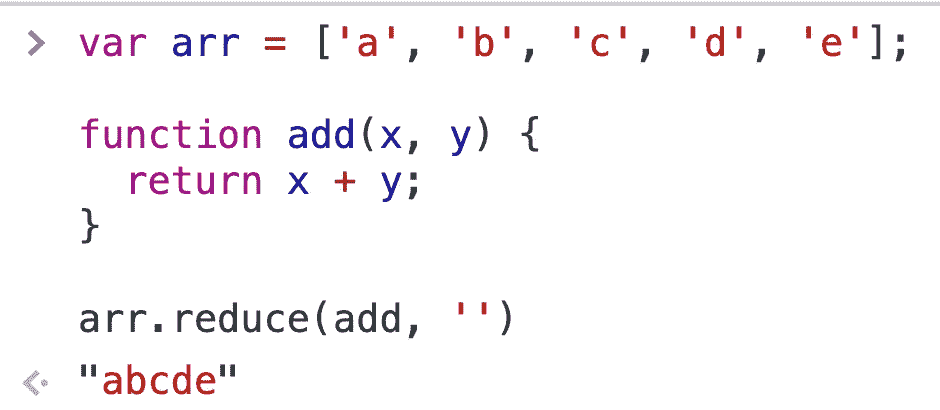

接下来，我们将进入实际编码的章节，来体验一下`reduce`的强大威力。

# 1.累积和累积乘法

如果我们想得到数组中所有元素的和，你会怎么做？

一般来说，你可以这样写:

当然，你可以有其他的写法，但是只要你使用 for 循环，代码就会显得多余。

然后让我们看看上面的累加函数是做什么的:

*   将初始`sum`设置为零
*   取出数组中的第一个元素并求和
*   在`sum`中缓存上一步的结果
*   依次取出数组中的其他元素，执行上述操作
*   返回最终结果

我们可以看到，当我们用文字描述上述步骤时，很明显符合`reduce`的使用。所以我们可以用`reduce`重写上面的代码:

如果您习惯使用箭头函数，上面的代码看起来会更简洁:

所有代码都在一行中！

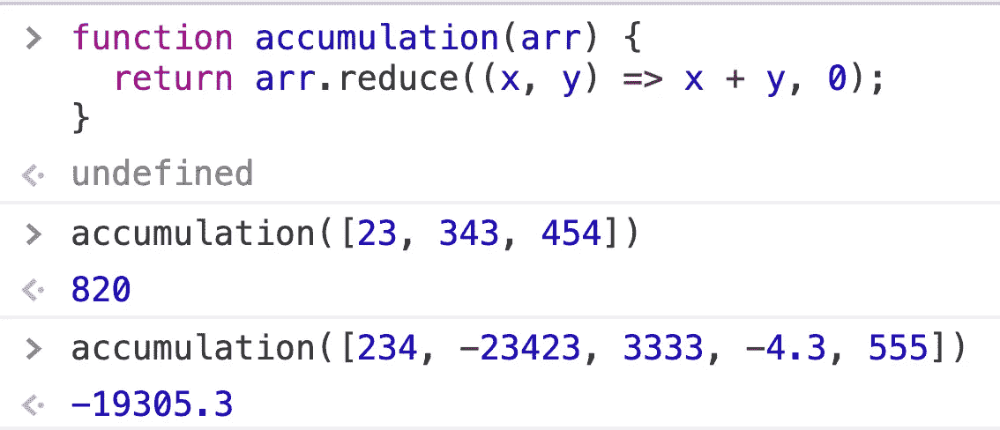

当然，累积乘法和累加是完全一样的:

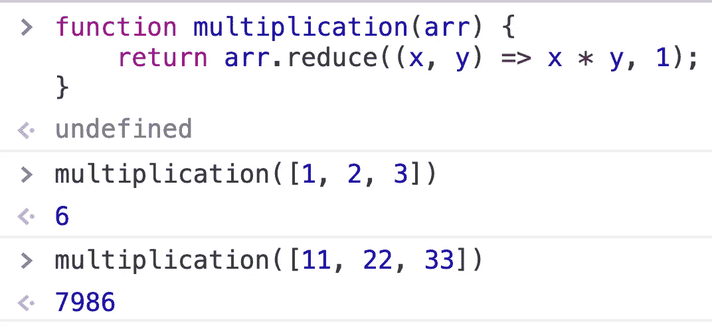

很多时候我们在总结的时候需要加一个砝码，这样更能体现出`reduce`的优雅。

```
const scores = [
  { score: 90, subject: "HTML", weight: 0.2 },
  { score: 95, subject: "CSS", weight: 0.3 },
  { score: 85, subject: "JavaScript", weight: 0.5 }
];const result = scores.reduce((x, y) => x + y.score * y.weight, 0); // 89
```

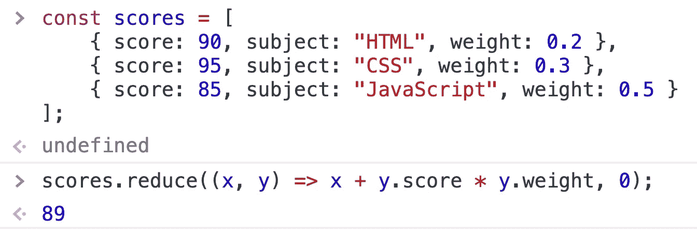

# 2.获取数组的最大值和最小值

如果你想得到一个数组的最大值和最小值，你可以这样写:

和以前一样。如果我们使用`reduce`，我们可以在一行代码中完成。

```
let arr = [3.24, 2.78, 999];arr.reduce((x, y) => Math.max(x, y));arr.reduce((x, y) => Math.min(x, y));
```

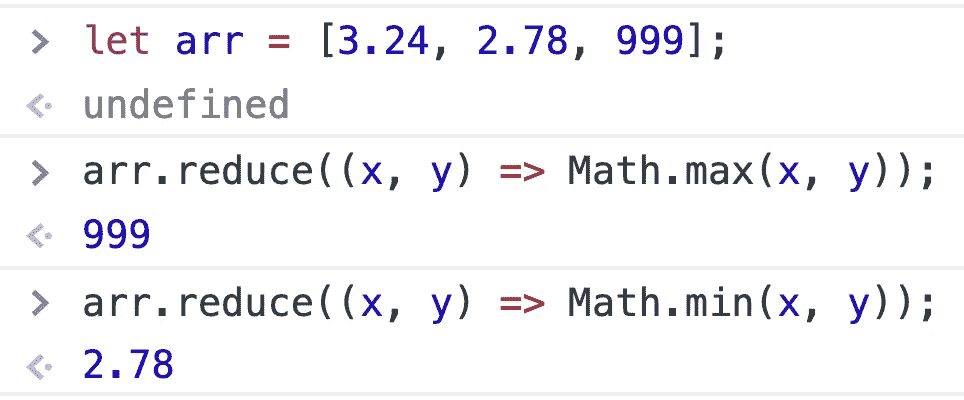

# 3.计算数组中元素的频率

我们经常需要计算数组中每个元素出现的次数。`reduce`方法可以帮助我们实现这一点。

注意，我们使用 map 对象而不是 object 来存储统计后的频率，因为数组中的元素可能是 object 类型，而 object 的 key 只能是 string 或 symbol 类型。

这里有两个例子:

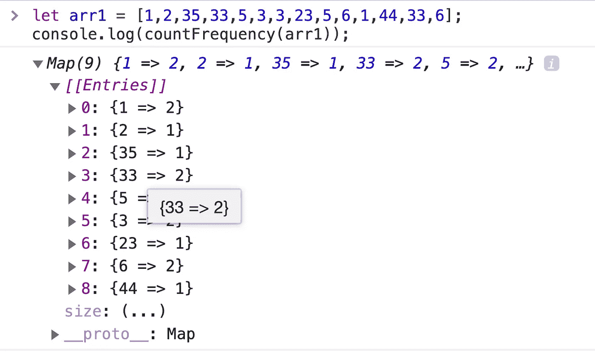

同样，如果要统计字符串中每个字符的出现频率，可以先将字符串转换为字符数组，然后按照上面的方法进行。

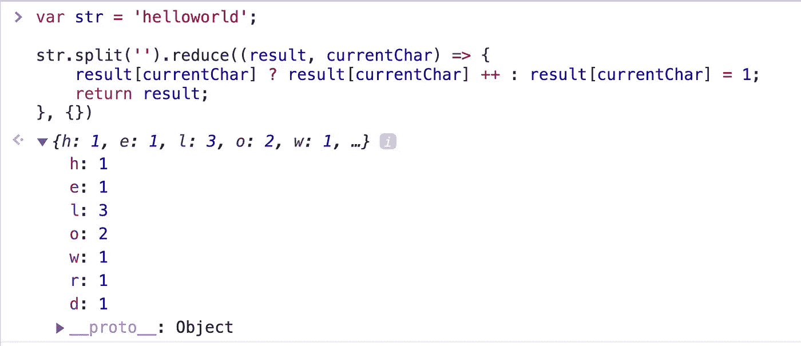

因为字符类型可以用作对象的键，所以我们在这里不使用 Map。

# 4.多个阵列的扁平化

```
function Flat(arr = []) {
    return arr.reduce((t, v) => t.concat(Array.isArray(v) ? Flat(v) : v), [])
}
```

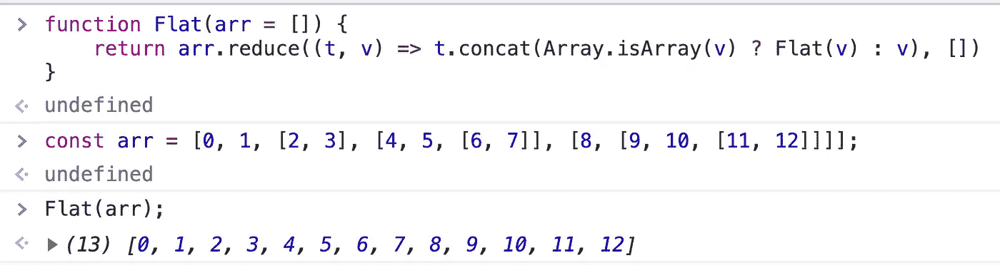

通过`reduce`依次访问数组中的每个元素。如果我们发现元素仍然是一个数组，递归调用 flat 方法。