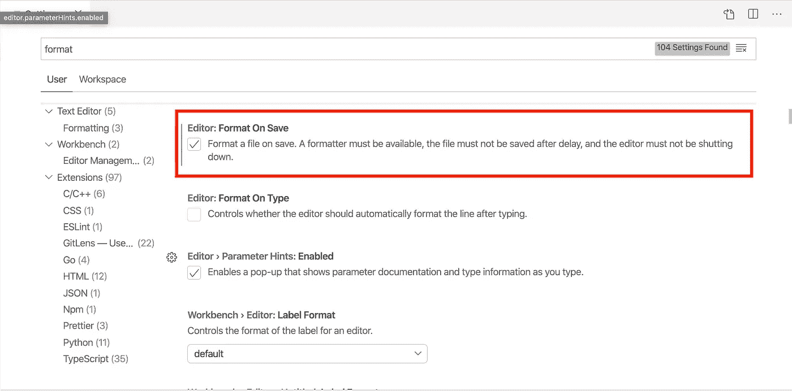

# 设置 ESLint & Prettier 的 4 步指南

> 原文：<https://javascript.plainenglish.io/4-step-guide-to-setting-up-eslint-prettier-d87904a7746e?source=collection_archive---------0----------------------->

## 让 ESLint 和 beautiful 在 2 分钟内启动并运行


在建立一个新的 Express 或 React 项目时，最常见的问题之一是设置 ESLint 和 Prettier 一起工作。

如果你想知道它们之间的区别，

> 更漂亮的是代码格式化程序，它负责你的代码应该是什么样子。ESLint 是一个不仅仅是格式化的 linter。它还有助于发现可能导致 bug 的代码错误。

这篇简短的指南是献给无数可能在这个问题上摸不着头脑的初学者的。

注意:我们将在本教程中使用 VS 代码，但是对于其他流行的代码编辑器来说，它的工作方式应该差不多。

# 第一步。安装开发依赖项

第一步是安装所需的 npm 软件包:

```
npm i eslint eslint-config-prettier eslint-plugin-prettier prettier --save-dev
```

标志允许我们添加这些包作为开发依赖。

# 第二步。配置 ESLint

现在，我们将配置 ESLint 使用更漂亮的格式。在项目文件夹的根目录下创建一个文件`.eslintrc.json`。这个文件将包含我们对 ESLint 的所有配置。

.eslintrc.json

配置 ESLint 还有更多的事情可以做——查看这里的文档。

# 第三步。配置更漂亮

然而，ESLint 和 Prettier 可能在许多格式问题上存在分歧。为了告诉 Prettier 它应该使用什么选项，我们在根文件夹中添加了一个`.prettierrc.json`文件。

.prettierrc.json

这里，我指定了要使用的格式样式。例如，`semi: true`告诉 Prettier 在每个语句后添加分号，`tabWidth: 2`指定每个缩进级别使用两个空格。

同样，您可以指定您喜欢使用的任何选项。如需完整的选项列表，请查看此处的文档。

# 第四步。在编辑器中配置自动格式

我们可以在每次保存文件时要求 VS Code 格式化我们的代码。在 macOS 上按`Cmd + ,`或在 Windows 上按`Ctrl + ,`调出设置窗格。

在搜索字段中搜索“格式”，并选中“编辑器:保存时格式化”复选框。



# 那都是乡亲们！

这就对了。ESLint +更漂亮的配置，只需 4 个简单步骤即可完成！为您的下一个项目尝试一下，使用`.eslintrc.json`和`.prettierrc.json`创建您自己的定制配置和规则。

## **简单英语的 JavaScript**

你知道我们有四份出版物和一个 YouTube 频道吗？在 [**plainenglish.io**](https://plainenglish.io/) 和 [**找到他们订阅我们的 YouTube 频道**](https://www.youtube.com/channel/UCtipWUghju290NWcn8jhyAw) **！**