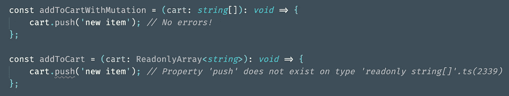
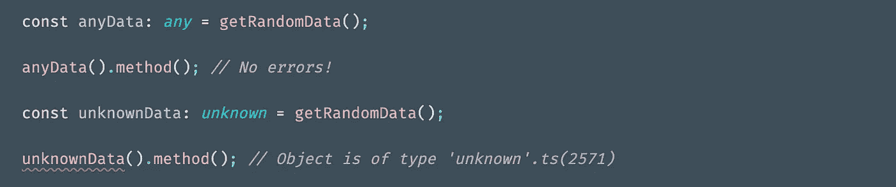

# 我从阅读有效打字稿中学到的 4 件事

> 原文：<https://javascript.plainenglish.io/4-things-i-learned-from-reading-effective-typescript-59bc5e517f31?source=collection_archive---------3----------------------->

Photo by [Siora Photography](https://unsplash.com/@siora18?utm_source=medium&utm_medium=referral) on [Unsplash](https://unsplash.com?utm_source=medium&utm_medium=referral)

几天前，我在长途飞行(*准确地说是 8 个小时)中读完了丹·范德卡姆的*高效打字稿*！*)。这本书写得简明扼要，有许多实用的建议。虽然我建议阅读整本书，但这里有一些我最喜欢的技巧。

## 1.使用` **readonly`** 防止变异对象时出现错误

当数组或元组被标记为`readonly`时，当用户试图添加、删除或更新这些对象中的项目时，TS 将出错。这在函数式编程中尤其有助于避免副作用。

## 2.为了类型的可重用性，函数表达式优于函数声明

当编写具有相同函数签名的实用程序时，可能会有些重复。下面，您会看到三个与 cart 相关的函数，每次都需要再次写出输入和输出类型。

为了保持干燥，您可以将整个签名分配给一个函数类型，并切换到使用函数表达式。

## 3.优先选择 unknown，以获得更好的类型安全性

使用`any`可能是一个有用的逃生出口，但也有很好的理由避免它。它不保证任何类型安全，并且它对调用链上的消费者隐藏错误。使用`unknown`类型，TypeScript 将正确地显示错误，比如调用不存在的方法。

如果您作为开发人员比编译器更了解类型，您也可以使用带有双重断言的`unknown`来阐明意图。

## 4.倾向于 JSDoc 或 TSDoc 风格的注释，以获得更好的开发体验

在大多数情况下，您应该避免在注释中包含类型信息。但是，如果您正在迁移并使用 JS 来启用 TS，或者如果您想要提供关于该函数的附加信息，JSDoc 或 TSDoc 是进行类型检查并与您的 ide 集成的好方法。

注意 VSCode 在工具提示中显示格式正确的注释。

就是这样！我选择这些技巧是因为它们可以立即应用于改进我们现有的代码库。我希望你也觉得它们有用。