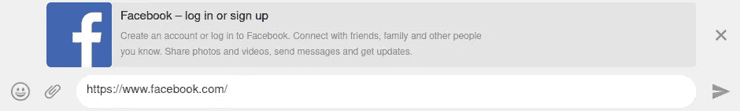
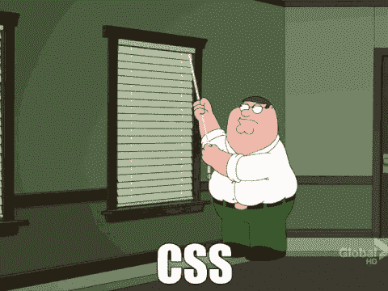

# 初学者 React 开发人员应该遵循的 4 个技巧

> 原文：<https://javascript.plainenglish.io/4-tips-beginner-react-devs-should-follow-83b23953ad36?source=collection_archive---------8----------------------->

## 这会让你的生活更轻松

## 1.了解服务器端渲染(SSR)

好的，所以当我说服务器端渲染时，我也指与之相关的一些东西。例如，NodeJS 和 webpack。

当你还在弄清楚 react 是如何工作的时候，作为一个初学者，你显然不会费心去渲染你的 react 应用服务器端。我要说的是，你至少应该知道它是什么，为什么它很重要，这样当你去进行下一次实习，他们的服务器端呈现他们的应用程序时，你就不会一无所知。

如果你正在阅读服务器端渲染，你也会碰到一些服务器端代码和术语，比如包、构建过程等等。你要注意这些事情，这很重要，因为从长远来看，了解这些会对你有很大帮助。你应该会配置 webpack，babel。

在这个过程中，您将学习一些基本的服务器端代码(如果您还没有学习的话),并且更好地了解这些库/框架是如何工作的。我不会在这里用 SSR 的细节来烦你，你可以在网上找到很多文章。但是我可以列举一些**优点**。

1.  **SEO**

易于在搜索引擎中索引页面。如果您在初始渲染搜索引擎上显示加载器/微调器后异步获取数据，可能无法找到您想要的内容。

2.**更好的性能(在某些情况下)**

在加载页面之前，不需要下载 JavaScript 文件。客户端的浏览器会立即显示一个完整呈现的 HTML 文件。这避免了客户端渲染所需的加载时间。虽然，初始加载时间可能会增加非常丰富和沉重的网页。你可以很容易地在网上找到一些比较，然后自己决定。

**3。你在社交媒体上获得了你网站的那些很酷的片段**

你可以在社交平台上预览你网站的链接。

此外，我鼓励你去看看 [Next.js](https://nextjs.org/) 。

## 2.不要过早优化

我相信你已经听过很多了。

您可以在应用程序中执行许多优化，但最终，完成工作是非常重要的。当谈到反应时，有许多更好的方法来组织代码和类似的东西，但其中许多在开始时是不必要的。你可以在旅途中了解这些细节，因为你发现需要它们。

举个例子， *React.PureComponent.* 你听说它通过比较新的和以前的*道具来防止不必要的渲染，*所以你决定在任何地方都使用它。不要这样。你可能根本不需要。因为你试图优化的组件可能不值得优化。

当然，如果你能找出哪个组件或代码的哪个部分需要优化，这很好，事实上，这表明你知道你在做什么。但是在必要的时候，一定要进行优化。

## 3.专注于掌握 JavaScript，更好的是，Typescript。

Photo by [Ferenc Almasi](https://unsplash.com/@flowforfrank?utm_source=medium&utm_medium=referral) on [Unsplash](https://unsplash.com?utm_source=medium&utm_medium=referral)

这似乎是新手的通病。我最近读了一篇文章，其中提到拥有一个框架特定的知识是你能对自己做的最糟糕的事情。有这么多可用的库和框架，这是很自然的。

你不想成为一个毫不费力地编写 React 组件，却努力用普通 JS 编写贪吃蛇游戏的人。

关注核心概念和 Javascript 在某些情况下的行为是很重要的。就我个人而言，我发现 Javascript 比 Python 难学得多，而且让人不知所措。

我建议研究一下 TypeScript，它是 JavaScript 的近亲。最近要做一个完全用 TypeScript 写的项目，浪费了很多时间去了解一些概念。

与 JavaScript 相比，Typescript 的优势显而易见。

记住，React，Angular 或者 Vue，都是 JavaScript！

## 4.如果你的设计能力很弱也没关系

如果你认为前端开发就是设计花哨的 ui 和应用很酷的动画，那你就错了。这不是唯一重要的事情。还有很多事情要做。

我做的最后一个项目，我没有费心把 UI 做得“漂亮”。我对那部分没有责任。他们有其他人在做那件事。我负责将支付网关集成到应用程序中。他们不关心我为输入折扣代码而做的框是否与其他元素对齐，也不关心按钮在点击时是否有合适的波动效果。不是说这些技能不重要。不，我的意思是，我知道我不能创造出最漂亮的用户界面。当谈到我的 CSS 技能时，我知道我的局限性。但是没关系。前端开发涉及的内容更多。你不可能事事完美，没关系。这需要时间。

他们雇用我不是因为我的 CSS 技能，而是因为我的 Javascript 技能。如果你可以用 Redux 做一些复杂的 Javascript 工作，但是很难为一个标题设置一个合适的页边空白，这是可以的。

css

喜欢这篇文章吗？如果是这样，通过 [**订阅解码获得更多类似内容，我们的 YouTube 频道**](https://www.youtube.com/channel/UCtipWUghju290NWcn8jhyAw?sub_confirmation=true) **！**

感谢您的阅读:)