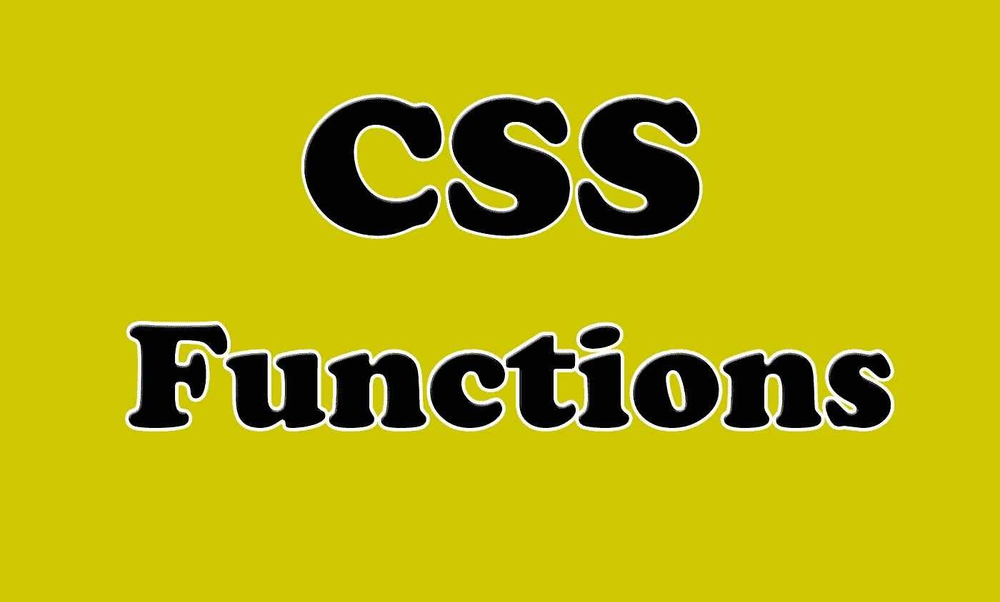

# 你应该知道的 4 个有用的 CSS 函数

> 原文：<https://javascript.plainenglish.io/4-useful-css-functions-that-you-should-know-f0b191849202?source=collection_archive---------1----------------------->

## 通过实例了解 CSS 函数


Photo by [Andy Holmes](https://unsplash.com/@andyjh07?utm_source=medium&utm_medium=referral) on [Unsplash](https://unsplash.com?utm_source=medium&utm_medium=referral)

# 介绍

像其他语言一样，CSS 有自己的功能。它们可以被插入到放置值的地方，或者在某些情况下，伴随着另一个值声明。一些 CSS 函数甚至允许你在其中嵌套其他函数。

在这篇文章中，我们将学习一些你应该知道的令人惊奇的 CSS 函数。让我们开始吧。



Image created with ❤️️ By author.

# 1.CSS 属性函数

函数`**attr()**`返回所选元素的属性值。它允许我们进入 HTML，获取属性的内容，并将其提供给 CSS 内容属性。

看看下面的例子:

```
*/* <div data-example="Medium"></div> */* div:after {   
   content: **attr(data-example)**;
 }
```

下面的例子将在页面上显示属性`Medium`。你可以在你的网页上试试。

以下是 Codepen 示例:

The attr() function.

# 2.calc 函数

函数`calc()`允许你执行计算来决定 CSS 属性值。所有主流浏览器都支持它。

该函数接受两个参数，并计算您提供的运算符(`+`、`-`、`*`、`/`)的结果，前提是这些参数是带或不带单位的数字。

这里有一个例子:

```
.element {   width: **calc(100vw - 80px)**; }
```

下面是一个使用函数`calc()`计算 div 元素宽度的 Codepen 示例。

The calc function.

# 3.var 函数

`**var()**` 函数用于插入 CSS 变量的值。这将有助于创建一些 CSS 变量，以便在我们代码的许多地方使用它们。

看看下面的例子:

```
:root {
  **--main-bg-color**: coral;
  **--main-txt-color**: blue;
  **--main-padding**: 15px;
}

#div1 {
  background-color: **var**(--main-bg-color);
  color: **var**(--main-txt-color);
  padding: **var**(--main-padding);
}

#div2 {
  background-color: **var**(--main-bg-color);
  color: **var**(--main-txt-color);
  padding: **var**(--main-padding);
}
```

正如您在上面看到的，我们在根元素中创建了值，然后使用函数`var()`在 div 元素中使用它们。

# 4.过滤功能

功能`**filter()**`将图形变化应用于输入图像和元素的外观。我们能达到的效果有:(`blur`、`brightness`、`contrast`、`grayscale`、`hue-rotate`、`opacity`、`invert`、`sepia`、`saturate`、`drop-shadow`)。如果我没错的话，我想还有更多。

这里有一个例子:

```
.element1 {   
  **filter**: drop-shadow(0.25rem 0 0.75rem #ef9035);
 }
// Or:.element2 {
  **filter**: blur(20px);
}
```

下面是另一个关于过滤函数的 Codepen 示例:

The filter function.

# 结论

如你所见，CSS 中的函数非常有用和重要。您可能熟悉一些 CSS 函数，但是这种语言有一个惊人的扩展列表。你需要学习更多有用的函数。

感谢您阅读本文，希望您觉得有用。

# 更多阅读

[](https://medium.com/javascript-in-plain-english/5-amazing-front-end-development-tools-that-you-should-know-7372dc377d7) [## 你应该知道的 5 个惊人的前端开发工具

### 每个开发人员都应该知道的有用的前端开发工具

medium.com](https://medium.com/javascript-in-plain-english/5-amazing-front-end-development-tools-that-you-should-know-7372dc377d7)