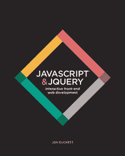
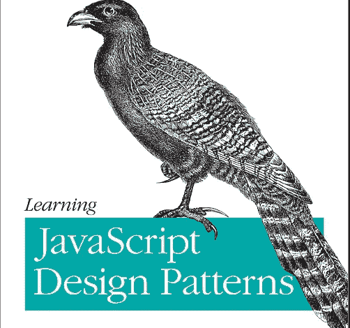
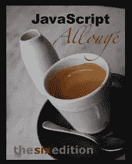

# 对有抱负的开发人员有用的 4 本 JavaScript 书

> 原文：<https://javascript.plainenglish.io/4-useful-javascript-books-for-aspiring-developers-67d9de904ea9?source=collection_archive---------8----------------------->

## JavaScript 知识的惊人书籍。

Photo by [Thought Catalog](https://unsplash.com/@thoughtcatalog?utm_source=medium&utm_medium=referral) on [Unsplash](https://unsplash.com?utm_source=medium&utm_medium=referral)

# 介绍

并不是所有人都喜欢在线学习或通过视频教程学习，有些人更喜欢书本。阅读这些书对你的身心健康都有好处，而且这些好处可以持续一生。如果你喜欢阅读编码书籍，它们会非常有用，因为它们会给你所有你需要的细节和知识。看书是学习 JavaScript 的最好方法之一。

在本文中，我们将为您列出一些对开发人员有用的 JavaScript 书籍。让我们开始吧。

# 1.JavaScript 和 jQuery

这本书是为那些想让自己的网站变得更有趣、更吸引人、更具互动性或更有用的人而写的。它是由 Jon Duckett 编写的，目的是帮助初学者很好地理解 JavaScript 和 jQuery 的基础知识。你所需要的只是对 HTML 和 CSS 的基本理解。

如果你是初学者，我建议你从这本书开始，但是不要太依赖 jQuery，因为它有点过时，而且大多数雇主认为这是一个障碍。

[JavaScipt & jQuery](http://javascriptbook.com/).

有兴趣可以查看这里的[书。](http://javascriptbook.com/)

# 2.你不知道 JS

这是一个由*凯尔·辛普森*写的很棒的系列丛书，探索了 JavaScript 中我们都认为自己理解但并不真正了解的部分。这些书都是免费的，太不可思议了。

[You don’t know JS](https://github.com/getify/You-Dont-Know-JS).

如果你感兴趣，这里是这个系列的 [Github 库](https://github.com/getify/You-Dont-Know-JS)。

# 3.JavaScript 设计模式

设计模式是软件设计中常见问题的可重用解决方案。在任何编程语言中，它们都是令人兴奋和着迷的话题。

这本书(“*学习 JavaScript 设计模式*”)是由 *Addy Osmani 写的。通过阅读本书，您将探索如何将古典和现代设计模式应用到 JavaScript 编程语言中。*

[JavaScript Design Patterns](https://addyosmani.com/resources/essentialjsdesignpatterns/book/).

有兴趣可以在这里查一下书[。](https://addyosmani.com/resources/essentialjsdesignpatterns/book/)

# 4.JavaScript Allongé

*JavaScript Allongé* 是一本关于用函数编程的书。当然是用 JavaScript 写的。

这本书从头开始，从值和表达式开始，讨论类型、身份、函数、闭包、范围、集合、迭代器以及更多的主题，直到使用类和实例。它还教你如何处理复杂的代码，以及如何简化代码而不使其变得晦涩难懂。

[JavaScript Allongé](https://leanpub.com/javascriptallongesix/read).

有兴趣的可以在这里查看一下[。](https://leanpub.com/javascriptallongesix/read)

# 结论

如你所见，所有这些书都充满了知识和价值。他们帮助许多开发人员提高了他们的 JavaScript 技能。你可以选择任何一个适合你的，开始获取有用的 JavaScript 知识。

感谢您阅读本文，希望您觉得有用。

# 更多阅读

 [## 您应该知道的 5 个 JavaScript 新特性

### JavaScript 中你应该知道的新特性

medium.com](https://medium.com/javascript-in-plain-english/5-new-javascript-features-you-should-know-adb410c2bf0a)