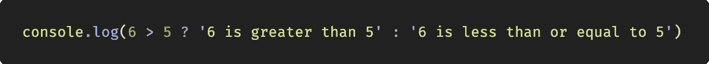
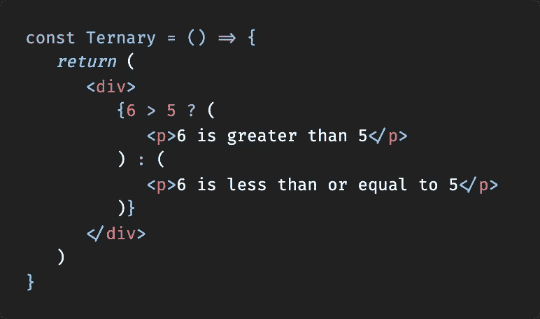

# 您可以在 React.js 中使用的 4 个有用的 JavaScript 简写

> 原文：<https://javascript.plainenglish.io/4-useful-javascript-shorthands-you-can-use-in-react-js-ca9d2600bf3f?source=collection_archive---------0----------------------->

## React.js

## 以下是我最喜欢的提供更少更清晰代码的短手。而且不仅仅在 React.js 中


Source: The author

尤其是在 JSX，代码很快就会变得令人困惑，尽管这正是 JSX 应该帮忙的地方。但是许多详细的 JavaScript 表达式带来了一定的风险，我们可以通过在代码中使用快捷键来最小化这种风险。

也许你已经知道许多这样的速记，这里有一些 React.js 的额外例子，即使只是作为复习。玩得开心！

# 1.if-else 简写

每个人都知道它，因为它是绝对不可或缺的——如果&否则。然而，有一个同样酷的简写。


Source: [https://codingcheats.io/javascript#shorthands](https://codingcheats.io/javascript#shorthands)

**速记:**



Source: [https://codingcheats.io/javascript#shorthands](https://codingcheats.io/javascript#shorthands)

**语法:**

```
condition ? if true : if false
```

对于那些可能觉得这种简写有点混乱的人，这里有一个非常简单的例子:


Source: [https://codingcheats.io/javascript#shorthands](https://codingcheats.io/javascript#shorthands)

当然，我们也一直在 React.js 中使用 if & else 进行条件渲染，但是下一个例子中的简化语法已经变得非常流行。


Source: [https://codingcheats.io/javascript#shorthands](https://codingcheats.io/javascript#shorthands)

最棒的是它很容易集成到 JSX 中，所以组件的其他部分也可以省去。



Source: [https://codingcheats.io/react#shorthands](https://codingcheats.io/react#shorthands)

如果您仍在 React 应用程序中获取数据，并希望向用户显示页面仍在加载，这将非常有用:


Source: [https://codingcheats.io/react#shorthands](https://codingcheats.io/react#shorthands)

# 2.扩展运算符简写

使用 spread 操作符，我们可以做很多事情，但最重要的是，我们可以节省大量的精力和代码。我认为这个解释相当准确:

> 我们可以在字符串或数组等可迭代对象上使用 spread 操作符，它会将可迭代对象的内容放入各个元素中。
> -[https://stackabuse.com/spread-operator-in-javascript/](https://stackabuse.com/spread-operator-in-javascript/)

简而言之，我们可以将一个包含所有元素的数组构建到另一个数组中，就像我们手动添加了每个条目一样。如果我们想将现有的条目放在最开始、结尾或两者之间的某个位置，这并不重要。

让我们来看一个例子，在这个例子中，我们希望将数字 1-5 分别打印为一个数组的条目。我们可以使用一个已经存在的阵列，它已经包含 2 和 3 个:


Source: [https://codingcheats.io/javascript#shorthands](https://codingcheats.io/javascript#shorthands)

## 如何在 React.js 中让这一点变得有用？

这里有许多可以想象的场景，但重要的是要理解，例如，我们可以对对象使用 spread 操作符。因此，我们可以将它用于道具，官方 React.js 文档甚至在以下情况下推荐使用它:

> 如果你已经有道具作为对象，并且你想在 JSX 通过它，你可以使用 **…** 作为一个**传播**操作符来通过整个**道具**对象。

所以在这里我们可以很好地利用这一点，页面的输出如预期的那样"*Max 23 岁*":


Source: [https://codingcheats.io/react#shorthands](https://codingcheats.io/react#shorthands)

但是扩展算子也可以用于各种其他场景。例如，如果您使用状态中的数组，则应该扩展该状态:


# 3.解构

这个概念应该已经为很多人所熟悉了，因为 React Hooks 在社区中非常受欢迎。然而，我有一种感觉，许多人并不真正理解它是关于什么的。让我们看看反应钩实际上是什么。

为此，我们只需创建一个初始值为 0 的状态。点击按钮后，状态设置为 5。举个例子。
但是对于这段代码，我没有使用析构概念，而是在没有 useState 钩子的情况下创建了它。
所以如果我们把它存储在一个变量中，然后记录下来，我们会发现它是一个由两个元素组成的数组。数组中的第一个条目是 state 的值，第二个是一个函数，我们可以调用它来给 state 一个新的值。


Source: [https://codingcheats.io/react#shorthands](https://codingcheats.io/react#shorthands)

我们可以简单地调用 state 的值和函数，从数组中改变它，但是当然，我们必须像在代码中那样指定数组中的位置。这应该会给每一个使用过钩子的人留下一个奇怪的印象，因为它也不是很实用和清晰。

正是出于这个原因，JavaScript 中存在着破坏。它允许我们用数组中的任何条目来制作一个变量。看起来是这样的:


由于默认情况下析构是顺序的，我们可以跳过数组中不想作为单独变量存储的元素。
例如，假设我们只想为数组中的两个男孩分别创建一个变量:


Source: [https://codingcheats.io/javascript#shorthands](https://codingcheats.io/javascript#shorthands)

唯一看起来像类型错误的是绝对正确的语法。如果我们想省略数组中的一个元素，我们只需在逗号之间留一个空格。

好了，回到反应，大多数人都应该知道下面的语法，它也使用析构:


看起来好多了，对吧？

但是我们可以在反应中使用这个原则，而不仅仅是为了这个目的。例如，如果我们想使用道具，这也是一种选择。


Source: [https://codingcheats.io/react#shorthands](https://codingcheats.io/react#shorthands)

对于这段代码，我们也可以使用析构。请注意，道具是一个物体，而不是一个阵列。但即使这样也没问题:


Source: [https://codingcheats.io/react#shorthands](https://codingcheats.io/react#shorthands)

# 4.模板字符串/多行字符串

特别是在 React 及其动态特性中，我们喜欢访问按钮标签等 UI 组件内容的道具或状态，以便获得动态输出。

当然，我们也处理固定的内容，例如我们想要硬编码的文本，但是动态输出变量。
对于所有编程语言来说，这当然不是问题，但是为了避免将大量令人困惑的字符串和其他数据类型链接在一起，JavaScript 提供了所谓的**模板字符串**，这使得一切变得更加容易和清晰。

尽管它们肯定不是未知的，但我将它们包括在列表中，因为我个人仍然看到太多它们可以帮助的代码。

这就是我们如何将变量和文本链接在一起的方法:


这就是我们使用模板字符串的方式:


所以唯一显著的变化是我们现在对字符串使用反勾号(`` `)。我们的 JS 关键字现在可以方便地包含在${}中。但是这并不是反斜线语法的唯一优点。看看这个:


有了模板字符串，我们可以使这变得容易得多:


## [加入我的邮件，接收你感兴趣的一切](http://eepurl.com/hacY0v)

## 非常感谢您的阅读——请务必给我留下反馈，告诉我使用图片来显示代码是不是一个好主意，或者我是否应该坚持将代码直接复制到文章中。谢谢:)

## **用简单英语写的 JavaScript 笔记**

我们总是有兴趣帮助推广高质量的内容。如果你有一篇文章想用简单的英语提交给 JavaScript，用你的中级用户名发邮件到 submissions@javascriptinplainenglish.com[](mailto:submissions@javascriptinplainenglish.com)**给我们，我们会把你添加为作者。**

**我们还推出了三种新的出版物！请关注我们的新出版物:[**AI in Plain English**](https://medium.com/ai-in-plain-english)，[**UX in Plain English**](https://medium.com/ux-in-plain-english)，[**Python in Plain English**](https://medium.com/python-in-plain-english)**——谢谢，继续学习！****

## ****如果您想了解 React.js 的更多信息，请访问:****

****[](https://medium.com/better-programming/5-awesome-react-js-libraries-you-should-know-about-ef0274fe4a56) [## 你应该知道的 5 个很棒的 React.js 库

### react-portal、react-toastify 等等

medium.com](https://medium.com/better-programming/5-awesome-react-js-libraries-you-should-know-about-ef0274fe4a56) 

第二部分:

[](https://medium.com/javascript-in-plain-english/5-awesome-react-packages-you-need-to-try-out-20a156d3d73e) [## 你需要尝试的 5 个很棒的 React 包

### 预渲染，有用的钩子，加载动画，颜色选择器&访问头部区域。由 5 位伟大的…

medium.com](https://medium.com/javascript-in-plain-english/5-awesome-react-packages-you-need-to-try-out-20a156d3d73e)****