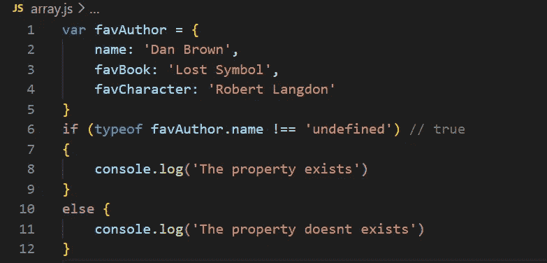

# 检查属性是否存在于 JavaScript 对象中的 4 种方法

> 原文：<https://javascript.plainenglish.io/4-ways-to-check-whether-the-property-exists-in-a-javascript-object-20c2d96d8f6e?source=collection_archive---------3----------------------->

更常见的情况是，我们被一个很容易解决的最简单的问题所困扰。我们知道解决这个问题会很容易，但想出解决方案却很难。网上的新概念和各种各样的东西让它变得势不可挡。当我刚开始使用 JavaScript 时，这就是一个这样的问题。所以今天我想列出检查属性是否存在于对象中的方法。



# 1)使用对象方法 hasOwnProperty()

最常见的解决方案是使用`hasOwnProperty()`，这是一种常见的对象方法。此方法返回一个布尔值，该值指示对象是否具有指定的属性。

```
var favAuthor = {
  name: 'Dan Brown',
  favBook: 'Lost Symbol',
  favCharacter: 'Robert Langdon'
}if(favAuthor.hasOwnProperty('favCharacter')) // true
{console.log('The property exists')}else {
  console.log('The property does not exist')
} 
```

如果该属性不存在，将返回 ***假***

```
console.log(favAuthor.hasOwnProperty('favVillain')) // false
```

# 2)在运算符中

如果指定的属性在指定的对象中，`**in**` **操作符**返回`true`。

```
var favAuthor = {
  name: 'Dan Brown',
  favBook: 'Lost Symbol',
  favCharacter: 'Robert Langdon'
}if('name' in favAuthor) // true
{console.log('The property exists')}else {
  console.log('The property does not exist')
}
```

如果指定的属性不存在，表达式将返回 ***false***

```
console.log('favVillain' in favAuthor) // false
```

# 3)使用 typeof 并将其与 undefined 进行比较

如果属性不存在，属性的类型应该是`’undefined'`，因此我们可以使用`typeof`运算符，并将其与`’undefined'`进行比较。

```
var favAuthor = {
  name: 'Dan Brown',
  favBook: 'Lost Symbol',
  favCharacter: 'Robert Langdon'
}if(typeof favAuthor.name !== 'undefined') // true
{console.log('The property exists')}else {
  console.log('The property does not exist')
}
```

如果指定的属性在提到的对象中不存在，它将返回 ***假***

```
console.log(typeof favAuthor.favVillain!== 'undefined') // false
```

# 4)利用！！操作员(双击操作员)

这是检查对象中属性的最不为人知的方法。在 Javascript 中，每个值都有一个相关的布尔值，*真*或*假*。例如，`null`值有一个相关联的布尔值`false`。诸如`abc`的字符串值具有相关联的布尔值`true`。

你可以在这里找到 ***真值*** 值[列表，在这里](https://developer.mozilla.org/en-US/docs/Glossary/Truthy)找到 ***假值*** 值[列表。](https://developer.mozilla.org/en-US/docs/Glossary/Falsy)

Null 是一个 *falsy* 值。

```
!!null // false
```

所以我们可以利用我们想要使用**检查的属性的名称来利用它！！**操作员。如果关键属性值不为空，它将返回 ***真***

```
var favAuthor = {
  name: 'Dan Brown',
  favBook: 'Lost Symbol',
  favCharacter: 'Robert Langdon'
}if(!!favAuthor.name) // true
{console.log('The property exists')}else {
  console.log('The property does not exist')
} 
```

如果该属性等于 null，这意味着该属性不存在，它将等于 ***false*** ，因为 null 是 falsy。

```
console.log(!!favAuthor.favVillain) // false
```

## 这就是总结！

谢谢:)