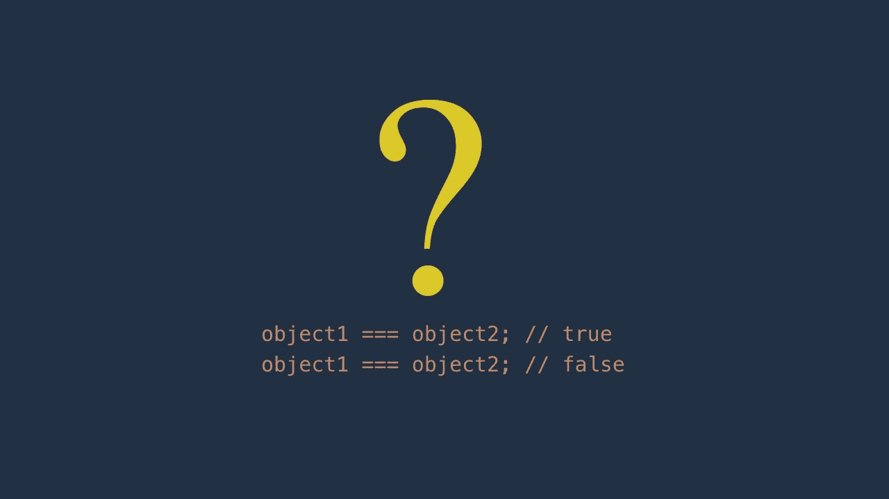

# JavaScript 中比较对象的 4 种方法

> 原文：<https://javascript.plainenglish.io/4-ways-to-compare-objects-in-javascript-97fe9b2a949c?source=collection_archive---------1----------------------->

## **天真。简单的。高效的。而这份辛苦却对自己有益**



您可能认为在 JavaScript 中比较两个对象很容易。对原始类型来说很容易，对对象来说就不容易了。

请继续阅读，看看它有多难，以及如何利用它来提高您的编码技能。

# 1.参考身份

假设你只想比较对象引用而不管其内容，那么你可以使用严格的等式(' === ')或者宽松的(' == ')。

例如:

```
let book1 = {
  title: ‘JavaScript’
};let book2 = {
  title: ‘JavaScript’
};let book3 = {
  title: ‘Kotlin’
};let book4 = book1;
let book5 = book1;console.log(book1 === book2); // false
console.log(book3 === book2); // false
console.log(book4 === book5); // true
```

正如你所看到的，结果 **book1 === book2** 是假的，尽管它们的内容是相同的，因为它们有不同的引用。

同样适用于**第三册===第二册**。

而且由于 **book4** 和 **book5** 都指向同一个对象实例 **book1** ，所以 **book 4 === book5** 为真。

我们很少比较真实项目中的对象引用。大多数时候，我们希望比较对象内部的实际值。

# 2.使用 JSON.stringify

首先，我们将 JavaScript 对象转换成 JSON 字符串，然后比较这些字符串。

例如:

```
let person1 = {
  name: ‘Amy’,
  age: 28
};let person2 = {
  name: ‘Amy’,
  age: 28
};let person3 = {
  name: ‘David’,
  age: 28
};console.log(JSON.stringify(person1) === JSON.stringify(person2)); // true
console.log(JSON.stringify(person3) === JSON.stringify(person1)); // false
console.log(JSON.stringify(person3) === JSON.stringify(person2)); // false
```

在上例中， **person1** 和 **person2** 具有相同的属性和值，因此**JSON . stringify(person 1)= = = JSON . stringify(person 2)**为真。

对于**人员 3** ，属性**名称**与**人员 1** 和**人员 2** 的值不同。结果，**JSON . stringify(person 3)= = = JSON . stringify(person 1)**为假，**JSON . stringify(person 3)= = = JSON . stringify(person 2)**为假。

但是，使用 **JSON.stringify()** 来比较对象有一个限制。如果每个对象的属性顺序不同，它就不起作用。

例如:

```
let person1 = {
  age: 28,
  name: ‘Amy’
};let person2 = {
  name: ‘Amy’,
  age: 28
};console.log(JSON.stringify(person1) === JSON.stringify(person2)); // false
```

**人员 1** 和**人员 2** 具有相同的属性值。唯一不同的是在**人员 1** 中，属性**年龄**出现在**姓名**之前，同时在**人员 2** 中，**姓名**出现在**年龄**之前。在这种情况下，比较的结果是假的。

# 3.使用 Lodash

要使比较变得轻而易举，只需利用 Lodash。

就拿上面那个 **JSON.stringify** 没用的例子来说，交给 Lodash:

```
let person1 = {
  age: 28,
  name: ‘Amy’
};let person2 = {
  name: ‘Amy’,
  age: 28
};console.log(_.isEqual(person1, person2)); // true
```

你可以在下面的文章中了解更多关于 Lodash 的信息:

[](https://medium.com/javascript-in-plain-english/11-super-handy-lodash-methods-to-simplify-things-in-javascript-8c45cd346616) [## 简化 JavaScript 的 11 个超级方便的 Lodash 方法

### 有时他们会拯救你的一天

medium.com](https://medium.com/javascript-in-plain-english/11-super-handy-lodash-methods-to-simplify-things-in-javascript-8c45cd346616) 

# 4.奖励:DIY

你不想使用任何外部库吗？

你相信你自己能做到吗？

或者您只是想磨练您的 JavaScript 编码技能？

那么这部分是给你的。事实上，做困难的事情很有趣，不是吗？

现在，您将编写一个函数来比较两个对象。

首先，您认为比较两个对象的明显方法是迭代属性列表，然后比较它们的值。好吧，我们开始吧:

```
function isEqual(obj1, obj2) {
  let props1 = Object.getOwnPropertyNames(obj1);
  let props2 = Object.getOwnPropertyNames(obj2);

  if (props1.length != props2.length) {
    return false;
  } for (let i = 0; i < props1.length; i++) {
    let prop = props1[i];

    if (obj1[prop] !== obj2[prop]) {
      return false;
    }
  }

  return true;
}let person1 = {
  age: 28,
  name: ‘Amy’
};let person2 = {
  name: ‘Amy’,
  age: 28
};console.log(isEqual(person1, person2)); // true
```

第一次尝试还不错吧。

但是，您的函数只适用于平面对象，不适用于嵌套对象。

例如:

```
let person1 = {
  age: 28,
  name: ‘Amy’,
  department: {
    id: 1,
    name: ‘DevOps’
  }
};let person2 = {
  name: ‘Amy’,
  age: 28,
  department: {
    id: 1,
    name: ‘DevOps’
  }
};console.log(isEqual(person1, person2)); // false
```

让我们把你的功能提升到一个更深的层次:

```
function isEqual(obj1, obj2) {
  let props1 = Object.getOwnPropertyNames(obj1);
  let props2 = Object.getOwnPropertyNames(obj2); if (props1.length != props2.length) {
    return false;
  } for (let i = 0; i < props1.length; i++) {
    let prop = props1[i];
    let bothAreObjects = typeof(obj1[prop]) === ‘object’ && typeof(obj2[prop]) === ‘object’; if ((!bothAreObjects && (obj1[prop] !== obj2[prop]))
    || (bothAreObjects && !isEqual(obj1[prop], obj2[prop]))) {
      return false;
    }
  } return true;
}console.log(isEqual(person1, person2)); // true
```

它又开始工作了。

与第一个版本相比，你能看出不同之处吗？

如果属性是对象，就利用递归继续下去，直到属性是基本类型。

你看，你做到了。

希望你喜欢这篇文章，并找到 DIY 的乐趣。

[](https://medium.com/javascript-in-plain-english/how-to-check-if-an-object-has-a-specific-property-in-javascript-6086177014d1) [## 如何在 JavaScript 中检查一个对象是否有特定的属性？

### 使用错误的方法会给你误导的结果。

medium.com](https://medium.com/javascript-in-plain-english/how-to-check-if-an-object-has-a-specific-property-in-javascript-6086177014d1)