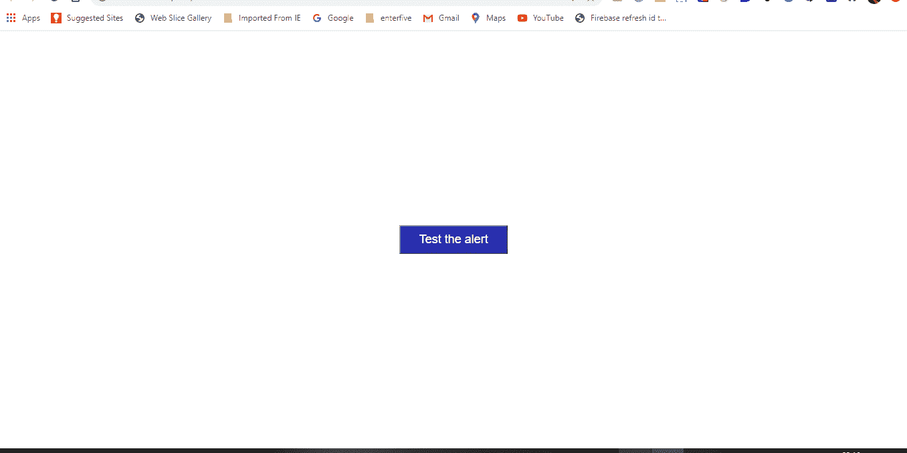
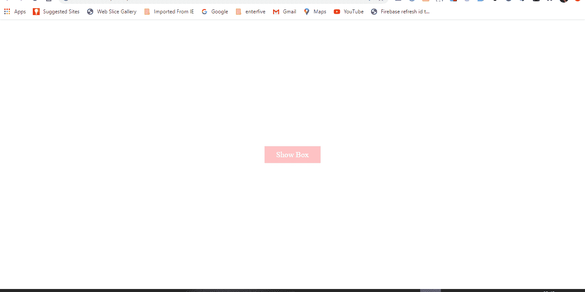

# 用 HTML、CSS 和普通 JavaScript 创建模式弹出框的 4 种方法

> 原文：<https://javascript.plainenglish.io/4-ways-to-create-a-modal-popup-box-with-html-css-and-vanilla-javascript-4bd1e95d0f92?source=collection_archive---------0----------------------->

# 介绍

当创建网页设计时，要考虑的最重要的事情之一是用户交互性。用户交互性的一个很好的例子是模态框。

基于用户执行的操作，模式框通常作为消息框出现在浏览器中。模式框有不同的形式和形状，包括警告框、闪烁通知框、对话框和灯箱。等等。

模式框的独特之处在于，它禁用浏览器中的主窗口，但保持其可见，模式窗口在网页前面显示为子窗口。

在应用程序中使用模态的一些重要情况包括:

*   对某种可能不可逆转的行为过程显示警告。
*   一条新信息的快速通知。
*   用户互动和参与的增加。

情态动词也有缺点，因为:

*   他们可以中断用户工作流。
*   它们会立即引起用户的注意。
*   他们在后台禁用内容，这在某些情况下可能会令人沮丧。

现在让我们开始创建模态。

# 样本 1

在教程的流程中，我们将创建三个文件，即四个样本中的**index.html、style.css** 和 **app.js** 文件。然后我们给出每个文件中代码的详细分类。

> 【index.html】T5**T6**

index.html

在上面的索引标记页面中，我们在 head 标签[、](https://fontawesome.com/)中有一个[字体超棒的](https://fontawesome.com/)脚本，我们将在模式框中使用它来显示一个图标。我们还在索引页面上链接了 CSS 和 JavaScript 页面。

在索引页面的主体中，我们有一些重要的 **HTML** 属性，比如 **id 的**，稍后将在我们的 JavaScript 文件中使用这些属性来操作页面。

最后，在我们的按钮标签中，我们有一个 **onclick** 事件属性，它有一个 **Alert** 函数，该函数为我们提供了在页面上显示模态消息的功能。

> ***style . CSS***

style.css

在 **style.css** 文件中，我们将页面的**框尺寸**设置为**边框**。这个属性允许我们在元素的总宽度和高度中包含填充和边框。

然后我们用**来设计我们的按钮。btn** 级。这允许我们将允许我们显示模态的按钮定位在页面的中心。

最后，使用 **#popUpBox，**我们可以将模态放在页面的中央。

使用 **z** - **index** 属性，我们可以将模态叠加在页面中其他元素的前面。

在 **style.css** 文件中需要注意的最重要的事情是，我们将显示属性的初始状态设置为 **none。**原因将在 **app.js 文件中解释。**

> ***app.js***

app.js

这里，我们有一个名为 **Alert、**的全局变量，它实例化了一个名为 **CustomAlert()的函数。**在这个函数中，我们:

*   访问了**#弹出框(id)。**这样，我们将显示设置为**块**，显示点击**按钮**标签时的模态。记住，在 CSS 文件中初始状态被设置为 **none** 。
*   通过访问 **HTML** 文件中的 **closeModal (id)** 关闭模态。这样我们就可以设置一个 HTML 按钮标签，带有一个 **onclick** 事件属性。在那里，我们声明了一个名为 **ok()的函数。**
*   最后，引用 **ok()** 函数，当按钮被点击时，我们将模态的 CSS 属性设置为 none。

这样，我们应该会得到下面的结果:

sample 1 modal

# 样本 2

我们分别从**index.html、style.css** 和 **app.js** 文件开始。

> **index.html**

index.html

从上面，我们有到我们的 **CSS** 和 **JavaScript** 文件的相关链接。然后在索引页面的主体中，我们有一个**输入**标签，其类型为**按钮**。

我们还有一个 **onclick** 事件属性，以及一个 **alert()** 方法，该方法包含一个将在模式中显示的文本。

> style.css

style.css

在这里我们:

*   用**设计我们的按钮。在**index.html**文件中声明的 btn** 类
*   然后我们有 **modalContainer、alertBox、alertBox h1、alertBox p、alertBox、closeBtn ID。**这些都是在 **app.js** 文件中创建的。与我们在**示例 1 中创建模型的方法不同。**

> app.js

app.js

在这里，我们将事情分成 6 个不同的部分:

*   首先，我们设置了两个名为 **closeModal** 和 **titleAlert** 的全局变量，这两个变量都保存了将在模式框中显示的文本。
*   我们声明了一个 **createCustomAlert()** 函数。这是我们创建显示在页面上的模型主体的地方。
*   然后我们在 body 标签中创建了一个 **div** ，给它分配了 **modalContainer ID** ，然后将高度设置为页面的滚动高度
*   接下来创建了用于警告框主体的 **div** 。我们给它分配了 **alertBox ID** 。然后，我们将模态设置在页面的中心，同时将样式设置为可见。
*   接下来，我们通过创建一个 **h1** 标签来设置模式框的标题。然后将文本变量 **titleAlert** 附加到 **h1** 标签上，以显示**弹出！！!"**消息。我们通过创建一个 **p** 标签并为其分配一个文本节点，做了一些类似于模型主体的事情。
*   最后，我们创建了一个名为 **removeCustomAlert()** 的函数来关闭模态框。我们通过创建一个**一个**标签，添加一个 **closeBtn ID** 给它，并创建一个 **onclick** 事件处理程序来引用关闭模式的函数。

这样，我们应该会得到下面的结果:

sample 2 modal

# 样本 3

> index.html

index.html

在上面的索引标记页面中，我们在 head 标签[、](https://fontawesome.com/)中有一个[字体 Awesome](https://fontawesome.com/) 脚本，我们将在模式框中使用它来显示一个图标。我们还在索引页面上链接了 CSS 和 JavaScript 页面。

页面上还声明了两个 **pop()** 函数，我们将在 **app.js** 文件中引用它们。

> style.css

style.css

上面的样式很简单。值得注意的是，在初始阶段，我们将我们的 **#btn ID** 设置为无显示。我们将在 **app.js** 文件中切换显示属性。

> app.js

app.js

我们首先将名为 **modal** 的全局变量设置为空。然后我们从【index.html】页面中引用 **pop()** 函数，之后我们设置模态的条件状态。

如果模态一开始为空，并且被点击，我们将显示设置为**块**并将模态变量设置为**真**以显示模态，如果关闭按钮被点击，我们将显示设置为**无**并将模态变量设置为**空**以移除模态。

有了这个，我们应该有下面的结果:

sample 3

# 样本 4

> index.html

index.html

这里我们将利用 **CSS** 类而不是 **ID 的**来操纵我们的模态的状态。我们有一个显示模态的按钮标签和一个带有字母“ **X** ”的 span 来关闭模态。

> style.css

style.css

这里我们设计了我们的按钮和模态。**。模态**类有一个初始状态，它的**可见性**是隐藏的。我们将用一个 JavaScript 函数来切换它，以显示模态。

> app.js

app.js

我们从上面做了三件事:

*   我们通过 **querySelector 访问我们的 HTML 类。****query selector()**方法返回文档中第一个匹配指定 CSS 选择器的元素。
*   然后我们创建了一个 **toggleModal()** 函数，它在 CSS 中切换 **show-modal** 类。
*   最后，我们向函数中添加了事件侦听器，以便在单击按钮时根据特定条件切换模式的状态。

有了这个，我们应该有下面的结果:

sample 4

# 结论

这就是我们 4 个模态的实现。您可以随意设计它的样式，并在您正在处理的任何项目中实现它。我知道这个设计可能不是最好的，但是这篇文章的目标更集中在 JavaScript 实现上，而不是设计上。

代码的链接可以在 [Github](https://github.com/desoga10/modal-popup) 上找到。

*原载于 2020 年 10 月 6 日 https://thecodeangle.com**的* [*。*](https://thecodeangle.com/4-ways-to-create-a-modal-popup-box-with-html-css-and-vanilla-javascript/)