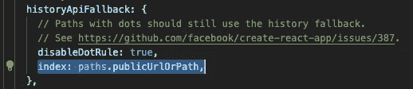
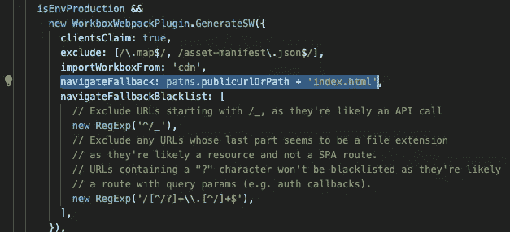
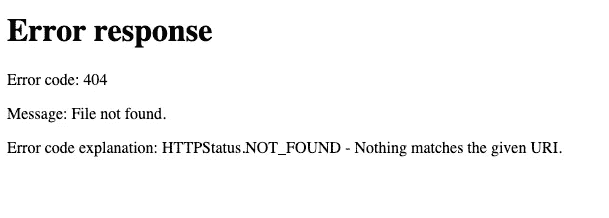

# 404:未找到反应页面

> 原文：<https://javascript.plainenglish.io/404-react-page-not-found-355b9352041e?source=collection_archive---------1----------------------->

[*在黑暗模式下阅读本*](https://www.blog.karenying.com/posts/404-react-page-not-found) *上的*[*blog.karenying.com*](https://www.blog.karenying.com/)*。*


Netlify’s 404 Page

您刚刚将第一个 [Create React 应用](https://reactjs.org/docs/create-a-new-react-app.html)部署到 Netlify。`Site is live`显示在滚动部署日志中。成功🎉

你愉快地访问你的新网站，点击相关链接。好样的，[反应过来的路由器](https://www.npmjs.com/package/react-router)已经投入了工作。一切看起来都很棒。

你在地址栏中输入一个路径，你知道它是由 React 路由器处理的……然后得到“找不到页面”的提示。啊？

确信你一定做错了什么，你在你的本地开发环境中启动你的应用程序并试图复制这个错误。但是路由在本地非常好。它甚至适用于生产版本:`npm run build`和`serve -s build`。那么这里的问题是什么呢？

# 单页应用程序中的路由

如果你使用 [Create React App](https://reactjs.org/docs/create-a-new-react-app.html) (CRA)和 [React Router](https://www.npmjs.com/package/react-router) ，你的站点很可能是一个单页面应用(SPA)。

与传统的多页面应用程序相反，spa 只维护一个 HTML 文件，通常是`index.html`。spa 依赖于客户端路由，而不是为每个路径提供不同的 HTML 文件。React Router 是一个受欢迎的客户端路由库，每周下载量接近 300 万次。

用最简单的话来说，React 路由器将路径连接到一个组件。当找到路径时，React Router 会将相关的元素插入 DOM 树中，而不需要刷新页面。

然而，为了使这个过程工作，HTTP GET 请求必须只从`index.html`中检索数据——所有的 React 路由器逻辑都在这里处理。这意味着服务器必须将所有请求发送到`index.html`。

那么，为什么这在当地行得通呢？这就是 Webpack 的用武之地。

# 网络包

有没有想过当你穿着 CRA 跑`npm start`时会发生什么？

`npm start`在引擎盖下运行`react-scripts start`(在你的`package.json`里检查一下)。如果我们偷看`/node_modules`下的`react-scripts`文件夹，我们会看到 CRA 使用 [Webpack](https://webpack.js.org/) 来捆绑和服务你的应用。

您的应用程序的所有 Webpack“设置”都保存在`/react-scripts/config`下的`webpackDevServer.config.js`和`webpack.config.js`中。

对于应用程序的开发版本，Webpack 将[历史 API 回退选项](https://webpack.js.org/configuration/dev-server/#devserverhistoryapifallback)设置为 true。在`webpackDevServer.config.js`中，Webpack 被指示将所有请求重定向到`paths.publicUrlOrPath`，它是服务于`index.html`的基本 URL`[http://localhost:3000](http://localhost:3000/)/`:



*Examining* `webpackDevServer.config.js`

对于当你`npm run build`和`serve -s build`时提供的产品版本，我们转向`webpack.config.js`。这里，我们将[导航回退选项](https://developers.google.com/web/tools/workbox/reference-docs/latest/module-workbox-webpack-plugin.GenerateSW)设置为`paths.publicUrlOrPath + 'index.html'`:



*Examining webpack.config.js*

瞧啊。同样，Webpack 将所有流量导向`index.html`。

太好了，这解释了为什么它在您的本地环境中都很好，但是在 Netlify 上呢？

# 网络生活

让我们回到您在本地机器上的生产构建。当您运行`npm run build`时，Webpack 将所有组织好的代码打包并缩小到根目录下的`build`文件夹中。这个文件夹的内容正是 Webpack 在本地作为产品版本使用的内容，也是 Netlify 在互联网上提供的内容。

但是你有没有试过用 Python 的 [http.server](https://docs.python.org/3.0/library/http.server.html) 来服务你的应用呢？它需要一个`index.html`文件，因此我们可以在您的 prod `build`文件夹中运行它:

```
$ cd /build
$ python3 -m http.server
```

前往`[http://localhost:8000/](http://localhost:8000/)`。输入您在 React 路由器中指定的路径，或单击相对链接并点击刷新。您应该感觉似曾相识，并看到以下 404 错误消息:



Another 404 page 😞

这正是 Netlify 上发生的事情。

Netlify 的服务器和 Python 的 http.server 不处理到`index.html`的重定向。尽管 Netlify 提供 Webpack 捆绑的服务，但它并不使用 Webpack 来实际提供页面服务。

如果你不手动输入地址或刷新页面，一切都很完美。这是因为您没有对这两个操作提出新的请求。你没有离开`index.html`，而 React 路由器正在正确地工作。然而，当你刷新或输入一个网址时，网站就崩溃了。

对此你能做些什么？

## 解决方案

幸运的是，你可以使用 Netlify 的[重定向选项](https://docs.netlify.com/routing/redirects/)。为了实现这一点，Netlify 需要在根目录中有一个名为`_redirects`的文件。这条航线是奇迹发生的地方:

```
/* /index.html 200
```

该规则指定所有路径(`/*`)重定向到`/index.html` [而不改变浏览器地址栏](https://docs.netlify.com/routing/redirects/redirect-options/) ( `200`)中的 URL。

你可以**或者**

*   把这个`_redirects`文件和上面的一行放到你 app 的`public`文件夹里。该文件夹中的所有内容都原封不动地放入`/build`的根目录中。

**或**

*   将`&& echo ‘/* /index.html 200’ | cat >build/_redirects`添加到`package.json`中的`build`脚本中。如果您检查部署日志，Netlify 会在每次部署之前运行`npm build`。这样，Netlify 每次都会在根目录中手动创建`_redirects`文件。

通过添加`_redirects`文件，我们复制了 Webpack 在本地机器上的功能。

# 结论

您刚刚成功修复了可怕的 404 Netlify 错误！在此过程中，我们了解了 React 路由器如何为 spa、Webpack 配置和 Netlify 重定向规则工作。

由于这是一个[常见的](https://stackoverflow.com/search?q=react+router+404)问题，我通过谷歌搜索很容易就找到了解决办法。这毕竟是一行程序。然而，我找不到一个可靠的解释来解释*为什么*会成功。希望这篇文章能填补这个空白。

Netlify 不是一个人！正如我们在上面看到的，Python 的 http.server 是另一个罪魁祸首。任何静态托管的 SPA 都会出现这种偷偷摸摸的错误。作为重定向的替代，[散列路由](https://itnext.io/why-using-hash-based-urls-in-your-react-spa-will-save-you-more-time-than-you-think-a21e2c560879)也允许 SPA 客户端路由。如果你有兴趣，一定要去看看。

## 进一步阅读

*   [GitHub 页面解决方案](https://github.com/rafrex/spa-github-pages)
*   [Heroku 解决方案](https://hackernoon.com/deploying-any-react-app-to-heroku-1ee6db9b97d3)
*   [Apache 解决方案](https://www.sej-ko.dk/2017/03/29/routing-single-page-application-on-apache-with-htaccess/)
*   [采用哈希路由的解决方案](https://itnext.io/why-using-hash-based-urls-in-your-react-spa-will-save-you-more-time-than-you-think-a21e2c560879)

感谢阅读。编码快乐！