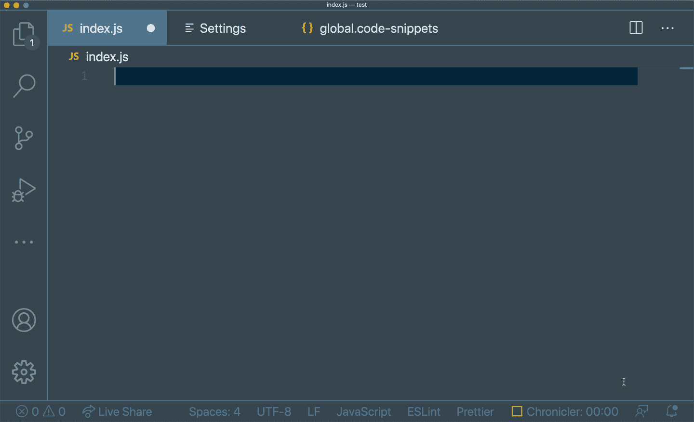

# JavaScript + React 自动完成的 5 个高级 vs 代码片段

> 原文：<https://javascript.plainenglish.io/5-advanced-vscode-snippets-for-javascript-react-autocompletion-21aa6c5688aa?source=collection_archive---------12----------------------->

## *复制意大利面的更好方法*🍝


Photo by [Joanna Kosinska](https://unsplash.com/@joannakosinska?utm_source=medium&utm_medium=referral) on [Unsplash](https://unsplash.com?utm_source=medium&utm_medium=referral)

# 什么是 vs 代码片段，为什么要使用它们？

VSCode Snippets 是使用 IntelliSense 或 Explorer 上的`> Insert Snippet`命令通过关键字移植样板代码的快捷方式。它们的作用范围可以是项目或语言，也可以是全局启用的。代码片断为复制和粘贴提供了一个更好的解决方案，因为它只选择模板并将光标留在实际代码需要更改的地方。

让我们看看它的实际效果。



要开始使用代码片段，使用`> Preferences: Configure User Snippets`命令导航到配置文件。您也可以熟悉来自[官方文档](https://code.visualstudio.com/docs/editor/userdefinedsnippets)的代码片段语法，它对每个字段的解释如下:

`*prefix*` *定义一个或多个触发字，显示智能感知中的代码片段。子字符串匹配是在前缀上执行的，所以在这种情况下，“fc”可以匹配“for-const”。*

`*body*` *是一行或多行内容，插入后会连接成多行。新行和嵌入的制表符将根据插入代码段的上下文进行格式化。*

现在，我们可以看看下面的五个例子，并将这些片段分解成单独的片段。

# 1.导入报表

这个代码片段在键入`import-react`的任何子串匹配时添加`import React from 'react';`，例如`i-r`或`imr`。

```
*"Import React"*: {
    *"prefix"*: "import-react",
    *"body"*: [
       "import React from 'react';"
    ]
}
```

# 2.测试案例

这个代码片段添加了一个嵌套了测试块的描述块，并在您沿着描述(定义了`$1`和`$2`的地方)移动光标。

```
*"Create a describe block"*: {
 *"prefix"*: "describe",
    *"body"*: [
        "describe('$1', () => {",
        "\ttest('$2', () => {",
        "\t\t$0",
        "\t})",
        "})"
    ]
}
```

# 3.成分

这个代码片段添加了一个功能性的 React 组件，可以由多个关键字触发。

```
*"Create a functional React component"*: {
    *"prefix"*: ["create-component", "functional-component"],
    *"body"*: [
        "function Component(props) {",
        "\treturn <div>$1</div>",
        "}"
    ]
}
```

# 4.钩住

这个代码片段添加了一个`useState`钩子，让第一个光标定义状态的名称，第二个光标定义默认值。

```
*"Add useState hook"*: {
    *"prefix"*: "useState",
    *"body"*: [
        "const [$1, set${1/(.*)/${1:/capitalize}/}] = useState($2);"
    ]
},
```

# 5.还原剂

这个代码片段为一个缩减器添加了一个模板，将光标留在这里来命名这个缩减器。

```
*"Create a reducer"*: {
    *"prefix"*: "reducer",
    *"body"*: [
        "function $1Reducer(state, action) {",
        "\tswitch (action.type) {",
        "\t\tcase 'reset':",
        "\t\t\treturn {}",
        "\t\tdefault:",
        "\t\t\treturn state",
        "\t}",
        "}"
    ]
}
```

除了这些例子，您还可以为流行的库定制代码片段，如 styled-components 或@testing-library/react。如果你正在寻找一个更完整的功能集，那么在 VSCode Marketplaces 上也有预先存在的代码片段。

感谢阅读！