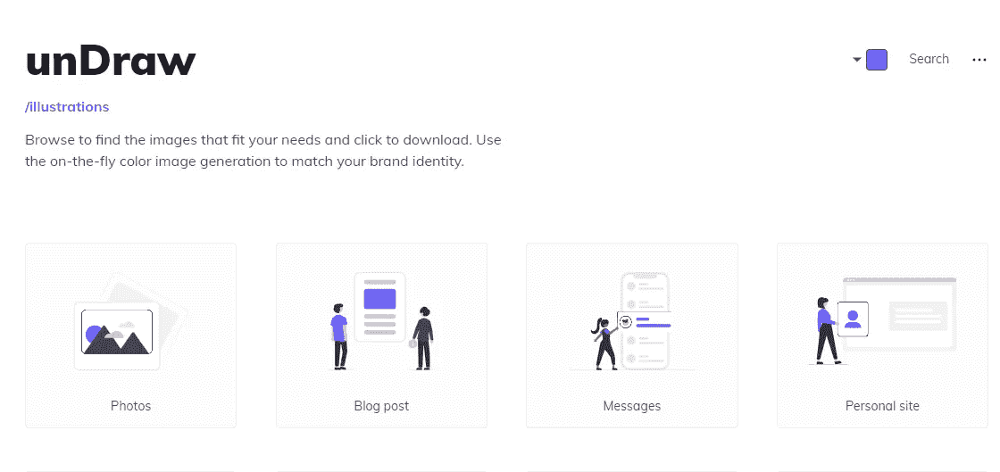
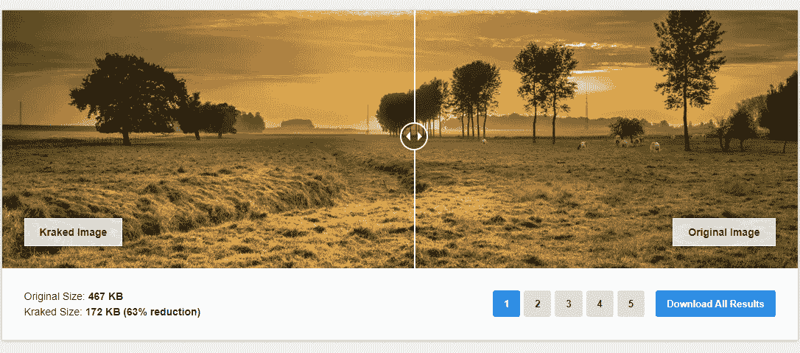
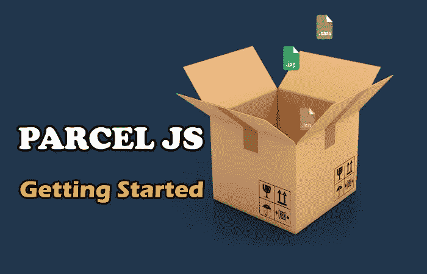
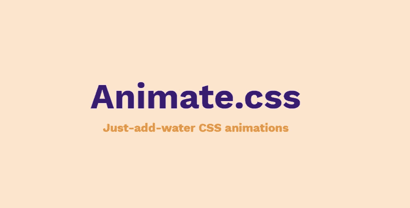

# 你应该知道的 5 个惊人的前端开发工具

> 原文：<https://javascript.plainenglish.io/5-amazing-front-end-development-tools-that-you-should-know-7372dc377d7?source=collection_archive---------0----------------------->

## 每个开发人员都应该知道的有用的前端开发工具

Photo by [Nicole Wolf](https://unsplash.com/@joeel56?utm_source=medium&utm_medium=referral) on [Unsplash](https://unsplash.com?utm_source=medium&utm_medium=referral)

# 介绍

作为一名前端开发人员，您每天都有许多任务要做。这就是为什么你将需要使用一些工具和资源来帮助你推进你的开发过程并且更有成效。网络上有很多工具是专门为前端开发人员设计的，目的是让他们的工作更轻松。

在本文中，我们将为前端开发人员发现一些有用的 web 工具。让我们开始吧。

# 1.拉开

Undraw 是一个很棒的网站，在那里你可以找到符合你需要的 SVG 图像，以便在你的网页上使用它们。您还可以自动定制颜色以匹配您的品牌，并将其用作普通图像、嵌入代码或直接用于您的设计工作流程。

Undraw 允许您组合几十个 SVG 图像，而不用担心速度，并且能够嵌入它们以最小化请求，从而达到极快的加载速度。

[Undraw](https://undraw.co/illustrations).

有兴趣可以去查他们的[网站](https://undraw.co/illustrations)。

# 2.Onepagelove

One-page-love 是一个单页网站，没有类似于*关于*、*团队*或*服务*的附加页面。所有的内容都在同一个网页上，传统上是长滚动布局。网站给了你一堆主题和模板，还有一些前端开发的学习技巧。这是一个能给你带来灵感的好地方。如果你想使用的话，它们还可以让你下载免费的模板。

[Onepagelove](https://onepagelove.com/).

有兴趣的可以查看[这里](https://onepagelove.com/)。

# 3.北海巨妖

北海巨妖是一个网站，允许你压缩和优化你的图像，使它们变得更小。这对你的网站性能和加载时间很有用。

[Kraken](https://kraken.io/).

这是一个伟大的工具，以加快你的应用程序和网站。有兴趣可以去他们的[网站](https://kraken.io/)看看。

# 4.包裹

ParcelJS 是一个 web 应用程序捆绑器，它是所有代码的编译器，与语言无关。packet-bundler 获取您所有的文件和依赖项，将它们合并成一个较小的输出文件集，可以用来运行您的代码。它利用多核处理提供极快的性能，并且不需要任何配置。它很容易使用，不像 Webpack 或其他捆绑器。

ParcelJS 为您的开发过程做了许多工作，比如缩小您的文件，以便减小它们的大小，从而使您的应用程序更快、更容易部署。它还用于编译 Sass 文件和支持 JavaScript ES6 特性，以便浏览器能够理解该语法。

[Parcel](https://parceljs.org/).

有兴趣可以去他们的[网站](https://parceljs.org/)看看。

# 5.Animate.css

AnimateCss 是一个库，它提供了一组跨浏览器的 Css 动画，可以在滑块、主页和其他 web 项目中使用。你可以安装它与 NPM 或只是通过使用他们的 CDN 在你的 HTML。

[AnimateCss](https://animate.style/).

你可以在这里查看。

# 结论

如你所见，我给了你我作为前端 web 开发人员经常使用的工具。使用它们会让事情变得更简单，因为你不必再手动做这些事情了。

感谢您阅读本文，希望您觉得有用。如果有，通过 [**订阅我们的 YouTube 频道**](https://www.youtube.com/channel/UCtipWUghju290NWcn8jhyAw?sub_confirmation=true) **获取更多类似内容！**

# 进一步阅读

 [## 每个 Web 开发人员都应该知道的五大 Github 库

### 面向 web 开发人员的 5 个出色的 Github 存储库

medium.com](https://medium.com/javascript-in-plain-english/top-5-github-repositories-every-web-developer-should-know-d2feb3fdc214)