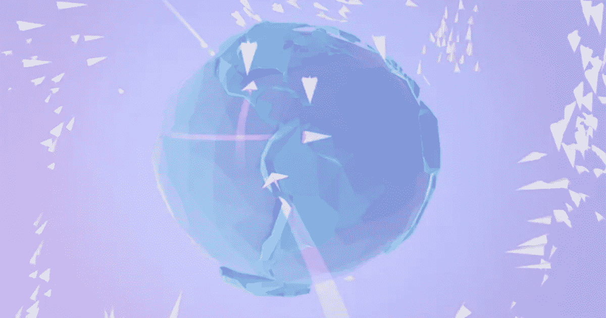
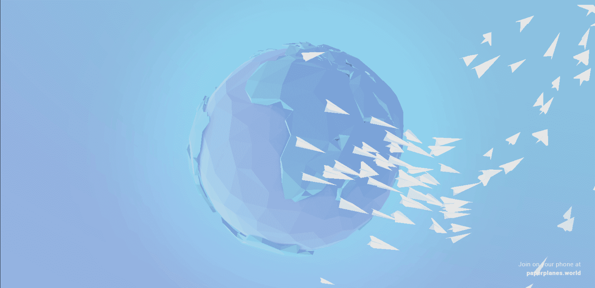
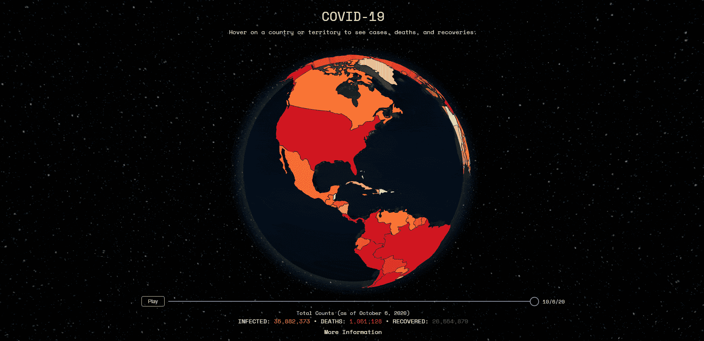
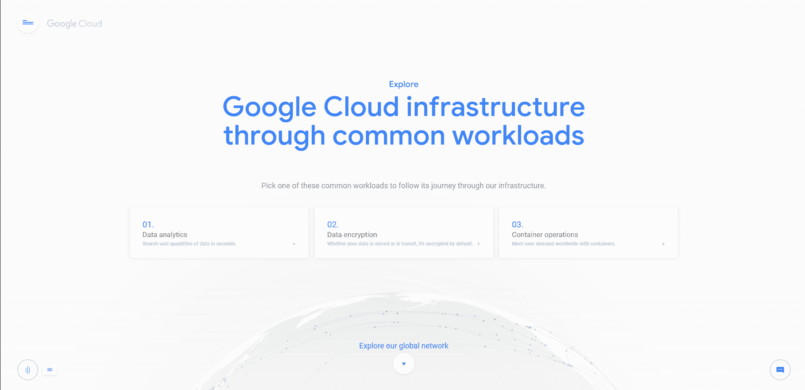
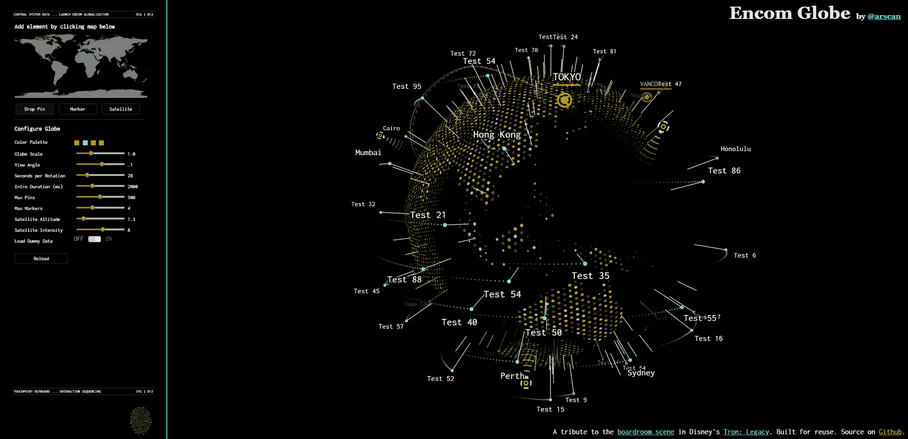

# 激发你灵感的 5 个超棒的 3D 地球项目🌍✨

> 原文：<https://javascript.plainenglish.io/5-awesome-3d-globe-projects-to-inspire-you-f9b7e9c5fd80?source=collection_archive---------5----------------------->

地球的 3D 模型非常适合设计创造性的网络项目，因为它很容易显示数据。由于有许多数据 API，访问人口、国家、城市、地理坐标、健康数据、教育等数据变得很容易。这里我整理了我最喜欢的 3D Globe 项目。

## 1.[纸飞机](https://paperplanes.world/)

在世界各地互相捕捉和投掷纸飞机:一个简单的概念，利用网络和 Android 的力量来创建彼此之间的即时连接。🚀🛫

## 2.[一起听](https://listeningtogether.atspotify.com/)

今天，在 Spotify 上，每一秒钟都有超过 3 万人开始播放他们从未谋面的人的同一首歌。实时查看全球各地的人们在听什么，并发现新的珍宝。🎵🎧

## 3.[新冠肺炎 3D](https://covid3d.live/)

新冠肺炎的交互式三维可视化。使用时间轴查看不同国家的统计数据或病毒在全球的传播情况。😷🤒

GitHub: [源代码](https://github.com/wobsoriano/covid3d)。

## 4.[谷歌云基础设施](https://cloud.withgoogle.com/infrastructure)

使用谷歌的全球网络界面，通过数据分析、数据加密和容器选项探索谷歌的云基础设施。💾💻

## 5. [Encom Globe](https://www.robscanlon.com/encom-globe/)

Encom Globe 是一个基于 WebGL 的 Globe 克隆，来自《创:遗产》中的会议室场景。它是使用 Three.js 编写的，带有一些 GLSL。🤖🌎

GitHub: [源代码](https://github.com/arscan/encom-globe/)。

写作一直是我的激情所在，帮助和激励他人给我带来了快乐。如果您有任何问题，请随时联系我们！

在 [Twitter](https://twitter.com/madzadev) 、 [LinkedIn](https://www.linkedin.com/in/madzadev/) 、 [GitHub](https://github.com/madzadev) 和 [DEV](https://dev.to/madza) 上给我接通！

订阅我的[博客](https://blog.madza.dev)获取更多类似的文章。