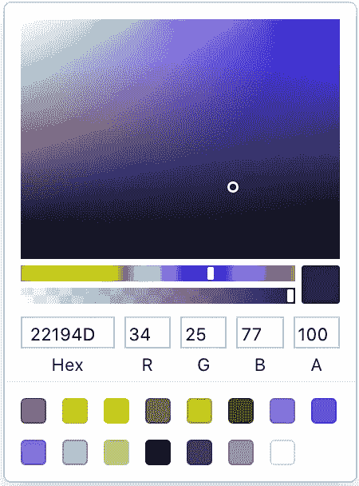
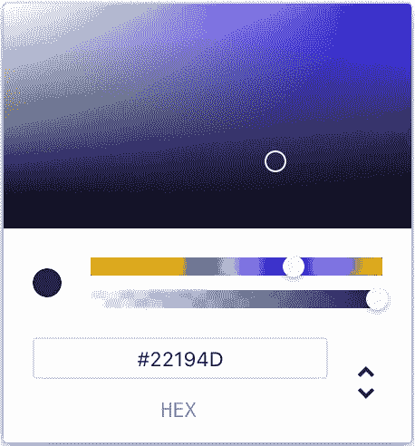
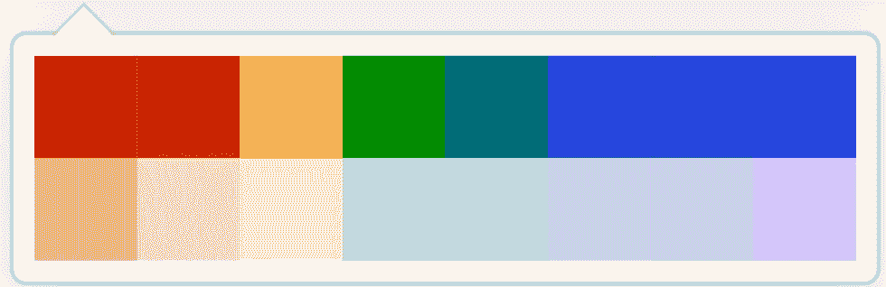
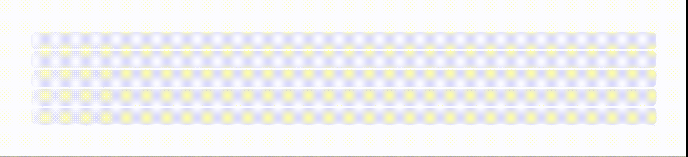

# React.js:你需要尝试的 5 个很棒的包

> 原文：<https://javascript.plainenglish.io/5-awesome-react-packages-you-need-to-try-out-20a156d3d73e?source=collection_archive---------1----------------------->

## 预渲染，有用的钩子，加载动画，颜色选择器&访问头部区域。由 5 个优秀的库为您的下一个 React.js 项目带来


首先:非常感谢你对第一部分的巨大反馈:)在这里你可以找到它:

[](https://medium.com/better-programming/5-awesome-react-js-libraries-you-should-know-about-ef0274fe4a56) [## 你应该知道的 5 个很棒的 React.js 库

### react-portal、react-toastify 等等

medium.com](https://medium.com/better-programming/5-awesome-react-js-libraries-you-should-know-about-ef0274fe4a56) 

# 1.反应-快照

我想我们现在都知道，使用 Gatsby & Next.js 等技术的静态页面和服务器端呈现对于 React 来说非常方便。不需要客户端渲染(React.js 的标准)的页面往往表现得更好&据说有利于 SEO。但是当然，并不是我们 React 应用程序的每个子页面都需要使用这些技术，尤其是移动它们可能相当麻烦。这就是为什么如果我们可以使用 CRA 来静态地只渲染某些页面(例如，如果我们有一个单页面应用程序，则为登录页面)，也就是说，在服务器端渲染作为构建过程的一部分，这将是非常理想的。这样我们就有了一个部分静态的页面，根据我们的需要，而不必离开创建-反应-应用程序作为我们的舒适区。

这很简单:

只需安装 react-snapshot: `npm i -D react-snapshot`

将构建过程的 package.json 条目更新为:

```
“build”: “react-scripts build && react-snapshot”
```

然后，确保用 react-snapshot 提供的功能替换 React.js 的默认渲染功能。您的 index.js 应该如下所示:

```
*import* React *from* ‘react’
*import* { render } *from* ‘react-snapshot’
*import* App *from* ‘./App’render(
  <React.StrictMode><App /></React.StrictMode>,
  document.getElementById(‘root’)
)
```

当你现在运行“npm run build”时，react-snapshot 应该像往常一样完成它的工作并创建/build 文件夹——多亏了它，你现在应该有一个预渲染的 index.html🥳了

与 react-snapshot 相结合的优秀库:

# 2.反应头盔

通常 react-helmet 以**客户端站点渲染**的方式改变我们文档的头部标签。因此，在页面上显示正确的标题需要很短的时间，因为只有在执行 react 时，才能操作/public/index.html 的 DOM。但是由于 react 头盔还支持**服务器端渲染**，它可能是与 react-snapshot 结合使用的最优雅的解决方案，通过 react 为我们的 index.html 生成一个自定义头部区域(当然，由于 react-snapshot，在构建过程之后进行硬编码)，并能够在 React 代码中轻松地再次更改它。

实现 react-头盔很简单，首先安装它:

```
npm install react-helmet
```

然后你可以使用头盔包装，就像它是你的头衔标签一样，就在 JSX。没有任何问题

```
<div *className*=”App”>
  <Helmet>
    <meta *charSet*=”utf-8" />
    <title>{title}</title>
  </Helmet>
</div>
```

现在你可以走了。当将 react-helmet 与 react-snapshot 结合起来并立即运行构建过程时，您应该看到用 react-helmet 定义的 head-area 将被带到/build/index.html。

# 3.反应-使用

在我看来，这是一个非常酷的收集各种方便的 React 挂钩的工具。
包括访问系统特性的钩子，工作状态，生命周期&副作用。安装后，我们来看两个例子:

现在我们只需要导入我们想要使用的东西。

## 使用卸载生命周期

一旦组件被卸载，就会触发此事件。这里有一个小例子:

当您按下按钮时，组件将从 DOM 中移除——因此它被卸载。

## 使用 Cookie:使用 cookie

# 4.反应颜色

颜色选择器是一个好东西，即使你在相当少的项目中需要它们。react-color 提供了 13 种不同的颜色拾取器，这些颜色拾取器基于众所周知的颜色拾取器。例如，Chrome、Sketch、GitHub 和 Photoshop 颜色选择器都是 React.js 组件。

**注意**:目前最新版本的拾色器似乎到处都不能正常工作，所以我建议不要安装这样的最新版本:

```
npm install react-color@2.17.3
```

**这里有一个小小的预告:**



The SketchPicker & ChromePicker component



GithubPicker

安装 react-color 后，您可以从 13 种不同的颜色选择器中进行选择，并像这样轻松地实现它们:

```
import React from 'react' 
import { SketchPicker } from 'react-color' function App() { 
  return <SketchPicker /> 
}
```

现在您有了一个工作的颜色选择器，但是您当然希望访问用户选择的颜色。这就是我们如何将用户选择的内容保存为状态，格式化为 hexcode:

```
*import* { GithubPicker } *from* 'react-color'function App() {
  let [bgColor, setBgColor] = useState('#C40BDE')const handleChangeComplete = (color) => {
    setBgColor(color.hex)
  }*return* (
    <div>
      <p>{bgColor}</p>
      <GithubPicker 
        *onChangeComplete*={handleChangeComplete}  
        *color*={bgColor}
      />
    </div>
  )
}
```

**onChangeComplete** 是我们的事件处理程序， **color** 属性设置默认颜色，以及用户选择的颜色。

# 5.反作用力-载荷-骨架

在本系列的最后一部分中，我向您介绍了如何加载图像，以便它们有一个漂亮的加载动画，通过这个动画，它们在开始时显示得有点模糊，直到它们被完全加载:

[](https://medium.com/better-programming/5-awesome-react-js-libraries-you-should-know-about-ef0274fe4a56) [## 你应该知道的 5 个很棒的 React.js 库

### react-portal、react-toastify 等等

medium.com](https://medium.com/better-programming/5-awesome-react-js-libraries-you-should-know-about-ef0274fe4a56) 

当然，还有其他方法可以直观地缩短 React 应用程序中内容的加载时间。
例如，“骨架”在文本中特别流行，我现在将为其引入一个库。



Clean, hm?

下面是我如何创建这个示例的:(当然，在生产中，当获取数据或延迟加载时，您应该使用它来创建一个转换:

导入并安装骨架组件:

```
npm install react-loading-skeleton
```

然后，您可以使用骨架组件并设置您希望它显示多少行。我选了 5。

```
<Skeleton *count*={5} />
```

**以下是完整代码:**

我决定改变 App.css 文件`p { line-height: 0; }`中段落的行高

如需高级造型，请务必查看官方文档:

[](https://www.npmjs.com/package/react-loading-skeleton) [## 反作用力-载荷-骨架

### 制作漂亮的动画加载骨骼，自动适应你的应用程序。用 npm/ yarn 安装…

www.npmjs.com](https://www.npmjs.com/package/react-loading-skeleton) 

## 非常感谢您的阅读:)如果您想了解 React.js 的更多信息，请访问:

[](https://medium.com/javascript-in-plain-english/4-useful-javascript-shorthands-you-can-use-in-react-js-ca9d2600bf3f) [## 您可以在 React.js 中使用的 4 个有用的 JavaScript 简写

### 以下是我最喜欢的提供更少更清晰代码的短手。而且不仅仅在 React.js 中

medium.com](https://medium.com/javascript-in-plain-english/4-useful-javascript-shorthands-you-can-use-in-react-js-ca9d2600bf3f) 

## [加入我的邮件，免费接收你感兴趣的一切](http://eepurl.com/hacY0v)

## **用简单英语写的 JavaScript 笔记**

我们已经推出了三种新的出版物！请关注我们的新出版物:[**AI in Plain English**](https://medium.com/ai-in-plain-english)[**UX in Plain English**](https://medium.com/ux-in-plain-english)[**Python in Plain English**](https://medium.com/python-in-plain-english)**——谢谢，继续学习！**

**我们也一直有兴趣帮助推广高质量的内容。如果您有一篇文章想要提交给我们的任何出版物，请发送电子邮件至[**submissions @ plain English . io**](mailto:submissions@plainenglish.io)**，并附上您的 Medium 用户名，我们会将您添加为作者。另外，请让我们知道您想加入哪个/哪些出版物。****