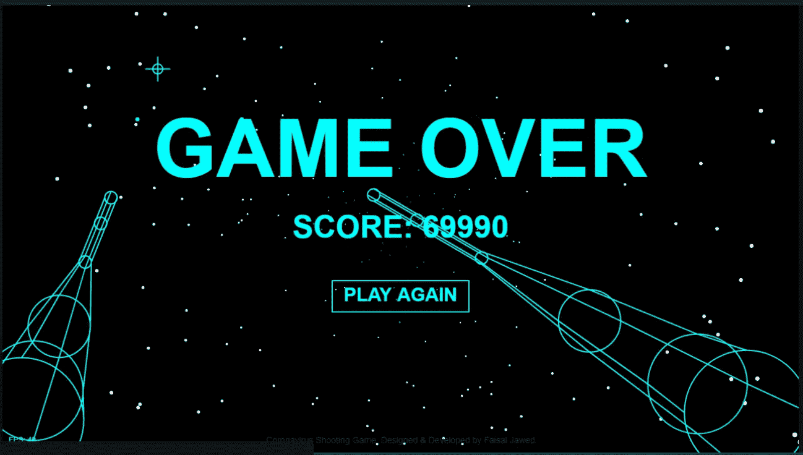

# HTML、CSS 和 JavaScript 的 5 支最佳新冠肺炎代码笔

> 原文：<https://javascript.plainenglish.io/5-best-covid-19-codepens-in-html-css-and-javascript-69058ef711aa?source=collection_archive---------3----------------------->

Photo by [Danial RiCaRoS](https://unsplash.com/@ricaros?utm_source=medium&utm_medium=referral) on [Unsplash](https://unsplash.com?utm_source=medium&utm_medium=referral)

## 使用这些令人印象深刻的代码笔学习、编码和开发创新的想法，并将您的技能提升到一个新的水平！

随着全球冠状病毒病例数量的增加和“**冠状病毒焦虑”**现已成为现实，专业人员可以采取一些策略来确保他们的团队不仅继续有效合作，而且保持项目的势头。

有一些像我一样的幸运的人被困在家里远程工作。我们应该花大量时间提高我们的基本技能，并学习新的技能。同样重要的是花大量的时间和你爱的人在一起，拥有一个平和放松的心态。

我相信冠状病毒为我们提供了*“新开始的空白一页”*。我们将学会如何满足于简单的衣服，重新发现我们曾经拥有的旧的最爱，读一本被遗忘的书，制造一场风暴让生活变得精彩。因此，我们需要珍惜生命中的每一刻，为回归正常生活做好准备。

如果你是一个网页开发者或者对编码感兴趣，你可以尝试 CodePen 网站来学习和提高你的网页开发技能。 [*Codepen*](https://codepen.io/) *是前端 web 开发的游乐场*。

CodePen 是关于灵感、教育和分享的。使用 CodePen 学习编码和展示您的最新作品，并从您的同行那里获得反馈。

在这里，我选择了五个优秀而简单的 CodePen 演示，供您尝试、个性化、创造难以置信的效果，并为您的项目开发创意。

## 1.冠状病毒主题模板

[牛逼主题模板](https://codepen.io/Manouchehr777/pen/NWqYYYa)设计灵感来自 [Manouchehr Tizkhan](https://codepen.io/Manouchehr777/) 。这个模板非常光滑、时尚，具有干净、现代的布局，非常容易定制，是吸引访问者访问您的 web 应用程序的好方法。

Code by [Manouchehr Tizkhan](https://codepen.io/Manouchehr777/) on [Codepen](https://codepen.io/)

## 2.冠状病毒资料图

我们已经看到了来自几个组织的许多优秀的仪表板和可视化。然而，[Adam Kuhn](https://codepen.io/cobra_winfrey/pen/VwLVwvb)使用 HTML、CSS 和 JavaScript 设计的冠状病毒地图既独特又令人印象深刻。你可以简单地滚动或悬停在国家，以了解最新的数据迅速。

Code by [Adam Kuhn](https://codepen.io/cobra_winfrey) on [Codepen](https://codepen.io/)

## 3.一种撒纸追踪游戏

有了 HTML 和 CSS，可以找到一些小乐趣；CSS 可以做出很多你可能没有意识到的搞笑的东西。由[亚当·库恩](https://codepen.io/cobra_winfrey)创作的伟大代码，我们可以看到一张卫生纸在小路上流动。在不确定的时候，我们应该寻找快乐和喜悦的时刻。详细研究这段代码，让我们看看您是否能想出另一段非常幽默的代码演示。

Code by [Adam Kuhn](https://codepen.io/cobra_winfrey) on [Codepen](https://codepen.io/)

## 4.冠状病毒(新冠肺炎)实时跟踪网页

[Ashish Kumar](https://codepen.io/iamishusharma/pen/GRJPjLV)设计的一个非常干净、吸引人、动态的网站脱颖而出。极简主义的设计特点加上颜色和图标使它非常漂亮。您可以从源代码中获得灵感，并增强网页，使其变得更好。

Code by [Ashish Kumar](https://codepen.io/iamishusharma/) on [Codepen](https://codepen.io/)

## 5.冠状病毒射击游戏

谁不喜欢游戏呢？即使你是一个孩子或一个成年人，你也不能不玩任何游戏就留下来。费萨尔·贾韦德设计了一款摧毁病毒的射击游戏，给人留下了深刻的印象。一个非常奇怪和吸引人的想法变成了一个游戏，让每个人都有兴趣对抗病毒。让我们看看你能杀死多少病毒。

Code by [Faisal Jawed](https://codepen.io/faisal-jawed) on [Codepen](https://codepen.io/)

我设法考了 69990 分。你能打败我的高分吗？在你的分数截图下面评论。

## 结束语

受到启发开始用这些笔编码？你准备好学习和创新这些很酷的想法了吗？你想即兴发挥这些代码，并建立一个令人印象深刻的代码吗？试一试编码，看看你一天结束时的状态。

记住总是向其他开发人员学习。通过观察他们的工作开始编码，并通过即兴创作原始源代码来练习。同样重要的是你如何服务于你的开发者社区——通过分享你的工作或者贡献创新的想法。

如果你有更好更新颖的想法，欢迎在下面随意评论。

快乐学习编程！

**感谢阅读！
你可以在 Medium 上找到我其他作品的链接，关注我** [**这里**](https://medium.com/@faraazdhuka28) **。**

## 资源

1.  冠状病毒主题模板由 [Manouchehr Tizkhan](https://codepen.io/Manouchehr777/) 制作。可用:【https://codepen.io/Manouchehr777/pen/NWqYYYa 
2.  冠状病毒资料图由[亚当·库恩](https://codepen.io/cobra_winfrey)拍摄。可用:[https://codepen.io/cobra_winfrey/pen/VwLVwvb](https://codepen.io/cobra_winfrey/pen/VwLVwvb)
3.  亚当·库恩的论文追逐。可用:[https://medium.com/r/?URL = https % 3A % 2F % 2f code pen . io % 2f cobra _ Winfrey % 2f pen % 2f gopzozo](https://codepen.io/cobra_winfrey/pen/gOpzozo)
4.  冠状病毒(新冠肺炎)实时追踪网页。可用:[https://medium.com/r/?URL = https % 3A % 2F % 2f code pen . io % 2 fiamishusharma % 2 fpen % 2 fgrjpjlv](https://codepen.io/iamishusharma/pen/GRJPjLV)
5.  冠状病毒射击游戏 [Faisal Jawed](https://codepen.io/faisal-jawed) 。可用:[https://medium.com/r/?URL = https % 3A % 2F % 2f code pen . io % 2f fais al-jawed % 2f pen % 2f nwqernz](https://codepen.io/faisal-jawed/pen/NWqeRNZ)

## **来自 JavaScript 简单英语:**

我们总是有兴趣帮助推广高质量的内容。如果你有一篇文章想用简单的英语提交给 JavaScript，用你的中级用户名发邮件到[submissions@javascriptinplainenglish.com](mailto:submissions@javascriptinplainenglish.com)给我们，我们会把你添加为作者。