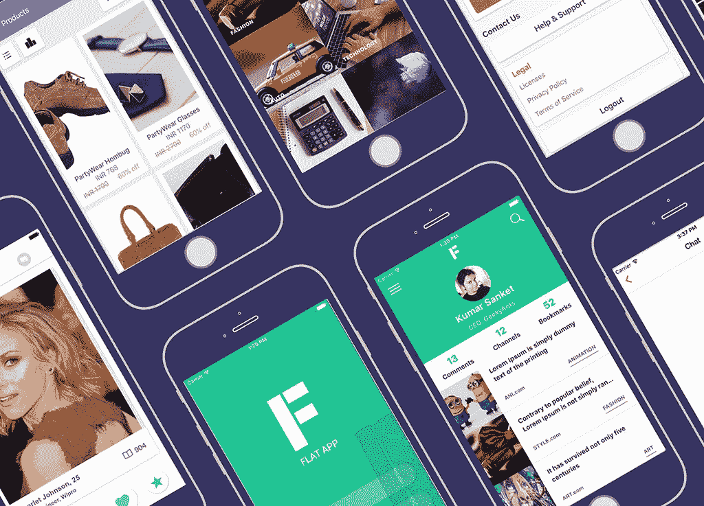
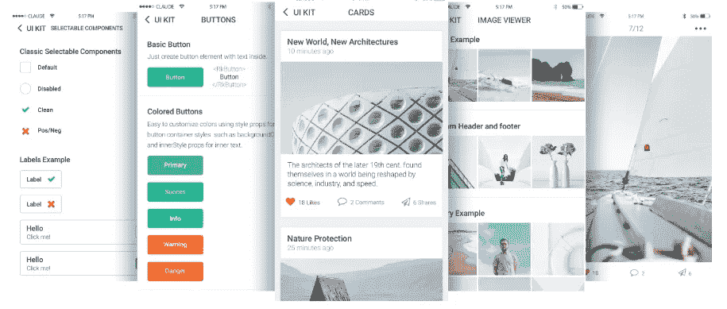
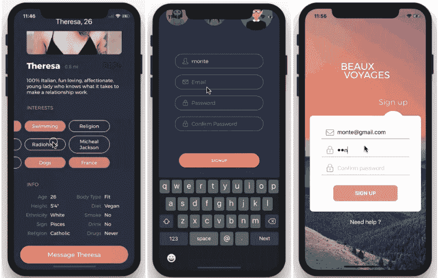
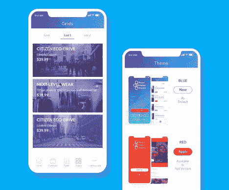

# 2020 年 5 款最佳免费 React 原生 UI 套件

> 原文：<https://javascript.plainenglish.io/5-best-free-react-native-ui-kits-of-2020-8fb4f728d91a?source=collection_archive---------3----------------------->

在 Instamobile，我们提供功能免费和高级 React 原生 UI 套件，以帮助开发人员和企业家更快地为 iOS 和 Android 构建他们的原生移动应用。通过使用免费的 React 原生 UI 套件，您可以跳过从头创建应用程序的困难部分。您可以使用已经为您创建和实现的漂亮的 UI 元素，以便您可以专注于使您的应用程序独一无二的东西。

React 原生 UI 套件为开发人员提供了一大套华丽的 UI 组件，可用于构建漂亮的 React 原生界面。UI 设计工具包基本上提供了创建移动应用程序所需的砖块。如果你想节省几个月的工作并更快地启动你的创业，请查看我们的高级和免费[移动应用模板](https://www.instamobile.io)。

## 最佳反应原生 UI 套件

从头开始设计一个移动应用程序可能会很可怕，尤其是对于没有构建移动产品经验的人来说。拿出一个原型是一项艰苦的工作，你通常需要多年的经验才能创造出一个设计精美的 MVP。如果你刚刚开始移动应用程序开发，很可能你没有经验，你的前几个应用程序看起来不会那么好。

此外，通过使用 React 原生 UI 工具包，您可以学到许多有趣的设计策略，而这些是您自己很难学会的。随着时间的推移，你获得的前端经验越多，你就越能发现这些设计技巧和修饰。但是作为一个初学设计的人或者对设计不感兴趣的开发人员，你最好使用 iOS 和 Android 设计工具包。

在本文中，我们列出了最好的免费 React 原生 UI 套件，帮助您了解在开发和移动设计上节省大量时间和金钱是多么重要。使用这些 React 原生设计套件制作您的下一款应用，让我们知道您节省了多少时间。毕竟要造车，不需要先发明轮子。

## 1.本地基地

目前市场上最流行的 React 原生 UI 工具包，[原生库](https://github.com/GeekyAnts/NativeBase)为你提供了一大套 UI 组件，你可以利用它们来开发一个新的应用。它充当大多数原生 React 组件(如按钮、文本字段、视图、键盘视图、列表视图等)的包装器，并通过添加额外的功能(如圆角、阴影等)来丰富它们。

它还附带了一个免费的 React 原生原型应用程序，名为 Kitchen Sink，至少可以节省您一天的工作时间。开源项目包含基本功能，如导航抽屉、应用程序菜单、选项卡视图、个人资料图片等。

## 2.React 本地初学者工具包

你见过多少次 React 原生开发者为流行的应用功能(如登录和注册)重新编写相同的代码？

这个开源的 [React Native 样板](https://www.instamobile.io/app-templates/react-native-starter-kit-firebase/)项目通过为你提供一个用 React Native 编码的全功能应用启动器，让你节省了几天的工作。您可以使用 React 原生初学者工具包简单地引导您的下一个应用程序的开发。漂亮的 UI 设计工具包包含一组丰富的功能，并且它开箱即可与 Firebase 完全集成。您可以在 React Native 中获得一个完整的工作流程，包括脸书登录、Firebase Auth、普通登录&注册、持久登录凭证等。只需下载这个免费的应用程序 UI 套件。

## 3.UI 小猫

[UI Kitten](https://github.com/akveo/react-native-ui-kitten) 是另一个免费的 React 原生 UI 套件。虽然没有上面提到的那些流行，UI Kitten 已经存在了很长时间，从 React Native development 开始就有了。这意味着这个项目已经相当成熟，而且开源社区仍在不断更新它，它是值得信赖的。因此，您可以依靠这个 UI 工具包来构建新 React 本机应用程序的用户界面。

你可以免费获得大量漂亮的 UI 元素，比如按钮、卡片、照片查看器、媒体集、开关、增强的文本字段等等。Github 上的 3.6K 明星们自己说了算。

如果你有 web 开发经验，你可能听说过 Bootstrap。请将此视为一个 React 本机引导框架。

## 4.反应本地元素

这是第二流行的 React 本地引导库。凭借华丽的 UI 元素，React 原生 UI 套件的惊人之处在于它提供了核心 UI 组件，这些组件高度可重用，可用于构建更复杂的界面。元件更小的事实为设计提供了更大的灵活性。

在构建下一个应用程序时，试试这个跨平台 UI 工具包。您甚至可以将它与多个 React 原生 UI 套件相结合，尽管这并不是理想的推荐方法。您需要尽可能减少依赖项的数量，以便能够更快地进行未来的更新。

## 5.React 本地初学者工具包

[这款](https://github.com/flatlogic/react-native-starter)入门套件不太受欢迎，但它在未来可能会受到欢迎。我们在这里列出它只是为了防止你想用一些不同于大多数 React 本地开发者的东西。毕竟，你不希望你的应用程序看起来与成千上万的其他应用程序一模一样。这对谷歌来说可能没问题，但苹果肯定不会让步。选择越多，对应用开发者越好。

然而，它在 Github 上仍然有 500 颗星，并且它带有许多完全构建的屏幕，如电子商务产品页面或联系人页面。

## 结论

这些是目前市场上最好的免费 React 原生 UI 套件。确保你分析了所有的细节，很好的理解了它们的作用和它们的局限性。要选择最好的一个，你需要了解你自己项目的所有细节，因为总有一个权衡。只要确保你使用一个，不要从头开始你的应用程序，特别是如果你是一个新的开发者/应用程序创建者。请在评论中告诉我们哪一个是你最喜欢的 UI 套件。如果你喜欢这篇文章，请通过进一步分享来传播它。