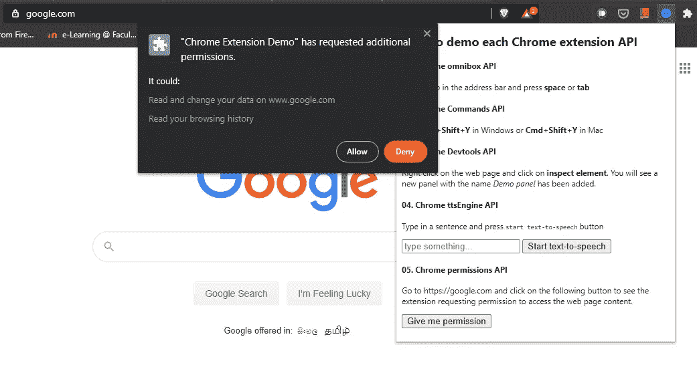

# 5 个你们大多数人都不知道的 Chrome 扩展 API

> 原文：<https://javascript.plainenglish.io/5-chrome-extension-apis-that-most-of-you-are-not-aware-of-711350ab00c4?source=collection_archive---------8----------------------->

## 用这些 API 给你的 Chrome 扩展添加酷的特性


Photo by [Caio](https://www.pexels.com/@caio?utm_content=attributionCopyText&utm_medium=referral&utm_source=pexels) from [Pexels](https://www.pexels.com/photo/light-smartphone-macbook-mockup-67112/?utm_content=attributionCopyText&utm_medium=referral&utm_source=pexels)

开始构建 Chrome 扩展很容易，但大多数新手开发者在试图将更多高级功能集成到他们的扩展中时会半途而废。在我看来，这主要是因为 Chrome 扩展 API 文档充满了沉重的技术术语，有些杂乱无章。因此，开发人员经常找不到他们真正要找的东西，即使它就在文档本身的某个地方。

这篇文章向你展示了大多数开发者都不知道的 5 个 Chrome 扩展 API。在 Chrome 扩展中使用这些 API 将有助于提高用户的工作效率，并最大化用户体验。

> 我构建了一个示例 Chrome 扩展，演示了如何使用下面讨论的 Chrome 扩展 API。下面来看看吧。

[](https://github.com/pavinduLakshan/ChromeExtensionDemo) [## pavinduLakshan/ChromeExtensionDemo

### 一个简单的 Chrome 扩展，演示了一些鲜为人知的 Chrome 扩展 API。克隆此 repo git 克隆…

github.com](https://github.com/pavinduLakshan/ChromeExtensionDemo) 

# 1.Chrome Omnibox API

假设您想要构建一个扩展，在用户在地址栏中键入时提供实时搜索建议。你将如何实现它？在 Chrome 中，你不需要担心。Chrome Omnibox API 可以提供帮助。

Chrome Omnibox API 允许该扩展在安装时在浏览器中注册一个关键字。当用户键入我们注册的关键字并继续键入时，这些查询会被实时直接发送到分机。然后，扩展可以处理用户输入的内容，并将适当的建议发送回地址栏。不仅如此，Omnibox API 还提供了在各种[事件](https://developer.chrome.com/extensions/omnibox#toc:~:text=)-,Events,-onInputStarted)如`[onInputEntered](https://developer.chrome.com/extensions/omnibox#event-onInputEntered)`、`[onInputChanged](https://developer.chrome.com/extensions/omnibox#event-onInputChanged)`等上监听地址栏变化的方法。

要在您的扩展中使用 Omnibox API，应该在下面的`manifest.json`中明确提到。我强烈建议您克隆演示资源库并将其安装在本地，看看它是如何工作的。

```
"omnibox": { "keyword" : "demo" }
```

然后，您可以在后台脚本中监听 Omnibox API 提供的各种事件，如下所示。

Omnibox API Demo

[](https://developer.chrome.com/extensions/omnibox) [## chrome.omnibox

### 描述:Omnibox API 允许你在 Google Chrome 的地址栏中注册一个关键字，也就是所谓的…

developer.chrome.com](https://developer.chrome.com/extensions/omnibox) 

# 2.Chrome 命令 API

有时，您希望通过引入键盘快捷键来轻松执行您的扩展的各种操作，从而使用户的生活变得简单。Chrome Commands API 让开发人员能够做到这一点。您在`manifest.json` 中指定想要使用的键盘快捷键，并在后台脚本中监听这些按键事件。按下每个快捷键组合后，您可以在分机内执行相应的功能。

然而，Chrome Commands API 有一些硬性限制。

*   您的快捷键都不能有`Ctrl+alt`组合键。
*   您也不能使用 Chrome 浏览器的一些保留键盘快捷键。即使您这样做了，快捷键默认功能也将具有优先权。
*   你的`manifest.json`的`manifest_version`至少应该是 2 或者更高。

> 需要关注的事情更多。请参见[Chrome Commands API 的用法](https://developer.chrome.com/apps/commands#usage)了解更多关于 Commands API 的限制。

要在扩展中使用 Chrome commands API，快捷命令应该在`manifest.json`中声明，如下所示。

```
...,
"commands": {
  "toggle-feature-foo": {
    "suggested_key": {
      "default": "Ctrl+Shift+Y",
      "mac": "Command+Shift+Y"
    },
    "description": "Toggle feature foo"
  }
},
...
```

然后，您可以在后台脚本中监听快捷键事件，如下所示。

Chrome Commands API demo

[](https://developer.chrome.com/apps/commands) [## 铬。命令

### 要使用此 API，您必须拥有至少为 2 的“manifest_version”。命令 API 允许您定义特定的…

developer.chrome.com](https://developer.chrome.com/apps/commands) 

# 3.扩展开发工具

有一些扩展为 Chrome Devtools 添加了额外的面板和侧边栏。例如， [Angular Batarang](https://chrome.google.com/webstore/detail/angularjs-batarang/ighdmehidhipcmcojjgiloacoafjmpfk?hl=en) 向 DevTools 添加了一个面板来显示 Angular web app 相关的性能分析，而 [React dev tools](https://chrome.google.com/webstore/detail/react-developer-tools/fmkadmapgofadopljbjfkapdkoienihi/internal?hl=en) 添加了一个面板来记录 React 特定的性能数据。我们如何在扩展中做类似的事情？这是通过 Chrome Devtools APIs 实现的。

要扩展现有的 DevTools，您应该声明一个`.html`文件作为`manifest.json`中的 Devtools 页面，如下所示。

```
"devtools_page": "devtools.html"
```

现在，`devtools.html`中加载的 JS 脚本可以访问 Devtools APIs，例如 [Devtools Panels API](https://developer.chrome.com/extensions/devtools_panels) 、 [Devtools Network API](https://developer.chrome.com/extensions/devtools.network) 等。

Chrome Devtools API demo

[](https://developer.chrome.com/extensions/devtools) [## 扩展开发工具

### DevTools 页面创建一个 DevTools 扩展 DevTools UI 元素:面板和侧边栏窗格在…

developer.chrome.com](https://developer.chrome.com/extensions/devtools) 

# 4.Chrome tts API

文本到语音的转换越来越好了。它使网页内容消费更加容易和方便，尤其是对视力受损的人来说。如何在 Chrome 扩展中使用它？检查[朗读](https://chrome.google.com/webstore/detail/read-aloud-a-text-to-spee/hdhinadidafjejdhmfkjgnolgimiaplp?hl=en)，它将网页大声朗读给最终用户。它利用文本到语音转换将网页文本转换成语音并读给用户听。想在你的扩展中增加类似的功能吗？Chrome tts API 就是为此而生的。

Chrome tts API 能够轻松地将文本到语音转换功能集成到 Chrome 扩展中。然而，`"tts"`应该在下面的`manifest.json`中的`"permissions"`下被提及，这样才能工作。

```
"permissions": [
   "tts"
]
```

Chrome tts API 提供了几个有用的方法来充分利用我们的扩展中的 API。

*   [chrome.tts.speak()](https://developer.chrome.com/extensions/tts#method-speak) -说出话语。
*   [chrome.tts.stop()](https://developer.chrome.com/extensions/tts#method-stop) -立即停止任何当前正在进行的语音。
*   [chrome.tts.pause()](https://developer.chrome.com/extensions/tts#method-pause) -暂停语音合成，可能在话语中间。呼叫`resume`或`stop`将取消暂停讲话。
*   [chrome.tts.resume()](https://developer.chrome.com/extensions/tts#method-resume) -如果讲话暂停，从停止的地方继续讲话。
*   [chrome . tts . is speaking()](https://developer.chrome.com/extensions/tts#method-isSpeaking)——检查 TTS 引擎当前是否在说话。

下面的代码片段展示了 Chrome tts API 的一个简单用例。要了解更多信息，请参考 Chrome tts API 开发者文档。没什么可担心的，他们都是可笑的全面😊。

Chrome tts API demo

[](https://developer.chrome.com/extensions/tts) [## 铬. tts

### Chrome 为 Windows(使用 SAPI 5)、Mac OS X 和 Chrome OS 上的语音提供原生支持，使用语音合成…

developer.chrome.com](https://developer.chrome.com/extensions/tts) 

# 5.可选扩展权限

在你的 Chrome 扩展中，你希望用户授予不同的[权限](https://developer.chrome.com/apps/declare_permissions#manifest)来执行不同的功能。有两种方法可以做到。您可以在安装时显示提示，让用户授予所有权限，或者只在需要时请求某些权限。两种方式各有利弊，但后一种方式更有优势。

*   由于默认情况下您的扩展以较少的权限运行，因此为用户提供了更好的安全性。如果您的扩展受到攻击，对用户造成的损害将小于在安装时授予所有权限所造成的损害。
*   每次当你的扩展需要许可的时候，它都会解释，从而增强用户体验。通过这种方式，用户可以很好地了解为什么你的扩展需要该权限，这将增加用户对你的扩展的信任。
*   当你的扩展需要更新时，Google 不会在添加新权限时禁用你的扩展，只要它们被声明为可选权限。

> **注意:**不是所有的权限都可以声明为可选的。此处[列出的权限](https://developer.chrome.com/apps/permissions#manifest:~:text=Permissions%20that%20can%20not%20be%20specified%20as%20optional)必须声明为**必需**如果你打算使用它们，在`*manifest.json*`中的`*“permissions”*`下。

您可以在`manifest.json`中声明您的扩展需要的可选权限，如下所示。

```
"optional_permissions": [ "tabs", "http://www.google.com/" ],
```

当扩展希望授予可选权限之一时，可以按如下方式请求。

Chrome Optional Permissions Demo

这将在您的浏览器中打开一个提示，如下所示。请注意，一旦您授予了权限，该扩展将不会再次显示提示，除非您撤销授予的权限或者卸载并重新安装该扩展。



Screenshot by author

[](https://developer.chrome.com/apps/permissions) [## 铬.权限

### 扩展可以声明必需权限和可选权限。通常，您应该:在以下情况下使用所需的权限…

developer.chrome.com](https://developer.chrome.com/apps/permissions) 

# 包扎

Chrome 扩展让我们扩展了众所周知的 Chrome 浏览器的功能。Google 提供了许多扩展 API，但是一些强大的 API 的文档充满了技术术语，跨越了几页，有时被深深地埋藏在文档中。这里我们讨论了 5 个如此强大但鲜为人知的 Chrome 扩展 API。我真诚地希望你学到了一些新的东西，并将在未来构建惊人的 Chrome 扩展时利用这些知识。

注意安全，直到下次。谢谢你阅读❤️

**资源:**

[铬显影剂文档](https://developer.chrome.com/home)

[https://github.com/pavinduLakshan/ChromeExtensionDemo](https://github.com/pavinduLakshan/ChromeExtensionDemo)