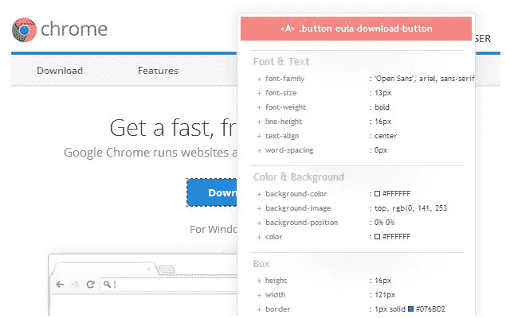

# 5 个 Chrome 扩展，用于提高开发人员的生产力

> 原文：<https://javascript.plainenglish.io/5-chrome-extensions-for-developers-productivity-11de7c343e58?source=collection_archive---------7----------------------->

## 五个 Chrome 扩展来保持专注，方便你作为开发者的日常工作流程。

**扩展模块**是一些小程序，可以个性化您的浏览器并为其添加新功能。你可以通过从 [Chrome 网上商店添加扩展来定制 **Chrome** 和你的浏览体验。](https://chrome.google.com/webstore/category/extensions?hl=en)

这里有五个 Chrome 扩展，我用它们来保持专注，提高我的工作效率和开发能力:

# **1。晶片分析器**

[https://www.wappalyzer.com/](https://www.wappalyzer.com/)

[**Wappalyzer**](https://chrome.google.com/webstore/detail/wappalyzer/gppongmhjkpfnbhagpmjfkannfbllamg?hl=en)**是一个神奇的扩展，通过列出使用的软件和技术，向用户揭示网站是如何开发的。**

# **2.CSSViewer**

****

**[https://github.com/miled/cssviewer](https://github.com/miled/cssviewer)**

******显示网页上任意元素的 CSS 参数。不用浪费时间打开 Chrome 的开发者工具来检查哪些 **CSS 规则**应用于某个元素，这个扩展允许你简单地使用光标来显示它们。******

# ****3.调色滴管****

********

****[**ColorPick 滴管**](https://chrome.google.com/webstore/detail/colorpick-eyedropper/ohcpnigalekghcmgcdcenkpelffpdolg?hl=en) **⁣** 是一个方便的扩展，只需点击一下就可以知道网页的颜色值。该代码有十六进制和 RGB 两种版本。****

# ****4.焦点我****

********

****[**focus me**](https://chrome.google.com/webstore/detail/focusme-a-pomodoro-timer/koebbleaefghpjjmghelhjboilcmfpad?hl=en)**是一款迫使你保持专注的生产力 app。它基于 Pomodoro 时间管理技术，包括阻止分散注意力的网站的能力，这样你就可以专注于你的工作。******

# ******5.Momentum⁣******

************

******[**Momentum**](https://chrome.google.com/webstore/detail/momentum/laookkfknpbbblfpciffpaejjkokdgca?hl=en) 让你把新的标签页变成一个高效的定制控制面板。******

****当你在 Chrome 中打开一个新标签时，这个扩展会用一张漂亮的图片、激励性的短语和问题来欢迎你:*“你今天的主要关注点是什么？”* 你还可以为你的待办事项列表添加一个小工具，并链接到你最喜欢的网站。****