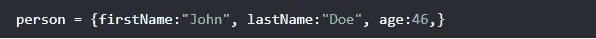
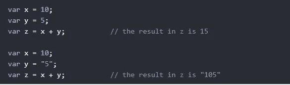
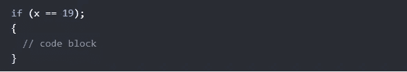
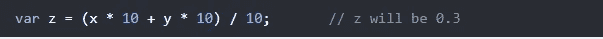

# JavaScript 初学者应该避免的 5 个常见错误

> 原文：<https://javascript.plainenglish.io/5-common-javascript-beginner-mistakes-that-you-should-avoid-5c50ddce8743?source=collection_archive---------11----------------------->

## 5 个初学 JavaScript 的错误和例子

Photo by [Kelly Sikkema](https://unsplash.com/@kellysikkema?utm_source=medium&utm_medium=referral) on [Unsplash](https://unsplash.com?utm_source=medium&utm_medium=referral)

# 介绍

每个人都会犯错误，但我们必须从中吸取教训并尽量避免错误，因为 JavaScript 或任何编程语言中的一个简单错误都可能导致我们的程序或应用程序停止运行，也可能导致一些错误和缺陷。因此，在本文中，我们决定指出一些初学者应该避免的常见 JavaScript 错误。

Photo by [Varvara Grabova](https://unsplash.com/@santabarbara77?utm_source=medium&utm_medium=referral) on [Unsplash](https://unsplash.com?utm_source=medium&utm_medium=referral)

# 1.用逗号结束定义

我个人面临的一个常见问题是用逗号结束定义。在 **ECMAScript 5** 中，对象和数组定义中的尾随逗号是合法的。但是 **JSON** 不允许尾随逗号。

JavaScript Object.

# 2.令人困惑的加法和串联

加法是数字的相加，串联是字符串的相加。两者都使用加号运算符(+)。因此，将数字作为数字添加会产生与将数字作为字符串添加不同的结果:

Adding numbers in JavaScript.

当添加两个变量时，很难预测结果:

Addition VS Concatenation in JavaScript.

# 3.把分号放错了位置

有时我们把分号放在错误的地方，这会改变程序的行为，因为分号意味着语句的结束。看看下面的例子:

Misplacing Semicolon

因为分号放错了位置，所以不管 x 的值是多少，这个代码块都会执行。

# 4.误解浮动

所有编程语言中的数字都存储为 64 位浮点数(floats)。所有编程语言在精确浮点值方面都有困难。看看下面的例子:

Floats in JavaScript.

为了解决上面的问题，我们需要乘和除:

Multiply and Divide.

# 5.未定义和空

JavaScript 对象、变量、属性、方法可以是`**undefined**`。此外，空的 JavaScript 对象可以有值`**null**`。许多初学者对此感到困惑，所以你需要了解何时使用每一个。

# 结论

编码是非常敏感的，任何错误都可能在你的程序中引起问题和错误，所以你需要尽可能的避免。这篇文章到此为止，希望你今天学到了新的东西。