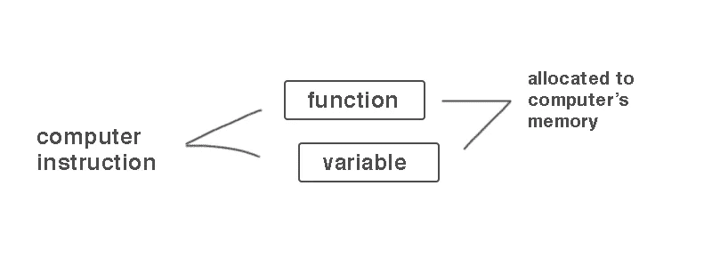
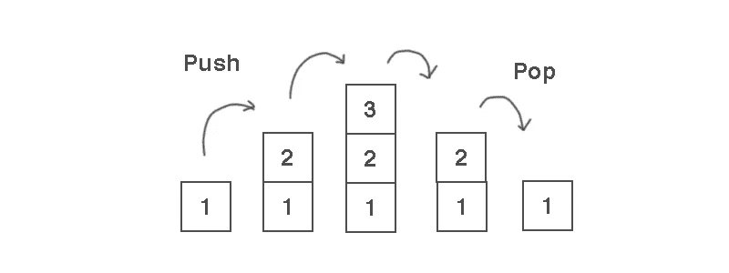
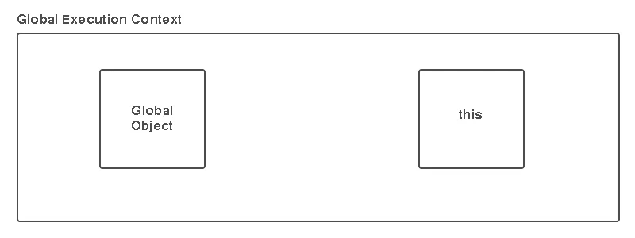

# 每个开发人员都应该知道的 5 个 JavaScript 术语

> 原文：<https://javascript.plainenglish.io/5-difficult-sounding-words-in-javascript-that-every-developer-should-know-3bbfac0c0f22?source=collection_archive---------3----------------------->


Photo by [Joseph Chan](https://unsplash.com/@yulokchan?utm_source=medium&utm_medium=referral) on [Unsplash](https://unsplash.com?utm_source=medium&utm_medium=referral)

JavaScript 是一种美丽、简单却又如此强大的语言。这是一种与其他编程语言非常不同的语言。你在这里意味着你想学习 JavaScript。既然你做出了明智的决定，那我们就开始吧。

难以理解的单词，如词汇环境、语法分析器、执行上下文、名称/值对、对象等。其实并不难。

> 你必须了解 JavaScript 引擎才能完全理解 JavaScript。

## 1.语法分析器

语法分析器是 JavaScript 引擎的一部分，它一个字符一个字符地读取代码并决定它做什么。

> 代码不是魔术，某个地方的程序员写了代码，在编写程序的时候，这些代码在计算机的内存中分配，最终一个字符一个字符，一行行地翻译和编译。

例子，

```
function hello() { let a = "Hello World"; }
```



JavaScript 是这样理解代码的:

*   from 中的单词 function 和结尾带()的单词是一个函数
*   var 描述它是一个变量，这意味着它的值可以改变

## 2.词汇环境

词汇环境是指在你写的代码中实际存在的代码。它是一个 js 引擎构造或 js 引擎的一部分，用于保存标识符-变量映射。标识符是指变量或函数的名称以及对实际对象或原始值的变量引用。

词汇被描述为*与定义有关。它保存了对父词法环境的引用。*

示例:

```
function hello() {let a = "Hello World";}
```

在上面的例子中，我们可以说变量 a 在词汇上位于函数 hello()内部。它让您了解到当编译器运行时，js 引擎将如何与变量和函数交互。

## 3.执行上下文

要理解它，我们必须了解堆栈。

> Stack 是一种抽象数据类型，它通过两个主要操作 Push 和 Pop 来收集元素。

按下堆栈中的位置，然后从堆栈中取出，如下图所示。我推荐阅读[栈](https://www.oreilly.com/library/view/data-structures-and/9781449373931/ch04.html)。



执行上下文是一个包装器，当代码在 js 引擎中运行时，这些操作在这里发生。词汇环境通过执行上下文来管理。如果任何函数是在执行上下文中创建的，它将存储在函数的内部属性[[environment]]中。所以每个函数跟踪与执行上下文相关的词法环境。它可以包含在词法环境中运行的代码和将要运行的代码。

## 4.对象和键/值对

这是大多数开发人员都知道的一个常见术语。

```
let address = {country: 'United States',state: 'California',street: 'York St' apartment: { buildingNumber: 34, floor: 12,

  room: 27 }}
```

像“国家”、“州”、“街道”、“公寓”这样的第一个标识符是*键*，它们保存的实际值是*值。*值的妙处在于它可以有更多的键/值对。

而用“*定义的地址变量让“*为对象。一个对象可以有无限多的键/值对。

## 5.全球环境

当代码运行时，js 引擎会创建一个全局执行上下文，所有内容都可以在其中运行。它是基本执行上下文或全局执行上下文。它指的是代码中的任何地方。全局执行上下文运行时创建 2 个东西，全局对象和变量“ *this* ”。*这个*变量被称为全局对象。



这些话很容易，但听起来似乎很难。希望这对你有帮助。

*感谢您的阅读。*