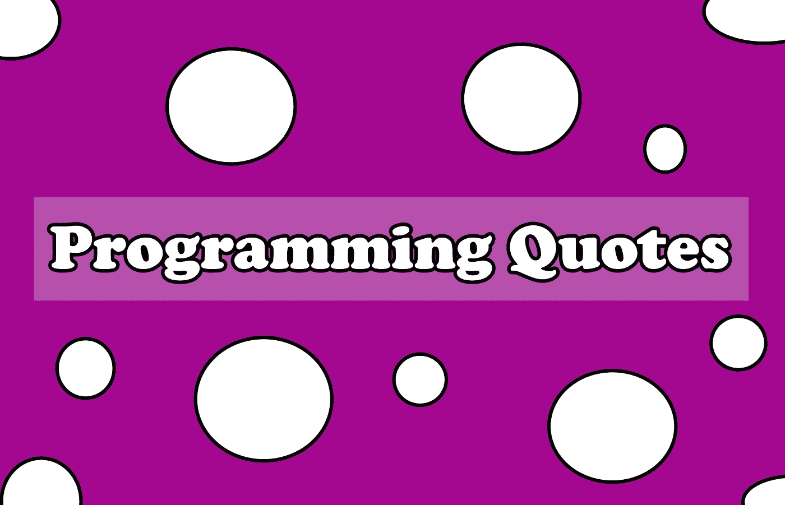

# 开发人员的 5 大编程名言

> 原文：<https://javascript.plainenglish.io/5-great-programming-quotes-for-developers-d50058b94607?source=collection_archive---------7----------------------->

## 对开发人员有用的编程报价

Photo by [Walling](https://unsplash.com/@walling?utm_source=medium&utm_medium=referral) on [Unsplash](https://unsplash.com?utm_source=medium&utm_medium=referral)

# 介绍

编程是用计算机能理解的代码解决问题的艺术。

从技术上讲，编程是逻辑的实现，以促进特定的计算操作和功能。这意味着你给机器提供一套指令，这些指令是用计算机能理解的语言编写的。

在这篇文章中，我们会发现一些关于编程的惊人语录，来激励你，逗你笑，或者让你思考。让我们开始吧。

Image Created with ❤️️ By Mehdi Aoussiad.

# 1.实践中学习

> 学习一门新编程语言的唯一方法就是用它来写程序
> 
> *丹尼斯·里奇。*

程序员大多是边做边学。再多的学术研究或看别人写代码都比不上打开编辑器开始出错。这意味着学习了基础知识还不足以称自己为真正的程序员。熟能生巧。

# 2.你需要失败

> **“试验导致失败，失败导致理解。”**
> 
> 伯特·鲁坦。

一些开发人员讨厌测试，因为很多时候你会发现自己在与错误和失误作斗争。然而，改变你的态度并接受它，会让你成为一个更好的开发者。为了学会如何成功，你需要经历失败。

# 3.而是你能想出什么

> “编程不在于你知道什么，而在于你能想出什么。”
> 
> *克里斯·派恩。*

作为程序员，不需要什么都懂。当我们一开始是初学者时，我们非常渴望了解所有的东西，尤其是语言语法。解决问题是我们最终会用到的技能，这也需要一些谷歌搜索的技能。你应该知道如何寻找解决方案并在你的程序中实现它们。关键是你能想出多少。

# 4.当事情变得困难时，休息一下

> "有时最好不去管某些事情，暂停一下，编程也是如此."
> 
> 乔伊斯·惠勒。

当问题变得更难，你感到疲倦时，我总是鼓励你起身离开电脑。你的大脑需要休息来寻找更多的解决方案。当你不在机器旁时，你的一些最佳解决方案就会出现。有时候，当你躺在床上的时候，你会想到解决办法。

# 5.你的代码就是你的照片

> "真理只能在一个地方找到:代码."
> 
> 罗伯特·马丁。

作为程序员，你的代码代表了你。作为开发人员，编写可伸缩且干净的代码非常重要。你应该编写计算机和人类都能理解的代码。所有这一切都来自实践和激情，只要热爱你所做的事情，你就会有创造力。

# 结论

这些编程语录只能激励或激励你。但是激情和热爱你所做的事情会让你不断前进。不要让任何人低估你的潜力，甚至是你自己。

感谢您阅读这篇短文，希望您觉得有用。如果是这样，通过 [**订阅解码获得更多类似内容，我们的 YouTube 频道**](https://www.youtube.com/channel/UCtipWUghju290NWcn8jhyAw?sub_confirmation=true) **！**

## 更多阅读

 [## 为您的下一个 JavaScript 项目准备的 5 个有趣的 API

### 您可以在 JavaScript 项目中使用的 5 个有用的 API

medium.com](https://medium.com/javascript-in-plain-english/5-fun-apis-for-your-next-javascript-projects-1834626864c)