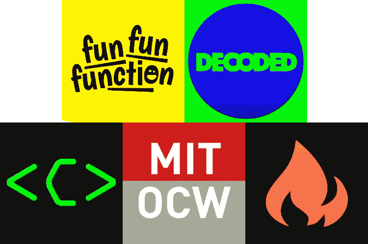

# 程序员必备的 5 个 YouTube 频道

> 原文：<https://javascript.plainenglish.io/5-great-youtube-channels-for-teaching-coding-concepts-ad0aab003d20?source=collection_archive---------10----------------------->

## 超越标准“操作”教程的渠道

## 1.趣味函数

 [## 趣味函数

### 我是马蒂亚斯·皮特·约翰逊，简称 mpj。我做全职程序员大概十年了。其中，我已经…

www.youtube.com](https://www.youtube.com/channel/UCO1cgjhGzsSYb1rsB4bFe4Q) 

[**好玩好玩功能**](https://www.youtube.com/channel/UCO1cgjhGzsSYb1rsB4bFe4Q) **:** 现已停业。它的创造者 MPJ 利用他卓越的 Quora 问答能力，将其转化为一个 YouTube 频道，目前拥有约 25 万订户。不要让它的倒闭阻止你检查这个频道，因为那里有大约 5 年的内容供你浏览。

当他解释一个概念时，他解释得很深刻。例如，MPJ 有一个关于测试概念的视频系列，大约 100 分钟长，分布在 7 个视频中。他不仅仅向人们展示如何编写测试(这是大多数教程没有解释这些概念的地方)，而是解释了为什么我们应该编写测试，我们可以使用什么方法，每种方法的优缺点，以及编写最基本的测试，然后一步一步地增加复杂性。

## 2.译解

 [## 译解

### 嗨，我叫 Sunil(朋友们都叫我 Sunny)。我是一名软件工程师，也是 Plain English 的创始人。我喜欢…

www.youtube.com](https://www.youtube.com/channel/UCtipWUghju290NWcn8jhyAw) 

[**解码**](https://www.youtube.com/channel/UCtipWUghju290NWcn8jhyAw) :列表中最新的频道。Sunny 介绍了一些更模糊的编程概念，比如闭包、工厂函数、调用/绑定/应用等等。但是，他并不只是谈论它们是什么以及它们是如何工作的，而是将它们应用到真实世界的例子中，以便您能够真正理解它们的用例。

你会经常发现，虽然 Sunny 涵盖的主题不同，但它们都是建立在以前视频中讨论的一些概念之上的，所以你可以在一个视频中获得知识，并在下一个视频中应用这些知识。

## 3.电脑爱好者

[https://www.youtube.com/user/Computerphile](https://www.youtube.com/user/Computerphile)——*这个链接由于某种原因没有嵌入…*

**:computer phile 避开了前两个以开发者为中心的频道，引入了更多的计算机科学话题，并将其分解为小型讲座。这是我喜欢看的那种频道，当我不一定想了解特定的编码知识时(例如，如何在 React 中使用 x)，而是当我想了解更多关于编程和计算机科学领域的主题时(例如，加密是如何工作的)。**

**这个频道有很多有趣的东西，如果你是通过自学/训练营的方式进入编程的话，你肯定不会遇到。所以，帮你自己一个忙，从频道中随机挑选一个视频，每周看一两次，以扩大你的思维范围。**

## **4.麻省理工学院开放式课程**

** [## 麻省理工学院开放式课程

### 无论你是学生，老师，或者仅仅是一个想学习的好奇的人，麻省理工学院开放式课程(OCW)提供了一个…

www.youtube.com](https://www.youtube.com/channel/UCEBb1b_L6zDS3xTUrIALZOw) 

[**麻省理工学院开放课件**](https://www.youtube.com/channel/UCEBb1b_L6zDS3xTUrIALZOw) :我决定增加这个频道，因为虽然它主要是麻省理工学院的讲座，但他们允许免费提供如此高质量的内容这一事实非常棒，仅这一点就值得一提。这是一个很棒的渠道，对于那些没有通过计算机科学途径进入这个行业的自学/训练营的开发者来说。

这里的内容很沉重(如你所料)，视频也很长(通常每段约 45-60 分钟)。但不要因此而分心。相反，访问该频道并选择一个您喜欢的播放列表。然后留出一些时间，每周看一次讲座。从长远来看，这是值得的，你会因此觉得自己是一个更全面的开发者。** 

## **5.火船**

** [## 火船

### 高强度的⚡代码教程，帮助您更快地构建和发布您的应用程序。每周订阅新视频，内容涵盖…

www.youtube.com](https://www.youtube.com/channel/UCsBjURrPoezykLs9EqgamOA) 

[**火船**](https://www.youtube.com/channel/UCsBjURrPoezykLs9EqgamOA) :该频道以学习为理念，在不偷工减料的情况下，管理转速高达 11 转。这个频道上的视频最初集中于 Firebase/Firestore，现在已经扩展到涵盖一系列网络技术。

杰夫在视频编辑和制作方面也有明显的天赋，这使得观看他的视频与大多数其他技术 YouTubers 不同，在这种情况下，你不会在摄像机前看到他，但视频充满了动画和有趣的东西。我真的没有用这些话给 Fireship 留下最好的印象，所以，相反，只要去看看这个频道——因为它很棒！** 

## **我们做到了！🎉**

**你应该看的五个 YouTube 频道。一定要点击订阅按钮，今天就开始提升你的知识水平！还有其他你认为应该包含的渠道吗？如果是这样，请留下您的评论，也许我们将来会写一篇后续文章。**

**免责声明:这个列表中的一个频道是我的——尽管它仍然是一个很棒的频道！**

****