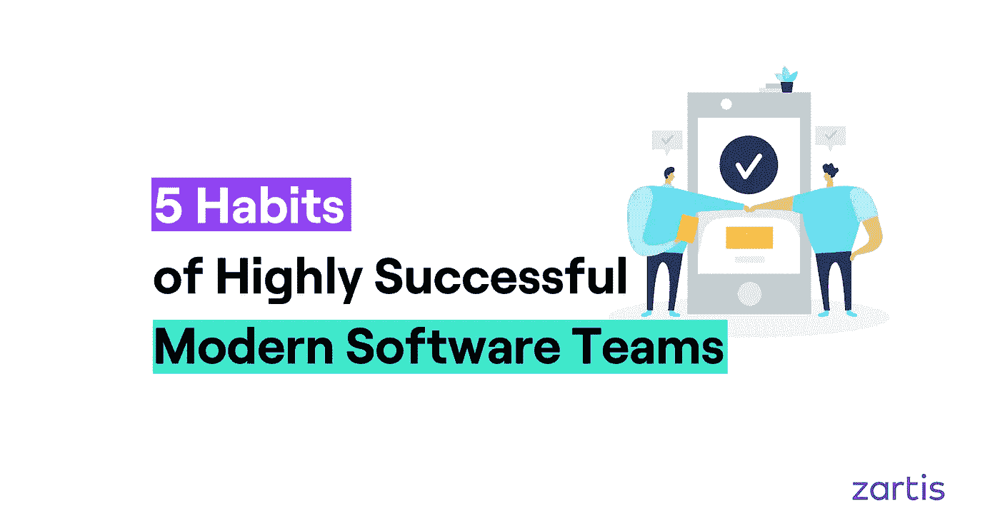

# 高度成功的现代软件团队的 5 个习惯

> 原文：<https://javascript.plainenglish.io/5-habits-of-highly-successful-modern-software-teams-b895fec9562f?source=collection_archive---------12----------------------->

随着软件行业的创新速度变得首屈一指，公司需要更努力、更快地工作，以跟上快速变化的需求。我们谈论的不仅仅是跟上技术的进步，而是需要面对开发现代软件的新方法所带来的组织挑战。

一个现代的软件开发过程意味着远离传统的整体式和本地的遗留系统。除了特定的技术，现代软件开发也意味着团队以现代的方式工作，并为公司带来创新。所以，你可能会问；什么是现代软件公司？

以下是非常成功的现代软件开发团队的 5 个习惯:

# 1.创新是他们文化的一部分

现代软件团队是好奇的，他们总是在寻找更好、更快、更便宜的开发软件的方法。简而言之，他们创新。研究和尝试替代方法对于现代软件团队来说是一个受欢迎的挑战。这通常来自于建立一种允许公开讨论和鼓励新想法的公司文化。

如果你的团队坚持使用遗留软件，因为进行巨大的数字化转型似乎令人生畏，那么是时候推动一些改变了。

## 我如何让我的软件团队成功？

好消息是，当把创新内化为你的文化的一部分时，这很容易。引入允许开发人员试验和探索的新策略，您可以帮助您的团队适应。确定你的软件团队中的领导者和最资深的开发人员，你们可以一起制定一个可靠的计划，从内部实现创新。

每个公司的需求都是不同的，但要想成功，你需要在你的 KPI 中加入创新，想出实现创新的方法，并授权。如果你坚持使用这些新的程序，并为你的软件团队提供正确的编程工具，变化就会随之而来。

# 2.现代工程团队是敏捷的

[敏捷宣言中的 12 条原则之一](http://agilemanifesto.org/principles.html)声明:“欢迎变化的需求，即使是在开发过程的后期。敏捷流程利用变化为客户带来竞争优势。”

根据来自[项目管理研究所](https://www.pmi.org/-/media/pmi/documents/public/pdf/learning/thought-leadership/pulse/pulse-of-the-profession-2015.pdf)的研究，敏捷团队在 65%的时间里按时完成了开发项目，而非敏捷工程团队只有 40%。他们达到了 KPI 的 75%,而非敏捷团队仅达到了 56%,这导致收入增长快了 37%!

利用敏捷开发实践，团队通常会在 2-3 周的冲刺中解决一个项目，并可以快速迭代和测试新的想法，而使用瀑布方法，你可能要花几个月到一年的时间才能让用户看到你的产品。这阻碍了持续改进和软件质量的机会，因为所有当前和未来的计划都依赖于最初的假设。如果您需要适应新的客户期望，实施变革可能会很困难且成本高昂。

## 我如何让我的软件团队成功？

如果你还没有，考虑遵循一个软件项目管理的敏捷方法。以下是一些最广泛使用的敏捷软件开发方法:

*   混乱
*   看板法
*   精益软件开发
*   [还有更](https://www.blueprintsys.com/agile-development-101/agile-methodologies)

大多数敏捷方法都有重叠的特征，但是从实现的角度来看，它们都使用独特的实践和策略组合。找出最适合您的团队、您的业务和技术需求的方法。

我们承担了许多现代化项目。我们知道这是可行的，如果你选择正确的敏捷方法并把它变成你自己的。说明你的产品路线图和开发过程。只有这样，最佳方法才会更加清晰。

# 3.现代软件团队预见未来

成功的现代软件团队不仅会开发出今天能完美工作的高质量软件，而且他们对未来有远见。如果你将创新内化，你将期待变化的到来，并设计出能适应变化的软件产品。

从可伸缩性和可移植性到易维护性和持续集成，有许多因素今天不会影响您的软件，但将来可能会给您带来麻烦。

## 我如何让我的软件团队成功？

我们通常在最初的设计阶段就做出这些可能会影响软件未来性能的决定。让考虑这些让你的软件保持现代的[因素成为你过程的一部分](https://diginomica.com/12-attributes-modern-software-success)。

如果你的团队成员正在使用微服务、分散系统、容器、敏捷方法等。，那么引入变化应该相当容易。

如果您已经过了初始阶段，那么您的软件团队需要分析在现有架构中哪里可以提高性能。目标是尽可能地消除相互依赖。确保新项目有一个更加分散和分离的架构将会打破这个循环。

# 4.现代软件团队聪明地工作，他们工作得更少

从持续集成和持续部署(CI/CD)到持续交付和[自动化测试](https://www.zartis.com/choosing-a-test-automation-framework-10-questions-to-help-you-on-your-way/)，一个成功的软件团队知道如何实现 DevOps 实践。这意味着更高的效率和连续的软件开发过程，不会给错误留下任何空间。

[高效利用 DevOps 的团队](https://devops.com/optimizing-effective-cicd-pipeline/)体验到上市时间减少了 18%,新软件交付增加了 21%。拥有高效 CI/CD 渠道的软件团队向市场交付更快、更高质量的应用程序，实现 19%的收入增长。

聪明工作的另一个方面是编写简短、干净并且更容易扩展的代码。如今，工程团队利用[清洁编码](https://x-team.com/blog/principles-clean-code/)的各种原则，如 KISS、 [SOLID and DRY](https://www.codeproject.com/Articles/36712/SOLID-and-DRY) ，使他们能够拥有整洁且可伸缩的代码。

## 我如何让我的软件团队成功？

如果您的软件团队落后于自动化工作，那么重新分配一些资源或进行更具战略性的雇佣可能是明智的。

好的一面是，软件开发人员热衷于采用持续开发，因为这对他们来说意味着更少的工作。为你的开发人员在团队中承担这样的角色创造机会。你不仅会增加团队的动力，还会提高生产力。

如果你正在招聘新的软件开发人员，你应该知道大多数技术雇主希望开发人员至少有一些自动化方面的经验。通过一些战略性的雇佣，你可以给你的开发团队增加合适的技能。

在过去几年中，我们部署了许多开发运维、构建和发布、质量保证自动化和站点可靠性工程师。我们可以看到，这些角色已经成为现代软件团队的必备条件，因为我们的客户越来越多地要求我们的[扩展开发团队](https://www.zartis.com/extended-development-teams/)具备这些技能。

# 5.现代软件团队不受环境的束缚

除了面对技术挑战时的灵活性之外，一个成功的软件团队还准备好了不同的工作和交流模式。优秀的团队专注于只雇佣最合适的开发人员，而这些开发人员有时可能在世界的另一端。你会让这阻止你获得你想要的天赋吗？

## 我如何让我的软件团队成功？

尤其是今天，随着对软件开发人员的高需求，我们必须比以前更加迎合人才的需求。这意味着能够适应不同的时区、远程工作人员和不同的文化。

如今，现代软件团队拥有[流程和开发工具来实现顺畅的协作和软件开发](https://www.zartis.com/interview-with-a-coder-killer-insights-for-distributed-teams/)。从支持远程通信的会议工具，到供不同时区的开发人员跟踪彼此进度的项目管理工具，您不仅可以帮助您的软件团队开发良好的代码，还可以开发一个协作环境。

# 结论

拥有一个现代化的软件开发团队不是一种状态，而是一个过程。即使是最好的团队也需要关注即将到来的软件趋势和不断变化的市场需求。

优先考虑创新，无论是完全的现代化还是逐渐的转变，你会看到你的软件团队朝着正确的方向前进。你可能不会在一夜之间看到改变，但是改变心态和习惯并不像按动开关那样简单。坚持以创新为目标，将其融入你的文化中，让你的软件团队能够坚持到底，这将成为团队的价值观。

**综上所述，如果你想成就一个成功的现代软件开发团队，你应该:**

*   以身作则，将创新内化
*   从技术堆栈和架构到团队工作方式，将现代化作为一个整体来处理
*   调整你的目标，设计长期可持续的解决方案
*   鼓励你的开发人员采用自动化并变得更有效率
*   用多种工具和流程装饰您的团队，以便随时随地进行操作。

【https://www.zartis.com】最初发表于**。**