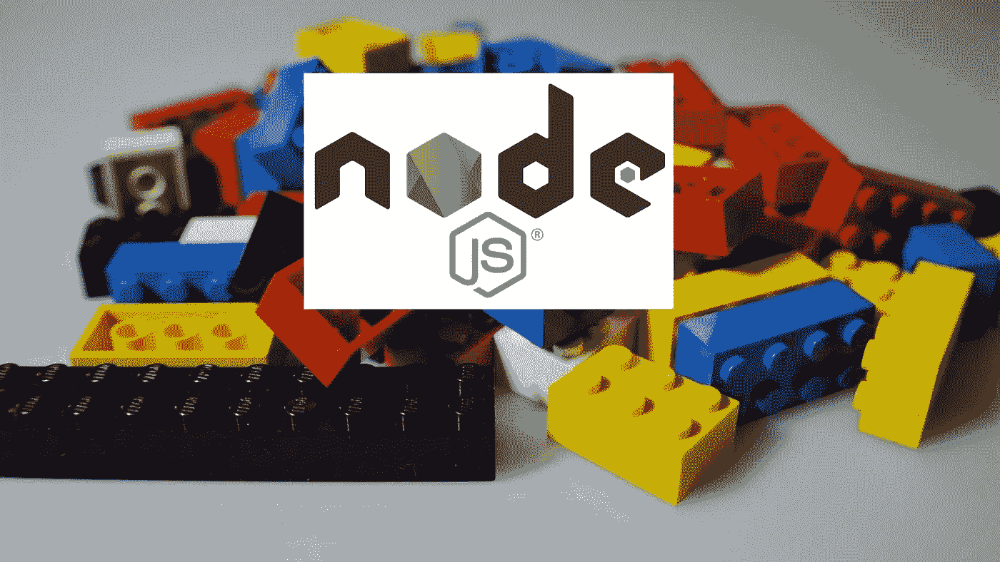

# 为您的微服务选择 Node.js 的 5 个重要原因

> 原文：<https://javascript.plainenglish.io/5-important-reasons-to-choose-node-js-for-your-microservices-5744ec55f4b2?source=collection_archive---------9----------------------->

Nodejs Microservices

构建 Node.js 微服务有很多好的理由，本文讨论了其中的 5 个。Node.js 和微服务是现代软件工程天堂里的一对。我们再进一步分析为什么 Node.js 微服务更有意义。

# 什么是微服务架构？

马丁·福勒(Martin fowler)是这一领域的一位梦想家，他将[微服务](https://martinfowler.com/articles/microservices.html)描述为:“*微服务架构风格是一种将单个应用程序开发为一套小服务的方法，每个小服务都在自己的进程中运行，并通过轻量级机制(通常是 HTTP 资源 API)进行通信。”*

他进一步补充说，这些服务是围绕业务能力构建的，可由全自动部署机器独立部署。这些服务可以用不同的编程语言编写，并使用不同的数据存储技术，只有最低限度的集中管理。

*“从他的定义来看，很明显，微服务需要小规模，只迎合业务的一部分。”*

从技术上讲，它应该是独立的，以自动化的方式进行部署。Node.js 非常适合小型高性能应用程序的需求。是时候研究一下什么是节点以及它能为创建更好的微服务做些什么了。

# 什么是 Node.js

Mozilla developer portal 将 [Node.js](https://developer.mozilla.org/en-US/docs/Learn/Server-side/Express_nodejs/Introduction) 描述为:*“Node(或者更正式的说法是 Node.js)是一个开源的、跨平台的运行时环境，允许开发者用 JavaScript 创建各种服务器端工具和应用。运行时旨在浏览器上下文之外使用(即直接在计算机或服务器操作系统上运行)。因此，该环境省略了特定于浏览器的 JavaScript APIs，并增加了对更传统的操作系统 API 的支持，包括 HTTP 和文件系统库。”*

从上面的描述中，很明显 Node.js 是 JavaScript，但是运行在与浏览器不同的运行时中。这个运行时就是 [V8 发动机](https://v8.dev/)。它是用 C++编写的，也在 Chrome 中使用。

这是阿特伍德定律的一个可靠标志，该定律声明:*“任何可以用 JavaScript 编写的应用程序，最终都会用 JavaScript 编写。”*

因此 Node.js 使我们能够以一种[非阻塞](https://Node.js.org/en/docs/guides/blocking-vs-non-blocking/)的方式在单线程中编写服务器端应用程序。你可以在这篇[文章](https://medium.com/better-programming/is-node-js-really-single-threaded-7ea59bcc8d64)中读到更多关于 Node.js 是否是单线程的信息。接下来，研究 Node.js 的优缺点，以及它对 Node.js 微服务的帮助。

# Node.js 的利弊

正如比雅尼·斯特劳斯特鲁普(以发明 C++而闻名)[所说](https://www.goodreads.com/quotes/226225-there-are-only-two-kinds-of-languages-the-ones-people):*世界上只有两种语言:人们抱怨的语言和没人用的语言*

毫无疑问，Node.js 也是一个很多人使用和抱怨的语言运行时。有趣的是，你可以在 [Node.js](https://Node.js.org/api/addons.html) 中使用 C++插件。下面的视频以明确的方式总结了 Node.js 的历史以及优缺点:

Node.Js Pros and cons

归结起来就是 Node.js 是快速的、轻量级的、高性能的、可扩展的。它也有很多关于 npm 的包。另一方面，由于阻塞了事件循环，这对 CPU 密集型程序来说并不好。这个视频暗示了“不成熟的工具”,但是对于大多数语言来说都是如此。

# 为什么选择 Node.js 微服务？

Node.js 非常适合微服务。

来自 Node.js 关于[页面](https://Node.js.org/en/about/)::*HTTP 是 Node.js 中的一等公民，设计时考虑了流和低延迟。这使得 Node.js 非常适合作为 web 库或框架的基础。这对于解耦的应用程序来说是非常好的，因为你可以使用许多 npm 模块来缝合一个很好的微服务。Node.js 速度很快，其基于事件的特性使其成为实时应用的绝佳选择。”*

从实际经验来看，我们曾经重写了一个从 PHP 到 Node.js 的服务，它比以前快了 70%。它也消耗了更少的资源。再比如 [GoDaddy](https://blog.risingstack.com/node-js-examples-how-enterprises-use-node-in-2016/#godaddyditchednettoworkwithNode.js) 从。net 到 Node.js，他们很喜欢。网飞将其应用程序[加载时间缩短了 70%](https://thinkmobiles.com/blog/node-js-app-examples/) 。让我们分析更多选择 Node.js 作为下一个微服务的理由:

# 支持全栈 web 开发

Node.js 支持真正的全栈 web 开发。毫无疑问，前端需要使用 JavaScript。当然，前端的框架或库的选择可以是一个很好的讨论。使用 Node.js，同样的 JavaScript 也可以在服务器上运行。如果一个团队中有 5 名开发人员，并且他们都编写 JavaScript 代码。全筹码对他们来说很有帮助。

是的，开发者应该学习 [*后端 vs 前端*](https://geshan.com.np/blog/2020/02/difference-between-backend-frontend/) *概念，但是他们不需要学习一门全新的编程语言。*

Node.js 还有许多其他特性和优点。与前端不同，软件工程师在为一个 [REST API](https://geshan.com.np/blog/2020/11/nodejs-mysql-tutorial/) 编写 Node.js 代码时，不需要担心跨浏览器兼容性和浏览器版本。Node.js 也不需要 [Babel](https://babeljs.io/) 这样的 transpilers 的重量。

正如[在 Paypal 报道的](http://highscalability.com/blog/2013/12/11/using-nodejs-paypal-doubles-rps-lowers-latency-with-fewer-de.html)—*“在前端和后端都使用 JavaScript 消除了浏览器和服务器之间的人为界限，允许工程师编写两者的代码。”因此 Node.js 的采用确实打开了全栈 web 开发的新大门。*

# Node.js 微服务内置 web 服务器

Node.js 内置了 [web 服务器](https://Node.js.org/api/http.html#http_http_createserver_options_requestlistener)。您不必与另一个 Nginx 或 Apache 争论。你也可以愉快地告别像 FPM 这样的东西，因为 Node.js 本质上是单线程的。你可能想用 PM2 来管理这个过程。

很可能你甚至不需要处理 Node.js 的 HTTP 库，因为它会被你使用的框架抽象出来。

如果你使用 [express js](https://expressjs.com/) ，让网络服务器[启动并运行](https://expressjs.com/en/starter/hello-world.html)是非常容易的。

Node.js 还可以非常轻松地处理多个请求和响应。这也使得编写 Node.js 应用程序变得轻而易举。您只有一个包含代码和 web 服务器的容器。你可以看看这个[Docker 文件](https://github.com/geshan/currency-api/blob/master/Dockerfile)作为例子，它也利用了 [Docker 多阶段构建](https://geshan.com.np/blog/2019/11/how-to-use-docker-multi-stage-build/)。不过，根据具体情况，您可能希望将 Nginx 放在 Node.js 的前面。

# Node.js 微服务提升开发者幸福感

开发人员的幸福感是一个受[多重因素](https://stackoverflow.blog/2020/02/27/the-eight-factors-of-happiness-for-developers/)影响的主观问题。2018 年的 Node.js [用户调查报告](https://Node.js.org/en/user-survey-report/)指出:*“node . js 正在继续对用户产生积极影响，尤其是在开发者生产力和满意度方面；当被要求描述 Node.js 时，受访者大多使用积极的词语，如“快速”、“简单”、“棒极了”、“强大”、“灵活”，甚至“有趣”。*

此外，2019 年的一份[报告](https://jaxenter.com/dev-report-javascript-164201.html)称，全球有 1140 万 JavaScript 开发者。它让 JavaScript 成为世界上拥有最多开发者的语言。

栈溢出开发者调查[指出](https://insights.stackoverflow.com/survey/2020#technology-programming-scripting-and-markup-languages) : *“毫不奇怪，JavaScript 连续第八年保持其作为最常用编程语言的地位。”*

在同一项调查中，它将 TypeScript(JavaScript 的超集)列为第二大最受欢迎的语言。JavaScript 在最受欢迎的语言列表中排名第十。JavaScript 很好使用。像任何其他语言一样，它有自己的怪癖，需要去适应它。一旦你熟悉了 JavaScript 和 Node.js，这是一门非常好的语言。这对开发者来说是件好事。

*在*[*【NPM】*](https://npmjs.com/)*(JavaScript 的包管理器)中有大量可供您使用的库，您可以找到许多您需要的已经构建好并随时可用的东西。*

除了这个开发人员的快乐方面，找到一个 JavaScript 或 Node.js 软件工程师并不困难。

这充分说明了 Node.js 生态系统中开发人员的快乐。你尝试 Node.js 做微服务也是很关键的一个方面。

我想分享的一个个人经验是，即使升级 Node.js 的主要版本也是如此容易。

最近我把一个微服务从 Node.js 8 升级到 Node.js 版本 14。升级非常顺利，减少了反应时间。我希望我也能对 PHP 这么说。部署 Node.js 也很容易，如果您的应用程序被 dockerized 化，它会变得更加容易。在这个循序渐进的教程中，您可以了解如何对 Node.js 应用程序进行 dockerizing。这无疑将开发人员在 Node.js 中工作的快乐提升到了新的水平。

# Node Js 速度快，可伸缩

Node.js 很快，因为有非阻塞 IO 和[事件循环](https://Node.js.org/en/docs/guides/event-loop-timers-and-nexttick/)。有了 Node.js，你可以很容易地把东西放到后台，这是 PHP 等语言所没有的。例如，PHP 按顺序执行代码。

*在 Node.js 中，您可以获得一个请求，响应任务已被调度，并将任务放在后台执行。*

基于事件的 Node.js 非常适合微服务。有了流和实时功能，选择 Node.js 作为下一个微服务应该是显而易见的。

快速是另一个主观术语。Node.js 速度很快，但与 what 相比。另一方面，可伸缩性更加客观。它可以用每秒的响应时间和请求数来衡量。就流量而言，沃尔玛是全球第 125 家网站,它当然知道高流量和可扩展性。在迁移到 Node.js 之后，据报道他们[在一个黑色星期五没有停机的情况下幸存了每分钟 600 万的页面浏览量。这就引出了下一点，企业就绪。](https://blog.risingstack.com/how-enterprises-benefit-from-microservices-architectures/#walmartsuccessfullyrevitalizeditsfailingarchitecturewithmicroservices)

# 经过实战检验并在企业范围内使用

Node.js 大放异彩的例子很多。可能其中很多也包括 Node.js 微服务。快速浏览一下使用 Express 的[公司，你会发现像 IBM 和埃森哲这样的大公司。Myntra 也在名单上，考虑到流量，它目前是世界上排名第 659 位的网站。](https://expressjs.com/en/resources/companies-using-express.html)

*LinkedIn 在 2012 年尝试 Node.js，* [*上报*](http://highscalability.com/blog/2012/10/4/linkedin-moved-from-rails-to-node-27-servers-cut-and-up-to-2.html) *27 台服务器削减，某些场景下响应快 20 倍。*

同样在 [Paypal](http://highscalability.com/blog/2013/12/11/using-nodejs-paypal-doubles-rps-lowers-latency-with-fewer-de.html) 中，使用 Node.js 的同一页面的平均响应时间减少了 35%。网飞测量到使用 Node.js 的启动时间减少了[70%](https://netflixtechblog.com/making-netflix-com-faster-f95d15f2e972)。同样，[易贝](https://tech.ebayinc.com/engineering/how-we-built-ebays-first-node-js-application/)由于可伸缩性和资源使用，将 Node.js 黑客马拉松项目转化为生产应用。

不胜枚举， [Spotify](https://blog.risingstack.com/how-enterprises-benefit-from-microservices-architectures/#spotifybuildsflawlessuserexperiencewithmicroservices) 使用 Node.js 微服务绝对证明了拥有 7500 万活跃用户的规模。

此外，它还证明了它可以在一个拥有 90 个团队、600 名开发人员和位于两个大洲的 5 个开发办公室的大型组织中工作。

你可以在这篇[帖子](https://trio.dev/blog/companies-use-node-js)中阅读更多成功案例。Node.js 微服务将继续存在，它们已经被证明是经过战斗考验的，并且在企业范围内令人惊讶地工作。

# 结论

JavaScript 可能是世界上最容易被误解的语言，但是随着最佳实践 T21 的出现，Node.js 将长期存在。它统治着企业，也让初创企业的开发者感到高兴。

不要犹豫，为你的下一个微服务选择 Node.js，你可能会有一个甜蜜的惊喜。

*原载于 2020 年 11 月 11 日*[*https://geshan.com.np*](https://geshan.com.np/blog/2020/11/nodejs-microservices/)*。*