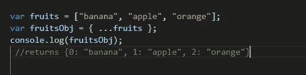
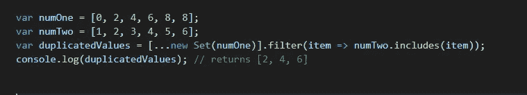
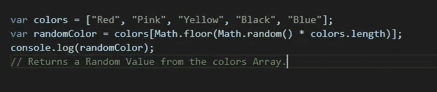

# 你应该知道的 5 个 JavaScript 数组技巧

> 原文：<https://javascript.plainenglish.io/5-javascript-array-tricks-you-should-know-e2a50f21d0a2?source=collection_archive---------14----------------------->

## JavaScript 数组技巧和提示

5 JavaScript Array Tricks.

数组是 JavaScript 中重要的数据结构之一，常用于存储数据。JavaScript 中的数组有很多操作存储数据的方法或函数。这是您在编程之初所学的基本知识之一。在本文中，我将向您展示一些在使用数组时应该考虑的技巧和提示。所以让我们开始吧。

# 1.将数组转换为对象:

有时，你会有一个数组，但是由于某种原因你需要在你的程序中把它转换成一个对象，最好的方法是使用**扩展操作符**，这比听起来要简单。

Convert Array to an Object.

# 2.从数组中删除重复项:

一个流行的 JavaScript 问题是如何从数组中删除重复项。有时你需要从数组中删除重复的数据，下面的例子用 **Set** 方法使它变得非常容易。

Remove duplicates from an Array.

# 3.用数据填充数组:

有些情况下，你必须创建一个数组，然后你需要填充它。所以在这种情况下，我们使用**填充**的方法。看看下面的例子:

Fulfill an Array with data.

# 4.求两个数组的交集:

这个挑战也是你在编码面试时会面临的一个常见问题，因为，它证明了你知道如何使用数组方法。

Arrays intersection.

# 5.从数组中获取随机值:

在某些情况下，程序的业务逻辑需要从数组中获取一些随机数据。 **Math.random()** 方法对此有所帮助。看看下面的例子:

Get random values from an Array.

*注意，****math . random()****方法返回 0 到 1 之间的随机数，另一方面，****math . floor()****方法返回小于或等于给定数字的最大整数。*

# 结论:

如你所见，这些只是 JavaScript 中数组的 5 个简单技巧，但是你必须确保你对它们了如指掌。因为你会在你的编码面试问题中遇到它们，当你想解决代码中的一些复杂问题时，它们也会帮助你，有很多类似的数组技巧你需要学习。

**快乐编码！**

喜欢这篇文章吗？如果有，通过 [**订阅获取更多类似内容解码，我们的 YouTube 频道**](https://www.youtube.com/channel/UCtipWUghju290NWcn8jhyAw) **！**