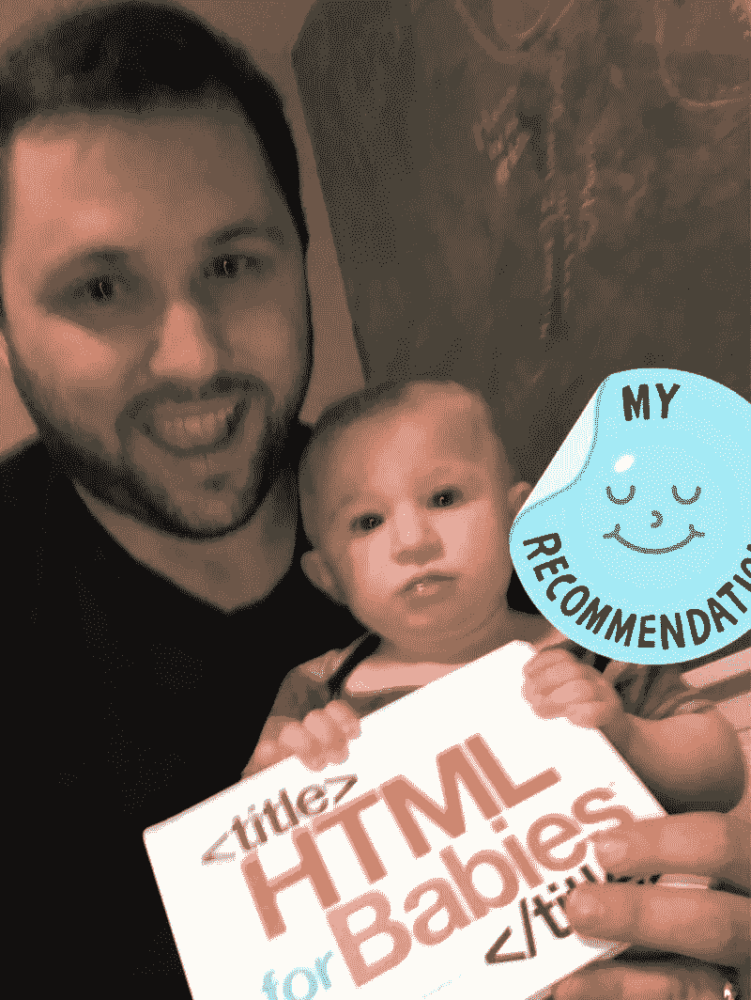

# 你应该读的 5 本 JavaScript 书:一个编码老师的观点

> 原文：<https://javascript.plainenglish.io/5-javascript-books-you-should-read-a-coding-teachers-perspective-ecb15dfec832?source=collection_archive---------1----------------------->

## 2020 年的 JavaScript 书籍

在本文中，我们将总结 2020 年你应该考虑阅读的 5 本 JS 书籍，不管你在开发人员职业生涯中处于什么阶段。

Photo by [Rick Kimotho](https://unsplash.com/@kimothorick?utm_source=medium&utm_medium=referral) on [Unsplash](https://unsplash.com?utm_source=medium&utm_medium=referral)

一般来说，我不会推荐编码书籍或编码教科书，因为它们出版的时候已经过时了，或者在几年内就会过时。也就是说，当我教编码时，我花了很多时间阅读/观看各种渠道的内容，以确保我的学生拥有相关的内容、实践练习和入门级工作的知识。

# 选拔过程

作为一名教师，我在课程开发的过程中读了很多书。通常，我每周快速阅读 2-4 本书，通常是 10-20 篇在线文章，然后在新单元开始前一两周，通过制作幻灯片、创建自定义编码练习和活动，以及为学习方式不同的学生(IEP 或更高级的学生)补充 youtube 视频和额外阅读材料，将所有内容整合在一起。

当我快速阅读时，我会看看内容是否符合以下标准:

1.  解释——术语/概念解释清楚了吗？他们有图表或视觉效果吗？
2.  练习——这本书有一步一步的代码练习吗？
    他们有更多你在工作中看到的开放式项目吗？
3.  评估——这本书有知识评估吗，比如小测验、面试问题、术语/概念词汇表？
4.  高级主题——它是否涵盖了高级主题，如设计模式、数据结构和算法、不变性、函数式编程等？
5.  流行技术——它是否提供了流行库或框架的深入知识？

尽管有很多关于 web 开发和为大学课程编写的冗长的教科书，但在我看来，当谈到 JavaScript 开发或全栈 JavaScript 时，大多数书籍都没有完全涵盖所有这些类别。因此，在本文中，我们将使用 1-5 的星级来快速传达他们在每个类别中的表现。

示例:

📖页数
讲解⭐⭐⭐⭐⭐练习⭐⭐⭐⭐考核⭐⭐⭐⭐⭐
高级话题⭐⭐⭐⭐⭐热门技术⭐⭐⭐⭐⭐

我推荐的前三本书是关于 JavaScript 基础的。之后，我会推荐一本关于 NodeJS 的书和一本关于 React 的书。我当然可以推荐更多的书，但我想保持在 5 本以内。

# 数字 VS 平装？

这些书里有值得买平装本的吗？最终，这完全是你的决定。我没有从任何作者那里得到推广他们的书的报酬，我确保优先考虑免费书籍和预算友好的选择，因为作为一名媒介作家，我的优先事项是教育。我在 medium 或亚马逊上赚的一点点钱都存进了我儿子的储蓄账户。

例如，前两本书可以在网上免费获得，我会提供它们的链接以及在亚马逊上购买它们的链接。就我个人而言，我拥有一些平装本的书，但我的大多数书都是通过 packpub 数字化的，因为我可以花一本书的钱读完几乎所有的书。

关于 Packtpub，我想强调的一点是，从他们那里购买实体书时要格外小心。就我个人而言，在 T2 考虑购买实体书之前，我会订阅 packtpub 并在线阅读书籍。有印刷错误和其他问题的倾向，因为他们出书太快了。所以出版速度和相关性是一把双刃剑。就我个人而言，我发现了一些错误，我总是报告它们，它们往往会在几周内得到修复。如果这不符合你的标准，那完全可以理解。

## [**雄辩的 JavaScript，第三版:编程的现代介绍**](https://amzn.to/2ThNpv0) 作者 [Marijn Haverbeke](https://medium.com/u/daf5b5309aac?source=post_page-----ecb15dfec832--------------------------------)

📖472
解说⭐⭐⭐实践⭐⭐⭐进阶话题⭐⭐⭐
热门技术⭐⭐⭐测评⭐

我向大家推荐的第一本书是[免费在线提供的](https://eloquentjavascript.net/)。

在我个人看来，这本书确实是结构最好的书之一。

本书可分为三个部分:
1。语言
2。浏览器
3。结节

这种结构最好的部分是，它清楚地定义了两个主要的运行时环境，初始部分使用可以在任一环境中运行的代码。

此外，它还介绍了所有的基本概念，包括许多高级概念以及一些体面且颇具挑战性的项目。然而，它确实缺乏对简单数据类型(如数组)的评估和说明，存在的少数数据类型对主题没有任何价值。除了子流程、流程/操作系统、诊断和单元测试之外，这本书还介绍了大多数节点核心概念。但老实说，这些都不是不买的借口。

> 这是一个绝对必备的版本，只会越来越好，而且像 Mozilla 这样的大公司支持第二版也就不足为奇了。

## [**你不知道 Js:这个&物体原型**](https://amzn.to/2TkV0co) **by** [**凯尔辛普森**](https://www.amazon.com/Kyle-Simpson/e/B006MAHIQ6/ref=dp_byline_cont_book_1) **。**

📖144 解说⭐⭐⭐⭐⭐实践⭐⭐⭐考核⭐
高级话题⭐⭐⭐⭐⭐热门技术⭐

*这本*书，可能是解释整个 JavaScript 语言中最难的主题之一的最好的书。

这是我拥有的为数不多的精装编码书籍之一，因为它太好了。这本书的伟大之处不仅仅在于它的内容和对核心概念的解释，还在于它短小精悍，不到 155 页。[系列的每本书都在 GitHub](https://github.com/getify/You-Dont-Know-JS) 上，每本都很好，很短但很深入。

也就是说，这本书和这个系列的一些缺点是它们缺乏评估。这不是一个大问题，坦率地说，对大多数读者来说，这并不重要，但是作为一名编码老师，这给我的学生带来了更多的工作，提供了更少的价值，因为衡量一本书对学生理解的有效性更依赖于老师的评估，而不是作者。

## [**学习 JavaScript 数据结构和算法**](https://amzn.to/2Tnz40d) **—第二版**作者 [Loiane Groner](https://www.amazon.com/Loiane-Groner/e/B07C6L6GPM/ref=dp_byline_cont_book_1)

📖314 解说⭐⭐⭐实践⭐⭐⭐进阶话题⭐⭐⭐
测评⭐热门技术⭐

谈到学习 JavaScript，有太多的资源涉及初级和中级概念，比如提升、闭包等等。

然而，当谈到数据结构和算法时，大多数大公司都在寻找的东西，JS 中缺乏内容。

Groner 的书是关于 JavaScript 数据结构和算法的最简明的书籍之一。

因此，如果你打算在一家需要深入了解数据结构和算法的大公司工作，这本书仍然是绝对必要的。

有一个更新的第三版，增加了一个关于 typescript 的小章节，并修改了许多代码练习，但是该书的内容没有更新，以解释如何使用 TypeScript 概念。此外，我强烈建议你亲自查看一下亚马逊的评论。

# Node.js 书籍

[**Node.js 完整参考指南**](https://amzn.to/39lJ6UX)
作者[瓦伦丁·博季诺夫](https://www.linkedin.com/in/valentin-bojinov-9796676/?originalSubdomain=bg)，[大卫·赫伦](https://github.com/robogeek)，[迪奥戈·雷森德](https://github.com/dresende)，2018 年 12 月

📖732 解说⭐⭐⭐⭐实践⭐⭐⭐⭐⭐测评⭐
高级话题⭐⭐⭐⭐⭐热门技术⭐⭐⭐⭐⭐

当这本书说“完整的参考指南”，这并不夸张，有三个作者在后面只会有所帮助。尽管它已经问世两年了，但它仍然很有意义，因为它包含了如此多的行业相关内容，以至于很难在其他任何地方找到所有这些内容。

这本书对新开发人员相当友好，因为它提供了关于 node.js 的快速而深入的讨论，但也花了一章(轻松的)讨论一些基本的前端概念，如 mobile-first、flexbox 和 bootstrap。然而，这本书的真正内容是它如何设法包含这么多通常被回避的主题，这些主题对全栈开发人员尤其是 node.js 变得越来越重要。

以下是它所涵盖的一些概念，这些概念是大多数其他关于 node 的书籍完全回避的:

1.  Node Modules & CommonJS VS ESM
    这是为数不多的几本介绍 require() vs import 标准的书之一，它教你如何在 Node 中实现导入，这是一个最近才[取消了实验标志](https://github.com/nodejs/node/pull/29866)的标准。
2.  测试驱动开发
    这本书很好地涵盖了使用 mocha、chai、docker 和 puppeteer 进行用户测试的测试驱动开发。
3.  十二因素应用模型和微服务
    尽管这是全栈 JavaScript 真正大放异彩的一个领域，但很多书都避而不谈。
4.  我无法强调今天有多重要。它解决了“它能在我的机器上工作，为什么不能在服务器上工作？”比像流浪汉那样的老学校更容易建立。
5.  ES2015+与符号& Async / Await
    这本书以一种绝大多数 JavaScript 都非常缺乏的方式回顾了 ES2015 和更高版本，并帮助读者在未来几年建立一个坚实的基础。

# 反应书籍

## [**学习 React Hooks**](https://amzn.to/2TkUHOI) 作者 Daniel Bugl，2019 年 10 月 18 日

📖426
解说⭐⭐⭐⭐⭐练习⭐⭐⭐⭐⭐考核⭐⭐⭐
高级话题⭐⭐⭐⭐⭐热门技术⭐⭐⭐⭐⭐

我怎么推荐这本书都不为过。我被前两章吸引住了。撇开编码双关语不谈，这真的是一本了不起的书。它不仅涵盖了 react 钩子，还通过分解 useState 实际做的事情，涵盖了 react 钩子的底层工作。

例如，react 属于流行类别，但不仅需要理解 react，还需要深入了解 JavaScript，特别是在函数式声明性编程范例方面，甚至是 react 的底层工作方面。令人欣慰和幸运的是，有人写了一本了不起的书，解决了大部分(如果不是全部)这些问题。

# 结论

有很多书我希望能入选。然而，只有 5 个插槽，我根据长度缩小了很多插槽。一些没有入选的书太长了，在一个出版内容在几年内就会过时的世界里，我最不想做的事情就是推荐几本 800 页的书。就我个人而言，我觉得 300-500 页左右最合适，因为这足以解释很多东西，但没有足够的空间让作者变得太枯燥、无聊或只是懒于写作。

**为什么要注册 Packtpub？** 我选择 [Packtpub](https://mention-me.com/m/ol/rf0eu-brett-mcmurdy) 是因为他们经常有最新的和最相关的编码内容，错误也不是没有。这就是为什么，我建议首先阅读在线书籍，并在一两年内出版，但也有一些例外，特别是当涉及到一种不像 JavaScript 那样变化很大的编程语言时。

## 为什么你应该注册成为灵媒会员？

首先，它鼓励像我这样的技术作家写更多的内容。第二，我用写作的被动收入为我新生儿的大学基金存钱。所以每一次阅读和每一分钱都是为了他的未来。也就是说，如果你能负担得起网飞，你可能也能负担得起一个 5 美元的中等账户，所以请考虑注册一个付费账户。

## 我写的其他文章

如果你喜欢读这篇文章，你可能也会喜欢其他几篇。

到目前为止，许多人已经听说过术语 ES6。但是很少有人谈到被抛弃的 ES4 规范不仅变成了 ES6，还导致了 Node.js 的产生，并从根本上重新定义了整个 JavaScript 语言。

 [## JavaScript 简史

### es、Deno 和 TypeScript 的过去、现在和可能的未来

medium.com](https://medium.com/javascript-in-plain-english/a-brief-history-of-javascript-9289a4d344d2) 

如果你正在尝试学习 React，可以看看 React 书籍上的这篇文章。我读了几乎所有关于这个主题的书，并在 2020 年缩小了最相关的范围。

 [## 值得一读的 7 本 React 书:隔离期间学习 React

### 在上一篇文章中，我写了关于 JavaScript 书籍的文章，并回顾了选择过程

medium.com](https://medium.com/@HansOnConsult/7-react-books-worth-reading-learning-react-while-quarantined-4486ceb3e862) 

如果您对完整的 JavaScript 开发和使用 VS 代码感兴趣，我建议您看看这篇文章，如果您认为我错过了一篇，请留下评论，我会尝试一下并更新这篇文章。我甚至会提到你。

 [## 2020 年最佳 Visual Studio 代码扩展:

### MERN 堆栈版

medium.com](https://medium.com/@HansOnConsult/best-visual-studio-code-extensions-in-2020-3b1292937d4) 

迄今为止，这是我最成功的文章之一。很多开发人员都会问这个问题，在我的文章中，我并不想给出答案。相反，我试图引导一场关于现代 web 开发的讨论，同时赞扬那些让我们的生活变得更简单的框架作者，并提出框架和库的替代方案。

 [## 我们应该停止使用框架吗？

### 30 天的代码和写作:第 5 部分

medium.com](https://medium.com/swlh/https-medium-com-hansonconsult-should-we-stop-using-frameworks-a3ddb41a70cc) 

最后一篇文章实际上是我发表的第一篇文章。这是对 SSL/TLS、web 安全的独特观点，并认为我们都应该加入 SSL，但我们可能不需要为此付费。也看看评论，因为这是对另一个媒体作家的礼貌的反动文章，你可以看到这个社区有多棒，因为我们可以同意不同意，而不用互相指责脸书😊。

 [## 让我们加密:保护网络

### 抛开自由市场神话&保护网络

medium.com](https://medium.com/swlh/https-medium-com-swlh-lets-encrypt-securing-the-web-for-all-5b50842ecead) 

# 关于作者

Brett“Hans”McMurdy 是一名自学成才的开发人员，在前端、后端以及两者之间的几个主要领域拥有 6 年多的经验。

他目前是一名全职爸爸，正在寻找一份全职工作，如果你有兴趣雇佣他，可以看看他的 Linkedin。

与此同时，他正在从事一些很酷的开源项目，这应该会让你考虑[赞助他](https://github.com/sponsors/HansUXdev/)。

1.他正在写一本关于 JavaScript 的开源书籍，用 node.js 而不是浏览器来教授这门语言。这也是一个由 GitPod 驱动的远程开发环境，因此您不需要一台昂贵的计算机，只需打开书本，在一个预配置的环境中开始学习。

2.他正在创建一些简单但强大的 [vscode 扩展](https://marketplace.visualstudio.com/publishers/HansUXdev)。

3.当他的追随者达到 50 人时，他想在 Twitch 上推出一个免费的课程 [**。**](https://www.twitch.tv/hansoncoding)