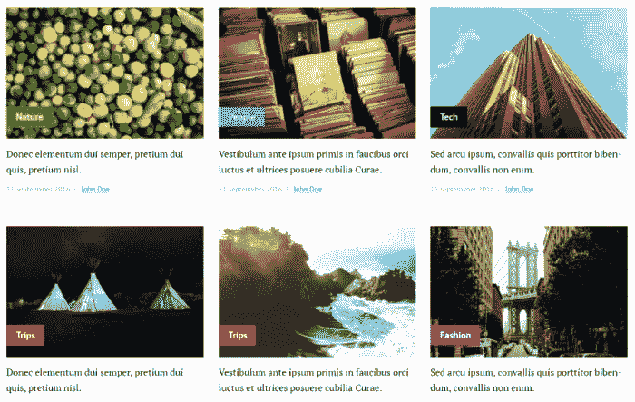

# 作为前端开发人员应该构建的 5 个 JavaScript 项目

> 原文：<https://javascript.plainenglish.io/5-javascript-projects-you-should-build-as-a-front-end-developer-57318b710344?source=collection_archive---------1----------------------->

## 为您的投资组合提供前端 web 开发项目

Photo by [Zan](https://unsplash.com/@zanilic?utm_source=medium&utm_medium=referral) on [Unsplash](https://unsplash.com?utm_source=medium&utm_medium=referral)

# 介绍

作为一名初级前端 web 开发人员，你需要在你的投资组合中有一些很棒的项目。因为无论你看了多少关于编程的书，看了多少视频，听了多少播客，如果你想提高自己的编码技能，成为一个更好的开发者，你就必须不断地练习。熟能生巧。这个规则适用于生活中的一切，不仅仅是编码。

在本文中，我们将为您列出一些令人兴奋的项目，作为前端开发人员，为了提高技能或获得工作，您应该尝试这些项目。让我们开始吧。

# 1.宣传册网站

这可以是任何类型的网站，例如，展示企业的网站、餐馆的登录页面或个人网站。你可以为现有的企业建立这种类型的项目，或者建立自己的企业并为其建立。

这是为了表明你有能力制作一个吸引人的、吸引人的、高转化率的登陆页面。因此，当人们来到它面前时，他们会知道它的用途、位置以及它作为服务提供了什么。还有，尽量让它看起来干净，视觉上赏心悦目。我想说的是通过制作漂亮的用户界面和良好的用户体验来关注前端。

这里有一个例子:

Brochure website.

# 2.一个包含 HTML 和 CSS 的博客模板

如今每个人都需要一个博客。用 HTML 和 CSS 制作一个好看的博客模板是一项必须掌握的技能。因为这有助于你巩固这两项技术的知识。

对于你的第一个更大的项目，建立一个博客模板是一个好主意。不要担心设计，网上有很多可用的资源。

Blog template from [Symo](https://symu.co/freebies/templates-4/blog-psd-template/).

我建议你建立一个主页，一个帖子页，联系页，并尝试使用 CSS 网格和响应式网页设计。

# 3.使用 API 的 Web 应用程序

这种类型的项目专注于构建一个使用 API **的 web 应用程序。**这将是构建任何形式的 web 应用程序，所以只要找到你感兴趣的 API 就行了。它可能是一个电影 API 或者你最喜欢的游戏 API，你的目标只是建立一个网站，显示一些数据或者做一些操作。只要确保它使用一些第三方 API。

这是一个伟大的项目，因为几乎每一个你将要工作的公司，都会在某些情况下使用 API。当然，你可以选择使用框架或者简单地使用普通的 JavaScript。

下面是一个使用 API 的非常简单的电影应用程序的示例:

Movie App.

# 4.电子商务购物车

这个项目的想法是做一个电子商务购物车，用户可以看到不同的产品，通过添加这些产品到购物车购物的能力。

这个购物车可以在网上商店和电子商务网站上使用。所有你需要的是一个前端的商店的基本界面，当然还有一些功能。

Shopping cart.

# 5.个人投资组合

现在您已经创建了几个项目，您需要一个地方来展示它们。所以你要建立一个文件夹，里面有关于你的信息，并展示你参与的所有项目。

这个项目更侧重于前端，因为你将不得不使它尽可能好。因此，当有人访问投资组合时，他会觉得很有吸引力。试着展现你的创造力。如果你爱它，你就能做到。

# 结论

正如我所说的，提高技能的最好方法是实践你所学的东西。如果你的目标是初级前端开发人员，这是展示你获得第一份工作技能的好方法。尽量让你的代码尽可能的干净，因为人们不会只看网页。

感谢您阅读本文，希望您觉得有用。如果有，通过 [**订阅我们的 YouTube 频道**](https://www.youtube.com/channel/UCtipWUghju290NWcn8jhyAw?sub_confirmation=true) **获取更多类似内容！**

# 更多阅读

 [## 你应该知道的 5 个惊人的前端开发工具

### 每个开发人员都应该知道的有用的前端开发工具

medium.com](https://medium.com/javascript-in-plain-english/5-amazing-front-end-development-tools-that-you-should-know-7372dc377d7)