# 你应该准备好的 5 个 JavaScript 技术面试问题

> 原文：<https://javascript.plainenglish.io/5-javascript-technical-interview-questions-that-everyone-has-to-prepare-39c0c062891f?source=collection_archive---------1----------------------->


# 1.JavaScript 与其他语言有何不同

## **1.1) JS 是 JIT 编译的**

虽然其他语言(如 C、Java、C#)是预先编译的，但 JS 是在运行时用实时(JIT)编译器解释和编译的。

*JavaScript 跳过了<编译器> & & <字节码>的步骤。*

*Java 示例编译步骤如下:*

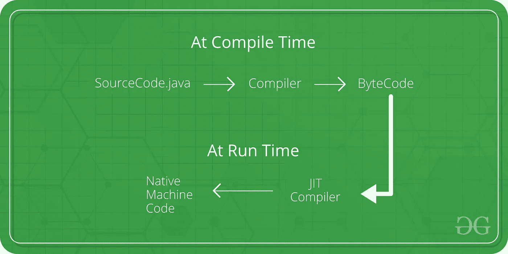

## **1.2) JS 动态类型化**

除非使用 TypeScript，否则 JavaScript 是动态类型的。

在 JS 中，可以动态地改变或重新分配类型。

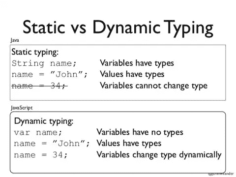

## **1.3) JS 是无类语言**

*ECMAScript 2015，也称为 ES6，引入了 JavaScript 类。

JavaScript 是一种无类语言；可以模拟上课。尽管 JavaScript 没有类，但它有对象，这就定义了语言是面向对象的。例如，可以通过使用**原型**来使用继承，函数本身也是对象，因为它们有自己的属性和方法。

**Cat** 对象函数可以作为带有‘new’关键字的类工作:

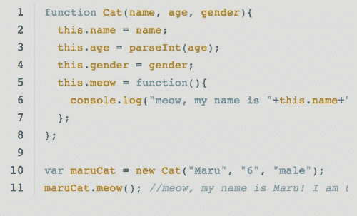

## **1.4)变量范围**

没有公共变量、私有变量或受保护变量这样的东西:这些都是可以模拟的。

*您可以使用作用域模拟公共、私有或受保护的变量。*

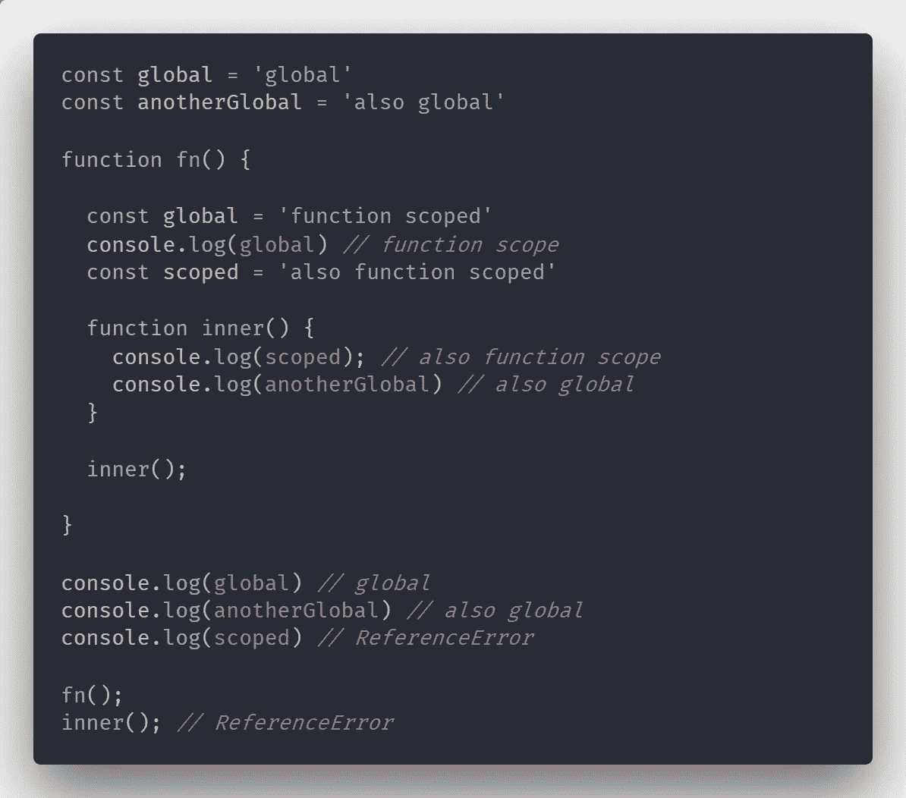

# 2.什么是 REST(ful) API？

*它的* ***架构*** *风格为分布式系统，REST 是****RE****presentation****S****tate****T****transfer。*

一个 **API** 是一个应用程序编程接口。它是一组允许程序相互交流的规则。开发人员在服务器上创建 API，并允许客户端与之对话。

**REST** 决定**API 的外观。**还有 5 个定义 RESTful 系统的指导性架构约束。在本文中，我将只介绍**统一接口**，因为它是一个约束，使得 RESTful 风格的架构与大多数其他网络应用程序架构不同。

## **HATEOAS(统一接口)**

HATEOAS 表示超文本是应用程序状态的引擎。它允许客户端可以通过遍历超媒体来动态地导航到适当的资源( **REST 资源寻址能力)。**

与特定方法一起使用的 HATEOAS(即`POST`、`GET`)告诉服务器客户端想要执行哪个任务。例如，`/customers/{id}` URI 路径和`GET`请求意味着客户想要*得到一个特定的客户。*

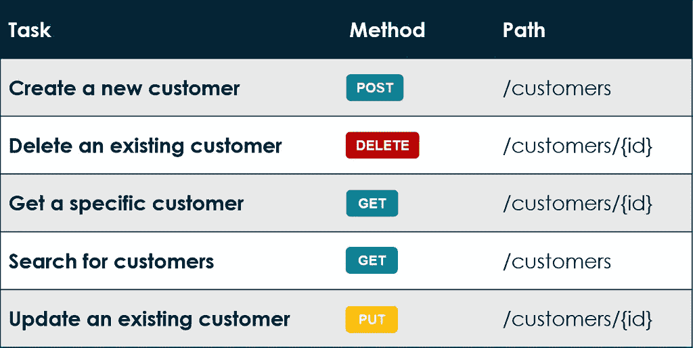

## **Restful API 的优点:**

*   将客户端和服务器解耦。
*   统一的接口有助于开发者之间的交流更加容易。

## **Restful API vs SOAP**

*总结:SOAP 专门依靠****XML****来提供消息服务。这给了 SOAP 一个好处，即它有一个标准。但是它对 XML 的使用也是 SOAP 的缺点，因为 JSON 现在更容易使用，也更受欢迎。*

与基于 SOAP 的 web 服务不同，RESTful web APIs 没有“官方”标准。这是因为 REST 是一种架构风格，而 SOAP 是一种协议。REST 本身不是一个标准，但是 RESTful 实现利用了一些标准，比如 HTTP、URI、JSON 和 XML。

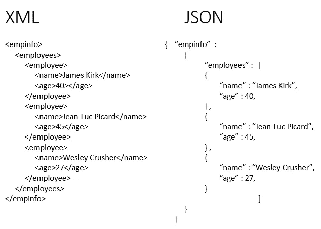

# 3.你如何测试代码？

有许多方法可以确保你编写出高质量的代码。首先，让我们比较单元测试和端到端(E2E)测试。

## **3.1) JavaScript 单元测试**

单元测试测试一个代码块(即函数)“单元”，以确保它们都按预期**运行**。这种测试允许开发人员检查程序的单个区域，以查看错误发生的位置(和原因)。

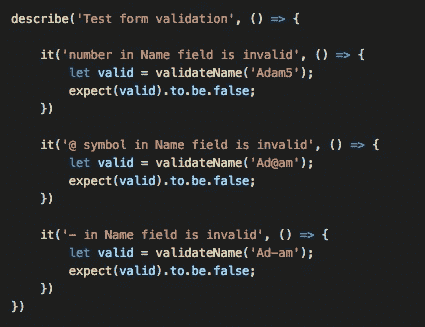

## **单元测试的好处**

1.它使你的项目更加敏捷。每当你添加一个新的功能，你可能不得不改变旧的代码。改变一个已经测试过的代码既昂贵又有风险。然而，如果您对新代码运行单元测试，您将确信新代码不会破坏任何旧的特性。

2.有助于在开发周期的早期发现 bug。

## **流行的单元测试工具**

**笑话**

Jest 是一个由脸书维护的 JavaScript 测试框架。


## **3.2) JavaScript E2E 测试**

端到端(E2E)测试是一种用于测试应用程序**是否按预期运行的技术。**简单来说，一种软件测试方法，用来从头到尾测试一个应用流程。E2E 的主要目的是模拟真实的用户场景。

## **流行的 E2E 测试工具**

**Cypress.io**

快速，简单和可靠的测试任何在浏览器中运行的东西。


## **TDD 与 BDD 的对比**

“你在测试什么？”在比较**单元测试**和 **E2E 测试**时，这是一个很大的问题。在行为驱动开发( **BDD** )中，你在寻找行为，例如，在某个条件下这个系统会发生什么。但是在测试驱动开发( **TDD** )中，你有一个方法测试，它将断言一些条件，但是随着系统的发展，这些测试可能会给你错误的结果。

## **进一步简单地说，它可以写成**

在 **TDD** 中，我不太在意输出。唯一需要的是以特定的方式进行测试。

在 **BDD** 中，我不介意你如何得出输出，只关心在给定条件下输出必须正确。

## **总结**

BDD 是从 TDD 发展而来的，作为一种消除 TDD 缺点的方法。

最好实现两种方法——一种支持开发人员编写的代码的质量，另一种支持产品所有者定义的系统行为。

## **3.3。棉绒**

lint 是一种静态代码分析工具，用于标记编程错误、bug、风格错误和可疑结构。他们扫描你的脚本，找出常见问题和错误，然后给你一个报告，报告中有行号，你可以用它来修复问题。除了实际的 bug 和错误，他们还会检查主观的、**风格偏好**。

## **棉绒的好处**

1.Linter 有助于轻松捕捉常见错误和 bug。

2.通过允许同事使用相同的代码风格，Linter 有助于提高生产率。

## **流行棉绒**

埃斯林特

定制配置是 ESLint 的最大特色之一。虽然 JSLint 不允许配置，这意味着它强制实施单一的样式指南，但 ESLint 稍微灵活一些。


通过使用 ESLint，你可以很容易地采用大型 IT 公司的编码风格。

## 谷歌

```
“extends”: [“eslint:recommended”, “google”]
```

## **AirBnb**

```
"extends": ["eslint:recommended", "airbnb"]
```

## **标准**

```
"extends": ["eslint:recommended", "standard"]
```

## **3.4。在线代码编辑器**

许多开发人员在日常开发和调试中使用在线代码编辑器，它的确是现代开发人员最好的测试工具之一。

## **jsfiddle & repl.it**

适用于检查令人困惑的 JavaScript 类型和变量范围。

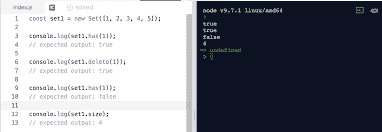

repl.it

## **CodeSandbox**

适合测试 SPA 代码(React、Vue 或 Angular)。

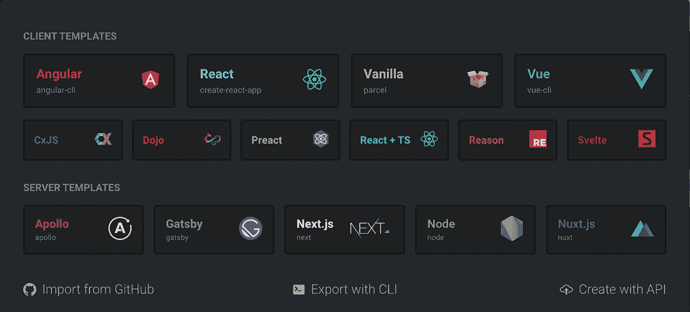

## **代码打开**

适合测试 CSS 和 HTML。CSS 很难调试和发现错误，因为 CSS 通常不会抛出任何错误。

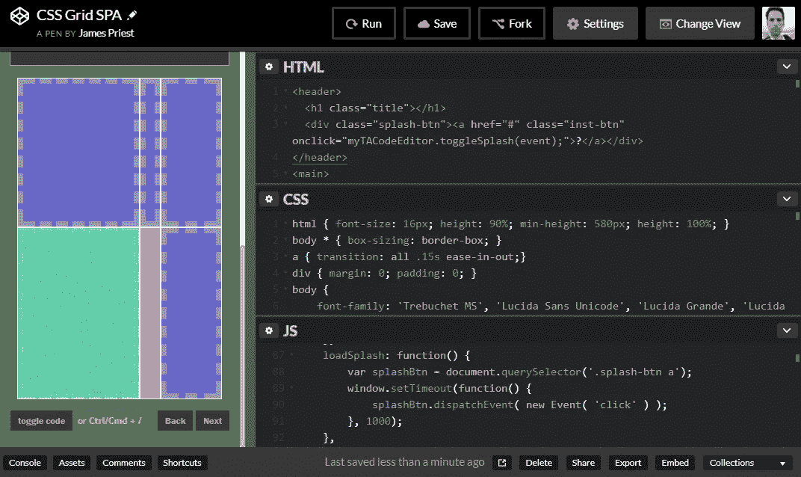

# 4.深度复制和浅度复制有什么区别？

一个**深度复制**意味着新变量的所有值都被复制，并且**与原来的**变量断开。一个**浅拷贝**意味着某些(子)值仍然**连接**到原始变量。

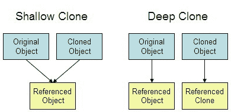

## **JavaScript 对象中的浅拷贝与深拷贝**

在 JavaScript 中使用 object 时，浅层复制经常会出现问题。

## **浅抄**

我们只改变了对象`b` ( `b.pt` )的`pt`属性，但是对象`a`也改变了:

在上面的例子中，我们实际上做了一个**浅层拷贝。这经常是有问题的，因为我们期望旧变量有原始值，而不是改变后的值。**

## **深度复制**

有多种方法可以制作对象的副本，特别是使用新的扩展和改进的 JavaScript 规范。

## **深度复制—扩展运算符**

ES2015 中引入的扩展运算符简短而简单。它*将*所有的值展开到一个新的对象中。

例如，您还可以使用它将两个对象合并在一起

```
const c = {...a, ...b}
```

## **深度复制—对象.分配**

这主要是在 spread 操作符出现之前使用的。`Object.assign`将对象`a`分配给空对象`{}`

## **陷阱:嵌套对象**

在处理复制对象时有一个很大的注意事项，它适用于上面列出的两种方法。当你有**一个嵌套对象(或数组)**并复制它时，该对象内的嵌套对象不会被复制，因为只有指针/引用。**浅浅再抄一遍**

## **嵌套对象的深层副本——扩展操作符**

## **嵌套对象的深层副本—stringy&解析**

手动遍历大对象并手动复制每个嵌套对象是非常乏味的。有一种方法可以不假思索地复制一切。你只需`stringify`你的对象，然后`parse`它

# 5.服务器端渲染是用来做什么的？

## **服务器端渲染**

服务器端呈现(SSR)是在服务器上呈现网页并将它们传递给浏览器(客户端)的过程，而不是在浏览器中呈现它们。SSR 向客户端发送完全呈现的页面；客户端的 JavaScript 包接管并支持 SPA 框架的运行

## **SSR 与客户端渲染**

服务器端呈现将完全呈现的页面发送给客户端；而客户端呈现需要导航到页面(`router`)以获得页面的内容

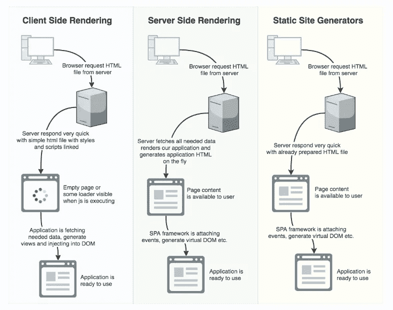

## **SSR；赞成者**

*   它使页面加载更快，从而提供更好的用户体验
*   它在 SEO(搜索引擎优化)中起着重要的作用，并能正确地索引网页，因为 Google 喜欢加载速度更快的网页

## **SSR；CONS**

*   在服务器端渲染一个大的应用程序可能非常耗时，并且可能会增加加载时间，因为这是一个**单一瓶颈**
*   如果最终用户使用的是**慢速互联网连接**(即移动连接)或**功能不足的设备**(即老一代移动设备)，则会出现性能问题

## **Next.js (SSR for React)**

Next.js 是一个开源的 React 前端开发 web 框架，支持服务器端渲染和为基于 React 的 web 应用程序生成静态网站等功能

```
npm install next react react-dom
# or
yarn add next react react-domyarn create next-app <project-name>
# or
npx create-next-app <project-name>
```

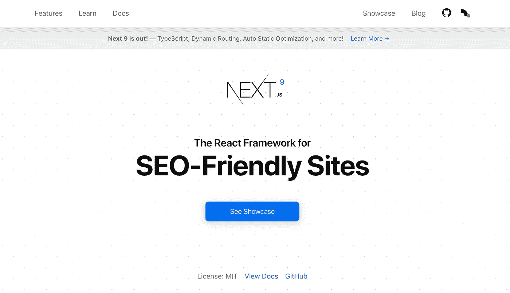

## **nuxt . js(Vue 的 SSR)**

Nuxt.js 是基于 Vue.js 构建 SSR 的免费开源 web 应用框架

```
npx create-nuxt-app <project-name>
```


## **我对 SSR 的看法**

很多公司会问你对诸如 Next.js (React)或 Nuxt.js (Vue)等 SSR 的体验。如果你有使用 SSR 的个人/专业经验，你是幸运的🙌你有值得夸耀的经历。但是如果你不这样做，我认为你仍然不需要太担心或者使用 SSR 建立一个新的应用程序。我认为 SSR 仍然是像 D3.js 这样的数据可视化前端开发人员的**可选* *技能

有 SSR 的经验是好的，但是如果你没有，就学习一下 SSR 以及它与客户端渲染的不同之处。只要表明你了解 SSR，并且你有能力了解更多。

感谢您的阅读，希望它能帮助您准备即将到来的面试。


Photo by [Jon Tyson](https://unsplash.com/@jontyson?utm_source=medium&utm_medium=referral) on [Unsplash](https://unsplash.com?utm_source=medium&utm_medium=referral)