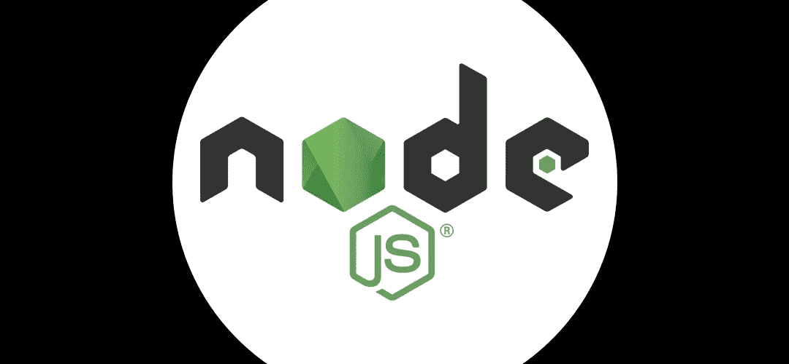

# 我自学 Node.js 时学到的 5 个教训

> 原文：<https://javascript.plainenglish.io/5-lessons-i-learned-teaching-myself-nodejs-74b5f6967dcf?source=collection_archive---------14----------------------->



用了 10 年的灯堆，我觉得是时候尝试新的东西了。

我已经看到了 NodeJS+MongoDB 可以做的一些漂亮的事情，并决定是时候冒险了。

这是我学到的。

# 1.它有自己的服务器

因为 NodeJS 运行在 JavaScript 上，所以它需要自己的运行时环境，类似于 PHP 和 Apache。

在本地工作时，您可能会安装类似 Mamp 或 Xampp 的东西。这将在您的机器上创建一个本地服务器，您可以在其中编写 PHP 应用程序。

NodeJS 就像本地服务器一样运行，一旦您安装了它并编写了一个基本的服务器脚本，在本例中是 app.js，您就可以在每次想要开发或添加包时启动您的服务器。

通过在终端中使用这个命令，您可以非常容易地启动 NodeJS 应用程序。

```
npx run app.js
```

然后 URL *localhost:3000* 变得可用，在这里您可以像处理 LAMP 堆栈一样处理本地应用程序。

您可以选择任何您想要的端口，只要它可用，允许您同时运行多个应用程序。

此外，把它放在现场需要一些虚拟主机魔术与代理，找到如何做到这一点。

[](https://medium.com/javascript-in-plain-english/running-a-nodejs-application-on-an-apache-production-server-4d3cca078f94) [## 在 Apache 生产服务器上运行 NodeJS 应用程序

### 这是我希望在发布我的 NodeJS 应用程序时找到的文章。

medium.com](https://medium.com/javascript-in-plain-english/running-a-nodejs-application-on-an-apache-production-server-4d3cca078f94) 

# 2.异步 JavaScript 很难让人理解

这是学习 NodeJS 最困难的部分。

我太习惯 PHP 处理代码执行的方式了，以至于当要写不同的代码时，我不能重新连接我的大脑。

例如，我使用 Mongoose 从 MongoDB 数据库中调用数据，然后将结果添加到一个变量中。

但是当我在 for 循环中使用这个变量时，里面什么也没有。

这是因为当代码执行时，它进行数据库调用，然后在结果返回之前尝试使用变量。

对此有几种解决方案:

## **2.1 回调**

在函数回调中添加处理。

```
//call document data from database
MyDocuments.findOne({id:DocId}, function(err, document) { //process document data returned})
```

这是最简单易懂的方法。然而，我的一个有点 NodeJS 奇才的好朋友向我保证，这不是最好的做事方式。

主要是因为复杂的应用程序会让你进入“回调地狱”,在回调中有回调，这可能会导致一些非常混乱的代码。

## **2.2 承诺等待/异步**

这鼓励 JavaScript 在尝试做下一件事之前等待一个函数完成。

我不得不承认，即使我设法在我的代码中写了一些这样的功能，我仍然不能完全理解它。

看起来，经过 10 年的工作，某种方式可能已经使我的编程思想变得更加坚定，或者我只是还没有找到一种方式来解释我所理解的方式。

但是，如果您正在开始 NodeJS 之旅，我建议您做一些有希望的例子，以获得至少一个基本的理解。当你的变量为空的时候，它将证明对你是非常宝贵的，你知道事实上它们不应该是空的。

# 3.一些惊人的扩展

只有当你开始搜索解决方案时，你才开始发现其他开发人员已经完成的解决你的问题的惊人工作。

浏览 NodeJS 包库，我意识到它是多么的庞大！

专业提示:在每个包的页面上，它会显示你在过去一周内下载了多少次。这尤其有助于衡量它有多受欢迎，这通常会给你一个好的概念。

我已经在我的应用程序中使用了几个软件包，它们让我的生活变得更加轻松，我在这里列出了它们。

## **3.1 锐**

```
npm i sharp
```

我非常喜欢 Sharp，我甚至在这里写了一篇关于它的文章'[在 Node.js 中使用 Sharp 来输出、调整和裁剪图像](https://medium.com/javascript-in-plain-english/using-sharp-in-nodejs-to-output-resize-and-crop-images-on-the-fly-f8b150989760)。

但说真的，很棒。它可以接收任何大小、格式或质量的任何图像，并以不同的大小、格式或质量输出。

它的速度也非常快，因此可以用来在页面加载时输出图像。

我目前的应用程序可以在不到一秒钟的时间内加载 30 张图片，将其中的 2/3 转换为 webp，1/3 转换为 png，以备不支持 webp 的浏览器使用。

## **3.2 PM2**

```
npm i pm2
```

如果您想在生产服务器上运行您的应用程序，那么 PM2 是必须的。

PM2 是一个守护进程管理器。因此，一旦你告诉它照看你的应用程序，你知道，它会得到很好的照顾。

它优雅地处理错误、重启、日志记录和几乎所有你想从服务器管理程序中得到的东西。

稳定的生产环境有许多功能；你甚至可以告诉它注意变化，这样它就可以在新代码上传时重新启动。

## **3.3 节点邮件程序**

```
npm i nodemailer
```

Nodemailer 是一种简单有效的通过 NodeJS 发送邮件的方式。

它可以处理 SMTP，这在当今防止垃圾邮件的世界中特别有用。

这里有一小段代码向您展示这有多简单。

```
let transport = nodemailer.createTransport({ host: '[smtp host]', port: 25, auth: { user: '[smtp user]', pass: '[smtp password]' }});const message = {from: '[from@]', // Sender addressto: '[to@]',         // List of recipientssubject: '[subject line]', // Subject linehtml: "Hello, world!" // Plain text body};transport.sendMail(message, function(err, info) {if (err) { console.log(err) } else { }});
```

## **3.4 注意事项**

尽量不要使用太多的依赖项/包。记住，这段代码是由*其他人*编写和维护的。

如果他们不能保持更新，那么它最终将需要被替换，有时写几行代码也同样有效。

# 4.大量的框架和模板引擎

我学到的另一件美妙的事情是，有很多框架可以帮助你按照自己的方式构建应用程序。

有了容易互换的框架和模板引擎，如果你不喜欢某样东西，就安装别的东西试试。太直白了。

## **4.1 框架**

托管像 Koa、哈比神和 Nest 这样的框架，你无疑能够找到适合你的框架。

由于我没有使用过它们，所以我不能详细描述上面的内容，但是当我打算开始我的 NodeJS 之旅时，Express 一次又一次地出现。

```
npm i express
```

它帮助我进行路由(我最害怕的事情之一)，处理响应，并且支持超过 14 个模板引擎。

我会鼓励你看看其他人，但 Express 做了我能要求的一切，所以我觉得没有必要去寻找其他东西。

## **4.2 模板引擎**

有相当多的模板引擎可供选择，如车把，小胡子，哈巴狗和圆点。

我确信它们都有各自的好处，但是我想要一些接近使用 PHP 和 HTML 的东西，因为那是我所习惯的。

我从 Pug 开始，但是我不明白制作一个简单的 HTML 页面的语法。

最终，我选择了 EJS。

```
npm i ejs
```

如果你以前用过模板引擎，那么使用 EJS 会感觉很熟悉。你像平常一样写 HTML，把 JavaScript 嵌入其中。

和 Express 配合的很好，合起来超级快。赢家。

# 5.MySQL？NoSQL！

使用 MySQL 多年后，尽管我从未构建过超级复杂的查询字符串，但我认为我已经很好地掌握了这个概念，可以在几分钟内完成一个不错的 MySQL 查询，它可以考虑多个表中的多个字段。

因此，当我不得不开始使用像 MongoDB 这样的 NoSQL 数据库时，它把我所知道的一些东西扔出了窗外，我肯定会说还有更多东西要学。

我安装并开始使用 mongose 来帮助我利用 MongoDB:*“mongose 是 MongoDB 和 Node.js 的对象数据建模(ODM)库，它管理数据之间的关系，提供模式验证，并用于在代码中的对象和 MongoDB 中这些对象的表示之间进行转换”。*

在 MySQL 中创建左连接或右连接非常简单，您可以通过 id 引用数据，但是在 Mongoose 中，我使用了一个名为 aggregation 和$lookup 的函数来创建连接。

```
Places.aggregate([
 { "$match": {
  slug:the_slug,
  status:'publish'}},
 {$lookup: {
  from: "places",
  localField: "related_post_event",
  foreignField: "id",
  as: "event_venue"
}}
```

我了解到跨表聚合会占用大量资源，所以可能有更好的方法。如果你知道，请评论这篇文章。

但是我喜欢 MongoDB 的一点是它不繁琐。

您可以将任何内容放入集合(表)中，它会为您计算出字段数据类型。

不需要定义表的模式和列，MongoDB 并不在乎，只要它有一个 id，那么在一个集合中就可以有许多不同的对象类型。

显然，只有当这是数据结构工作的最佳方式时，才这样做。

# 结论

从 LAMP 栈迁移到 NodeJS、Express 和 MongoDB 非常简单，因为我以前使用过模板引擎和 JavaScript。

路由、JavaScript 的异步性和理解 NodeJS 如何在典型的服务器上运行确实让我头疼。

但是，有一点我可以说的是，我觉得挺过瘾的。

速度，你可以安装的无止境的有用包列表和 power NodeJS 给了你很多选择，如果你想在开发一个应用程序或网站的同时学习一门新的编程语言，我绝对推荐你试试 NodeJS。

感谢您的阅读，希望您喜欢我的文章。

请查看我下面的其他文章。

[](https://medium.com/javascript-in-plain-english/how-to-get-over-90-on-google-pagespeed-insights-a85255ac9a05) [## 如何在 Google Pagespeed Insights 上获得 90 分

### 除了个人走私之外，为什么还要在 Chrome 的 Lighthouse 扩展中尝试 100 个呢…

medium.com](https://medium.com/javascript-in-plain-english/how-to-get-over-90-on-google-pagespeed-insights-a85255ac9a05) [](https://medium.com/javascript-in-plain-english/i-redesigned-and-rebuilt-my-website-in-a-new-technology-and-it-died-in-google-f403bf9e4a85) [## 我在 Node.js 重建了我的网站，它死在了 Google。以下是我学到的

### 上线一个新网站总会有一点紧张，而且有一个很好的理由，它通常没有经过…

medium.com](https://medium.com/javascript-in-plain-english/i-redesigned-and-rebuilt-my-website-in-a-new-technology-and-it-died-in-google-f403bf9e4a85)