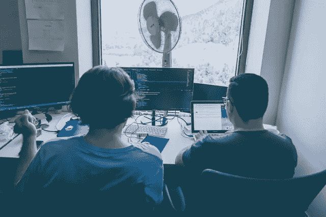

# 我作为开发人员第一年的 5 个经验教训

> 原文：<https://javascript.plainenglish.io/5-lessons-learned-from-my-first-year-as-a-developer-51b33b214c49?source=collection_archive---------7----------------------->

Photo on Unsplash by [Alvaro Reyes (@alvarordesign)](https://unsplash.com/@alvarordesign)

作为一名软件开发人员，我很感激在我职业生涯的早期获得了深刻的见解和重要的收获。由于我参与的项目设置的性质，以及在一个由经验丰富的开发人员组成的相当小的团队中工作，我设法在日常工作中获得了很多知识，并且成长得非常快。

有时候，因为期望，我不得不认真地加强我的比赛，我不得不承担更大的责任。虽然当时看起来压力很大，但实际上却是塞翁失马焉知非福，因为那段时间是我成长和学习最多的时期。

我想总结一下我作为软件开发人员第一年学到的五个最大的教训。

# 1.沟通是关键。

当你以前没有做过软件开发人员时，你倾向于认为他们所做的一切就是整天盯着他们的屏幕写代码，而没有任何与人类的互动。这与事实相差甚远。

的确，一些开发人员喜欢尽可能少地开会和打电话，花更多的时间写代码。但是尽管如此，一个好的开发人员总是与以下人员交流他/她的想法:

1.  顾客。你需要在同一轨道上。有几次，我拿起一张票，读了描述，然后开始根据我认为是任务的东西编写代码——后来才发现我误解了任务。客户很可能会感谢你就任何不确定性与他们联系，他们也很乐意与你分享他们的想法。最后，你的工作是将他们的需求转化为代码，因此你必须完全了解他们的需求。
2.  你的同行开发者。很多时候，沟通是通过拉请求和代码审查来维持的。每天的站立会议也是交流和分享想法的好机会。但是你仍然需要和团队的其他成员保持密切的联系，这样每个人都知道每个人在做什么。有时候，你可能正在处理一个团队中其他人已经面临过甚至可能已经解决的问题，他们可以在路上帮助你。

# 2.犯错误没关系。

作为一名新的开发人员，很自然地会觉得你必须向所有人证明自己，并且你可以处理任何抛给你的事情。但是你不应该在头上浇太多的水。你可能会承担更大更复杂的任务，而你可能还没有准备好，结果你犯了一堆错误，不得不在以后解决这些问题。

特别是当你得到一个任务，没有任何预先计划就投入进去，没有完全考虑清楚，最后以一个既没有很好的架构也没有覆盖所有边缘情况的特性结束时，这种情况就会发生。

这里最糟糕的情况是，你最终不得不在你的特性之上修复一些 bug，而这些特性可能从一开始就没有设计好。如果您没有在以后重构代码，那么您编写的代码很可能最终会腐烂，成为遗留的，将来很难维护。

这里的重点是我们都会犯错。有时我们会编写没有正确计划的代码，有错误的代码，不干净的代码或者破坏项目中的模式和约定的代码。这里要做的关键事情是尽可能高效地纠正错误和修复问题。

刚刚起步的低年级学生可能甚至不知道什么是糟糕的代码。其他人可能会，但不知道如何改进。这是一个学习的过程，这里最好的事情是对你的决定保持清醒，并对同事的反馈持开放态度。

# 3.抵制改变一切可以改善的冲动。

> "如果它没坏，就不要修理它。"英国谚语

这也是初级开发人员经历的自然过程之一。我们了解更好的做事方式、更好的实践、更新的技术等等。然后，我们看到我们的代码库有多差，我们希望改进一切。需要抵制这种冲动，因为每个变更都有风险，作为一个没有经验的开发人员，您可能看不到变更某些东西的实际风险。在我们真正做出任何重大改变之前，我们需要三思，并向我们的同事寻求建议。

“如果它没有坏，就不要去修理它”这句谚语很好地记住了，但这并不意味着事情永远不应该改进。我们只需要仔细分析这种改进的利弊，而不是出于纯粹的冲动去做任何事情。

提出更新的想法和改进建议是很好的。很多情况下，人们会欣然接受。关键是只在有空间的时候改进事情，而不仅仅是为了改进。

# 4.编写对人类友好的代码，而不仅仅是有效的代码。

> "干净的代码可以被原作者之外的开发者阅读和增强."迪夫·托马斯

干净的代码被定义为可读的、对人友好的和可测试的代码。它是不言自明的代码，不需要一堆注释来解释的代码，任何开发人员都可以理解它在做什么。

初级甚至中级开发人员都有一个普遍的习惯，那就是主要关注于让某些东西工作起来——一旦它工作了，我们作为开发人员的工作就完成了。这种心态非常不好，会造成灾难性的后果。

有时这是我们的环境允许我们做的唯一一件事，因为最后期限很紧，客户正在期待一个特性发布。但是在这里，我认为如果没有给开发人员实际的时间，让他们以一种健康和干净的方式构建特性，会有更大的组织问题。

我说的是那些发布糟糕代码的开发人员，因为他们不在乎，只关心如何完成工作。

您的代码需要对人类友好，而不仅仅是由机器解释的原因是，人类最终会维护您的代码。软件需要维护，因为软件通常随着人类需求的变化而变化，而人类需求也在变化。自然地，软件需要改变，人类将不得不捡起你的代码并做必要的改变。如果他们不能理解它，甚至更糟——如果你的代码缺乏单元测试——他们最终会破坏代码的工作部分，从而导致软件随着时间的推移而崩溃。

糟糕的代码已经成为整个公司灾难的一个原因。这是因为一个可怕的代码库，其中任何小的变化都会导致一堆新的问题，这迟早会使团队生产力下降。最终会达到软件无法再处理的地步。

# 5.了解实际需求，不要盲从功能需求。

理解你的客户真正想要的和需要的比仅仅阅读特性需求和盲目地实现它们更重要。我之所以这样说，是因为在许多情况下，客户需要一项新功能，但他们不知道自己到底想要什么。他们可能会给你一个你需要做什么的建议，但是他们自己也愿意接受建议。

很多时候，从技术角度来说，用一种方式实现一个特性是有风险的，而用另一种方式实现更合适。你甚至可以想出一个更好的解决方案，给他们带来比他们最初期望的更多的价值，他们会更加感激。

我们应该记住，我们正在将人类的需求转化为代码，因此我们应该正确地理解需求，然后做必要的事情，以及适合项目及其环境的事情。

# 结论

这是我作为软件开发人员第一年的五个关键收获。一路走来，我学到了很多东西，希望能在以后的文章中分享。

本文的要点是强调任何开发人员都将面临不同的阶段，并在此过程中经历一堆挑战。至关重要的是，我们要在工作中关注我们的日常经验，并通过更好地表现和稳步改善来利用这些见解。

感谢阅读。😊