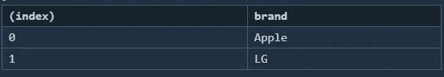
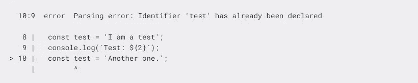

# 每个开发人员都应该知道的 JavaScript 的 5 种现代实践

> 原文：<https://javascript.plainenglish.io/5-modern-practices-of-javascript-that-every-developer-should-know-1a61dc9a6ee0?source=collection_archive---------0----------------------->

## 编写干净代码的 5 个最佳技巧和实践


Photo by [Shirin Alian](https://unsplash.com/@shirinalian?utm_source=medium&utm_medium=referral) on [Unsplash](https://unsplash.com?utm_source=medium&utm_medium=referral)

十多年前，JavaScript 只是一个让网站更具交互性和更好看的工具，但从那以后事情发生了很大的变化。

现在 JavaScript 广泛应用于生产的各个领域，从网页开发到游戏再到移动应用。此外，对于任何给定的任务，您都有可能找到稳定且成熟的 JavaScript。

因此，保持与所有最佳实践的同步变得越来越重要，这可以让你和你的代码比其他人更有优势，尤其是在工作面试和技术面试中。

下面是 JavaScript 的 5 个现代规则，每个开发人员都应该知道，以编写干净的代码并变得熟练:

## 1.解构

通常，我们有许多与同一事物相关的值和属性，我们使用对象来存储和传递这些值和数据。

下面给出了访问这些值的标准方法:

```
const mobile= {
    id: 42,
    brand: 'Apple'
};
console.log(mobile.id);
console.log(mobile.brand);
```

虽然这种方法是可行的，但是您可以在这里看到代码重复，因为我们每次都要引用对象来获取值。有更好的方法来处理这个问题。

```
const mobile= {
    id: 42,
    brand: 'Apple'
};
var {id,brand} = mobile;
console.log(id);
console.log(brand);//Destructuring can be applied to functions as well
var myFunction= ({id})=>{           
   console.log(id); 
 }
myFunction(mobile);
```

此外，您还可以使用这种技术来析构数组。

```
function myFun() {
  return [1, 2];
}

let a, b; 
[a, b] = myFun(); 
console.log(a); // 1
console.log(b); //2
```

同样的属性也可以很容易地用于交换变量。

```
let a = 1;
let b = 3;
[a, b] = [b, a];
console.log(a); // 3
console.log(b); // 1
```

你可以在这里找到关于解构[的深度指南。](https://developer.mozilla.org/en-US/docs/Web/JavaScript/Reference/Operators/Destructuring_assignment)

## 2.更好的记录

控制台日志是几乎所有开发人员的首选调试方法，不管他们的经验如何。然而，没有多少人知道存在记录消息的聪明方法。

```
const foo= {
  brand: 'Apple'
};const bar= {
  brand: 'LG'
};console.log(foo);
console.log(bar);
```

输出如下所示:

```
{"brand": "Apple" }
{"brand": "LG" }
```

上面的代码片段显示了一种非常常见的记录消息的方法，但是它的问题是没有办法知道哪个日志打印了什么，正如您从输出中看到的那样。

记录数据的正确方法是用圆括号将日志消息括起来，或者在我们的例子中，当记录多个对象时，也可以使用`.table`而不是`.log`。这将更清楚地显示我们正在记录的对象。

两种方式如下所示:

```
const foo= {
  brand: 'Apple'
};const bar= {
  brand: 'LG'
};
console.log({foo,bar})
console.table([foo,bar])
```

输出将更容易看到，也更精细。

```
//Output
{   
  "foo": {     
    "brand": "Apple"   
  },  
  "bar": {     
    "brand": "LG"   
  } 
}
```

`console.table()`将呈现以下内容:



Table showing the objects with their properties

另一个有用的方法是 count 方法，当使用循环或递归并反复调用同一个函数时，它会变得非常有用。count 方法记录每次调用函数的次数，而无需您声明任何计数器变量来存储函数被调用的次数。

例如，请参见下面的片段:

```
let user = "";

function greet() {
  console.count();
  return "Welcome " + user;
}

user = "John";
greet();
user = "Sam";
greet();
```

我们已经调用了函数`greet()`两次，因此代码输出如下所示:

```
"default: 1"
"default: 2"
```

还有更多这样的方法可以使调试更容易，比如使用 trace 方法。你可以在这里找到完整的列表。

## 3.高阶函数

高阶函数是接受一些参数并输出结果的函数。如果您已经编程一段时间了，那么您可能已经在不知情的情况下遇到并使用了这些函数。

JavaScript 提供了几个高阶函数，可以让程序员的生活更轻松。有一些常见的操作，比如对数组排序或者从列表中删除重复的元素。所有这些操作都可以通过使用本地函数在几行代码中完成。

为了检索所有唯一的元素，我们可以使用`Set()`方法。

```
let duplicateArray = [1,2,2,2,4,4,3];
let uniquesArray= Array.from(new Set(duplicateArray)); //[1,2,4,3]
```

类似地，为了对数组进行排序，我们可以使用`sort()`方法。

```
let mArray = [1,2,5,4];
console.log(mArray.sort()); // [1,2,4,5]
```

使用这些函数的好处非常明显。它们产生简短、干净的代码，使您能够专注于更重要的事情，而不是编写函数来排序数组和删除重复的元素。

这些函数也使得运行循环变得非常简单。不用运行传统的 for 或 while 循环，通过使用函数可以很容易地实现这一点。

例如，如果我们想打印数组中乘以 5 的所有元素，并存储所有元素的总和，我们可以运行如下所示的循环:

```
let arr= [1,2,3];
let total=0;
for(var i=0;i<arr.length;i++){
    total+=arr[i];
    console.log(arr[i]*5);
}
console.log(total);
```

或者，我们可以使用函数来快速执行这些任务。

```
let arr= [1,2,3];
arr.map(val => console.log(val*5))
let total=arr.reduce((acc,current)=>acc+current);
console.log(total)
```

虽然我们使用了乘法等简单的运算，但在现实应用中，任务要复杂得多，使用`reduce()`、`filter()`等类似函数可以省去很多麻烦。

还有很多其他这样的功能，你可以在这里找到一个全面的指南。

## 4.异步等待

JavaScript 支持异步编程，这意味着您可以运行一段代码，而不会干扰整个程序的流程。换句话说，它是并行编程的一种形式。

例如，在后台获取数据时，您会看到一个进度条。一旦加载了数据，程序就会呈现数据并删除进度条。

实现这个概念的现代方法是使用 JavaScript 提供的`async`和`await`功能。

下面的代码片段展示了执行异步操作的常见做法:

```
function random(){
    return Promise.resolve(Math.random())

  }
const showNum = ()=>{
    let first,second;
    random().then(v => {
      first=v;
      console.log(first);
      return random().then(p=>{
        second=p;
        console.log(second);
        console.log(second+first);
      })
    })
  }
showNum()
```

上面的代码试图记录两个随机生成的数字的总和。正如你所看到的，使用`then()`会导致一连串重复的代码，不仅看起来不整洁，而且写起来也很耗时。

然而，JavaScript 为我们提供了一个更好的选择。

```
function random(){
    return Promise.resolve(Math.random())

  }
const showNum = async()=>{
    let first = await random();
    console.log(first);
    let second=await random();
    console.log(second);
    console.log(first+second);
  }
showNum()
```

使用 async 和 await 使得在 JavaScript 中执行这样的操作变得非常简单，并且没有多少语言提供这样一种直接处理异步任务的方式。

## 5.林挺

林挺是有经验的开发人员遵循的一种常见实践，以使他们的代码没有错误和不一致。通俗地说，它是一个分析你的程序的工具，用来标记编程错误、bug、风格错误，以及未使用的变量和声明。

当长期使用时，它可以提高您的编程技能，因为您将习惯于统一的代码风格，并编写出更加整洁的代码。它还记录你的待办事项和待办事项。

下面是展示林挺的一个简单案例:

```
const test = 'I am a test';
console.log(`Test: ${test}`);
const test= 'Another one.';
```

常量`test`被声明了两次，因此在你执行程序时会抛出一个错误。

但是当您使用 linter 时，这个错误会立即被捕获。



Linter pointing out the error

这是使用 linter 的核心优势之一，也是它在当今世界如此受欢迎的主要原因之一。

我们使用了一个简短的 3 行示例来展示一个常见错误，但是 JavaScript 应用程序正变得越来越复杂，这样的错误在更大的程序中肯定会发生。

你可以按照他们的官方指南安装并开始使用 ESLint，这是一个流行的 JavaScript linter。

## 结论

JavaScript 应用程序每天都在变得越来越复杂，部分原因是它几乎无处不在。今天，几乎不可能找到不使用 JavaScript 的网页。

除了这种快速增长，JavaScript 语言也在发展。几乎每年 JavaScript 都会经历重大的变化，并且会添加新的功能来促进开发过程。

这些新功能和现代规则不仅加快了开发阶段，还能让你在技术面试中受益。

因此，对于有经验的开发人员来说，掌握这些进步是非常必要的，而对于新开发人员来说，掌握和使用他们所掌握的新工具更是必要的。