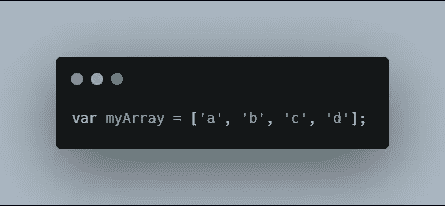
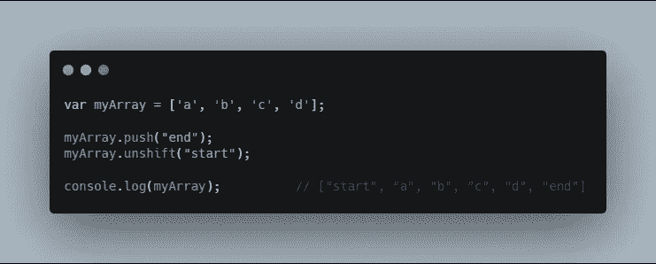
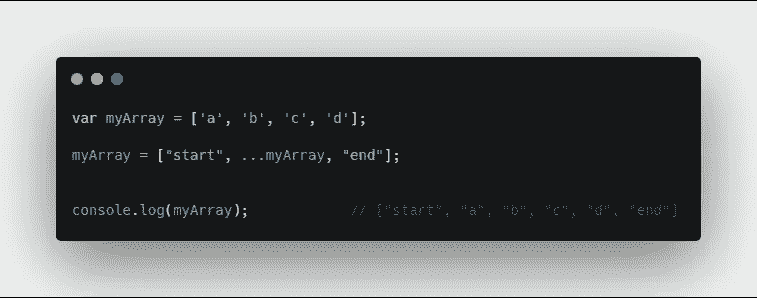
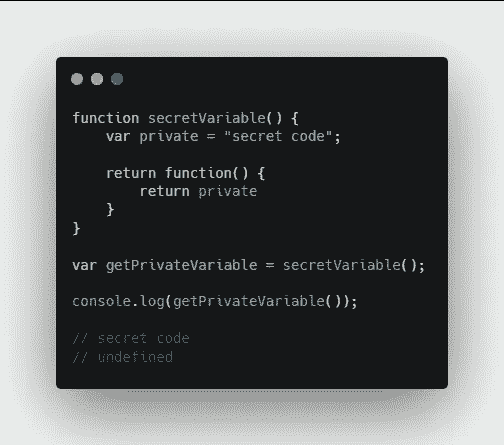
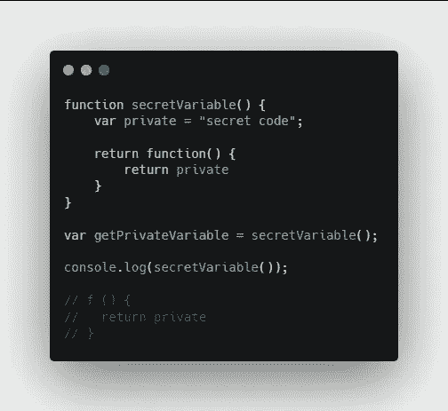
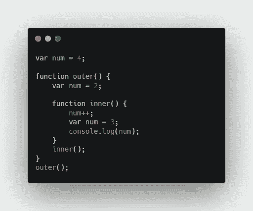
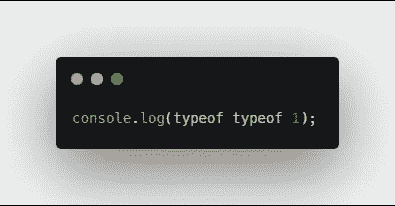
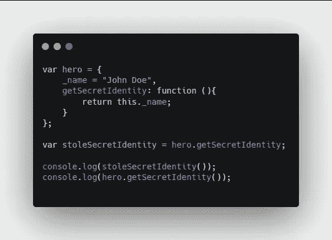

# JavaScript 的 5 个必知面试问题

> 原文：<https://javascript.plainenglish.io/5-must-know-interview-questions-for-javascript-bd9000c56e7a?source=collection_archive---------6----------------------->

基本问题，但对 JavaScript 开发人员至关重要。


Photo by [Maranda Vandergriff](https://unsplash.com/@mkvandergriff?utm_source=medium&utm_medium=referral) on [Unsplash](https://unsplash.com?utm_source=medium&utm_medium=referral)

这是 5 个基本的 JavaScript 问题，我认为大多数 JavaScript 开发者都应该知道。我们将使用 ES6 和常规 JavaScript 来解决这些问题。

# 1.在数组中添加元素

我们从一个数组问题开始。这是一个很常见的问题。所以问题是你如何在数组的开头和结尾加上一些东西。

**样品阵列**



**解决方案 1**



**解决方案 2**



# 2.在 JavaScript 中创建私有变量

下一个问题是如何在 JavaScript 中创建私有变量。

除了扰乱 JavaScript 的范围之外，没有真正的方法可以做到这一点。因此，为了做到这一点，我们需要创建一个变量，它位于函数的局部范围内。

**解决方案**



如果我们看到`secretVariable()`里面有什么，我们会得到下面的结果。



我们实际上看不到它的价值。所以我们必须以另一种方式重新分配它，然后它将运行秘密变量。

# 3.产量是多少？

**样题 1**



**输出 1**

```
3
```

我们会自己解决的。

所以我们有一个函数`outer()`和一个函数`inner()`。第一行无关紧要，因为什么都没发生。只是分散注意力。第四行和第八行中的`num`变量被覆盖。

第七行将给出未定义的值，因为`num=2`不在内部函数的范围内。

**样题 2**



**输出 2**

```
string
```

如果你这样看待这个问题，它会更有意义。

```
console.log(typeof (typeof 1));
```

首先，`typeof 1`会给你`number`。然后，`typeof number`给你`string`。

**样题 3**



**输出 3**

```
undefined
John Doe
```

如果我们将第八行修改如下，

```
var stoleSecretIdentity = hero.getSecretIdentity.bind(hero);
```

我们将获得:

```
John Doe
John Doe
```

因为我们将它设置为一个新变量，所以我们必须添加绑定以便显示名称两次。

编码快乐！

## 用简单英语写的 JavaScript 的注释

我们总是有兴趣帮助推广高质量的内容。如果你有一篇文章想用简单的英语提交给 JavaScript，用你的中级用户名发邮件到 submissions@javascriptinplainenglish.com[](mailto:submissions@javascriptinplainenglish.com)**给我们，我们会把你添加为作者。**

**我们还推出了三种新的出版物！请关注我们的新出版物:[**AI in Plain English**](https://medium.com/ai-in-plain-english)[**UX in Plain English**](https://medium.com/ux-in-plain-english)[**Python in Plain English**](https://medium.com/python-in-plain-english)**——谢谢，继续学习！****