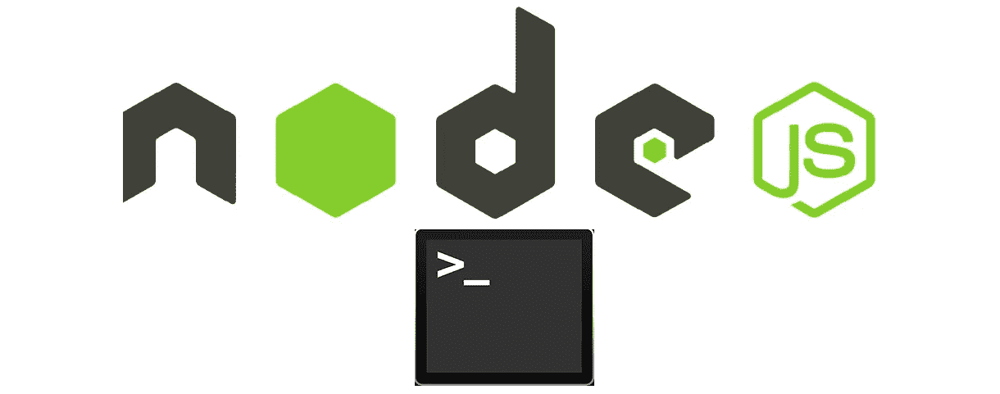
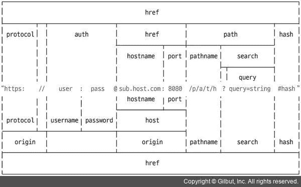

# 5 你应该知道的 Node.js 内部模块

> 原文：<https://javascript.plainenglish.io/5-node-js-internal-modules-you-should-know-cfd9f37b72e8?source=collection_archive---------2----------------------->

## 在网络浏览器中，Node 比 JavaScript 有更多的功能



# 1.小路

*它帮助操作文件夹&文件路径*

*   路径模块非常有用，因为每个操作系统都有不同的路径分隔符
*   Windows 类型和 POSIX 类型
*   **窗型**:隔₩(即 C:₩Users₩stacycho)
*   POSIX 类型用于基于 Unix 的操作系统，如 macOS 和 Linux
*   **POSIX 类型**:由/(即/home/stacycho)分隔

*   **__filename** ， **__dirname** 分别代表当前文件和当前文件夹路径
*   **路径:sep** :路径分隔符(即 Windows : `\`，POSIX : `/`)
*   **path.delimiter** : env 变量分隔符(即 Windows : `;`，POSIX `:`
*   **path.dirname(path)** :文件路径
*   **path.extname(path)** :文件扩展名
*   **path.basename(路径，扩展名)**:文件名
*   **path.parse(path)** :将文件路径分为 root、dir、base、ext、name
*   **path . format(object)**:path . parse()对象到文件的路径
*   **path.noramlize(path)** :删除重复项/ \
*   **path . isabsolute(path)**:return boolean 表示文件路径是绝对路径还是相对路径
*   **path.join(path，…)** :组合成一条路径
*   **path.resolve(path，…)** :组合成一个路径

```
difference between path.join & path.resolve
--
- path.resolve : absolute path
- path.join : relative pathpath.join('/a', '/b', 'c'); // /a/b/c
path.resolve('/a', '/b', 'c'); // /b/c
```

# 2.全球资源定位器(Uniform Resource Locator)

*它有助于操纵互联网地址(url)*

*   它们是两种类型的 url 操作 1) WHATWG url 2)传统节点 url



*   **url.parse(address)** :单独的 url
*   **url.format(object)** :重组 url

# 3.跑龙套

*   **util** 模块具有所有实用功能
*   随着 API 被弃用，许多 API 被添加和删除

*   **util.deprecate** :该函数告知该函数已被弃用
*   **util . promise rify**:将回调模式改为承诺模式。异步/等待

# 4.操作系统（Operating System）

*网页浏览器中的 JavaScript 无法获取操作系统信息，但节点可以*

*   **os.type()** :显示操作系统类型
*   **os.uptime()** :操作系统启动后的时间
*   **os.hostname()** :显示电脑名称
*   **os.release()** :显示操作系统版本
*   **os.homedir()** :显示主目录路径
*   **os.freemem ()** :显示可用 RAM
*   **os.totalmem()** :显示整个内存容量

# 5.查询字符串

*将 url 的 searchParams 转换成一个对象*

*   **query string . parse(query)**:URL 查询成 JavaScript 对象
*   **query string . string ify(object)**:将对象查询为字符串

# **简明英语团队的笔记**

你知道我们有四份出版物和一个 YouTube 频道吗？你可以在我们的主页[**plain English . io**](https://plainenglish.io/)找到所有这些内容——关注我们的出版物并 [**订阅我们的 YouTube 频道**](https://www.youtube.com/channel/UCtipWUghju290NWcn8jhyAw) **来表达你的爱吧！**