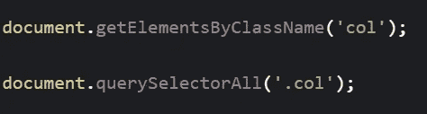
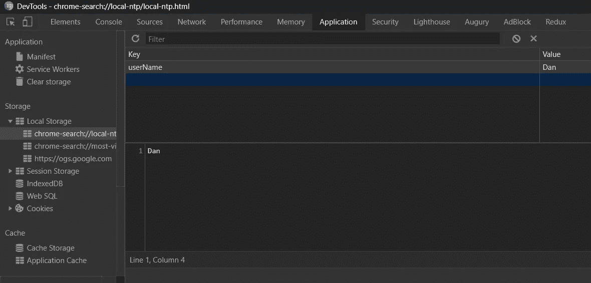

# 测试您的 JavaScript 知识的 5 个问题

> 原文：<https://javascript.plainenglish.io/5-questions-to-test-your-javascript-knowledge-9371c39b74c3?source=collection_archive---------2----------------------->

如果您错过了第 1 部分:

[](https://blog.usejournal.com/5-questions-to-test-your-javascript-knowledge-968e3f15779b) [## 测试您的 JavaScript 知识的 5 个问题

### 准备好测试您的 JavaScript 知识了吗？

blog.usejournal.com](https://blog.usejournal.com/5-questions-to-test-your-javascript-knowledge-968e3f15779b) 

# 数学运算

`const num = 1 / 0;`

`num`的值是多少？
我们会从这个操作中得到一个错误吗？


Photo by [Kevin Ku](https://unsplash.com/@ikukevk?utm_source=medium&utm_medium=referral) on [Unsplash](https://unsplash.com?utm_source=medium&utm_medium=referral)

# 回答

`num`的值将会是`Infinity`。

# 说明

JavaScript 目前有八种数据类型:

```
number
bigint
string
boolean
null
undefined
object
symbol
```

`number`类型的变量有一些边缘情况定义。`Infinity`和`-Infinity`代表无穷大的值。`Nan`(非数字)是无效数学运算的结果。值得注意的是，JavaScript 将**而不是**对无效的数学运算抛出错误，而是返回一个`Nan`值(不是一个数字)。

理解这些边缘情况是有帮助的，因为您将意识到“无声的”错误(不抛出异常的逻辑错误)。

# 学什么

[无穷大](https://developer.mozilla.org/en-US/docs/Web/JavaScript/Reference/Global_Objects/Infinity)
[数字](https://developer.mozilla.org/en-US/docs/Web/JavaScript/Reference/Global_Objects/Number)

# 查询 DOM

querySelectorAll 和 getElementsBy*有什么区别？
(getElementsByClassName，getElementsByTagName 等)



Selecting elements from the script

# 回答

主要区别在于`querySelector`返回一个**静态**集合，它代表元素**在执行**时的快照，而`getElementsBy*`返回一个“**活动**”，自动更新`htmlCollection`对象。

# 说明

首先，我们需要理解“活动”和“静态”集合之间的区别。“实时”集合意味着当 DOM 改变时它会自动更新，并且总是反映 DOM 的当前状态。“静态”集合返回元素的快照，并且在元素更新时不更新。这意味着如果我们在通过`querySelector`选择元素后更新它们，我们选择的元素将不会准确地反映 DOM。

> getElementsBy*返回一个 HtmlCollection，它会随着 DOM 的改变而自动更新。querySelectorAll 返回一个不自动更新的节点列表。

# 学什么

[query selector all](https://developer.mozilla.org/en-US/docs/Web/API/Document/querySelectorAll)
[getElementsByClassName](https://developer.mozilla.org/en-US/docs/Web/API/Document/getElementsByClassName)
[html collection](https://developer.mozilla.org/en-US/docs/Web/API/HTMLCollection)
[NodeList](https://developer.mozilla.org/en-US/docs/Web/API/NodeList)

# 变量声明

描述每个场景中会发生什么。

# 回答

在第一个场景中，程序将把`undefined`记录到控制台。
在第二个场景中，我们会得到一个错误:

```
Uncaught ReferenceError: Cannot access 'name' before initialization
```

# 说明

`Let`和`const`于 2015 年在 ES6 推出。以前，变量是用 var 声明的。

在处理 var 语句时，JavaScript 会做一个叫做**提升**的事情。

> 提升——举起或举起某物的行为。(词汇)

第一个示例中的代码是这样修改的:

因此，当程序试图将`name`记录到控制台时，它会记录`undefined`。因为没有用`let`提升，所以程序在尝试控制台日志时没有识别出来并抛出错误。

`var`和`let`的另一个主要区别是**范围**。`var`使用**功能**范围，`let` 使用**块**范围。

**函数范围**——变量在整个函数中是已知的和共享的

**块范围** —变量只在它自己的块中是已知的(函数、for 循环、if 语句等)。

在 sun 函数中，`letter`在函数的作用域中是已知的，可以在函数内部的任何地方使用。在 moon 函数中，`letter`仅在`if`语句的范围内是已知的。因此，当试图从外部(函数范围)访问它时，会抛出一个错误。

> var 和 let 的两个主要区别是范围和提升。

在迁移旧代码或从互联网上复制代码时，理解 var 的特殊行为非常重要。我相信理解它会帮助你避免将来潜在的 bug。

# 学什么

[var](https://developer.mozilla.org/en-US/docs/Web/JavaScript/Reference/Statements/var)
[let](https://developer.mozilla.org/en-US/docs/Web/JavaScript/Reference/Statements/let)

# 储存；储备

如何在客户端的浏览器中存储信息？
信息需要持久，在程序的所有标签中共享，并且在浏览器重启后仍然存在。


Photo by [Ruchindra Gunasekara](https://unsplash.com/@ruchindra?utm_source=medium&utm_medium=referral) on [Unsplash](https://unsplash.com?utm_source=medium&utm_medium=referral)

# 回答

使用本地存储。

# 说明

浏览器为我们提供了一个`Storage`对象来处理在浏览器上存储信息。如果我们希望存储以下数据，我们使用 localStorage:

*   持久(浏览器关闭后不会消失)。
*   在网站的所有选项卡上共享。
*   服务器上不需要。

使用 localStorage 的示例:

> 注意:localStorage 是 window.localStorage 的扩展

要在 chrome 中访问页面的本地存储，打开 chrome dev tools(f12)，点击 Application 选项卡，然后点击 storage 部分下的 local storage。



**额外好处**:如果我们的程序有几个标签，我们希望每个标签都有不同的配置，我们可以使用**会话存储**。但是请记住，如果我们想要跨标签共享相同的属性**，我们应该使用本地存储。**

> 会话存储特定于选项卡。本地存储特定于浏览器。

# 学什么

[本地存储](https://developer.mozilla.org/en-US/docs/Web/API/Window/localStorage)
[会话存储](https://developer.mozilla.org/en-US/docs/Web/API/Window/sessionStorage)

# 迭代器

每一行中控制台会记录什么？


Photo by [Chris Ried](https://unsplash.com/@cdr6934?utm_source=medium&utm_medium=referral) on [Unsplash](https://unsplash.com?utm_source=medium&utm_medium=referral)

# 回答

```
numbers: [1,2,3,4]
doubleNumbersByMap: [2,4,6,8]
doubleNumbersByForEach: undefined
```

# 说明

**数字**

`numbers`不会改变，因为`forEach`和`for of`不会**也不会**改变它们被调用的数组。

**doubleNumbersByMap**

Map 遍历数组并返回一个由回调函数修改的新数组。因此，`doubleNumbersByMap`是一个包含两倍于`numbers`的值的新数组。

**doubleNumbersByForEach**

`doubleNumbersByForEach`是`undefined`，因为`forEach`返回`undefined`。

`forEach()`对每个数组元素执行一次`callback`函数；不像`map`或`reduce`，它总是**返回**值`undefined`。通常，我们使用 if 在一个可迭代对象上执行副作用**。`forEach()`难道**不是**变异了调用它的原始数组。**

**奖金**

如果我们想使用`forEach`方法更新`numbers`，我们需要在回调中使用 array 属性。这允许我们访问原始数组并修改它。

这里我们可以看到`forEach`方法的语法。

```
arr.forEach(callback(currentValue [, index [, array]])[, thisArg])
```

# 学什么

[forEach](https://developer.mozilla.org/en-US/docs/Web/JavaScript/Reference/Global_Objects/Array/forEach)
[地图](https://developer.mozilla.org/en-US/docs/Web/JavaScript/Reference/Global_Objects/Array/map)

# 结论

在本节课中，我们回顾了 JavaScript 中一些更重要的概念。这些话题经常在面试中出现，所以我希望你做好准备！

感谢阅读！

## **说白了就是**

你知道我们有四种出版物吗？通过[**plain English . io**](https://plainenglish.io/)找到他们——通过关注我们的出版物和 [**订阅我们的 YouTube 频道**](https://www.youtube.com/channel/UCtipWUghju290NWcn8jhyAw) **来表达爱意吧！**