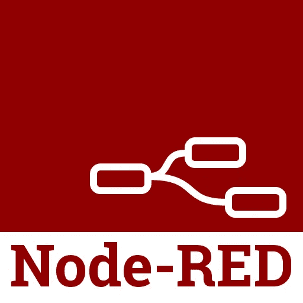

# 现在使用 Node-RED 的 5 个理由

> 原文：<https://javascript.plainenglish.io/5-reasons-to-use-node-red-right-now-2128bcc97d6c?source=collection_archive---------1----------------------->

## Node-RED 已经过实战测试，开源，并且可以投入生产。

你可能听说过[节点红](https://nodered.org/)。你知道，那个超级棒的、基于浏览器的、绘制流程和连接节点的工具，可以轻松地将物联网设备与应用程序集成在一起？对，就是那个。

也许你考虑过用，也许没有。

在这篇文章中，我将向你展示在你的应用中使用 Node-RED 的几个理由。就现在。

# 1.基于久经考验的技术体系构建

## 节点. js

Node-RED 的核心是 Node.js，它(如你所知)是一个 JavaScript 运行时，[拥有宇宙中最大的开源组件生态系统](https://nodejs.org/en/)(好吧，我添加了最后一部分，但它是地球上最大的)。所以它很成熟，有一个活跃的社区，很多人都在使用它。

因为它是成熟的，并且被大量使用，所以你可以相信它是有效的。但是不要相信我的话。[问贝宝。还是网飞](https://www.infoworld.com/article/2610110/paypal-and-netflix-cozy-up-to-node-js.html)。或者[沃尔玛](https://hackernoon.com/walmart-strives-to-be-an-online-retail-leader-with-node-js-9484a4ff51f7) ( [我可以继续](https://thinkmobiles.com/blog/node-js-app-examples/))。

## Java Script 语言

好吧，Node.js 就是 JavaScript 的意思，对吧？当然，但是那不是一件坏事。不管你喜欢它还是讨厌它，JavaScript 一直存在，而且，让我们面对现实吧，它不会有任何发展。

我用过它(我承认一开始不太情愿)，但是[尽管它有一些怪癖](https://www.sitepoint.com/three-javascript-quirks-java-c-developers-should-know/)，但它很好用。再加上易学易用，[功能强大](https://dzone.com/articles/why-is-javascript-the-programming-language-of-the)。使用 JavaScript 的原因有很多([点击这里选择五个](https://medium.com/javascript-non-grata/the-five-top-reasons-to-use-javascript-bd0c0917cf49))。

## 网络浏览器

网络浏览器在技术上是技术栈的一部分吗？我不知道，也许我在这里有创造性的自由。但是我这样做是为了说明这一点:编写 GUI 是困难的(尤其是像你我编写的好 GUI)。

当您可以将少量标记(HTML/CSS)、少量代码(JavaScript)和少量元数据(JSON)结合起来，并获得一个看起来非常漂亮的用户界面时，这是值得一提的。

哦，网络浏览器无处不在。你喜欢狩猎吗？太好了！火狐？厉害！铬？歌剧？欢迎所有人(叹气，甚至是你，Chrome)。

# 2.JSON 比 XML 好得多

## XML 怎么了？

我不喜欢 XML。XML 非常灵活、强大、富于表现力，但是我不喜欢 XML，因为它很容易被扭曲成一大堆难以阅读的应用程序元数据。

当应用程序开发人员陷入“让我们用 XML 描述我们所有的元数据吧！”无法说服他们不要这样做。他们被迷住了。决心将应用程序配置变成一团乱麻(通常就在他们离开团队，或者更糟，离开公司之前)。

## 更好的元数据

Node-RED 使用 JSON(即 JavaScript 对象符号)来描述其元数据。这里没有 XML。JSON 会不会变态？当然，但是我不这么认为，它比 XML 更容易阅读。

# 3.可视化(网络)边缘

## 基于流程的编程很酷

什么是“基于流程的编程”(FBP)？这是可视化应用程序功能的一种非常酷的方式。j .保罗·莫里森于 20 世纪 70 年代为一家加拿大银行创建的 FBP 是一种不同的编程思维方式，它将问题分解为数据、处理这些数据的进程以及连接进程的网络。

为了实现一个目标，流程被组合在一个流程中。类似地，流可以被逻辑地分组在一起，以完成更高层次的目标，等等。数据输入，数据输出。

毫不奇怪，FBP 非常适合可视化编程。所以你可以画代码。是的。画吧。代码。运行。多酷啊。

## 边缘生活

啊，网络的[边缘](https://developer.ibm.com/depmodels/edge-computing/)。是的，这是很多创新发生的地方。为什么？因为那里是大量数据产生的地方。大量的。一直都是。来自传感器、摄像头的数据，以及来自手机和可穿戴设备等移动设备的 GPS 数据。甚至不要让我从自动驾驶汽车的所有数据开始(它就要来了，相信它)。

需要利用所有这些数据进行创新吗？嗯，我的朋友，那是“边缘”,那是 Node-RED 闪耀的地方。

怎么会？由于 Node-RED 是由 [IBM 新兴技术服务](https://emerging-technology.co.uk/)团队设计和构建的，作为一种可视化向硬件设备发送和接收[消息队列遥测传输(MQTT)](https://developer.ibm.com/articles/iot-mqtt-why-good-for-iot/) 消息的方式，将硬件(及其数据流)连接到应用程序已经融入了 Node-RED 的 DNA。如果你需要构建一个原型来展示你的想法，为什么不使用一个为 edge 设计的原型呢？

# 4.这不是玩具

因此，您已经用 Node-RED 构建了一个原型，您的客户对此印象深刻。现在怎么办？

现在你在原型的基础上创造出最终的产品。但是留在红色节点！无论您需要构建的是一个新功能、一组新功能，还是从浏览器到[数据库](https://flows.nodered.org/node/node-red-node-mysql)的整个应用程序，Node-RED 都能满足您从原型到[生产](https://developer.ibm.com/series/learning-path-workshop-node-red-production)的需求。

如果你不能从成千上万免费提供的组件中找到满足你需求的组件，[你可以自己编写](https://nodered.org/docs/creating-nodes/)！

例如，看看 IBM Cloud 中的 [Node-RED Starter](https://developer.ibm.com/tutorials/how-to-create-a-node-red-starter-application) ，它将带你走上构建一些重要功能的道路。

# 5.不仅仅是为了物联网

Node-RED 允许您通过使用浏览器将节点之间的数据流连接在一起来创建功能。通过对传感器、摄像头和无线路由器等物联网设备之间的应用功能进行建模，它在物联网领域获得了巨大的人气。

但它不仅仅是一项物联网技术(如果你有创造力的话)。有大量来自 flows.nodered.org 的现成节点。不喜欢那些？[自己编码](https://nodered.org/docs/creating-nodes/)！

关键是，节点是一个代码块，它可以做你想做的任何事情。需要从 Twitter 读入一些数据？检查。需要将这条推文与情绪匹配器进行比较，看看这条推文是开心/悲伤/冷漠吗？检查。需要从 web 表单中读入数据？检查。执行运行在[open whish](https://www.ibm.com/cloud/functions)中的无服务器功能？检查。

你明白我的意思了。超级灵活。也很强大。