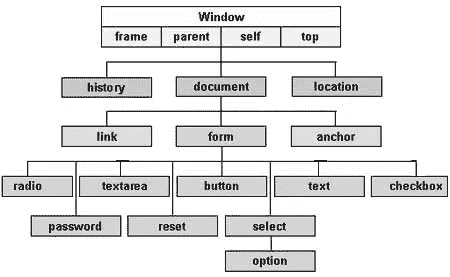
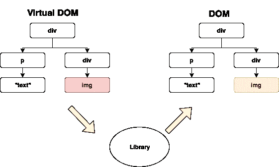
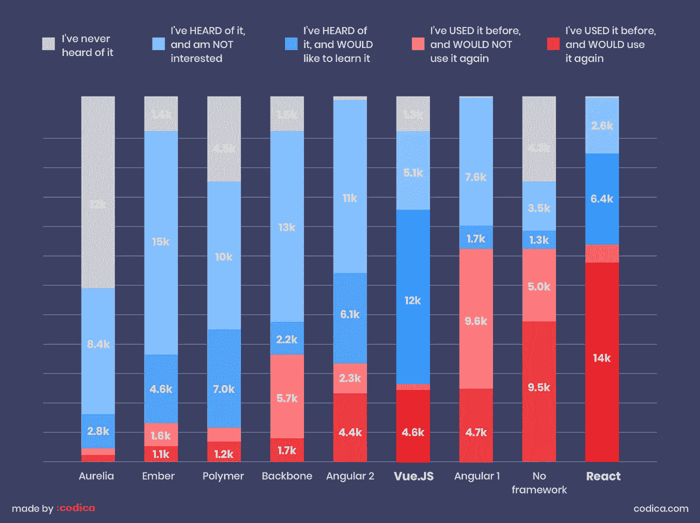

# 使用 React 的五大理由

> 原文：<https://javascript.plainenglish.io/5-reasons-why-you-should-be-using-react-238373cc245e?source=collection_archive---------4----------------------->

如果你打算使用 JS 框架或库，我对你的第一个建议是学习 React。React 由脸书开发，于 2013 年 5 月 29 日首次发布，现在是最受欢迎的前端 web 开发库。但是它是如何变得如此流行的，为什么今天有这么多的开发人员经常使用它呢？为了回答这些问题，让我们来看看为什么这么多人使用 React 以及为什么你也应该使用 React 的五个原因。


# 1.)虚拟世界

首先，您可以将 DOM(文档对象模型)视为存储网页上所有对象的地方。DOM 的独特之处在于它以树状结构组织这些对象，如下图所示。



[Source](https://www.tutorialspoint.com/javascript/javascript_html_dom.htm)

大多数其他 JavaScript 库和框架都使用真正的 DOM。然而，真正的 DOM 的问题是，每次 UI 状态自上而下发生变化时，整个系统都必须更新。这是一个相当简单的过程，但是多次更新 DOM 会使事情变得很慢，而且代价很高，这就是虚拟 DOM 的用武之地。

虚拟 DOM 本质上是真实 DOM 的副本，但是虚拟 DOM 实际上不会改变你在屏幕上看到的任何东西，这就是为什么它这么快。本质上，虚拟 DOM 就像是对真实 DOM 进行截图，然后保存起来。

一旦虚拟 DOM 更新，它就将更新的版本与虚拟 DOM 的先前版本进行比较。React 然后比较虚拟 DOM 的两个版本，看看通过一个称为 *diffing* 的过程发生了什么变化，并只将这些变化应用于真实 DOM。



这样，我们不必遍历整个树并更新其中包含的每个对象，而只需更新发生变化的部分。这就是为什么 React 如此之快以及为什么它今天如此受欢迎的一个重要原因。


# 2.)JSX

JSX 是 React 中使用的一种语法，它使 web 开发变得更加容易。JSX 本质上结合了 Javascript 和 HTML 的元素，并将它们放在一个包中。

```
const name = 'Alex';
const jsxExample = <h1>Hello, {name}!</h1>;
```

正如你可能猜到的“你好，亚历克斯！”是页面上将显示的内容。如果你想在安装 React，[之前自己尝试一些 JSX，你可以在这里](https://codepen.io/pen?&editable=true&editors=0010)完成。JSX 还可以用在函数、if 语句、循环、变量以及任何可以使用普通 JavaScript 的地方。你会注意到我们在使用 JSX 时仍然使用 camel case，这是因为 JSX 更像 JavaScript 而不是 HTML。如果你想了解更多关于 JSX 的信息，你可以观看这段更深入的视频:

一些开发人员不喜欢使用 JSX，但这没有理由担心，因为 React 不会强迫您使用它。如果您愿意，您可以像平常一样继续使用 JS 和 HTML，这样您就可以将 JSX 视为 React 的一个额外特性，可以帮助您加快开发速度。


# 3.)React 是一个库

尽管您可能看到 React 被许多人称为 JavaScript 框架，但实际情况是它是一个库，而不是框架。要理解框架和库之间的区别，首先要考虑这两种不同三明治之间的区别。


[Source](https://st2.depositphotos.com/9568834/12346/i/950/depositphotos_123465984-stock-photo-two-sandwiches-on-the-cutting.jpg)

你可以把一个框架想象成两个三明治的所谓“骨架”。两者外面都是面包，里面从上到下依次是蔬菜、奶酪和肉。然而，即使这两种三明治都含有相同的结构，你只要看着它们就可以知道它们的味道会非常不同，因为里面的成分不同(库)。

所以，框架和库的区别在于，框架的结构在你开始之前就已经确定了，而库则没有。这意味着库比框架给你更多的灵活性和定制性。

从技术角度来说，库本质上允许你控制应用程序的流程，而不是比较两个不同的三明治。当你使用一个库时，你是调用库的人，但是当你使用一个框架时，它调用你。这就是所谓的控制反转。


# 4.)React 受欢迎

在过去的几年里，React 的受欢迎程度激增，现在已经是排名第一的 JavaScript 库。看看 React 与其他同样流行的库和框架相比如何。



[Source](http://codica.com/)

正如你所看到的，基本上没有人没有听说过 React，只有一小部分人对它不感兴趣或者不会再使用它。React 的受欢迎程度来自于它的速度(虚拟 DOM)、可重用的组件、简单的学习曲线以及它的开发者工具和支持。这也意味着，如果你正在找工作，React 将是你在其他库和框架方面的最佳选择。


# 5.)支持 React Native 的移动应用

尽管与 React 不完全相同，React Native 允许你为 Android 和 IOS 创建移动应用。语法与常规的 React 并不完全相同，但是 React Native 仍然非常相似，如果您已经熟悉 React 或者甚至只是普通的 JavaScript，您不会花太多时间来学习。

如果你没有 Mac 电脑，并且有兴趣为 IOS 创建移动应用程序，那么 React Native 非常适合你。React Native 也可以同时用于 IOS 和 Android 的开发，像普通 React 一样用 JavaScript 和 JSX 编写。React Native 在 2015 年发布，仍然有些新，有很多改进和扩展的空间。如果您想更详细地了解 React Native，可以单击下面的链接:

[](https://facebook.github.io/react-native/) [## React Native 使用 React 构建原生应用的框架

### 使用 React 构建原生应用的框架

使用 Reactfacebook.github.io 构建原生应用的框架](https://facebook.github.io/react-native/) 

*来源*:

[](https://reactjs.org/docs/introducing-jsx.html) [## 介绍 JSX - React

### 考虑这个变量声明:这个有趣的标记语法既不是字符串也不是 HTML。它叫 JSX，是一个…

reactjs.org](https://reactjs.org/docs/introducing-jsx.html) [](https://www.codecademy.com/articles/react-virtual-dom) [## React:虚拟 DOM | Codecademy

### DOM 操作是现代交互式网络的核心。不幸的是，它也比大多数产品慢得多…

www.codecademy.com](https://www.codecademy.com/articles/react-virtual-dom) [](https://facebook.github.io/react-native/) [## 反应本地学习一次，写在任何地方

### React Native 将本机开发的最佳部分与 React 相结合，React 是用于构建…

facebook.github.io](https://facebook.github.io/react-native/) [](https://www.tutorialspoint.com/javascript/javascript_html_dom.htm) [## JavaScript -文档对象模型或 DOM

### JavaScript -文档对象模型或 DOM，每个网页都驻留在一个浏览器窗口中，可以被认为是一个…

www.tutorialspoint.com](https://www.tutorialspoint.com/javascript/javascript_html_dom.htm) 

## 进一步阅读

[](/5-tools-practices-to-help-you-develop-faster-in-react-b884c1b20fc2) [## 帮助您在 React 中更快开发的 5 种工具和实践

### React 工具、技巧和最佳实践将帮助您更快地构建应用

javascript.plainenglish.io](/5-tools-practices-to-help-you-develop-faster-in-react-b884c1b20fc2) 

*更多内容看* [***说白了。报名参加我们的***](https://plainenglish.io/) **[***免费周报***](http://newsletter.plainenglish.io/) *。关注我们关于* [***推特***](https://twitter.com/inPlainEngHQ)[***LinkedIn***](https://www.linkedin.com/company/inplainenglish/)*[***YouTube***](https://www.youtube.com/channel/UCtipWUghju290NWcn8jhyAw)*[***不和***](https://discord.gg/GtDtUAvyhW) *。*****