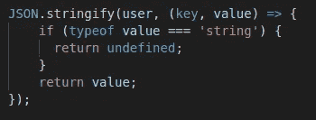

# JSON.stringify()的 5 个秘密特性

> 原文：<https://javascript.plainenglish.io/5-secret-features-of-json-stringify-c699340f9f27?source=collection_archive---------0----------------------->


Credits: [Kirmeli.com](https://www.google.com/url?sa=i&url=https%3A%2F%2Fahmedalkiremli.com%2Fwhy-to-learn-what-to-learn-and-how-to-learn%2F&psig=AOvVaw3IGik44VGBXe661UZsW5Mh&ust=1581750442478000&source=images&cd=vfe&ved=0CAMQjB1qFwoTCMj-5Oi90OcCFQAAAAAdAAAAABAR)

> JSON。stringify()方法将 JavaScript 对象或值转换为 JSON 字符串。

作为 JavaScript 开发者，`JSON.stringify()`是调试最常用的函数。但是这有什么用呢，难道我们就不能用我们的朋友`console.log()`单独来做同样的事情吗？让我们试一试。

```
//Initialize a User object
const user = {
 “name” : “Prateek Singh”,
 “age” : 26
}console.log(user);**RESULT** // [object Object]
```

哎呀！`console.log()`没有帮我们打印出想要的结果。它打印`**[object Object]**` ***，因为从对象到字符串的默认转换是“[Object Object]”***。所以我们用`JSON.stringify()`先把对象转换成字符串，然后在控制台打印，就像这样。

```
const user = {
 “name” : “Prateek Singh”,
 “age” : 26
}console.log(JSON.stringify(user));**RESULT** // "{ "name" : "Prateek Singh", "age" : 26 }"
```

一般来说，开发者使用这个`stringify`函数的方式和我们上面做的一样简单。但是我要告诉你这个小宝石的一些隐藏的秘密，这将使你的生活变得容易。

# 1:第二个参数(数组)

是的，我们的`stringify`函数也可以有第二个参数。它是你想在控制台中打印的对象的键的数组。看起来简单？让我们仔细看看。我们有一个对象*产品*我们想知道产品的名称。当我们把它打印成:
`console.log(JSON.stringify(product));`
时，它给出了下面的结果。

```
{“id”:”0001",”type”:”donut”,”name”:”Cake”,”ppu”:0.55,”batters”:{“batter”:[{“id”:”1001",”type”:”Regular”},{“id”:”1002",”type”:”Chocolate”},{“id”:”1003",”type”:”Blueberry”},{“id”:”1004",”type”:”Devil’s Food”}]},”topping”:[{“id”:”5001",”type”:”None”},{“id”:”5002",”type”:”Glazed”},{“id”:”5005",”type”:”Sugar”},{“id”:”5007",”type”:”Powdered Sugar”},{“id”:”5006",”type”:”Chocolate with Sprinkles”},{“id”:”5003",”type”:”Chocolate”},{“id”:”5004",”type”:”Maple”}]}
```

很难在日志中找到 *name* 键，因为控制台上显示了很多无用的信息。当物体变大时，难度增加。stringify 函数的第二个参数就派上了用场。我们再重写一遍代码&看看结果。

```
console.log(JSON.stringify(product**,[‘name’]**);//**RESULT** {"name" : "Cake"}
```

问题解决了，我们可以通过在第二个参数中以数组的形式传递所需的键，而不是打印整个 JSON 对象。

# 2:第二个参数(函数)

我们也可以传递第二个参数作为函数。它根据函数中编写的逻辑计算每个键值对。如果你返回`undefined`，键值对将不会被打印。为了更好的理解，请看这个例子。

```
const user = {
 “name” : “Prateek Singh”,
 “age” : 26
}
```



Passing function as 2nd argument

```
// **Result**
{ "age" : 26 }
```

只有`age`被打印为值`typeOf`字符串的函数条件返回`undefined`。

# 3:第三个参数为数字

第三个参数控制最后一个字符串的间距。如果参数是一个**数字**，字符串化中的每一级都将缩进这个数量的空格字符。

```
**Note: '--' represnts the spacing for understanding purpose**JSON.stringify(user, null, 2);
//{
//--"name": "Prateek Singh",
//--"age": 26,
//--"country": "India"
//}
```

# 4:字符串形式的第三个参数

如果第三个参数是一个**字符串**，它将被用来代替上面显示的空格字符。

```
JSON.stringify(user, null,'**');
//{
//**"name": "Prateek Singh",
//**"age": 26,
//**"country": "India"
//}
**Here * replace the space character.**
```

# 5:托吉森方法

我们有一个名为`toJSON`的方法，它可以作为任何对象的一部分作为其属性。`JSON.stringify`返回该函数的结果并将其字符串化，而不是将整个对象转换成字符串。请看这个例子。

```
const user = {
 firstName : "Prateek",
 lastName : "Singh",
 age : 26,
 toJSON() {
    return { 
      fullName: `${this.firstName} + ${this.lastName}`
    };}console.log(JSON.stringify(user));**RESULT** // "{ "fullName" : "Prateek Singh"}"
```

这里我们可以看到，它没有打印整个对象，而是只打印了`toJSON`函数的结果。

希望你学到了我们的小朋友`stringify()`的一些牛逼功能。

如果你觉得这篇文章有用，请点击“鼓掌”按钮，关注我更多类似的精彩文章。并通过 [**订阅我们的 YouTube 频道**](https://www.youtube.com/channel/UCtipWUghju290NWcn8jhyAw?sub_confirmation=true) **获取更多类似内容！**

> 感谢阅读
> 
> 快乐编码||写 2 学