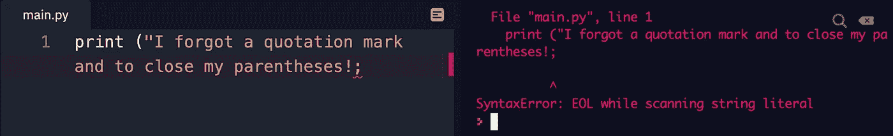

# 你可能成为程序员的 5 个迹象

> 原文：<https://javascript.plainenglish.io/5-signs-that-you-might-be-a-programmer-331b0d256ea8?source=collection_archive---------16----------------------->

Image created by author using [Canva](http://www.canva.com)

有些事情只有程序员才能理解。不管你愿不愿意承认，如果你经常编程，你很可能已经经历过一次或多次这样的情况。

没有必要感到尴尬，你和好公司在一起。

以下是只有程序员才会做的五件事(排名不分先后):

## 1.**你的大脑会不断尝试调试之前的代码，甚至在你睡觉的时候。**

你已经花了两天时间试图解决这个问题，但毫无收获。你已经厌倦了，也没有办法了。

在你的头脑中运行场景，你认为你可能有解决方案。

不，等等，那不可能。

晚上你躺在床上——辗转反侧——思绪万千——惹恼了你的配偶。然后，你终于睡着了。

但是你的大脑不止于此。做梦的时候，你在分析代码，运行循环，测试不同的功能。

然后它发生了…你终于解决了它！💡

你在半夜带着解决方案醒来，然后想，“我最好在早上记住这个。”

第二天你冲到电脑前登录。

您检查您的代码，准备解决问题。

这时你会意识到…

你一直都忘了分号。

## **2。键入时，在括号( )和引号“”内键入内容之前，先打开和关闭它们。**

在编程中，我们用引号将单词括起来来表示一个*字符串。这让计算机知道我们在向它传递人类语言，而不是用编程语言给它命令。*

`print("This is not code")`

以类似的方式，编程函数和方法接受一组括号内的*参数*(或*参数*)来执行特定的动作。

这意味着忘记关闭引号或括号会导致应用程序或程序中出现 *bug* 或*错误*——但是我该告诉谁呢？

Screenshot taken by author

因此，我们中的一些人养成了在输入任何内容之前打开和关闭括号和引号的习惯。

即使这并不重要。

例子包括，但不限于，打报告，做作业，有时甚至是写中型故事。😉

## **3。你的书签栏上储存了比任何人都多的网页。**

对于您在网上遇到的所有编码资源，您需要一种方法来记住它们。

还有什么地方比你的书签栏更好呢？

你得到了一切:

*   方便的 CSS 渐变生成器。
*   当你终于有空的时候，你将要完成的教程。
*   你想去的一些新的编码挑战网站。
*   这是一个很棒的代码笔，你以后会想更深入地了解它。
*   您找到的 Linux Bash 命令的备忘单。
*   Git 命令的另一个备忘单。

这只是刚刚触及表面。

见鬼，你甚至创建了文件夹来组织它们。没有吗？只有我吗？

无论如何，我相信有一天你会把它们清理掉的。

## **4。你真的想告诉你的朋友你正在学习的新技术，但他们可能不会理解。**

原来你在这里。

你发现自己出去了，和一个朋友一起吃午饭。然后他们会问一个可怕的问题，“那么你最近在忙些什么？”

现实中，你有很多东西想和他们分享。

你刚买了一门你很感兴趣的新课程。很快，您将能够在您一直在构建的项目中实现一个数据库。

尽管您非常熟悉 *MongoDB* ，但是您认为是时候开始使用像 *PostgresQL* 这样的关系数据库了，因为您有未来扩展的大计划。

开始使用 *SQL* 时你会有点紧张，但是你听说这并不难掌握。肯定不像学习一门完整的服务器端语言那么技术性。

然后实现发生了。

你的朋友不编码。

如果你大声说出你脑子里想的所有事情，他们会觉得你在说普通话(假设他们不懂普通话)。

所以你只要抬起头，礼貌地笑一笑，回复一句“你懂的。老样子，老样子。”

## **5。有人提到他们想学习一门新的语言，所以你开始推销你的案例。**

> “你真的应该考虑 Python。它有如此多的使用案例。”

它可用于:

*   Web 开发
*   机器学习
*   面向对象编程
*   数据科学

> “对于每种情况，都有很多很好的框架可以使用。
> 
> 语法很简单，非常容易掌握。"

他们很困惑，问你在说什么。

> “哦。你指的是西班牙语。”

无论是使用编程术语，还是在写作时出现编码错误，或者是不小心将 Word 文档保存为一个 **script.js** 文件，我们都曾经遇到过这种情况。

下次你有这样的经历时，不要让它困扰你。一笑置之，记住你并不孤单。这只是你是程序员的一个明显标志。