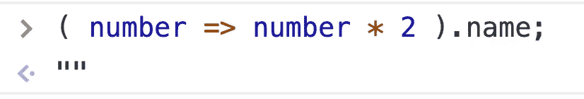
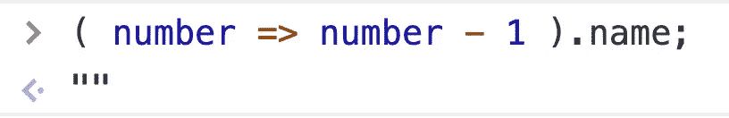
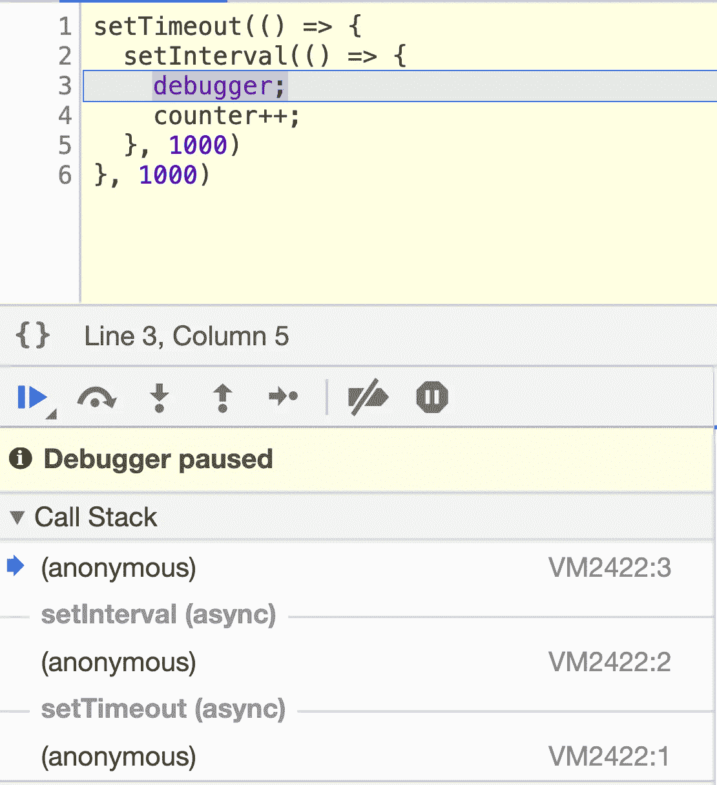
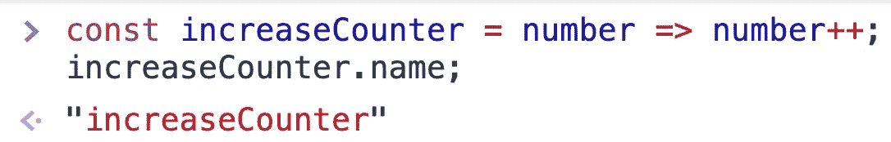
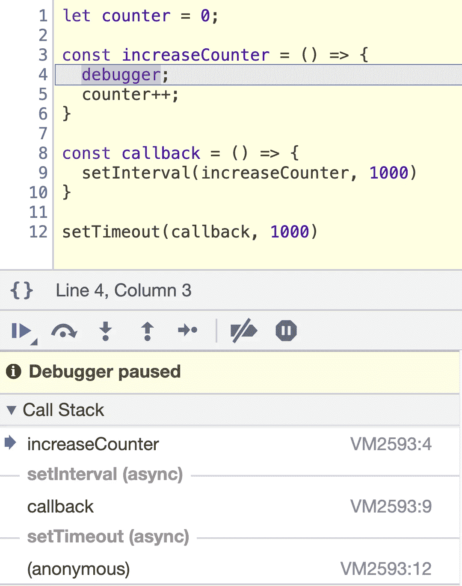

# 编写更好的箭头函数的 5 个简单技巧

> 原文：<https://javascript.plainenglish.io/5-simple-tips-to-write-better-arrow-functions-a55f40f63d58?source=collection_archive---------0----------------------->

## 箭头功能很强大，但你应该正确使用它。


Photo by [Nick Fewings](https://unsplash.com/@jannerboy62?utm_source=medium&utm_medium=referral) on [Unsplash](https://unsplash.com?utm_source=medium&utm_medium=referral)

ECMAScript2015 中增加了箭头函数。它比传统函数更简洁，并且在词汇上绑定了`this`。

正确使用箭头函数可以提高我们代码的质量。但是很多程序员对箭头函数有误解，不能发挥箭头函数的作用。以下是我之前学到的一些经验，希望对你有所帮助。

# 1.为箭头函数添加名称

所有传统函数都有自己的名字，除了箭头函数。


但是 JavaScript 中的 arrow 函数是匿名的:函数的`name`属性是一个空字符串`''`默认值。

```
( number => number * 2 ).name; // ""( number => number - 1 ).name; // ""
```



然后你可能会问:这个`name`属性是做什么的？

您的代码中可能不需要该属性，但是当我们需要调试时，它非常有用。

假设我们有这段代码:

```
let counter = 0;setTimeout(() => {
  setInterval(() => {
    debugger;
    counter++;
  }, 1000)
}, 1000)
```

下面是代码的调试会话:



From Chrome Debug Console

我们可以看到，在调用栈中，数组函数确实被标记为`anonymous`。而我们无法从这样的调用栈信息中得到任何有用的东西。

为了便于调试，有必要给箭头函数添加一个名称。让我们看看如何为箭头函数添加函数名:

这里有一个例子:

```
const increaseCounter = number => number++;increaseCounter.name; // => 'increaseCounter'
```



因为变量`increaseCounter`保存了箭头函数，JavaScript 认为`'increaseCounter'`可能是该函数的一个好名字。因此箭头函数被命名为`'increaseNumber'`。

> 一个好的做法是添加一个函数名推断来命名箭头函数。

现在让我们用使用名称推理的代码来检查一个调试会话:

```
let counter = 0;const increaseCounter = () => {
  debugger;
  counter++;
}const callback = () => {
  setInterval(increaseCounter, 1000)
}setTimeout(callback, 1000)
```



因为箭头函数有名称，所以调用堆栈给出了有关正在执行的代码的更多信息:

*   `callback`是调用`increaseCounter`的函数。
*   `increaseCounter`增加一个计数器变量。

# 2.尽可能内嵌

内联函数是只有一个表达式的函数。我喜欢 arrow 函数，它能够编写短的内联函数。

例如，不使用长形式的箭头函数:

```
const array = [1, 2, 3];array.map((number) => { 
  return number * 2;
});
```

当 arrow 函数只有一个表达式时，您可以很容易地删除花括号`{ }`和`return`语句:

```
const array = [1, 2, 3];array.map(number => number * 2);
```

我的建议是:

> 当函数只有一个表达式时，一个好的做法是内嵌 arrow 函数。

# 3.粗箭头和比较运算符

比较运算符`>`、`<`、`<=`和`>=`看起来类似于粗箭头`=>`(它定义了箭头函数)。

当这些比较操作符用于行内箭头函数时，会造成一些混乱。

让我们定义一个使用`<=`操作符的箭头函数:

```
const negativeToZero = number => number <= 0 ? 0 : number;
```

在同一行上出现两个符号`=>`和`<=`会引起误解。

为了清楚地区分粗箭头和比较运算符，第一个选项是将表达式放在一对括号中:

```
const negativeToZero = number => (number <= 0 ? 0 : number);
```

第二种选择是故意使用更长的形式来定义箭头函数:

```
const negativeToZero = number => {
  return number <= 0 ? 0 : number;
};
```

这些重构消除了粗箭头符号和比较运算符之间的混淆。

> 如果箭头函数包含操作符`>`、`<`、`<=`和`>=`，一个好的做法是将表达式放在一对括号中，或者故意使用更长的箭头函数形式。

# 4.构造普通对象

内联箭头函数中的对象文字触发语法错误:

```
const array = [1, 2, 3];// throws SyntaxError!
array.map(number => { 'number': number });
```

JavaScript 认为花括号是代码块，而不是对象文字。

将对象文字放在一对括号中可以解决这个问题:

```
const array = [1, 2, 3];// Works!
array.map(number => ({ 'number': number }));
```

如果对象文字有许多属性，您甚至可以使用换行符，同时仍然保持 arrow 函数内联:

```
const array = [1, 2, 3];// Works!
array.map(number => ({
  'number': number
  'propA': 'value A',
  'propB': 'value B'
}));
```

我的建议是:

> 在内联箭头函数中使用时，将对象文字括在一对括号中。

# 5.注意过度嵌套

arrow 函数语法很短，这很好。但是作为一个副作用，当许多箭头函数被嵌套时，它可能是神秘的。

让我们考虑下面的场景。当点击一个按钮时，向服务器发出一个请求。当响应就绪时，项目将记录到控制台:

```
myButton.addEventListener('click', () => {
  fetch('/items.json')
    .then(response => response.json())
    .then(json => {
      json.forEach(item => {
        console.log(item.name);
      });
    });
});
```

箭头功能是 3 层嵌套。理解代码做什么需要花费精力和时间。

为了增加嵌套函数的可读性，第一种方法是引入变量，每个变量包含一个箭头函数。变量应该简明地描述函数做什么。

```
const readItemsJson = json => {
  json.forEach(item => console.log(item.name));
};const handleButtonClick = () => {
  fetch('/items.json')
    .then(response => response.json())
    .then(readItemsJson);
};myButton.addEventListener('click', handleButtonClick);
```

重构将箭头函数提取到变量`readItemsJson`和`handleButtonClick`中。嵌套层次从 3 减少到 2。现在，更容易理解脚本的作用了。

更好的是，您可以重构整个函数来使用`async/await`语法，这是解决函数嵌套的一个好方法:

```
const handleButtonClick = async () => {
  const response = await fetch('/items.json');
  const json = await response.json();
  json.forEach(item => console.log(item.name));
};myButton.addEventListener('click', handleButtonClick);
```

恢复:

> 一个好的做法是，通过将箭头函数作为单独的函数提取到变量中，或者如果可能的话，采用`async/await`语法，来避免箭头函数的过度嵌套。

# 结论

JavaScript 中的箭头函数是匿名的。为了使调试富有成效，一个好的做法是使用变量来保存 arrow 函数。这允许 JavaScript 推断函数名。

当函数体只有一个表达式时，内嵌箭头函数很方便。

操作员`>`、`<`、`<=`和`>=`看起来像肥胖的箭头`=>`。当在内联箭头函数中使用这些运算符时，必须小心。

对象文字语法`{ prop: 'value' }`类似于块`{ }`的代码。因此，当对象文字被放在内嵌箭头函数中时，您需要将它包装到一对括号中:`() => ({ prop: 'value' })`。

最后，函数的过度嵌套模糊了代码的意图。减少箭头函数嵌套的一个好方法是将它们提取到变量中。或者，尝试使用更好的特性，比如`async/await`语法。