# 关于 JavaScript 操作符，我不知道的 5 件事

> 原文：<https://javascript.plainenglish.io/5-things-i-didnt-know-about-javascript-operators-44bb1d03c71a?source=collection_archive---------5----------------------->

Photo by Xavi Cabrera on Upsplash

## 1)用一元运算符排序

当您开始学习 JavaScript 时，您可能已经学会了使用一元操作符(如`++`和`— —`)来分别增加或减少数值。如果你需要复习，JavaScript 有二元和一元操作符。一元运算符只需要一个操作数，最常用于变量。

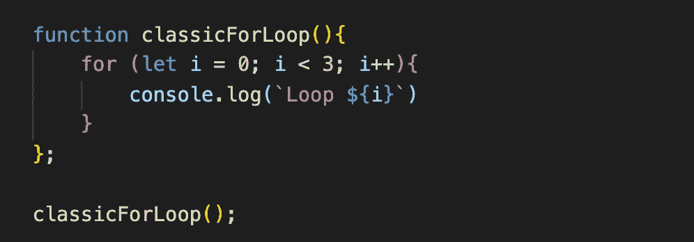

Example of a classic for loop with utilizing the unary operator, i++

我个人在`for`循环和计数器中无数次使用过`++`和`— —`，但是我从来不知道顺序有什么不同！当您使用双一元运算符作为后缀(在操作数之后)，`x++`时，您将在执行增量之前接收操作数的当前值。如果您在变量`++x`前使用双一元运算符作为前缀，您实际上将首先递增操作数的值，然后接收新值。

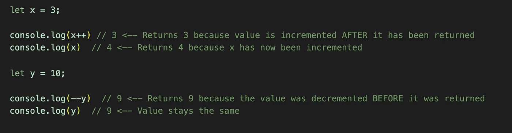

## 2)需要号码？使用一元运算符！

您知道吗，单个一元运算符作为前缀，`+x`或`— x`，会将字符串转换为整数，类似于使用`Number()`的方式？我不知道，当我偶然发现这个小事实时，真是大开眼界！我无法告诉你有多少次我试图调试写得完美的函数，因为它们没有给出我需要的数字。原来是因为我时不时传入一个`string`，而不是真正的`number`。现在我有一个方法来证明未来不会出现类似的问题，耶！

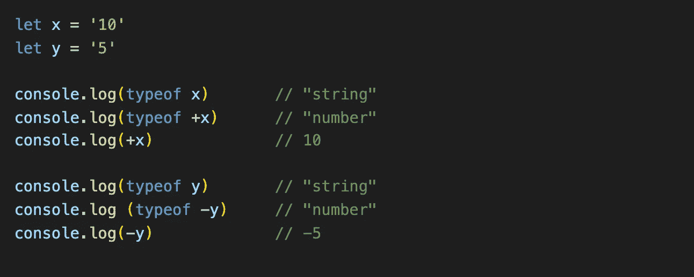

***注意:*** 正一元运算符`+`，只会把值转换成整数，负运算符`—` ，既把值转换成整数，又把它变成负数。还要记住，两个否定构成一个肯定，所以最好只使用肯定前缀`+`。

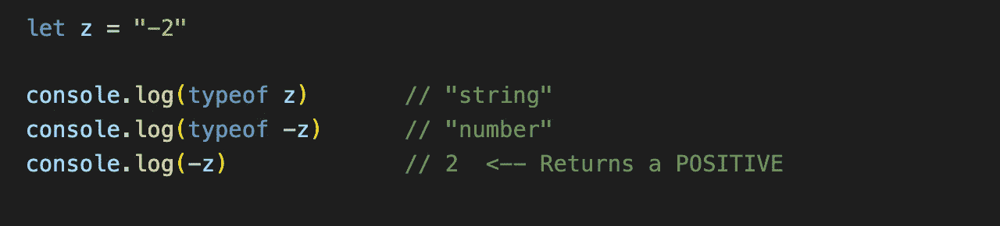

Example of two negatives returning a positive value

***加成:*** 一元运算符可以将布尔值`true`和`false`分别转换为整数`1`和`0`。

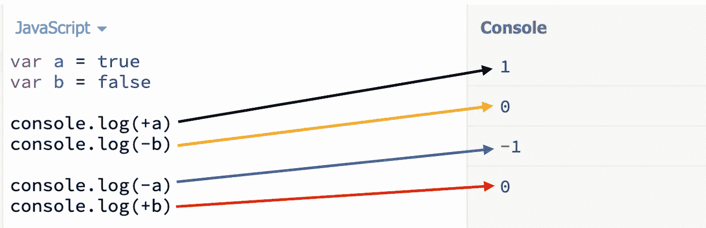

Positive (+) or negative (-) unary operator does not matter for FALSE values but it does for TRUE values

***Double Bonus:*** 一个双一元后缀，`x++`或者`x — —` ，也会把一个值转换成一个整数，但是下次调用的时候也会增加或者减少`x`的值。基本上，第一个一元运算符进行转换，第二个运算符对`x`值进行加减。

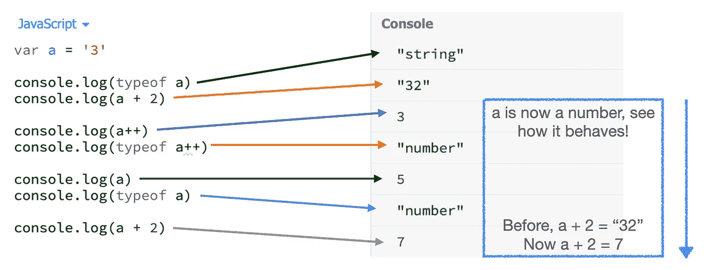

Notice that after calling a++ twice we get 5 when we console.log(a). That is because we increased a twice even when calling “typeof” in a console.log

## 3)复合赋值运算符——您可以做的不仅仅是加法和减法！

在 JavaScript 中，`+=`和`— =`都是常见的简写形式，但是您知道还有十几种其他的复合赋值操作符可以使用吗？我发现最有用、最有可能在我自己的代码中立即实现的包括乘法、除法、余数和取幂赋值。

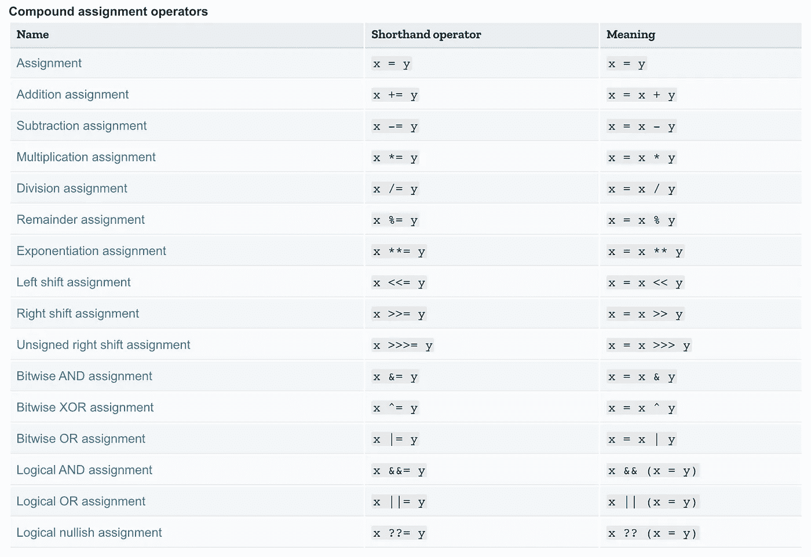

Chart above is taken from the MDN web docs, Expressions and Operators. [Click here to view](https://developer.mozilla.org/en-US/docs/Web/JavaScript/Guide/Expressions_and_Operators).

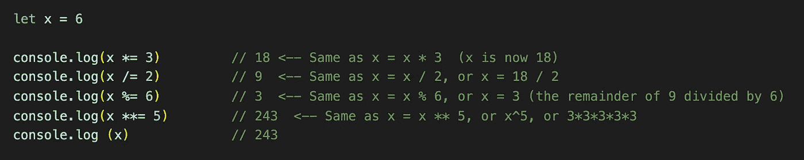

Examples of the multiplication, division, remainder, and exponentiation assignments. Keep in mind that these operators mutate our x value which is how we end up with so many different values

## 4)逻辑运算符可以赋值

我认为可以肯定地说，每个人都喜欢逻辑运算符。它们构成了我们代码中大多数条件语句的基础，键入起来很简单。

在 JavaScript 中，有三种类型的逻辑运算符: [AND 运算符](https://developer.mozilla.org/en-US/docs/Web/JavaScript/Reference/Operators/Logical_AND)、`&&`、 [OR 运算符](https://developer.mozilla.org/en-US/docs/Web/JavaScript/Reference/Operators/Logical_OR)、`||`和 [nullish 运算符](https://developer.mozilla.org/en-US/docs/Web/JavaScript/Reference/Operators/Nullish_coalescing_operator)、`??`。您可能以前在代码中使用过`&&`和`||`操作符来执行条件，但是您知道它们也可以用作赋值操作符吗？

逻辑 AND 赋值操作符`&&=`接受两边的两个表达式。如果左边的表达式是`true`，那么操作者将把它赋给右边的表达式。

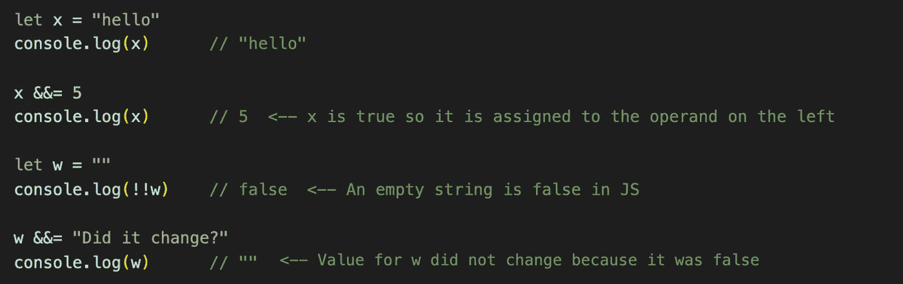

Examples of the AND assignment operator in action

另一方面，OR 赋值操作符`||=`的作用正好相反。它还接受两边的两个表达式，但只有左边的表达式是`falsy`时，它才会赋值。

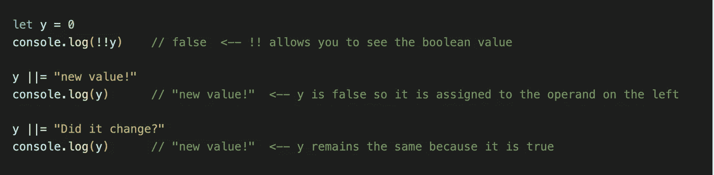

Examples of the OR assignment operator in action

***加成:*** `&&`运算符总是在`||`之前求值

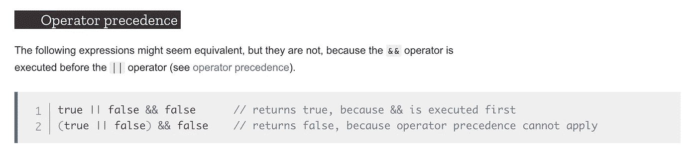

Screenshot taken from MDN web docs, Logical AND (&&). [Click here to view](https://developer.mozilla.org/en-US/docs/Web/JavaScript/Reference/Operators/Logical_AND).

## 5)逗号操作符超越了“for”循环

当我第一次学习如何实现`for`循环时，我以为逗号只是语法的一部分，但事实证明它们本身就是操作符！

> **逗号运算符** ( `**,**`)对其每个操作数求值(从左到右)，并返回最后一个操作数的值。这使您可以创建一个复合表达式，在其中计算多个表达式，复合表达式的最终值是其成员表达式中最右边的值。这通常用于为一个`[for](https://developer.mozilla.org/en-US/docs/Web/JavaScript/Reference/Statements/for)`回路提供多个参数。
> 
> — MDN web docs，[逗号运算符(，)](https://developer.mozilla.org/en-US/docs/Web/JavaScript/Reference/Operators/Comma_Operator)

虽然我认为我在`for`循环之外使用逗号操作符的可能性相对较低，但它确实揭示了`for`循环是如何为我工作的。如果有的话，我现在意识到我可以在一个`for`循环中添加比传统的三个表达式更多的内容。

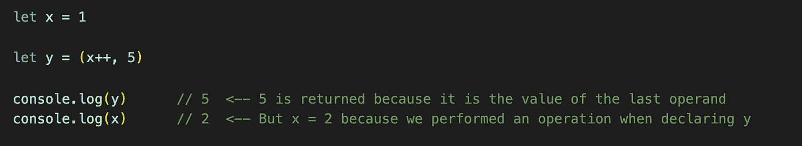

## 结论

阅读。的。文档。虽然它可能看起来不性感或令人兴奋，但它将加深您对“基本”代码的理解，揭开我们认为理所当然的一些工具的神秘面纱，并可能使您成为更快的程序员。

我写这篇文章很开心，所以感谢你的阅读！