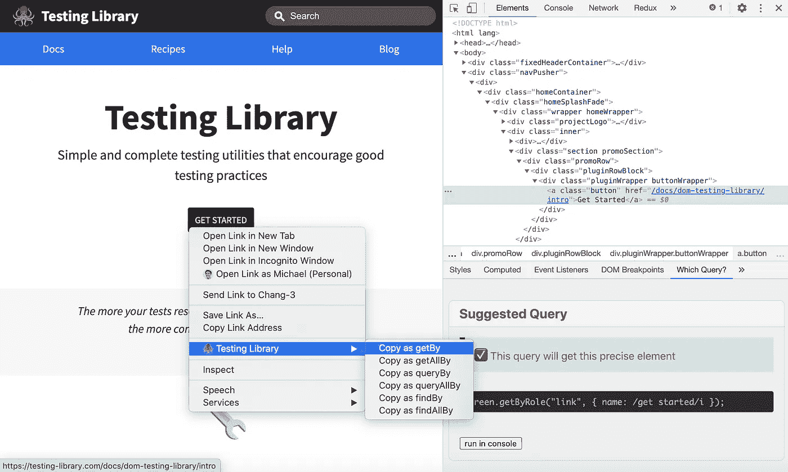
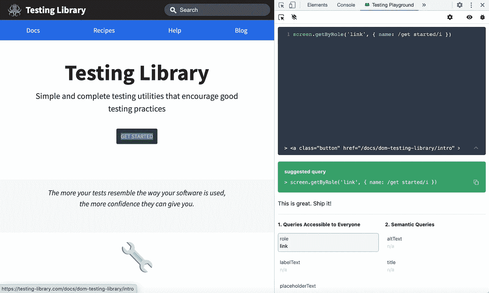

# 完善反应测试库查询的 5 个技巧

> 原文：<https://javascript.plainenglish.io/5-tips-to-perfect-react-testing-library-queries-ae4e49f27858?source=collection_archive---------2----------------------->

## 我的策略是用测试库 API 检索任何元素


Photo by [K. Mitch Hodge](https://unsplash.com/@kmitchhodge?utm_source=medium&utm_medium=referral) on [Unsplash](https://unsplash.com?utm_source=medium&utm_medium=referral)

# 我的旅程

在我开始用测试库测试组件交互之后，我很快意识到最困难的任务是检索正确的 DOM 元素。这是测试的关键途径。毕竟，如果你不能查询你想测试的东西，你就不能测试它！我学到的第一件事是`getByText`并且它覆盖了大量的测试用例。但是很快，当我继续测试更复杂的组件时，还不够好。通过我所有的考验和磨难，这已经成为我的查询策略。

# 1.屏幕调试

测试库的`screen.debug`是我提出查询的工具。我可以使用 Testing Library 的日志记录工具，立即在控制台中记录一个美化的 DOM 树，其中包含所有元素属性，而不是看代码并想象它是如何在我的大脑中的 DOM 上表示的。直观地看到这一切，有助于我快速制定查询策略。默认情况下，它将记录`document.body`。

```
import { render, screen } from '[@testing](http://twitter.com/testing)-library/react';test('screen debug default', () => {
  render(
    <div role="group">
      <button className="secondary">Secondary</button>
      <button className="primary">Primary</button>
    </div>
  );
  screen.debug();
  // output:
  //   <body>
  //     <div>
  //       <div role="group">
  //         <button className="secondary">
  //           Secondary
  //         </button>
  //         <button className="primary">
  //           Primary
  //         </button>
  //       </div>
  //     </div>
  //   </body>
});
```

`screen.debug`还接受一个 DOM 元素来专门记录该元素。这对于快速验证查询是否如预期那样工作非常有用。

```
test('screen debug element', () => {
  render(
    <div role="group">
      <button className="secondary">Secondary</button>
      <button className="primary">Primary</button>
    </div>
  );
  screen.debug(document.querySelector('.primary'));
  // output:
  //   <button className="primary">
  //     Primary
  //   </button>
});
```

# 2.按文本查询

按文本查询返回一个基于文本内容的元素，这是我最常用的查询。它是我默认的查询方法，不仅因为它易于理解和使用，还因为它非常接近地模拟了 web 应用程序上的实际用户行为和交互。

```
import { render } from '@testing-library/react';test('should return element based on its text', () => {
  const { getByText } = render(<button>Button</button>);
  expect(getByText('Button')).toMatchInlineSnapshot(`
    <button>
      Button
    </button>
  `);
});
```

# 3.按标签文本查询

按标签文本查询返回基于相关标签元素文本内容或`aria-label`属性的元素。这个查询方法实际上依赖于实现，因为它需要一个幕后关联。它将根据其文本内容找到一个标签元素(类似于通过文本进行查询)，找到与该标签相关联的输入元素，并返回该输入元素。这种关联可以通过嵌套来完成

```
test('should return element based label nesting', () => {
  const { getByLabelText } = render(
    <label>
     Field
     <input />
   </label>
 );
 expect(getByLabelText('Field')).toMatchInlineSnapshot(`<input />`);
});
```

通过`htmlFor`

```
test('should return element based on label htmlFor', () => {
  const { getByLabelText } = render(
   <>
    <label htmlFor="field">Field</label>
    <input id="field" />
   </>
 );
 expect(getByLabelText('Field')).toMatchInlineSnapshot(`
   <input
     id="field"
   />
  `);
});
```

或通过`aria-labelledby`。

```
test('should return element based on label aria-labelledby', () => {
  const { getByLabelText } = render(
   <>
     <label id="field">Field</label>
     <input aria-labelledby="field" />
   </>
 );
 expect(getByLabelText('Field')).toMatchInlineSnapshot(`
    <input
      aria-labelledby="field"
    />
  `);
});
```

由于这种特定的实现需求，使用起来有点困难。但这是我的第二个直接查询方法的真正原因是因为它也可以基于`aria-label`属性进行查询，这可以是您想要的任何属性(当然在合理的范围内)。这不仅使测试查询更容易，而且有助于可访问性。

```
test('should return element based on its aria-label', () => {
  const { getByLabelText } = render(<div aria-label="label" />);
  expect(getByLabelText('label')).toMatchInlineSnapshot(`
    <div
      aria-label="label"
    />
 `);
});
```

# 4.按角色查询

这会根据元素的`role`属性返回一个元素。像通过`aria-label`查询一样，通过角色查询有助于测试和可访问性。唯一的区别是，角色有相当[明确定义的价值观](https://developer.mozilla.org/en-US/docs/Web/Accessibility/ARIA/ARIA_Techniques)，因此不太灵活。尽管如此，它是我的下一个首选查询方法，因为它在测试和可访问性方面有双重作用。

```
test('should return element based on its role', () => {
 const { getByRole } = render(<div role="button" />);
 expect(getByRole('button')).toMatchInlineSnapshot(`
   <div
     role="button"
   />
 `);
});
```

# 5.在…之内

测试库的`within`允许你使用嵌套查询。如果给定查询返回多个元素，这将非常有用。您不是立即查询想要测试的元素，而是将它分解成多个查询，每个查询都建立在前一个查询的基础上，直到您可以唯一地查询所需的元素。`within`将测试库查询绑定到一个 DOM 元素，这样您就可以执行子查询。

```
import { render, within } from '@testing-library/react';test('should return element based on its role', () => {
  const { getAllByRole } = render(
    <table>
      <tbody>
        <tr role="row">
          <td>Cell</td>
        </tr>
        <tr role="row">
          <td>Cell</td>
        </tr>
        <tr role="row">
          <td>Else</td>
        </tr>
      </tbody>
    </table>
  );
  const [row1, row2, row3] = getAllByRole('row');
  expect(within(row1).getByText('Cell')).toBeTruthy();
  expect(within(row2).getByText('Cell')).toBeTruthy();
  expect(within(row3).queryByText('Cell')).toBeNull();
});
```

# 额外收获:Chrome 扩展

为了使查询更加容易，chrome 有几个扩展可以自动完成这项工作。

[**测试库:哪个查询**](https://chrome.google.com/webstore/detail/testing-library-which-que/olmmagdolfehlpjmbkmondggbebeimoh/related?hl=en-US) 是 chrome 扩展，当你通过右键菜单或者元素检查器工具选择一个元素时，会自动生成基本查询。



Testing Library: which query Chrome Extension

[**Testing Playground**](https://chrome.google.com/webstore/detail/testing-playground/hejbmebodbijjdhflfknehhcgaklhano)是 chrome 的另一个扩展，它做了类似的事情，但通过显示额外的数据来增强查询构建过程，这些数据可以帮助您更好地理解查询，例如美化的 DOM 树、有用的可查询属性以及针对所选元素的更好的查询建议。



Testing Playground Chrome Extension

当然，一定要验证这些生成的查询，以确保它们完全按照预期工作！

# 最后的想法

测试库是一个非常棒的组件交互测试库，它让测试变得更加容易和容易。即便如此，查询要测试的正确元素仍然具有挑战性。根据我的经验，这五个策略可以帮助您为任何可能的场景生成查询。最重要的是，你可以使用 chrome 扩展来自动完成大部分工作。现在去测试吧——你再也没有借口了！

# 资源

*   [官方测试库文档](https://testing-library.com/docs/intro)
*   [交互测试指南](https://medium.com/javascript-in-plain-english/interaction-testing-with-react-testing-library-d824f74ce48a)
*   [Github 回购本文](https://github.com/mjchang/medium/tree/master/testing-library-queries)
*   [本文的 CodeSandbox】](https://codesandbox.io/s/github/mjchang/medium/tree/master/testing-library-queries?file=/src/demo.test.js)